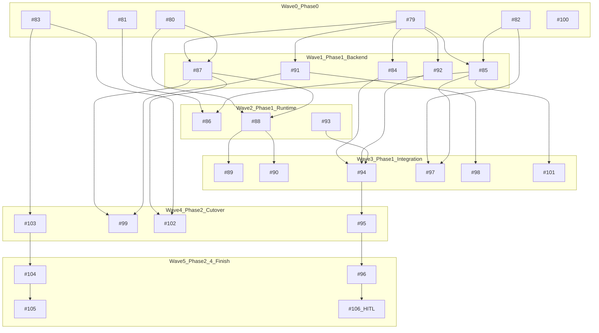
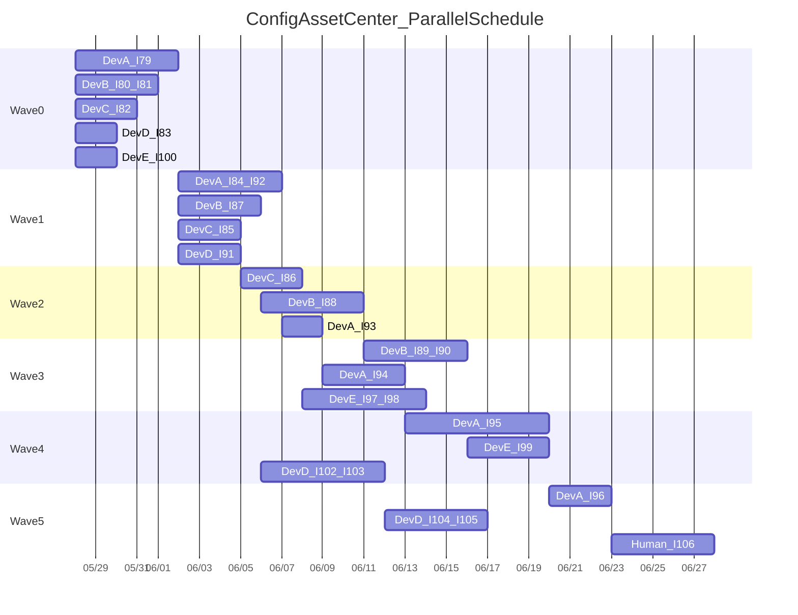

# Config Asset Center 全量并行开发计划

**Epic**：[Issue #78](https://github.com/zhaozengqing4364-bit/sales-training-qoder/issues/78)（umbrella，无 `ready-for-agent`）  
**权威文档**：[docs/architecture/config-asset-center.md](docs/architecture/config-asset-center.md) v1.2.1、[docs/adr/2026-05-26-roleplay-contract-governance.md](docs/adr/2026-05-26-roleplay-contract-governance.md)  
**当前基线**：`SituationPackRepository` 内联于 [backend/src/curriculum_practice/services/roleplay_contracts.py](backend/src/curriculum_practice/services/roleplay_contracts.py)（~1800 行），返回 raw `dict`；无 `roleplay/` 子包、无 `PublishedAssetRef`、无 `build_role_anchor`。

---

## 1. 执行模型

### 1.1 闭环定义（每个 Issue 必须满足）

每个 Issue 合并前必须完成：

1. **Issue AC 全勾选** — 对照 GitHub Issue Acceptance criteria
2. **定向测试** — 见下文「Issue 闭环测试矩阵」
3. **无回归** — `cd backend && pytest tests/unit/test_roleplay_contracts.py` + 该 Issue 触达域的相关测试
4. **PR 关联** — PR body 写 `Closes #NN`；禁止一个 PR 跨多个无依赖关系的 Issue（同 Wave 内可串在同一 PR 仅当明确标注且文件高度重叠，**默认 1 Issue = 1 PR**）
5. **Wave 门禁** — Wave N 全部 Issue 合并后，跑 Wave N 集成验收（见 §4）再开 Wave N+1

### 1.2 并行泳道（减少 merge 冲突）

按**文件所有权**分配 lane，同 lane 内串行，跨 lane 可并行：


| Lane                     | 主目录/文件                                                                                                                          | Issues                                 |
| ------------------------ | ------------------------------------------------------------------------------------------------------------------------------- | -------------------------------------- |
| **L1 RoleplayCore**      | 新建 `backend/src/curriculum_practice/services/roleplay/`；`roleplay_contracts.py` 仅 re-export                                     | #79, #84, #91, #92, #93, #94, #95, #96 |
| **L2 Schema/Gates**      | `curriculum_practice/schemas.py`, `models.py`, `publishing_gates.py`, `practice_templates.py`, alembic                          | #80, #87                               |
| **L3 Compiler/Runtime**  | `voice_instruction_compiler.py`, `voice_runtime_policy.py`, `session_snapshots.py`, `examiner_session_assembler.py`, stepfun 上游 | #81, #85, #86, #88, #89, #90           |
| **L4 Agent/Persona**     | `agent/services/persona_policy.py`, `agent/api/personas.py`                                                                     | #82, #97                               |
| **L5 Docs/ImportExport** | `docs/architecture/`, 新建 admin import/export API                                                                                | #83, #102, #103, #104, #105            |
| **L6 Admin UI**          | `web/src/app/admin/...`                                                                                                         | #98, #99, #100, #101                   |


**高冲突文件**（禁止两人同时改）：

- `roleplay_contracts.py` — 仅 #79 重构期独占；之后调用方改 import 走 re-export
- `curriculum_practice/schemas.py` — #80 先合，#87 后合
- `publishing_gates.py` — #87 独占至 Wave 3 集成完成

### 1.3 依赖图（Issue 级）




---

## 2. Wave 计划（严格顺序 + 并行窗口）

### Wave 0 — Phase 0 契约（6 Issue 并行，**无 Blocker**）

**目标**：接口与 schema 落地，**不建表、不切换 runtime、不改 StepFun 热路径**。


| Issue                                                                           | 并行 Lane | 闭环要点                                                                                                                                                                                                                                                                       | 必跑测试                                                                                             |
| ------------------------------------------------------------------------------- | ------- | -------------------------------------------------------------------------------------------------------------------------------------------------------------------------------------------------------------------------------------------------------------------------- | ------------------------------------------------------------------------------------------------ |
| [#79](https://github.com/zhaozengqing4364-bit/sales-training-qoder/issues/79)   | L1      | 新建 `roleplay/situation_pack_dto.py`、`situation_pack_repository.py`（ABC）、`adapters/business_rule_config_adapter.py`；`SituationPackRepository` 从 [roleplay_contracts.py](backend/src/curriculum_practice/services/roleplay_contracts.py) 迁出，原文件 re-export；所有 caller 改 import | `pytest tests/unit/test_roleplay_contracts.py`；新建 `tests/unit/test_situation_pack_repository.py` |
| [#80](https://github.com/zhaozengqing4364-bit/sales-training-qoder/issues/80)   | L2      | `PublishedAssetRef` dataclass + Pydantic；Alembic 增 `practice_templates.situation_pack_code`、`published_asset_refs`                                                                                                                                                         | `pytest tests/unit/test_curriculum_runtime_snapshot`* 相关；migration up/down                       |
| [#81](https://github.com/zhaozengqing4364-bit/sales-training-qoder/issues/81)   | L3      | 三级 hash helper 与命名；扩展 [compiled_contract.py](backend/src/prompt_templates/compiled_contract.py) 或 voice compiler 侧文档                                                                                                                                                       | 新建 hash 单元测试                                                                                     |
| [#82](https://github.com/zhaozengqing4364-bit/sales-training-qoder/issues/82)   | L4      | `PersonaPolicyValidator` + persona API 集成；field-level `reason_code`                                                                                                                                                                                                        | `pytest tests/unit/test_agent_service.py`                                                        |
| [#83](https://github.com/zhaozengqing4364-bit/sales-training-qoder/issues/83)   | L5      | `docs/architecture/config-asset-export-v1.schema.json` + 示例 fixture                                                                                                                                                                                                        | schema 校验脚本/pytest                                                                               |
| [#100](https://github.com/zhaozengqing4364-bit/sales-training-qoder/issues/100) | L6      | 审计 CaseItem/RoleProfile Admin 页；输出确认清单                                                                                                                                                                                                                                     | `web` 相关 page.test                                                                               |


**Wave 0 门禁**（全部合并后）：

- `pytest tests/unit/test_roleplay_contracts.py tests/unit/test_config_bundle_roleplay_situation_packs.py`
- **#79 必须先于任何 Wave 1 L1 Issue 合并**

---

### Wave 1 — Phase 1 后端主干（#79 完成后 5 Issue 并行）

**硬约束**：runtime authority **仍为 Phase A**；B1/DualRead **flag 默认 OFF**。


| Issue                                                                         | 依赖       | Lane | 闭环要点                                                                                                                    |
| ----------------------------------------------------------------------------- | -------- | ---- | ----------------------------------------------------------------------------------------------------------------------- |
| [#84](https://github.com/zhaozengqing4364-bit/sales-training-qoder/issues/84) | #79      | L1   | B1/DualRead **骨架 + fake adapter**；`SITUATION_PACK_DUAL_READ=false` 默认；**不读 situation_packs 表**                          |
| [#85](https://github.com/zhaozengqing4364-bit/sales-training-qoder/issues/85) | #79, #82 | L3   | `VoiceInstructionCompiler.build_role_anchor()`；输入 `SituationPackDTO`                                                    |
| [#87](https://github.com/zhaozengqing4364-bit/sales-training-qoder/issues/87) | #79, #80 | L2   | [publishing_gates.py](backend/src/curriculum_practice/services/publishing_gates.py) publish 写入完整 `published_asset_refs` |
| [#91](https://github.com/zhaozengqing4364-bit/sales-training-qoder/issues/91) | #79      | L1   | `resolve` + `references` Read API；[api.py](backend/src/curriculum_practice/api.py)                                      |
| [#92](https://github.com/zhaozengqing4364-bit/sales-training-qoder/issues/92) | #79      | L1   | `situation_packs` 表 migration + ORM；**runtime 仍不读**                                                                     |


**并行建议**：

- Dev A → #79（Wave 0 若未完成则阻塞全队）
- Dev B → #80, #81, #82, #83（Wave 0）
- Dev C → #100
- Wave 1：Dev A → #84+#92（同 L1 串行）；Dev B → #87；Dev C → #85；Dev D → #91

**Wave 1 门禁**：

- `pytest tests/unit/test_curriculum_publish_gates.py tests/integration/test_practice_template_api.py`
- 确认 **无代码路径在 flag OFF 时读 `situation_packs` 表**

---

### Wave 2 — Phase 1 运行时编译链（串行关键路径）


| Issue                                                                         | 依赖            | 顺序           | 闭环要点                                                                |
| ----------------------------------------------------------------------------- | ------------- | ------------ | ------------------------------------------------------------------- |
| [#86](https://github.com/zhaozengqing4364-bit/sales-training-qoder/issues/86) | #81, #85      | 可与 #88 并行    | StepFun 每轮 `role_anchor_text` + `turn_instruction_hash` 审计          |
| [#88](https://github.com/zhaozengqing4364-bit/sales-training-qoder/issues/88) | #79, #80, #87 | **关键路径**     | `RoleplayContractCompiler` 从 frozen ref / ConfigVersion snapshot 重建 |
| [#93](https://github.com/zhaozengqing4364-bit/sales-training-qoder/issues/93) | #92           | 与 #86/#88 并行 | 初始 projection 脚本；idempotent upsert                                  |


**Wave 2 门禁**：

- `pytest tests/unit/test_roleplay_contracts.py tests/unit/test_stepfun_realtime_upstream.py`
- 手工：publish template → 验证 `published_asset_refs` 非空

---

### Wave 3 — Phase 1 集成 + Phase 2 sync + UI 启动


| Issue                                                                           | 依赖            | 并行       | 闭环要点                                                                                                                       |
| ------------------------------------------------------------------------------- | ------------- | -------- | -------------------------------------------------------------------------------------------------------------------------- |
| [#89](https://github.com/zhaozengqing4364-bit/sales-training-qoder/issues/89)   | #88           | 串行       | [session_snapshots.py](backend/src/curriculum_practice/services/session_snapshots.py) frozen 消费；legacy template warning    |
| [#90](https://github.com/zhaozengqing4364-bit/sales-training-qoder/issues/90)   | #88           | 与 #89 并行 | [voice_runtime_policy.py](backend/src/sales_bot/services/voice_runtime_policy.py)；**legacy direct practice** 单独 observable |
| [#94](https://github.com/zhaozengqing4364-bit/sales-training-qoder/issues/94)   | #84, #92, #93 | 串行       | ConfigBundle publish/rollback → `sync_head_projection`；失败不阻断 publish                                                       |
| [#97](https://github.com/zhaozengqing4364-bit/sales-training-qoder/issues/97)   | #82, #85      | 与后端并行    | Persona Admin role_anchor 表单 + inline field errors                                                                         |
| [#98](https://github.com/zhaozengqing4364-bit/sales-training-qoder/issues/98)   | **#91 only**  | 与 #97 并行 | 结构化表单替换 JSON；**不依赖 #94**                                                                                                   |
| [#101](https://github.com/zhaozengqing4364-bit/sales-training-qoder/issues/101) | #79, #85      | 可选并行     | ConfigBundle preview 含 prompt 片段                                                                                           |


**Wave 3 集成验收（必须全过）**：

```bash
pytest tests/integration/test_curriculum_practice_session_snapshot.py \
       tests/integration/test_session_flow.py \
       tests/integration/test_sales_realtime_reconnect_flow.py
```

- 验证 legacy template / legacy direct practice **两条 fallback 入口分离**且均有 warning/metric

---

### Wave 4 — Phase 2 双读 + Template UI + Import/Export 启动


| Issue                                                                           | 依赖           | 闭环要点                                                     |
| ------------------------------------------------------------------------------- | ------------ | -------------------------------------------------------- |
| [#95](https://github.com/zhaozengqing4364-bit/sales-training-qoder/issues/95)   | #94          | 开启 DualRead flag（staging）；mismatch 以 Phase A 为准 + metric |
| [#99](https://github.com/zhaozengqing4364-bit/sales-training-qoder/issues/99)   | #87, #91     | Template 组装 UI + situation_pack 下拉                       |
| [#102](https://github.com/zhaozengqing4364-bit/sales-training-qoder/issues/102) | #83, #87     | Export API                                               |
| [#103](https://github.com/zhaozengqing4364-bit/sales-training-qoder/issues/103) | **#83 only** | Import API（#83 fixture）；**可与 #102 并行**                   |


**Wave 4 门禁**：

- Staging 双读运行 ≥ 配置窗口（建议 2 周）且 mismatch 告警为 0，方可开 #96
- `pytest tests/evaluation/test_roleplay_contract_eval.py`（若适用）

---

### Wave 5 — 切换、Import 闭环、HITL


| Issue                                                                           | 依赖         | 闭环要点                                                    |
| ------------------------------------------------------------------------------- | ---------- | ------------------------------------------------------- |
| [#96](https://github.com/zhaozengqing4364-bit/sales-training-qoder/issues/96)   | #95        | **Runtime authority → B1**；flag 可回滚；保留 Phase A fallback |
| [#104](https://github.com/zhaozengqing4364-bit/sales-training-qoder/issues/104) | #103       | `publish_after_import` 双 lifecycle                      |
| [#105](https://github.com/zhaozengqing4364-bit/sales-training-qoder/issues/105) | #103, #104 | Presales export fixture + 去 seed + 部署文档                 |
| [#106](https://github.com/zhaozengqing4364-bit/sales-training-qoder/issues/106) | #96        | `**ready-for-human` ADR**；不创建 B2 implementation ticket  |


**最终验收**：

```bash
# 后端全量相关
cd backend && pytest tests/unit/test_roleplay_contracts.py \
  tests/unit/test_curriculum_publish_gates.py \
  tests/integration/test_practice_template_api.py \
  tests/integration/test_curriculum_practice_session_snapshot.py

# 前端 Admin
cd web && npm test -- roleplay-situation-packs page.test personas
```

- Import dry_run → import → publish_after_import → 开练 E2E（manual 或 integration）

---

## 3. Issue 逐个闭环清单（28 Issues）

### Phase 0

**#79 — SituationPack 深模块**

- 产出：`curriculum_practice/services/roleplay/` 包结构
- 验收：DTO 映射 `default`_* → canonical；Repository ABC；Phase A adapter
- 测试：`test_situation_pack_repository.py` + 现有 roleplay contract 全绿
- **阻塞**：Wave 1 全部 L1/L2 依赖项

**#80 — PublishedAssetRef + Schema**

- 产出：12 字段完整；migration；`can_reconstruct_from_snapshot()`
- 测试：ref round-trip 单元测试
- **注意**：与 #79 可能同改 `schemas.py` — 约定 #80 只加 PublishedAssetRef 段，#79 不改 schemas

**#81 — 三级哈希**

- 产出：hash 函数 + 文档；anchor 变更不影响 base hash
- 测试：三级边界单测

**#82 — role_anchor Validator**

- 产出：Persona create/update 校验；稳定 reason_code
- 测试：`test_agent_service.py` 扩展

**#83 — Import/Export Schema 文档**

- 产出：`config-asset-export-v1` schema + fixture
- 测试：schema validate pytest

**#100 — CaseItem/RoleProfile 确认**

- 产出：确认清单文档；缺口则最小补表单
- 测试：现有 page.test

### Phase 1 Backend

**#84 — B1/DualRead 骨架（flag OFF）**

- **禁止**：读 `situation_packs` 表作 runtime authority
- 测试：fake dual-read 一致/不一致分支

**#85 — build_role_anchor**

- 输入：`SituationPackDTO` + persona_policy
- 测试：模板变量、空 anchor

**#86 — 每轮注入 + turn hash**

- 触达：stepfun upstream/policy
- 测试：`test_stepfun_realtime_upstream.py`

**#87 — Publish 冻结 refs**

- 触达：publishing_gates + practice_templates publish 路径
- 测试：publish 后 refs hash 一致；missing pack gate fail

**#88 — Frozen ref 编译**

- 核心：`RoleplayContractCompiler` snapshot 重建路径
- 测试：mock ConfigVersion；hash mismatch terminal fail

**#89 — 课程闭环 frozen**

- 触达：session_snapshots, examiner_session_assembler
- 测试：integration session snapshot

**#90 — 平台直练 + legacy direct practice**

- 与 #89 **入口分离**；metric `legacy_direct_practice_fallback`
- 测试：integration sales session flow

**#91 — resolve + references API**

- 扩展 [curriculum_practice/api.py](backend/src/curriculum_practice/api.py)
- 测试：contract/integration API test

### Phase 2 Migration

**#92 — situation_packs 表**

- Alembic only；runtime flag 仍 OFF

**#93 — 初始 projection 数据**

- 脚本 idempotent；不切换 authority

**#94 — sync_head_projection**

- publish/rollback hook；失败不阻断 + audit

**#95 — DualRead 观测**

- flag ON（staging）；2 周观察期

**#96 — Runtime 切 B1**

- **仅在 #95 稳定后**；可回滚 flag

### Phase 3 Admin UI

**#97 — Persona role_anchor UI**

- inline field errors 消费 #82 reason_code；无 alert

**#98 — SituationPack 结构化表单**

- 仅依赖 #91；ConfigBundle lifecycle 不变；#94 完成后兼容 projection read

**#99 — Template 组装 UI**

- situation_pack_code 下拉；依赖 #87 refs 写入

**#101 — ConfigBundle preview prompt**

- preview 响应含 compiled 片段

### Phase 4 Import/Export

**#102 — Export API**

- 经 Service 层；#83 schema 校验

**#103 — Import API**

- 仅依赖 #83；#102 roundtrip 在 #104/#105

**#104 — publish_after_import**

**#105 — Presales fixture + 去 seed + 部署文档**

### HITL

**#106 — Phase B2 ADR**

- `ready-for-human`；ADR accepted 后再开 implementation epic
- **禁止**现在创建 `ready-for-agent` B2 票

---

## 4. 并行开发调度示例（6 人）




---

## 5. 风险与依赖防护


| 风险                                    | 防护                                                                           |
| ------------------------------------- | ---------------------------------------------------------------------------- |
| Phase 1 提前读 B1 projection             | #84/#96 code review 检查 flag；Wave 1 门禁 grep 无 `situation_packs` runtime read  |
| #79 重构破坏 15+ import 点                 | 保留 re-export 一 release；caller 分批改 import                                     |
| legacy template vs direct practice 混淆 | #89/#90 分开 PR；集成测试各一条路径                                                      |
| DualRead 过早切 authority                | #96 硬依赖 #95 + 2 周观察；生产默认 OFF                                                 |
| Import 覆盖 published                   | #103 默认 `new_version`；#104 集成测试 assert                                       |
| UI 与后端 schema 漂移                      | #91 合后再开 #98；共享 types 在 [web/src/lib/api/types.ts](web/src/lib/api/types.ts) |


---

## 6. 建议首个 Sprint 范围

**最小可并行启动包（Wave 0 全体 + Wave 1 预备）**：

1. **必须先合**：#79（全队阻塞项）
2. **并行**：#80, #81, #82, #83, #100
3. **#79 合并后立即开**：#84, #85, #87, #91, #92

不在 Sprint 1 做：#86（StepFun 热路径）、#96（B1 切换）、#105（去 seed）