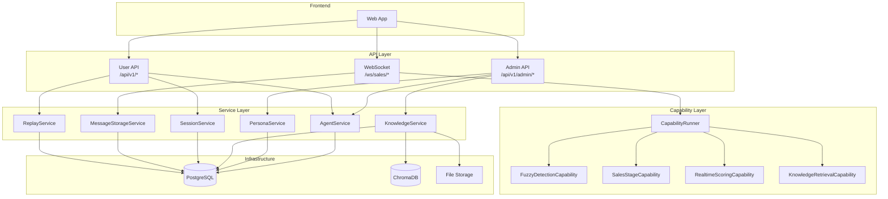

# Design Document

## Overview

本设计文档描述 AI 练习平台后端升级的技术架构和实现方案。升级将现有的"对讲机模式"语音对话系统扩展为完整的 Agent 平台，支持动态配置的训练场景、AI 角色、知识库管理和实时反馈能力。

**设计原则：**
- 严格遵循 `docs/api-contract/` 中定义的 API 契约
- 扩展现有 `common/` 模块而非创建平行结构
- 使用组合而非继承扩展 WebSocket Handler
- 使用 SQLAlchemy 2.0 + AsyncSession
- 使用 Pydantic v2
- API 响应使用 Result[T] 包装

**关键参考：**
- 现有代码: `backend/src/common/conversation/engine.py`, `backend/src/common/knowledge/`
- WebSocket: `backend/src/sales_bot/websocket/simple_handler.py`
- 模板: `.kiro/templates/backend/capability.py`

## Architecture

### 系统架构图



### 目录结构（扩展现有模块）

```
backend/src/
├── common/                         # 扩展现有公共模块
│   ├── conversation/               # 扩展现有对话模块
│   │   ├── engine.py               # 保留现有
│   │   ├── models.py               # 新增 ConversationMessage
│   │   ├── storage.py              # 新增 MessageStorageService
│   │   └── replay.py               # 新增 ReplayService
│   ├── knowledge/                  # 扩展现有知识库模块
│   │   ├── vector_store.py         # 保留现有
│   │   ├── ingestion_service.py    # 保留现有
│   │   ├── models.py               # 新增 KnowledgeBase, KnowledgeDocument
│   │   ├── schemas.py              # 新增
│   │   └── api.py                  # 新增 Admin API
│   ├── db/
│   │   ├── models.py               # 扩展现有模型
│   │   └── schemas.py              # 扩展现有 schemas
│   └── ...
├── agent/                          # 新增 Agent 平台核心
│   ├── __init__.py
│   ├── models.py                   # Agent, Persona, AgentPersona
│   ├── schemas.py                  # Pydantic schemas
│   ├── context.py                  # AgentContext 定义
│   ├── api/
│   │   ├── __init__.py
│   │   ├── agents.py               # Agent CRUD API
│   │   ├── personas.py             # Persona CRUD API
│   │   └── agent_personas.py       # Agent-Persona 关联 API
│   ├── services/
│   │   ├── __init__.py
│   │   ├── agent_service.py
│   │   └── persona_service.py
│   └── capabilities/               # 能力模块
│       ├── __init__.py
│       ├── base.py                 # BaseCapability 基类
│       ├── registry.py             # CapabilityRegistry
│       ├── runner.py               # CapabilityRunner
│       ├── fuzzy_detection.py      # 模糊词检测
│       ├── sales_stage.py          # 销售阶段识别
│       ├── realtime_scoring.py     # 实时评分
│       └── knowledge_retrieval.py  # 知识库检索
└── sales_bot/                      # 现有销售机器人
    └── websocket/
        ├── simple_handler.py       # 保留现有（向后兼容）
        └── enhanced_handler.py     # 新增增强版（组合模式）
```

## Components and Interfaces

### 1. AgentContext（新增）

```python
@dataclass
class AgentContext:
    """能力模块执行上下文"""
    session_id: str
    agent_id: str
    persona_id: str
    user_id: str
    state: dict[str, Any]  # 会话状态（能力模块可读写）
    conversation_history: list[dict]  # 对话历史
    
    # 配置
    agent_config: dict
    persona_config: dict
    
    # 运行时
    turn_count: int = 0
    start_time: datetime = None
    trace_id: str = None
    
    def get_scoring_weights(self) -> dict:
        """获取评分权重，Persona 优先"""
        return self.persona_config.get("scoring_weights") or \
               self.agent_config.get("capabilities_config", {}).get("scoring", {}).get("dimensions", [])
```

### 2. CapabilityRegistry（新增）

```python
class CapabilityRegistry:
    """能力模块注册表 - 单例模式"""
    _capabilities: dict[str, type[BaseCapability]] = {}
    
    @classmethod
    def register(cls, capability_class: type[BaseCapability]):
        """注册能力模块"""
        cls._capabilities[capability_class.capability_id] = capability_class
        return capability_class
    
    @classmethod
    def get(cls, capability_id: str) -> type[BaseCapability] | None:
        """获取能力模块类"""
        return cls._capabilities.get(capability_id)
    
    @classmethod
    def list_all(cls) -> list[str]:
        """列出所有已注册的能力模块"""
        return list(cls._capabilities.keys())


# 使用装饰器注册
@CapabilityRegistry.register
class FuzzyDetectionCapability(BaseCapability):
    capability_id = "fuzzy_detection"
    ...
```

### 3. CapabilityRunner（新增）

```python
class CapabilityRunner:
    """能力模块运行器 - 管理能力模块的生命周期和执行"""
    
    def __init__(self, agent_config: dict, persona_config: dict | None = None):
        self.capabilities: list[BaseCapability] = []
        self._init_capabilities(agent_config, persona_config)
    
    def _init_capabilities(self, agent_config: dict, persona_config: dict | None):
        """根据配置初始化能力模块"""
        caps_config = agent_config.get("capabilities_config", {})
        
        for cap_id, config in caps_config.items():
            if config.get("enabled"):
                cap_class = CapabilityRegistry.get(cap_id)
                if cap_class:
                    # 合并 Persona 配置覆盖
                    merged_config = {**config}
                    if persona_config:
                        merged_config.update(persona_config.get(cap_id, {}))
                    self.capabilities.append(cap_class(merged_config))
    
    async def run_all(
        self, 
        context: AgentContext, 
        input_data: Any
    ) -> list[CapabilityResult]:
        """并行执行所有能力模块"""
        tasks = [cap.execute(context, input_data) for cap in self.capabilities]
        results = await asyncio.gather(*tasks, return_exceptions=True)
        
        # 处理异常
        processed = []
        for i, result in enumerate(results):
            if isinstance(result, Exception):
                logger.error(f"Capability {self.capabilities[i].capability_id} failed: {result}")
                processed.append(CapabilityResult(success=False, fallback="[CAPABILITY_ERROR]"))
            else:
                processed.append(result)
        return processed
    
    async def on_session_start(self, context: AgentContext):
        """会话开始时调用所有能力模块"""
        for cap in self.capabilities:
            await cap.on_session_start(context)
    
    async def on_session_end(self, context: AgentContext) -> dict[str, Any]:
        """会话结束时调用所有能力模块，收集统计数据"""
        stats = {}
        for cap in self.capabilities:
            cap_stats = await cap.on_session_end(context)
            stats[cap.capability_id] = cap_stats
        return stats
```

### 4. Agent Service

```python
class AgentService:
    """Agent 管理服务"""
    
    def __init__(self, db: AsyncSession):
        self.db = db
    
    async def create(self, data: CreateAgentRequest, user_id: str) -> Result[Agent]:
        """创建 Agent，初始状态为 draft"""
        
    async def list(
        self, 
        page: int, 
        page_size: int, 
        category: str | None = None,
        status: str | None = None,
        admin: bool = False
    ) -> tuple[list[AgentListItem], int]:
        """获取 Agent 列表，admin=False 时只返回 published"""
        
    async def get_by_id(self, agent_id: str, admin: bool = False) -> Result[Agent]:
        """获取 Agent 详情"""
        
    async def update(self, agent_id: str, data: UpdateAgentRequest) -> Result[Agent]:
        """更新 Agent"""
        
    async def delete(self, agent_id: str) -> Result[bool]:
        """删除 Agent，有关联会话时返回 [AGENT_CANNOT_DELETE]"""
        
    async def publish(self, agent_id: str) -> Result[Agent]:
        """发布 Agent"""
        
    async def archive(self, agent_id: str) -> Result[Agent]:
        """归档 Agent"""
        
    async def get_personas(self, agent_id: str) -> list[PersonaListItem]:
        """获取 Agent 关联的 Persona 列表"""
```

### 5. Persona Service

```python
class PersonaService:
    """Persona 管理服务"""
    
    def __init__(self, db: AsyncSession):
        self.db = db
    
    async def create(self, data: CreatePersonaRequest, user_id: str) -> Result[Persona]:
        """创建 Persona"""
        
    async def list(
        self,
        page: int,
        page_size: int,
        category: str | None = None,
        difficulty: str | None = None
    ) -> tuple[list[PersonaListItem], int]:
        """获取 Persona 列表"""
        
    async def get_by_id(self, persona_id: str) -> Result[Persona]:
        """获取 Persona 详情"""
        
    async def update(self, persona_id: str, data: UpdatePersonaRequest) -> Result[Persona]:
        """更新 Persona"""
        
    async def delete(self, persona_id: str) -> Result[bool]:
        """删除 Persona，被 Agent 关联时返回 [PERSONA_IN_USE]"""
        
    async def duplicate(self, persona_id: str) -> Result[Persona]:
        """复制 Persona，名称后缀 (副本)"""
```

### 6. Knowledge Service（扩展现有）

```python
class KnowledgeService:
    """知识库管理服务 - 扩展现有 common/knowledge/"""
    
    def __init__(self, db: AsyncSession, vector_store: VectorStore):
        self.db = db
        self.vector_store = vector_store  # 复用现有
    
    async def create(self, data: CreateKnowledgeBaseRequest) -> Result[KnowledgeBase]:
        """创建知识库，同时创建向量集合"""
        
    async def list(
        self,
        page: int,
        page_size: int,
        category: str | None = None
    ) -> tuple[list[KnowledgeBaseListItem], int]:
        """获取知识库列表"""
        
    async def upload_document(
        self, 
        kb_id: str, 
        file: UploadFile, 
        title: str | None = None,
        background_tasks: BackgroundTasks = None
    ) -> Result[KnowledgeDocument]:
        """上传文档，使用 BackgroundTasks 异步处理"""
        # 1. 保存文件到存储
        # 2. 创建 pending 状态的文档记录
        # 3. 添加后台任务处理文档
        
    async def search(
        self, 
        kb_id: str, 
        query: str, 
        top_k: int = 3,
        similarity_threshold: float = 0.7
    ) -> list[dict]:
        """检索相关内容 - 复用现有 vector_store"""
```

### 7. Knowledge Retrieval Capability（新增）

```python
@CapabilityRegistry.register
class KnowledgeRetrievalCapability(BaseCapability):
    """知识库检索能力 - 在对话中自动检索相关知识"""
    
    capability_id = "knowledge_retrieval"
    name = "知识库检索"
    
    config_schema = {
        "type": "object",
        "properties": {
            "enabled": {"type": "boolean"},
            "top_k": {"type": "number", "default": 3},
            "similarity_threshold": {"type": "number", "default": 0.7}
        }
    }
    
    def __init__(self, config: dict, knowledge_service: KnowledgeService = None):
        super().__init__(config)
        self.knowledge_service = knowledge_service
    
    async def execute(self, context: AgentContext, query: str) -> CapabilityResult:
        """检索相关知识"""
        # 合并 Agent 和 Persona 的知识库
        kb_ids = context.agent_config.get("default_knowledge_base_ids", [])
        kb_ids += context.persona_config.get("knowledge_base_ids", [])
        kb_ids = list(set(kb_ids))  # 去重
        
        results = []
        for kb_id in kb_ids:
            chunks = await self.knowledge_service.search(
                kb_id, 
                query, 
                top_k=self.config.get("top_k", 3)
            )
            results.extend(chunks)
        
        # 按相关度排序，取 top_k
        results.sort(key=lambda x: x.get("score", 0), reverse=True)
        results = results[:self.config.get("top_k", 3)]
        
        return CapabilityResult(
            success=True,
            data={"context": self._format_context(results), "results": results}
        )
    
    def _format_context(self, results: list[dict]) -> str:
        """格式化为 LLM 上下文"""
        if not results:
            return ""
        return "\n\n".join([
            f"[来源: {r.get('source', '未知')}]\n{r.get('content', '')}"
            for r in results
        ])
```

### 8. Fuzzy Detection Capability

```python
@CapabilityRegistry.register
class FuzzyDetectionCapability(BaseCapability):
    """模糊词检测能力"""
    
    capability_id = "fuzzy_detection"
    name = "模糊词检测"
    
    DEFAULT_PATTERNS = [
        {"pattern": r"大概|可能|也许|应该", "category": "uncertain", 
         "suggestion": "请给出具体数据", "severity": "high"},
        {"pattern": r"嗯|那个|就是说", "category": "filler", 
         "suggestion": "减少填充词，保持表达流畅", "severity": "low"},
        {"pattern": r"差不多|左右|大约", "category": "vague", 
         "suggestion": "请给出精确数值", "severity": "medium"}
    ]
    
    config_schema = {
        "type": "object",
        "properties": {
            "fuzzy_patterns": {"type": "array"},
            "detection_mode": {"type": "string", "enum": ["realtime", "batch"]},
            "cooldown_seconds": {"type": "number", "default": 10}
        }
    }
    
    async def execute(self, context: AgentContext, text: str) -> CapabilityResult:
        """检测文本中的模糊词"""
        patterns = self.config.get("fuzzy_patterns", self.DEFAULT_PATTERNS)
        cooldown = self.config.get("cooldown_seconds", 10)
        
        detections = []
        for pattern_config in patterns:
            matches = re.findall(pattern_config["pattern"], text)
            if matches:
                # 检查冷却时间
                cooldown_key = f"fuzzy_cooldown_{pattern_config['category']}"
                last_detection = context.state.get(cooldown_key, 0)
                now = time.time()
                
                if now - last_detection < cooldown:
                    continue
                
                detections.append({
                    "category": pattern_config["category"],
                    "matched": list(set(matches)),
                    "suggestion": pattern_config["suggestion"],
                    "severity": pattern_config["severity"]
                })
                context.state[cooldown_key] = now
        
        return CapabilityResult(
            success=True,
            data={"detections": detections},
            should_interrupt=any(d["severity"] == "high" for d in detections)
        )
```

### 9. Sales Stage Capability

```python
@CapabilityRegistry.register
class SalesStageCapability(BaseCapability):
    """销售阶段识别能力"""
    
    capability_id = "sales_stage"
    name = "销售阶段识别"
    
    STAGES = [
        {"id": "opening", "name": "开场破冰", "key_actions": ["建立信任", "了解背景"], "keywords": ["你好", "介绍", "了解"]},
        {"id": "discovery", "name": "需求挖掘", "key_actions": ["深入痛点", "确认需求"], "keywords": ["需求", "问题", "痛点", "挑战"]},
        {"id": "presentation", "name": "方案呈现", "key_actions": ["匹配需求", "展示价值"], "keywords": ["方案", "产品", "功能", "价值"]},
        {"id": "objection", "name": "异议处理", "key_actions": ["处理疑虑", "提供证据"], "keywords": ["但是", "担心", "价格", "竞品"]},
        {"id": "closing", "name": "促成成交", "key_actions": ["推动决策", "行动号召"], "keywords": ["合作", "签约", "下一步", "决定"]}
    ]
    
    async def execute(self, context: AgentContext, conversation_history: list[dict]) -> CapabilityResult:
        """基于对话历史判断当前阶段"""
        current_stage = await self._analyze_stage(conversation_history)
        previous_stage = context.state.get("current_stage")
        
        stage_info = next((s for s in self.STAGES if s["id"] == current_stage), self.STAGES[0])
        progress = self._calculate_progress(current_stage)
        
        # 更新状态
        context.state["current_stage"] = current_stage
        
        return CapabilityResult(
            success=True,
            data={
                "current_stage": current_stage,
                "stage_name": stage_info["name"],
                "key_actions": stage_info["key_actions"],
                "guidance": self._generate_guidance(current_stage, conversation_history),
                "progress": progress
            },
            should_interrupt=current_stage != previous_stage  # 阶段变化时通知
        )
    
    async def _analyze_stage(self, history: list[dict]) -> str:
        """分析当前阶段 - 基于关键词规则"""
        if not history:
            return "opening"
        
        recent_text = " ".join([m.get("content", "") for m in history[-5:]])
        
        # 简单规则引擎，后续可替换为 LLM
        for stage in reversed(self.STAGES):
            if any(kw in recent_text for kw in stage["keywords"]):
                return stage["id"]
        
        return "opening"
    
    def _calculate_progress(self, stage_id: str) -> float:
        """计算进度"""
        stage_order = ["opening", "discovery", "presentation", "objection", "closing"]
        try:
            idx = stage_order.index(stage_id)
            return (idx + 1) / len(stage_order)
        except ValueError:
            return 0.0
    
    def _generate_guidance(self, stage_id: str, history: list[dict]) -> str:
        """生成阶段指导"""
        guidance_map = {
            "opening": "建立良好的第一印象，了解客户背景",
            "discovery": "深入挖掘客户需求和痛点",
            "presentation": "展示产品价值，匹配客户需求",
            "objection": "耐心处理客户疑虑，提供证据支持",
            "closing": "推动客户做出决策，明确下一步行动"
        }
        return guidance_map.get(stage_id, "")
```

### 10. Realtime Scoring Capability

```python
@CapabilityRegistry.register
class RealtimeScoringCapability(BaseCapability):
    """实时评分能力"""
    
    capability_id = "realtime_scoring"
    name = "实时评分"
    
    DEFAULT_DIMENSIONS = [
        {"name": "专业度", "weight": 0.25},
        {"name": "沟通技巧", "weight": 0.25},
        {"name": "销售流程", "weight": 0.20},
        {"name": "异议处理", "weight": 0.15},
        {"name": "成交能力", "weight": 0.15}
    ]
    
    async def execute(self, context: AgentContext, turn_data: dict) -> CapabilityResult:
        """计算本轮评分"""
        # 优先使用 Persona 的评分权重
        dimensions = context.get_scoring_weights() or self.DEFAULT_DIMENSIONS
        
        dimension_scores = []
        for dim in dimensions:
            score = await self._evaluate_dimension(dim["name"], turn_data, context)
            previous_score = context.state.get(f"score_{dim['name']}", score)
            delta = score - previous_score
            trend = "up" if delta > 2 else ("down" if delta < -2 else "stable")
            
            dimension_scores.append({
                "name": dim["name"],
                "score": score,
                "trend": trend,
                "delta": round(delta)
            })
            context.state[f"score_{dim['name']}"] = score
        
        overall = sum(
            d["score"] * dim["weight"] 
            for d, dim in zip(dimension_scores, dimensions)
        )
        
        return CapabilityResult(
            success=True,
            data={
                "overall": round(overall),
                "dimensions": dimension_scores,
                "feedback": self._generate_feedback(dimension_scores)
            }
        )
    
    async def _evaluate_dimension(self, dim_name: str, turn_data: dict, context: AgentContext) -> int:
        """评估单个维度 - 基于规则，后续可替换为 LLM"""
        base_score = 70
        text = turn_data.get("content", "")
        
        # 简单规则评分
        if dim_name == "专业度":
            if any(kw in text for kw in ["数据", "案例", "证据", "研究"]):
                base_score += 10
            if any(kw in text for kw in ["大概", "可能", "也许"]):
                base_score -= 10
        elif dim_name == "沟通技巧":
            if len(text) > 50 and len(text) < 200:
                base_score += 5
            if "您" in text or "请问" in text:
                base_score += 5
        
        return max(0, min(100, base_score))
    
    def _generate_feedback(self, scores: list[dict]) -> str:
        """生成反馈建议"""
        lowest = min(scores, key=lambda x: x["score"])
        if lowest["score"] < 60:
            return f"建议加强{lowest['name']}方面的表现"
        elif lowest["score"] < 75:
            return f"注意提升{lowest['name']}"
        return "表现良好，继续保持"
```

### 11. Message Storage Service

```python
class MessageStorageService:
    """对话消息存储服务 - 放在 common/conversation/storage.py"""
    
    def __init__(self, db: AsyncSession):
        self.db = db
    
    async def save_message(
        self,
        session_id: str,
        turn_number: int,
        role: str,
        content: str,
        audio_url: str | None = None,
        duration_ms: int | None = None,
        analysis_data: dict | None = None
    ) -> ConversationMessage:
        """保存对话消息"""
        message = ConversationMessage(
            session_id=session_id,
            turn_number=turn_number,
            role=role,
            content=content,
            audio_url=audio_url,
            duration_ms=duration_ms,
            fuzzy_words=analysis_data.get("fuzzy_words") if analysis_data else None,
            sales_stage=analysis_data.get("sales_stage") if analysis_data else None,
            score_snapshot=analysis_data.get("score_snapshot") if analysis_data else None
        )
        self.db.add(message)
        await self.db.commit()
        await self.db.refresh(message)
        return message
    
    async def update_analysis(
        self,
        message_id: str,
        fuzzy_words: list[dict] | None = None,
        sales_stage: str | None = None,
        score_snapshot: dict | None = None,
        ai_feedback: str | None = None
    ) -> ConversationMessage:
        """更新消息的分析数据"""
        stmt = select(ConversationMessage).where(ConversationMessage.id == message_id)
        result = await self.db.execute(stmt)
        message = result.scalar_one_or_none()
        
        if message:
            if fuzzy_words is not None:
                message.fuzzy_words = fuzzy_words
            if sales_stage is not None:
                message.sales_stage = sales_stage
            if score_snapshot is not None:
                message.score_snapshot = score_snapshot
            if ai_feedback is not None:
                message.ai_feedback = ai_feedback
            await self.db.commit()
        
        return message
    
    async def mark_highlight(
        self,
        message_id: str,
        highlight_type: str,
        highlight_reason: str
    ) -> ConversationMessage:
        """标记消息为关键时刻"""
        stmt = select(ConversationMessage).where(ConversationMessage.id == message_id)
        result = await self.db.execute(stmt)
        message = result.scalar_one_or_none()
        
        if message:
            message.is_highlight = True
            message.highlight_type = highlight_type
            message.highlight_reason = highlight_reason
            await self.db.commit()
        
        return message
```

### 12. Replay Service

```python
class ReplayService:
    """对话回放服务 - 放在 common/conversation/replay.py"""
    
    def __init__(self, db: AsyncSession):
        self.db = db
    
    async def get_messages(
        self,
        session_id: str,
        page: int = 1,
        page_size: int = 50
    ) -> tuple[list[ConversationMessage], int]:
        """获取会话消息列表"""
        # 检查会话状态
        session = await self._get_session(session_id)
        if session.status != SessionStatus.COMPLETED:
            raise ValueError("[SESSION_NOT_COMPLETED]")
        
        stmt = select(ConversationMessage).where(
            ConversationMessage.session_id == session_id
        ).order_by(ConversationMessage.turn_number)
        
        # 分页
        total_stmt = select(func.count()).select_from(stmt.subquery())
        total = (await self.db.execute(total_stmt)).scalar()
        
        stmt = stmt.offset((page - 1) * page_size).limit(page_size)
        result = await self.db.execute(stmt)
        messages = result.scalars().all()
        
        return messages, total
    
    async def get_replay_data(self, session_id: str) -> Result[dict]:
        """获取完整回放数据，包含时间轴标记"""
        messages, _ = await self.get_messages(session_id, page=1, page_size=1000)
        
        # 生成时间轴标记
        timeline_markers = self._generate_timeline_markers(messages)
        
        # 生成阶段摘要
        stage_summary = self._generate_stage_summary(messages)
        
        return Result.ok({
            "session_id": session_id,
            "messages": [self._message_to_dict(m) for m in messages],
            "timeline_markers": timeline_markers,
            "stage_summary": stage_summary,
            "total_duration_ms": self._calculate_total_duration(messages)
        })
    
    def _generate_timeline_markers(self, messages: list[ConversationMessage]) -> list[dict]:
        """生成时间轴标记"""
        markers = []
        current_stage = None
        cumulative_ms = 0
        
        for msg in messages:
            # 阶段变化标记
            if msg.sales_stage and msg.sales_stage != current_stage:
                markers.append({
                    "timestamp_ms": cumulative_ms,
                    "type": "stage_change",
                    "label": self._get_stage_name(msg.sales_stage),
                    "message_id": msg.id
                })
                current_stage = msg.sales_stage
            
            # 模糊词标记
            if msg.fuzzy_words:
                for fw in msg.fuzzy_words:
                    if fw.get("severity") == "high":
                        markers.append({
                            "timestamp_ms": cumulative_ms,
                            "type": "fuzzy_word",
                            "label": f"模糊词: {', '.join(fw.get('matched', []))}",
                            "message_id": msg.id,
                            "highlight_type": "bad"
                        })
            
            # 高亮标记
            if msg.is_highlight:
                markers.append({
                    "timestamp_ms": cumulative_ms,
                    "type": "highlight",
                    "label": msg.highlight_reason or "关键时刻",
                    "message_id": msg.id,
                    "highlight_type": msg.highlight_type
                })
            
            cumulative_ms += msg.duration_ms or 0
        
        return markers
```


## Data Models

### 13. Agent 数据模型

```python
# backend/src/agent/models.py
from sqlalchemy import Column, String, Text, JSON, Enum, Integer, DateTime, ForeignKey, Boolean
from sqlalchemy.dialects.postgresql import UUID
from sqlalchemy.orm import relationship
import uuid

class AgentStatus(str, Enum):
    DRAFT = "draft"
    PUBLISHED = "published"
    ARCHIVED = "archived"

class Agent(Base):
    """Agent 训练场景"""
    __tablename__ = "agents"
    
    id = Column(UUID(as_uuid=True), primary_key=True, default=uuid.uuid4)
    name = Column(String(100), nullable=False)
    description = Column(String(500))
    icon = Column(String(50))
    category = Column(String(50), nullable=False)  # sales|presentation|interview|customer_service
    
    system_prompt = Column(Text)
    welcome_message = Column(Text)
    capabilities_config = Column(JSON, default=dict)
    default_knowledge_base_ids = Column(JSON, default=list)
    
    status = Column(String(20), default="draft")
    version = Column(Integer, default=1)
    
    created_by = Column(UUID(as_uuid=True), ForeignKey("users.user_id"))
    created_at = Column(DateTime, server_default=func.now())
    updated_at = Column(DateTime, server_default=func.now(), onupdate=func.now())
    published_at = Column(DateTime, nullable=True)
    
    # Relationships
    personas = relationship("AgentPersona", back_populates="agent", cascade="all, delete-orphan")
    sessions = relationship("PracticeSession", back_populates="agent")
```


### 14. Persona 数据模型

```python
class PersonaCategory(str, Enum):
    CUSTOMER = "customer"
    INTERVIEWER = "interviewer"
    COACH = "coach"
    EXAMINER = "examiner"

class PersonaDifficulty(str, Enum):
    EASY = "easy"
    MEDIUM = "medium"
    HARD = "hard"

class Persona(Base):
    """AI 角色"""
    __tablename__ = "personas"
    
    id = Column(UUID(as_uuid=True), primary_key=True, default=uuid.uuid4)
    name = Column(String(100), nullable=False)
    description = Column(String(500))
    icon = Column(String(50))
    category = Column(String(50), nullable=False)  # customer|interviewer|coach|examiner
    difficulty = Column(String(20), default="medium")  # easy|medium|hard
    
    system_prompt = Column(Text, nullable=False)
    traits = Column(JSON, default=dict)  # {"性格": "怀疑", "关注点": "证据"}
    knowledge_base_ids = Column(JSON, default=list)
    behavior_config = Column(JSON, default=dict)  # BehaviorConfig
    scoring_weights = Column(JSON, nullable=True)  # 覆盖 Agent 默认权重
    
    is_public = Column(Boolean, default=True)
    status = Column(String(20), default="active")  # active|inactive
    
    created_by = Column(UUID(as_uuid=True), ForeignKey("users.user_id"))
    created_at = Column(DateTime, server_default=func.now())
    updated_at = Column(DateTime, server_default=func.now(), onupdate=func.now())
    
    # Relationships
    agent_personas = relationship("AgentPersona", back_populates="persona")
```


### 15. AgentPersona 关联模型

```python
class AgentPersona(Base):
    """Agent-Persona 关联表"""
    __tablename__ = "agent_personas"
    
    id = Column(UUID(as_uuid=True), primary_key=True, default=uuid.uuid4)
    agent_id = Column(UUID(as_uuid=True), ForeignKey("agents.id", ondelete="CASCADE"), nullable=False)
    persona_id = Column(UUID(as_uuid=True), ForeignKey("personas.id", ondelete="RESTRICT"), nullable=False)
    
    display_order = Column(Integer, default=0)
    is_default = Column(Boolean, default=False)
    override_config = Column(JSON, nullable=True)  # 覆盖 Persona 配置
    
    created_at = Column(DateTime, server_default=func.now())
    
    # Relationships
    agent = relationship("Agent", back_populates="personas")
    persona = relationship("Persona", back_populates="agent_personas")
    
    # Unique constraint
    __table_args__ = (
        UniqueConstraint("agent_id", "persona_id", name="uq_agent_persona"),
    )
```


### 16. KnowledgeBase 数据模型

```python
# backend/src/common/knowledge/models.py
class KnowledgeBase(Base):
    """知识库"""
    __tablename__ = "knowledge_bases"
    
    id = Column(UUID(as_uuid=True), primary_key=True, default=uuid.uuid4)
    name = Column(String(100), nullable=False)
    description = Column(String(500))
    category = Column(String(50), nullable=False)  # product|competitor|faq|policy
    
    vector_collection = Column(String(100), nullable=False)  # ChromaDB collection name
    embedding_model = Column(String(100), default="text-embedding-ada-002")
    
    document_count = Column(Integer, default=0)
    total_chunks = Column(Integer, default=0)
    
    status = Column(String(20), default="active")  # active|archived
    created_at = Column(DateTime, server_default=func.now())
    updated_at = Column(DateTime, server_default=func.now(), onupdate=func.now())
    
    # Relationships
    documents = relationship("KnowledgeDocument", back_populates="knowledge_base", cascade="all, delete-orphan")
```


### 17. KnowledgeDocument 数据模型

```python
class DocumentStatus(str, Enum):
    PENDING = "pending"
    PROCESSING = "processing"
    READY = "ready"
    FAILED = "failed"

class KnowledgeDocument(Base):
    """知识库文档"""
    __tablename__ = "knowledge_documents"
    
    id = Column(UUID(as_uuid=True), primary_key=True, default=uuid.uuid4)
    knowledge_base_id = Column(UUID(as_uuid=True), ForeignKey("knowledge_bases.id", ondelete="CASCADE"), nullable=False)
    
    title = Column(String(200), nullable=False)
    file_type = Column(String(20), nullable=False)  # pdf|docx|txt|md
    file_url = Column(String(500), nullable=False)
    file_size = Column(Integer, nullable=False)  # bytes
    
    status = Column(String(20), default="pending")  # pending|processing|ready|failed
    chunk_count = Column(Integer, default=0)
    error_message = Column(Text, nullable=True)
    
    created_at = Column(DateTime, server_default=func.now())
    
    # Relationships
    knowledge_base = relationship("KnowledgeBase", back_populates="documents")
```


### 18. ConversationMessage 数据模型

```python
# backend/src/common/conversation/models.py
class ConversationMessage(Base):
    """对话消息"""
    __tablename__ = "conversation_messages"
    
    id = Column(UUID(as_uuid=True), primary_key=True, default=uuid.uuid4)
    session_id = Column(UUID(as_uuid=True), ForeignKey("practice_sessions.session_id", ondelete="CASCADE"), nullable=False)
    
    turn_number = Column(Integer, nullable=False)
    role = Column(String(20), nullable=False)  # user|assistant
    content = Column(Text, nullable=False)
    audio_url = Column(String(500), nullable=True)
    timestamp = Column(DateTime, server_default=func.now())
    duration_ms = Column(Integer, nullable=True)
    
    # 分析数据 (JSON)
    fuzzy_words = Column(JSON, nullable=True)  # [{category, matched, suggestion, severity}]
    sales_stage = Column(String(50), nullable=True)
    score_snapshot = Column(JSON, nullable=True)  # {overall, dimensions}
    ai_feedback = Column(Text, nullable=True)
    
    # 高亮标记
    is_highlight = Column(Boolean, default=False)
    highlight_type = Column(String(20), nullable=True)  # good|bad|neutral
    highlight_reason = Column(String(200), nullable=True)
    
    # Relationships
    session = relationship("PracticeSession", back_populates="messages")
    
    # Index
    __table_args__ = (
        Index("ix_conversation_messages_session_turn", "session_id", "turn_number"),
    )
```


### 19. PracticeSession 扩展

```python
# 扩展现有 practice_sessions 表
class PracticeSession(Base):
    """练习会话 - 扩展现有模型"""
    __tablename__ = "practice_sessions"
    
    # ... 保留现有字段 ...
    
    # 新增字段
    agent_id = Column(UUID(as_uuid=True), ForeignKey("agents.id"), nullable=True)
    persona_id = Column(UUID(as_uuid=True), ForeignKey("personas.id"), nullable=True)
    
    # Relationships (新增)
    agent = relationship("Agent", back_populates="sessions")
    persona = relationship("Persona")
    messages = relationship("ConversationMessage", back_populates="session", cascade="all, delete-orphan")
```

## WebSocket Handler

### 20. EnhancedSalesHandler（组合模式）

```python
# backend/src/sales_bot/websocket/enhanced_handler.py
class EnhancedSalesHandler(BaseWebSocketHandler):
    """
    增强版销售对话处理器 - 使用组合模式
    
    组合组件:
    - CapabilityRunner: 能力模块执行
    - MessageStorageService: 消息存储
    - ConversationEngine: 对话引擎 (复用现有)
    """
    
    def __init__(self):
        super().__init__("sales")
        # 组合组件 (延迟初始化)
        self.capability_runner: CapabilityRunner | None = None
        self.message_storage: MessageStorageService | None = None
        self.conversation_engine: ConversationEngine | None = None
        self.context: AgentContext | None = None
        
        # 会话状态
        self.agent_config: dict = {}
        self.persona_config: dict = {}

    
    async def initialize(
        self, 
        session_id: str,
        agent_id: str,
        persona_id: str,
        user_id: str,
        db: AsyncSession
    ):
        """根据 Agent/Persona 配置初始化"""
        # 加载配置
        agent_service = AgentService(db)
        persona_service = PersonaService(db)
        
        agent_result = await agent_service.get_by_id(agent_id)
        persona_result = await persona_service.get_by_id(persona_id)
        
        if not agent_result.is_success or not persona_result.is_success:
            raise ValueError("[INVALID_AGENT_OR_PERSONA]")
        
        self.agent_config = agent_result.value.to_dict()
        self.persona_config = persona_result.value.to_dict()
        
        # 初始化上下文
        self.context = AgentContext(
            session_id=session_id,
            agent_id=agent_id,
            persona_id=persona_id,
            user_id=user_id,
            state={},
            conversation_history=[],
            agent_config=self.agent_config,
            persona_config=self.persona_config,
            start_time=datetime.utcnow()
        )
        
        # 初始化组件
        self.capability_runner = CapabilityRunner(self.agent_config, self.persona_config)
        self.message_storage = MessageStorageService(db)
        
        # 调用能力模块的 session_start
        await self.capability_runner.on_session_start(self.context)

    
    async def _process_user_text(self, text: str):
        """处理用户文本 - 增强版"""
        self.context.turn_count += 1
        
        # 1. 保存用户消息
        user_message = await self.message_storage.save_message(
            session_id=self.context.session_id,
            turn_number=self.context.turn_count,
            role="user",
            content=text
        )
        
        # 2. 并行执行能力模块
        capability_results = await self.capability_runner.run_all(self.context, text)
        
        # 3. 处理能力模块结果
        analysis_data = {}
        for cap, result in zip(self.capability_runner.capabilities, capability_results):
            if result.success:
                # 发送实时反馈
                if cap.capability_id == "fuzzy_detection" and result.data.get("detections"):
                    await self._send_fuzzy_detection(result.data["detections"])
                    analysis_data["fuzzy_words"] = result.data["detections"]
                    
                elif cap.capability_id == "sales_stage":
                    await self._send_stage_update(result.data)
                    analysis_data["sales_stage"] = result.data["current_stage"]
                    
                elif cap.capability_id == "realtime_scoring":
                    await self._send_score_update(result.data)
                    analysis_data["score_snapshot"] = result.data
        
        # 4. 更新消息分析数据
        await self.message_storage.update_analysis(user_message.id, **analysis_data)
        
        # 5. 生成 AI 响应 (复用现有逻辑)
        response_text = await self._generate_response(text)
        
        # 6. 保存 AI 消息
        await self.message_storage.save_message(
            session_id=self.context.session_id,
            turn_number=self.context.turn_count,
            role="assistant",
            content=response_text
        )
        
        # 7. 发送 TTS
        await self._send_tts_response(response_text)

    
    async def _send_fuzzy_detection(self, detections: list[dict]):
        """发送模糊词检测消息"""
        await self.manager.send_json(self.websocket, {
            "type": "fuzzy_detection",
            "timestamp": datetime.utcnow().isoformat(),
            "trace_id": self.context.trace_id,
            "data": {"detections": detections}
        })
    
    async def _send_stage_update(self, stage_data: dict):
        """发送阶段更新消息"""
        await self.manager.send_json(self.websocket, {
            "type": "stage_update",
            "timestamp": datetime.utcnow().isoformat(),
            "trace_id": self.context.trace_id,
            "data": stage_data
        })
    
    async def _send_score_update(self, score_data: dict):
        """发送评分更新消息"""
        await self.manager.send_json(self.websocket, {
            "type": "score_update",
            "timestamp": datetime.utcnow().isoformat(),
            "trace_id": self.context.trace_id,
            "data": score_data
        })
    
    async def on_session_end(self) -> dict:
        """会话结束时收集统计"""
        if self.capability_runner and self.context:
            return await self.capability_runner.on_session_end(self.context)
        return {}
```


## Migration Strategy

### 21. 数据库迁移顺序

```
Migration Order (Alembic):

1. agents (无依赖)
   - 创建 agents 表
   - 添加索引: status, category, created_at

2. personas (无依赖)
   - 创建 personas 表
   - 添加索引: category, difficulty, status

3. knowledge_bases (无依赖)
   - 创建 knowledge_bases 表
   - 添加索引: category, status

4. knowledge_documents (依赖 knowledge_bases)
   - 创建 knowledge_documents 表
   - 外键: knowledge_base_id → knowledge_bases.id (CASCADE)
   - 添加索引: status, knowledge_base_id

5. agent_personas (依赖 agents, personas)
   - 创建 agent_personas 表
   - 外键: agent_id → agents.id (CASCADE)
   - 外键: persona_id → personas.id (RESTRICT)
   - 唯一约束: (agent_id, persona_id)

6. conversation_messages (依赖 practice_sessions)
   - 创建 conversation_messages 表
   - 外键: session_id → practice_sessions.session_id (CASCADE)
   - 添加索引: (session_id, turn_number)

7. ALTER practice_sessions (依赖 agents, personas)
   - 添加列: agent_id (nullable)
   - 添加列: persona_id (nullable)
   - 外键: agent_id → agents.id (SET NULL)
   - 外键: persona_id → personas.id (SET NULL)
```


### 22. 硬编码 Persona 迁移计划

```python
# backend/src/agent/migrations/migrate_personas.py
"""
将 simple_handler.py 中的 PERSONA_CONFIG 迁移到数据库

运行方式: python -m agent.migrations.migrate_personas
"""

PERSONA_CONFIG_MAPPING = {
    "impatient_ceo": {
        "name": "急躁的CEO",
        "description": "时间非常宝贵，没有耐心听长篇大论，经常打断对方要求说重点",
        "icon": "😤",
        "category": "customer",
        "difficulty": "hard",
        "traits": {"性格": "急躁、直接", "关注点": "效率、结果"},
        "behavior_config": {
            "response_length": "short",
            "challenge_frequency": 0.9,
            "interruption_triggers": ["啰嗦", "长篇大论"],
            "typical_questions": ["说重点！", "这能给我带来什么？"]
        }
    },
    "skeptical_buyer": {
        "name": "怀疑的采购",
        "description": "对任何承诺都持怀疑态度，经常要求提供证据、案例、数据支持",
        "icon": "🤔",
        "category": "customer",
        "difficulty": "hard",
        "traits": {"性格": "怀疑、谨慎", "关注点": "证据、数据"},
        "behavior_config": {
            "response_length": "medium",
            "challenge_frequency": 0.8,
            "interruption_triggers": ["竞品", "证据", "案例"],
            "typical_questions": ["有什么证据？", "能证明吗？"]
        }
    },
    "price_focused": {
        "name": "价格敏感型",
        "description": "只关心价格，总是想要折扣，不断压价",
        "icon": "💰",
        "category": "customer",
        "difficulty": "medium",
        "traits": {"性格": "精明、计较", "关注点": "价格、折扣"},
        "behavior_config": {
            "response_length": "short",
            "challenge_frequency": 0.7,
            "interruption_triggers": ["价格", "费用", "成本"],
            "typical_questions": ["太贵了", "能便宜点吗？"]
        }
    },
    "technical_cto": {
        "name": "技术型CTO",
        "description": "对营销话术不感兴趣，只关心技术细节",
        "icon": "🔧",
        "category": "customer",
        "difficulty": "hard",
        "traits": {"性格": "专业、严谨", "关注点": "技术、架构"},
        "behavior_config": {
            "response_length": "medium",
            "challenge_frequency": 0.8,
            "interruption_triggers": ["技术", "架构", "安全"],
            "typical_questions": ["技术栈是什么？", "怎么实现的？"]
        }
    }
}

async def migrate_hardcoded_personas(db: AsyncSession):
    """迁移硬编码 Persona 到数据库"""
    persona_service = PersonaService(db)
    
    for old_id, config in PERSONA_CONFIG_MAPPING.items():
        # 检查是否已存在
        existing = await persona_service.get_by_name(config["name"])
        if existing.is_success:
            logger.info(f"Persona '{config['name']}' already exists, skipping")
            continue
        
        # 从 simple_handler.py 获取 system_prompt
        from sales_bot.websocket.simple_handler import PERSONA_CONFIG
        system_prompt = PERSONA_CONFIG[old_id]["system_prompt"]
        
        result = await persona_service.create(
            CreatePersonaRequest(
                name=config["name"],
                description=config["description"],
                icon=config["icon"],
                category=config["category"],
                difficulty=config["difficulty"],
                system_prompt=system_prompt,
                traits=config["traits"],
                behavior_config=config["behavior_config"],
                is_public=True
            ),
            user_id="system"
        )
        
        if result.is_success:
            logger.info(f"Migrated persona: {config['name']} -> {result.value.id}")
        else:
            logger.error(f"Failed to migrate persona: {config['name']}")
```


### 23. 音频存储策略

```
Audio Storage Strategy:

1. 存储位置
   - 开发环境: 本地文件系统 backend/data/audio/
   - 生产环境: 对象存储 (阿里云 OSS / AWS S3)

2. 目录结构
   backend/data/audio/
   └── {session_id}/
       ├── {message_id}_user.wav      # 用户语音 (ASR 原始)
       └── {message_id}_assistant.mp3  # AI 语音 (TTS 生成)

3. 文件命名
   格式: {session_id}/{message_id}_{role}.{ext}
   示例: abc123/msg001_user.wav

4. 保留策略
   - 默认保留: 30 天
   - 高亮消息: 90 天
   - 可配置: AUDIO_RETENTION_DAYS 环境变量

5. 格式规范
   - 用户语音: WAV (16kHz, 16-bit, mono)
   - AI 语音: MP3 (Edge TTS 输出)

6. 清理任务
   - 定时任务: 每日凌晨 3:00
   - 清理逻辑: 删除超过保留期限的音频文件
   - 同时更新数据库: audio_url = NULL
```


## Correctness Properties

### 24. 正确性属性

| ID | 属性 | 验证方式 |
|----|------|----------|
| CP1 | Agent 创建后 status 必须为 draft | 单元测试 |
| CP2 | 只有 published 状态的 Agent 对用户可见 | 集成测试 |
| CP3 | 有关联会话的 Agent 不能删除 | 集成测试 |
| CP4 | 每个 Agent 最多一个 default Persona | 数据库约束 + 服务层检查 |
| CP5 | Persona 被 Agent 关联时不能删除 | 集成测试 |
| CP6 | 知识库被引用时不能删除 | 集成测试 |
| CP7 | 文档上传后状态必须为 pending | 单元测试 |
| CP8 | 文档处理失败时 error_message 不为空 | 单元测试 |
| CP9 | 模糊词检测遵循冷却时间 | 单元测试 |
| CP10 | 销售阶段只能是定义的 5 个值之一 | 枚举约束 |
| CP11 | 评分范围必须在 0-100 | 服务层验证 |
| CP12 | 消息 turn_number 在会话内递增 | 数据库约束 |
| CP13 | 未完成会话不能获取回放数据 | 服务层检查 |
| CP14 | WebSocket 消息必须包含 trace_id | 中间件检查 |
| CP15 | 能力模块执行超时返回 fallback | 单元测试 |
| CP16 | Persona 复制后名称包含 "(副本)" | 单元测试 |
| CP17 | 迁移脚本可重复执行 (幂等) | 迁移测试 |
| CP18 | 音频文件超过保留期限被清理 | 集成测试 |
| CP19 | AgentPersona 关联唯一 | 数据库唯一约束 |
| CP20 | 能力模块配置合并时 Persona 优先 | 单元测试 |


## Error Handling

### 25. 错误处理策略

```python
# 错误码定义
ERROR_CODES = {
    # Agent 相关
    "[AGENT_NOT_FOUND]": "Agent 不存在",
    "[AGENT_NAME_EXISTS]": "Agent 名称已存在",
    "[AGENT_CANNOT_DELETE]": "Agent 有关联会话，无法删除",
    "[AGENT_ALREADY_PUBLISHED]": "Agent 已发布",
    "[INVALID_CAPABILITY_CONFIG]": "能力配置无效",
    
    # Persona 相关
    "[PERSONA_NOT_FOUND]": "Persona 不存在",
    "[PERSONA_NAME_EXISTS]": "Persona 名称已存在",
    "[PERSONA_IN_USE]": "Persona 正在被使用，无法删除",
    "[PERSONA_ALREADY_LINKED]": "Persona 已关联到该 Agent",
    "[INVALID_BEHAVIOR_CONFIG]": "行为配置无效",
    
    # 知识库相关
    "[KNOWLEDGE_BASE_NOT_FOUND]": "知识库不存在",
    "[DOCUMENT_NOT_FOUND]": "文档不存在",
    "[KNOWLEDGE_BASE_IN_USE]": "知识库被引用，无法删除",
    "[UNSUPPORTED_FILE_TYPE]": "不支持的文件类型",
    "[FILE_TOO_LARGE]": "文件过大 (最大 50MB)",
    "[DOCUMENT_PROCESSING_FAILED]": "文档处理失败",
    
    # 会话相关
    "[SESSION_NOT_FOUND]": "会话不存在",
    "[SESSION_NOT_COMPLETED]": "会话未完成",
    "[INVALID_AGENT_OR_PERSONA]": "无效的 Agent 或 Persona",
    
    # 能力模块相关
    "[CAPABILITY_ERROR]": "能力模块执行失败",
    "[TIMEOUT]": "处理超时",
}

# 错误响应格式
{
    "success": false,
    "error": "[ERROR_CODE]",
    "message": "用户友好的错误描述",
    "trace_id": "abc123"
}
```


## Testing Strategy

### 26. 测试策略

```
测试金字塔:

┌─────────────────────────────────────┐
│         E2E Tests (5%)              │  WebSocket 完整流程
├─────────────────────────────────────┤
│      Integration Tests (25%)        │  API + DB + 服务层
├─────────────────────────────────────┤
│        Unit Tests (70%)             │  能力模块、服务方法
└─────────────────────────────────────┘
```

**单元测试重点:**
- 能力模块: FuzzyDetection, SalesStage, RealtimeScoring
- 服务方法: AgentService, PersonaService, KnowledgeService
- 数据验证: Pydantic schemas

**集成测试重点:**
- API 端点: CRUD 操作、权限检查、错误处理
- 数据库: 外键约束、级联删除、唯一约束
- 文档处理: 上传 → 处理 → 向量化

**E2E 测试重点:**
- WebSocket 完整对话流程
- 实时反馈消息发送
- 会话回放数据完整性

**测试文件位置:**
```
backend/tests/
├── unit/
│   ├── test_fuzzy_detection.py
│   ├── test_sales_stage.py
│   ├── test_realtime_scoring.py
│   ├── test_agent_service.py
│   └── test_persona_service.py
├── integration/
│   ├── test_agent_api.py
│   ├── test_persona_api.py
│   ├── test_knowledge_api.py
│   └── test_replay_api.py
└── e2e/
    └── test_websocket_flow.py
```


## Document Processing

### 27. 文档处理流程

```python
# 使用 FastAPI BackgroundTasks 异步处理文档

@router.post("/{kb_id}/documents")
async def upload_document(
    kb_id: str,
    file: UploadFile,
    title: str | None = None,
    background_tasks: BackgroundTasks,
    db: AsyncSession = Depends(get_db)
):
    """上传文档 - 返回 202 Accepted"""
    service = KnowledgeService(db)
    
    # 1. 验证文件类型和大小
    if file.content_type not in ALLOWED_TYPES:
        return Result.fail("[UNSUPPORTED_FILE_TYPE]")
    
    if file.size > MAX_FILE_SIZE:
        return Result.fail("[FILE_TOO_LARGE]")
    
    # 2. 保存文件到存储
    file_url = await save_file(file, kb_id)
    
    # 3. 创建 pending 状态的文档记录
    doc = await service.create_document(
        kb_id=kb_id,
        title=title or file.filename,
        file_type=get_file_type(file.filename),
        file_url=file_url,
        file_size=file.size
    )
    
    # 4. 添加后台任务
    background_tasks.add_task(process_document, doc.id)
    
    return JSONResponse(
        status_code=202,
        content={"success": True, "data": doc.to_dict()}
    )


async def process_document(document_id: str):
    """后台处理文档"""
    async with get_db_session() as db:
        service = KnowledgeService(db)
        
        # 更新状态为 processing
        await service.update_document_status(document_id, "processing")
        
        try:
            # 1. 读取文件内容
            content = await read_document_content(document_id)
            
            # 2. 分块
            chunks = chunk_document(content)
            
            # 3. 向量化并存储
            await service.store_chunks(document_id, chunks)
            
            # 4. 更新状态为 ready
            await service.update_document_status(
                document_id, 
                "ready",
                chunk_count=len(chunks)
            )
            
        except Exception as e:
            logger.error(f"Document processing failed: {e}")
            await service.update_document_status(
                document_id,
                "failed",
                error_message=str(e)
            )
```

## Summary

本设计文档完整描述了 AI 练习平台后端升级的技术方案，包括：

1. **架构设计**: 扩展现有 common/ 模块，新增 agent/ 模块
2. **数据模型**: Agent, Persona, AgentPersona, KnowledgeBase, KnowledgeDocument, ConversationMessage
3. **服务层**: AgentService, PersonaService, KnowledgeService, MessageStorageService, ReplayService
4. **能力模块**: FuzzyDetection, SalesStage, RealtimeScoring, KnowledgeRetrieval
5. **WebSocket**: 使用组合模式的 EnhancedSalesHandler
6. **迁移策略**: 7 步 Alembic 迁移 + 硬编码 Persona 迁移脚本
7. **错误处理**: 统一错误码和响应格式
8. **测试策略**: 单元测试 70% + 集成测试 25% + E2E 5%

所有 API 严格遵循 `docs/api-contract/` 中定义的契约。
