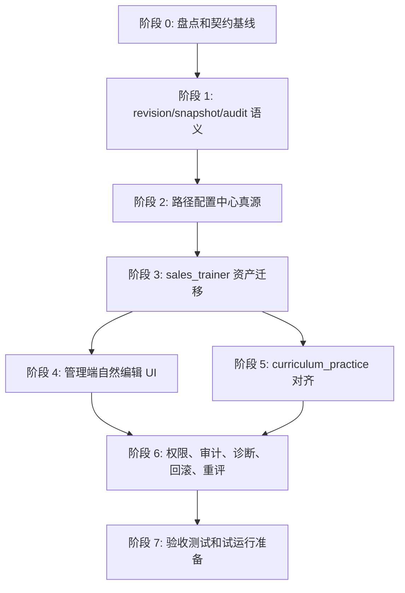

# 发布治理修订模型执行包

关联主计划：`.omo/plans/published-governance-revision-plan.md`  
目标仓库：`/Users/zhaozengqing/github/销售训练qoder`  
执行边界：本文是实施准备文件，不包含功能代码，不修改业务逻辑。

## 读取基线

执行前已要求读取并纳入这些真源：

- `AGENTS.md`
- `CLAUDE.md`
- `CONTEXT.md`
- `backend/AGENTS.md`
- `backend/src/sales_trainer/AGENTS.md`
- `web/src/app/admin/sales-trainer/AGENTS.md`
- `docs/api-contract/sales-trainer.md`
- `docs/architecture/config-asset-center.md`
- `docs/adr/2026-05-27-config-asset-b2-hitl-governance.md`
- `.trellis/spec/backend/index.md`
- `.trellis/spec/frontend/index.md`
- `scripts/critical-quality-gate.sh`
- `web/package.json`
- `backend/pyproject.toml`

执行者必须保持这些约束：

- 用户可见名称是“新人训练路径”；`sales_trainer` 只作为兼容技术命名。
- 后端路由只做鉴权、参数解析和调用 service；不得在 route 中直接改 ORM。
- 业务规则、文案、阈值、流程开关、权限映射不得散落在页面或路由。
- 发布、回滚、归档、重评、绑定变更、路径配置变更必须写审计。
- 历史 attempt/session/submission/result 的 snapshot 不允许被未来发布污染。
- 全量质量门失败时必须记录既有失败证据和聚焦测试替代证据，不得谎称通过。

## 执行目标

把全系统“发布后不可修改 / 复制草稿 / 换绑”的治理方式，升级为：

```text
logical_id + revision_id + active pointer + immutable snapshot + audit + rollback + explicit regrade
```

管理员看到的是：

- 编辑
- 保存修改
- 发布并生效
- 查看历史
- 回滚到此版本
- 重新评分历史记录

管理员不应为了普通编辑理解：

- 复制草稿
- 换绑
- `module_key`
- `unit_id`
- `paper_key`
- `sales_trainer`

技术字段只允许默认隐藏在诊断展开区。

## 依赖顺序



不能先改 UI 文案再补底层语义。UI 文案只有在 service、契约、测试能证明 future-only 和 snapshot immutable 后才算有效。

## 阶段 0：盘点和契约基线

### 目标

建立唯一契约，明确哪些对象进入统一发布治理，哪些对象暂缓，哪些保留兼容读取。

### 文件范围

- `docs/api-contract/sales-trainer.md`
- 可新增 `docs/api-contract/published-governance-revisions.md`
- `CONTEXT.md`
- `docs/adr/` 下如需记录不可逆决策则新增 ADR
- 只读盘点：
  - `backend/src/sales_trainer/`
  - `backend/src/curriculum_practice/services/`
  - `web/src/app/admin/sales-trainer/`
  - `web/src/lib/sales-trainer/`

### 任务

1. 列出所有 `draft/published/archived` 对象和当前 draft-only 锁点。
2. 列出所有运行时 snapshot 字段：`voice_policy_snapshot`、`curriculum_snapshot`、`material_snapshot`、`score_scheme_snapshot`、`task_brief_snapshot`、`transcript_snapshot`、quiz answer snapshot。
3. 定义统一术语：`logical_id`、`revision_id`、`active_revision_id`、`working_revision_id`、`snapshot`、`binding_revision`、`rollback`、`regrade_run`、`audit_event`。
4. 明确新人训练路径优先，课程闭环第二批对齐，成熟配置治理只复用生命周期经验。
5. 明确旧接口兼容策略：旧字段继续返回，新字段增量加入。

### 验证命令

```bash
rg -n "revision_id|active_revision|working_revision|snapshot|rollback|regrade" docs/api-contract docs/adr CONTEXT.md
rg -n "只有 draft|不可直接修改|复制为新草稿|NOT_EDITABLE|SCORING_PROMPT_NOT_EDITABLE" backend/src/sales_trainer web/src/app/admin/sales-trainer web/src/components/admin/sales-trainer web/src/lib/sales-trainer
```

### 验收证据

- 契约能说明普通编辑、发布、回滚、重评、历史快照、权限、审计的机器语义。
- 对象盘点包含新人训练路径、课程闭环、成熟治理参照三类对象。
- 没有业务代码改动。

### 失败标准

- 只写“后续支持版本”但没有 `logical_id`、`revision_id`、`active pointer` 契约。
- 没列出现有 draft-only 锁点。
- 没说明 `ConfigVersion` 不可直接照搬为 immutable revision。

### 回滚策略

只涉及文档时，用 git revert 本阶段文档提交即可；不得回滚用户已有业务改动。

## 阶段 1：统一 revision/snapshot/audit 基础设施

### 目标

建立不可变 revision、当前生效指针、审计事件和字段风险分类的服务层能力。

### 文件范围

- `backend/src/common/governance/` 或项目既有同等 shared kernel 目录
- `backend/src/common/db/models.py`
- `backend/alembic/versions/`
- `backend/tests/unit/`
- `backend/tests/integration/`
- `docs/api-contract/`

### 任务

1. 新增或等价实现 `governance_revisions`、`governance_active_refs`、`governance_audit_events`。
2. 保存 working revision，发布时冻结 immutable revision。
3. active pointer 移动必须写 audit event。
4. rollback 默认移动 active pointer，不复制 payload，不改历史记录。
5. 字段风险分类至少支持：非语义更正、语义修改、绑定修改、高风险评分规则修改。
6. 高风险字段包括正确答案、分值、通过线、AI 评分 prompt、评分规则集，不能被普通配置降级为低风险。
7. service 层暴露 save、publish、rollback、history、diff、impact-preview。

### 验证命令

```bash
cd backend && venv/bin/alembic upgrade head
cd backend && venv/bin/python -m pytest tests/unit/test_sales_trainer_services.py --no-cov
cd backend && venv/bin/ruff check src/
cd backend && venv/bin/mypy src/
```

### 验收证据

- 测试证明已发布 revision payload 不可原地修改。
- 测试证明 active pointer 改变不修改 revision payload。
- 审计事件包含 actor、action、target、before_revision_id、after_revision_id、reason、trace_id、created_at、影响范围。

### 失败标准

- revision payload 可以被 update 覆盖。
- rollback 只改前端文案，没有 active pointer 和 audit event。
- 路由直接改 ORM。

### 回滚策略

- 数据库迁移必须提供可审计 downgrade 或补偿脚本说明。
- 若上线后 revision 服务异常，保留旧读取接口兼容，但禁止旧路径继续写 published payload。

## 阶段 2：新人训练路径配置中心成为真源

### 目标

把路径配置中心从 Unit 聚合诊断页升级为路径级发布资产。

### 文件范围

- `backend/src/sales_trainer/services/path_service.py`
- 新增或调整 `backend/src/sales_trainer/services/path_config_service.py`
- `backend/src/sales_trainer/models.py`
- `backend/src/sales_trainer/schemas.py`
- `backend/src/sales_trainer/api.py`
- `backend/src/router_registry.py`
- `backend/alembic/versions/`
- `web/src/app/admin/sales-trainer/paths/page.tsx`
- `web/src/components/admin/sales-trainer/path-config-center.tsx`
- `web/src/lib/sales-trainer/config-center.ts`
- `web/src/lib/sales-trainer/config-center-types.ts`
- `web/src/app/(dashboard)/sales-trainer/page.tsx`
- `web/src/lib/sales-trainer/module-path.ts`

### 任务

1. 新增路径级 logical object，例如 `newcomer_training_path_v1`。
2. 从 `SalesTrainerUnit.config.path` backfill 第一个 path revision。
3. `new_seller_modules_v1` 保留只读 alias，新增保存必须写 `newcomer_training_path_v1`。
4. 学员首页读取 path active revision，而不是只靠前端硬编码四模块。
5. 路径配置中心支持编辑、保存 working revision、发布、回滚、历史、诊断。
6. 配置中心显示关卡启停、绑定内容、缺失配置、发布可行性、学员端预览。
7. `SalesTrainerUnit.config.path` 迁移为 legacy projection，不再是新写入真源。

### 验证命令

```bash
cd backend && venv/bin/python -m pytest tests/unit/test_newcomer_training_path_boundary.py tests/integration/test_newcomer_training_path_article_api.py --no-cov
cd web && npx vitest run 'src/app/admin/sales-trainer/paths/page.test.tsx' 'src/lib/sales-trainer/config-center.test.ts' 'src/lib/sales-trainer/module-path.test.ts'
cd web && npx tsc --noEmit
```

### 验收证据

- 路径配置中心能保存、发布、回滚 path revision。
- 学员端路径首页从后端配置读取模块标题、顺序、启停、说明、按钮、绑定状态。
- 诊断能指出 legacy alias、缺绑定、草稿绑定、归档引用。

### 失败标准

- 路径配置中心仍只是从多个 Unit 推导状态。
- 管理员仍需进入模块单元编辑页理解 path 字段。
- UI 默认暴露 `module_key`、`unit_id`、`path_key` 才能操作。

### 回滚策略

- 保留 legacy Unit 聚合读取作为短期兼容 fallback。
- 一旦 path active revision 初始化失败，learner 返回 `[PATH_CONFIG_SOURCE_MISSING]`，不伪造成功路径。

## 阶段 3：新人训练路径资产迁移

### 目标

训练单元、商务技巧文章绑定、考卷、题目、AI prompt、评分标准、材料、考试/录音记录接入 revision lineage。

### 文件范围

- `backend/src/sales_trainer/services/unit_service.py`
- `backend/src/sales_trainer/services/exam_paper_service.py`
- `backend/src/sales_trainer/services/exam_paper_unit_adapter.py`
- `backend/src/sales_trainer/services/question_service.py`
- `backend/src/sales_trainer/services/question_bank_adapter.py`
- `backend/src/sales_trainer/services/prompt_service.py`
- `backend/src/sales_trainer/services/material_service.py`
- `backend/src/sales_trainer/services/article_binding_service.py`
- `backend/src/sales_trainer/services/quiz_service.py`
- `backend/src/sales_trainer/services/audio_submission_service.py`
- `backend/src/sales_trainer/models.py`
- `backend/src/sales_trainer/schemas.py`
- `backend/tests/unit/test_newcomer_training_path_papers.py`
- `backend/tests/unit/test_newcomer_training_path_articles.py`
- `backend/tests/unit/test_newcomer_training_path_audit_logs.py`
- `backend/tests/integration/test_newcomer_training_path_paper_api.py`

### 任务

1. 已发布对象编辑改为保存 working revision，而不是返回不可修改。
2. 考卷 revision 固化题目 revision refs、顺序、分值、通过线、评分策略。
3. 题目 revision 固化题干、类型、选项、正确答案、解析、分值、AI prompt。
4. AI prompt / 评分标准 revision 固化 prompt、模型参数、评分维度、通过线。
5. 材料版本映射到统一 revision metadata，保留文件 hash 和 current pointer。
6. 商务技巧文章绑定进入 path/module binding revision。
7. quiz attempt 增加 path/unit/paper/question revision refs；旧数据标记 `legacy_snapshot_only`。
8. audio submission/result 保留已有 snapshots，补 material/score/prompt revision lineage。

### 验证命令

```bash
cd backend && venv/bin/python -m pytest tests/unit/test_newcomer_training_path_papers.py tests/unit/test_newcomer_training_path_articles.py tests/unit/test_newcomer_training_path_audit_logs.py tests/integration/test_newcomer_training_path_paper_api.py --no-cov
cd backend && venv/bin/python -m pytest tests/unit/test_sales_trainer_services.py --no-cov
cd backend && venv/bin/ruff check src/
```

### 验收证据

- 修改已发布商务技巧考卷题干后，旧 attempt 展示旧题，新 attempt 使用新题。
- 修改 AI prompt 后，旧评分仍能解释旧 prompt 或旧 prompt hash，新评分使用新 prompt。
- 发布新材料或评分标准不影响已创建 submission/result。

### 失败标准

- 历史学员记录被新题、新 prompt、新材料覆盖。
- backing quiz unit 仍是考卷管理的普通管理员主概念。
- 草稿、发布、归档状态被绕过导致草稿资产可被 learner 使用。

### 回滚策略

- 旧 attempt 无法匹配 revision 时只标记 `legacy_snapshot_only`，不得伪造 revision id。
- paper 与 backing unit 解耦失败时，保留 adapter 兼容，但 UI 和契约仍以 paper 为一等对象。

## 阶段 4：管理端自然编辑 UI

### 目标

把“不可修改 / 复制草稿 / 换绑”体验替换为“编辑生成新修订，只影响后续学员”。

### 文件范围

- `web/src/app/admin/sales-trainer/paths/page.tsx`
- `web/src/app/admin/sales-trainer/units/`
- `web/src/app/admin/sales-trainer/papers/`
- `web/src/app/admin/sales-trainer/questions/`
- `web/src/app/admin/sales-trainer/score-standards/`
- `web/src/app/admin/sales-trainer/articles/`
- `web/src/app/admin/sales-trainer/materials/`
- `web/src/components/admin/sales-trainer/`
- `web/src/lib/sales-trainer/admin-display.ts`
- `web/src/lib/sales-trainer/operation-log-display.ts`
- `web/src/lib/api/client.ts`
- `web/src/lib/api/client-domains.ts`
- `web/src/lib/api/types.ts`

### 任务

1. 已发布对象可进入编辑页。
2. 保存按钮文案改为“保存修改”，说明“将生成新修订，只影响后续学员”。
3. 发布确认弹窗展示依赖校验、变更摘要、影响范围、是否高风险。
4. 历史版本抽屉展示 revision_no、发布时间、发布人、原因、change_class、diff、引用状态、回滚按钮。
5. 回滚确认弹窗说明只影响未来，不改历史记录。
6. 重评入口必须单独高风险弹窗，要求范围预览和原因。
7. 普通管理员默认隐藏技术字段；运维诊断展开区显示 technical ids。
8. 集中错误码到用户提示映射，不在页面散落业务政策文案。

### 验证命令

```bash
cd web && npx vitest run 'src/app/admin/sales-trainer/paths/page.test.tsx' 'src/app/admin/sales-trainer/papers/page.test.tsx' 'src/app/admin/sales-trainer/papers/[paperId]/edit/page.test.tsx' 'src/app/admin/sales-trainer/score-standards/page.test.tsx' 'src/components/admin/sales-trainer/module-nav.test.tsx' 'src/lib/sales-trainer/admin-display.test.ts'
cd web && npx tsc --noEmit
```

### 验收证据

- 普通管理员能完成编辑、保存、发布，不需要理解复制草稿和换绑。
- 页面默认不出现 `module_key`、`unit_id`、`paper_key`、`sales_trainer` 作为主要操作概念。
- 技术字段只在诊断展开区出现。

### 失败标准

- 仅替换文案，但 API 仍拒绝编辑已发布对象。
- 保存修改直接覆盖 active published payload。
- 页面主流程仍显示“复制为新草稿”作为普通编辑入口。

### 回滚策略

- UI 可短期保留旧复制草稿兼容入口在诊断区或迁移辅助区，但不能作为主路径。
- 若后端 revision API 未启用，前端必须显示明确不可用原因，不伪造自然编辑。

## 阶段 5：课程闭环对齐

### 目标

把 `curriculum_practice` 中 PracticeTemplate、CaseItem、RoleProfile、ExaminerAgent、LearningContent、Question 等同类发布资产对齐到统一模型。

### 文件范围

- `backend/src/curriculum_practice/services/practice_templates.py`
- `backend/src/curriculum_practice/services/test_bank.py`
- `backend/src/curriculum_practice/services/learning_contents.py`
- `backend/src/curriculum_practice/services/published_asset_refs.py`
- `backend/src/curriculum_practice/services/publishing_gates.py`
- `backend/src/curriculum_practice/services/snapshots.py`
- `backend/src/curriculum_practice/services/asset_resolution.py`
- `backend/tests/unit/test_practice_template_published_asset_refs.py`
- `docs/architecture/config-asset-center.md`
- `docs/adr/`

### 任务

1. PracticeTemplate 编辑生成 working revision，发布生成 `published_asset_refs`。
2. `published_asset_refs` 升级引用 revision id + hash。
3. `curriculum_snapshot` 增加 revision lineage。
4. CaseItem、RoleProfile、ExaminerAgent、LearningContent 接入 logical id + revision id。
5. 发布门禁和回滚门禁都校验依赖资产可用。
6. 保留运行时只消费 frozen snapshot 的规则。

### 验证命令

```bash
cd backend && venv/bin/python -m pytest tests/unit/test_practice_template_published_asset_refs.py --no-cov
cd backend && venv/bin/python -m pytest tests/unit/test_newcomer_training_path_boundary.py --no-cov
cd backend && venv/bin/mypy src/
```

### 验收证据

- 旧 session 的 `curriculum_snapshot` 不受新 asset revision 影响。
- 回滚模板或资产只影响未来 session。
- 通用题库被 sales_trainer 或 curriculum_practice 任一侧更新时，不污染另一侧历史记录。

### 失败标准

- 课程闭环继续要求普通管理员理解 duplicate、模板换绑、重新发布才能做普通编辑。
- `curriculum_snapshot` 运行时继续从 latest asset 重建。

### 回滚策略

- 保留现有 `published_asset_refs` 读取兼容。
- 无 revision lineage 的历史 session 标记 legacy，不反填不可信数据。

## 阶段 6：权限、审计、诊断、回滚、重评

### 目标

让管理者能管控，运维者能定位和恢复，审计能追责。

### 文件范围

- `backend/src/sales_trainer/permissions.py`
- `backend/src/sales_trainer/services/operation_log_service.py`
- `backend/src/sales_trainer/services/training_record_service.py`
- 新增或调整 regrade service
- `web/src/app/admin/sales-trainer/settings/page.tsx`
- `web/src/app/admin/sales-trainer/operation-logs/page.tsx`
- `web/src/app/admin/sales-trainer/score-results/page.tsx`
- `web/src/app/admin/sales-trainer/quiz-attempts/[attemptId]/page.tsx`
- `web/src/app/admin/sales-trainer/audio-submissions/[submissionId]/page.tsx`

### 任务

1. 权限区分超级管理员、内容管理员、培训负责人、运维人员、学员。
2. 后端强制拦截编辑、发布、回滚、归档、重评、查看原始诊断数据。
3. 所有治理动作写 audit event。
4. 运维诊断页显示 active revision、缺绑定、非法引用、ASR/AI 配置、最近错误码、legacy 数据量、恢复入口。
5. 回滚 API、UI、审计、future-only 语义闭环。
6. 重评历史记录必须单独预览、原因、范围、before/after、trace_id，默认追加结果，不覆盖原始结果。

### 验证命令

```bash
cd backend && venv/bin/python -m pytest tests/unit/test_newcomer_training_path_permissions.py tests/integration/test_newcomer_training_path_rbac_api.py tests/unit/test_newcomer_training_path_audit_logs.py --no-cov
cd web && npx vitest run 'src/app/admin/sales-trainer/settings/page.test.tsx' 'src/app/admin/sales-trainer/operation-logs/page.test.tsx' 'src/app/admin/sales-trainer/score-results/page.test.tsx' 'src/app/admin/sales-trainer/quiz-attempts/[attemptId]/page.test.tsx' 'src/app/admin/sales-trainer/audio-submissions/page.test.tsx'
```

### 验收证据

- 越权发布、回滚、重评被后端拒绝。
- 审计事件包含 actor、action、target、before/after 或 before_revision/after_revision、reason、trace_id、created_at、影响范围。
- 运维能从诊断页看到错误对象、错误原因、需要谁处理、修复入口。

### 失败标准

- 前端隐藏按钮但后端仍允许越权。
- 重评能无原因覆盖历史成绩。
- 回滚没有审计或不能证明只影响未来。

### 回滚策略

- 高风险重评默认 append-only；如展示结果切换错误，可以恢复展示指针到原始评分。
- 权限策略发布异常时，超级管理员保留应急只读诊断入口，写操作仍不得绕过审计。

## 阶段 7：验收测试和试运行准备

### 目标

用测试和浏览器验收证明：历史不变、未来生效、可审计、可回滚、权限可拦截。

### 文件范围

- `backend/tests/unit/`
- `backend/tests/integration/`
- `backend/tests/contract/`
- `web/src/**/*.test.ts`
- `web/src/**/*.test.tsx`
- 浏览器验收记录输出到 `evidence/` 或 `.sisyphus/evidence/`

### 任务

1. 补后端 unit/integration/contract 测试。
2. 补前端 Vitest。
3. 跑三条浏览器验收：
   - 编辑已发布商务技巧考卷题目后，旧 attempt 旧题，新 attempt 新题。
   - 编辑 AI prompt 后，旧评分旧 prompt，新评分新 prompt。
   - 回滚路径配置后，未来学员回到旧路径，历史记录不变。
4. 执行完整质量门或记录既有失败。
5. 输出试运行问题记录模板。

### 验证命令

```bash
cd web && npx tsc --noEmit
cd web && npm test
cd backend && venv/bin/python -m pytest tests/unit/test_newcomer_training_path_papers.py tests/unit/test_newcomer_training_path_articles.py tests/unit/test_newcomer_training_path_audit_logs.py tests/unit/test_newcomer_training_path_permissions.py tests/integration/test_newcomer_training_path_paper_api.py tests/integration/test_newcomer_training_path_article_api.py tests/integration/test_newcomer_training_path_rbac_api.py --no-cov
cd backend && venv/bin/ruff check src/
cd backend && venv/bin/mypy src/
cd backend && venv/bin/alembic upgrade head
bash scripts/critical-quality-gate.sh
```

### 验收证据

- 命令输出保存到 `evidence/` 或 `.sisyphus/evidence/`。
- 全量失败时保存原始失败输出、标明既有失败与本次变更关系、提供聚焦替代测试。
- 浏览器截图或录屏覆盖管理员配置、学员端旧新记录、运维诊断、操作日志。

### 失败标准

- 只测页面能打开，不测历史快照、未来生效、审计、权限。
- 质量门失败但最终汇报写“通过”。
- 没有试运行记录模板，真实新人试运行无法收集问题。

### 回滚策略

- 代码回滚不改历史 revision 和 audit。
- 数据回滚以 active pointer 回滚为主，不删除历史 revision。
- 测试数据清理必须保留审计样本或导出证据。

## 全局失败标准

出现任一项，本次实施判失败：

- 管理员仍必须手动理解“复制草稿、换绑、重新发布”才能完成普通编辑。
- 历史学员记录会被新题、新 prompt、新材料、新路径配置覆盖。
- UI 仍把 `module_key`、`unit_id`、`paper_key`、`sales_trainer` 作为普通管理员主要操作概念。
- 回滚只有文案，没有 API、active pointer、审计和未来生效语义。
- 路径配置中心仍只是 Unit 聚合视图，没有路径级发布配置真源。
- 高风险重评可以无原因、无范围、无 before/after、无 trace_id 地覆盖历史成绩。
- 测试不覆盖历史快照、未来生效、审计和权限。

## 执行证据格式

每阶段完成时记录：

```text
阶段：
提交范围：
验证命令：
命令结果：
浏览器验收：
审计事件样本：
遗留风险：
是否触发失败标准：
```

