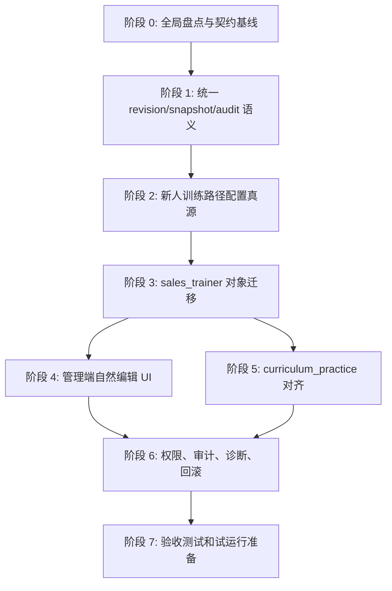

# 发布治理修订模型实施计划

本计划只规划，不实现功能代码。目标仓库：`/Users/zhaozengqing/github/销售训练qoder`。

计划输入已纳入以下项目上下文：

- `AGENTS.md`
- `CLAUDE.md`
- `CONTEXT.md`
- `backend/AGENTS.md`
- `backend/src/sales_trainer/AGENTS.md`
- `web/src/app/admin/sales-trainer/AGENTS.md`
- `docs/api-contract/sales-trainer.md`
- `docs/architecture/config-asset-center.md`
- `docs/adr/2026-05-27-config-asset-b2-hitl-governance.md`
- `.trellis/spec/backend/index.md`
- `.trellis/spec/frontend/index.md`
- `scripts/critical-quality-gate.sh`
- `web/package.json`
- `backend/pyproject.toml`

## 目标审计

### 可指物

本次目标不是“让发布体验更好”，而是交付一套可检查的发布治理模型：

- 一个统一领域契约：定义 `logical_id`、`revision_id`、`active_revision`、`snapshot`、`binding`、`rollback`、`regrade`、`audit_event`。
- 一套后端修订基础设施：保存不可变修订、当前生效指针、运行时快照引用、审计事件。
- 一个新人训练路径配置真源：路径配置中心不再从多个 `SalesTrainerUnit.config.path` 反推路径，而是管理路径级发布资产。
- 一组对象级迁移：训练单元、题目、考卷、录音评分标准、材料、商务技巧文章绑定、路径配置、操作日志、学员考试/录音记录。
- 一组课程闭环对齐改造：`PracticeTemplate`、`CaseItem`、`RoleProfile`、`ExaminerAgent`、`LearningContent`、通用 `TestBank Question`、`published_asset_refs`、`curriculum_snapshot`。
- 一个管理员自然编辑 UI：显示“编辑 / 保存修改 / 发布并生效 / 查看历史 / 回滚到此版本 / 重新评分历史记录”，不要求普通管理员理解“复制草稿、换绑、重新发布”。
- 一个可验证验收集：后端、前端、浏览器路径都能证明“历史不被污染，未来使用新修订，回滚只影响未来，审计可追踪，权限可拦截”。

### 可否证

出现以下任一情况，本计划执行失败：

- 管理员完成普通内容修改仍必须手动理解“复制草稿、换绑、重新发布”。
- 历史学员考试、录音、评分记录会被新题干、新选项、新正确答案、新 prompt、新材料覆盖。
- 普通管理员页面仍把 `module_key`、`unit_id`、`paper_key`、`sales_trainer` 作为主要操作概念。
- “回滚”只有前端文案，没有 API、active pointer、审计事件和未来生效语义。
- 路径配置中心仍从多个 `SalesTrainerUnit.config.path` 聚合状态，没有路径级发布配置真源。
- 已发布对象编辑仍直接修改当前已发布 payload。
- 高风险重评可以无原因、无影响范围、无 before/after、无 `trace_id` 地覆盖历史成绩。
- 测试只验证页面能打开，不验证历史快照、未来生效、审计、权限和并发冲突。

### 完成态

完成后可以演示这条闭环：

1. 管理员打开“新人训练路径配置中心”，看到四个关卡、启停、绑定内容、缺失配置、学员端预览和发布状态。
2. 管理员编辑已发布的商务技巧考卷题目，保存后系统生成新修订；未发布前学员仍使用旧版本。
3. 管理员发布新修订后，新学员看到新题；旧学员考试记录仍显示旧题、旧答案、旧得分依据。
4. 管理员编辑 AI 评分 prompt 后，新评分使用新 prompt；旧评分仍能展示当时 prompt 版本或 prompt 快照。
5. 管理员回滚路径配置或考卷到旧修订后，只影响未来学员。
6. 运维人员在诊断页能看到 active revision、依赖缺失、最近错误码、ASR/AI 状态、审计事件和恢复入口。
7. 超级管理员可以触发“重新评分历史记录”高风险动作；动作必须预览影响范围、填写原因、记录审计，并保留原始结果。

### 上下文约束

- 本计划第一实施主线是新人训练路径，因为这是当前用户明确指出的业务痛点。
- 课程闭环 `curriculum_practice` 是第二主线，需要复用其已有 `published_asset_refs` 和 `curriculum_snapshot` 思路，但不能假设它已经满足自然编辑体验。
- `BusinessRuleConfig`、`ConfigBundle`、`AdminSettings`、`ScoringRuleset`、`PromptTemplate` 是成熟参照，不是可以无条件复制的统一答案。
- 现有 `ConfigVersion` 同步逻辑存在更新已有 snapshot 的行为，不能作为“不可变修订”的直接模板；只能复用生命周期、预检、发布、回滚、审计思路。
- 后端路由不能直接改 ORM；新增更新、发布、回滚、重评必须进入 service/rules/audit 层。
- 业务规则、状态文案、阈值、流程开关、权限映射不能散落在页面或路由。
- 技术字段可以保留在诊断展开区，不能成为普通管理员完成配置的前置知识。

## 当前系统盘点

### 新人训练路径 / `sales_trainer`

| 对象 | 当前锁点或真源 | 当前问题 | 计划影响 |
|---|---|---|---|
| 训练单元 `SalesTrainerUnit` | `backend/src/sales_trainer/services/unit_service.py` 中 `update_unit()` 对非 `draft` 拒绝更新 | 已发布后只能复制草稿；单元同时承载路径、学习、考试、录音等多种配置 | 拆出 logical unit 与 immutable unit revision；已发布编辑变成 pending revision |
| 考卷 `SalesTrainerExamPaper` | `backend/src/sales_trainer/services/exam_paper_service.py` 中 `update_paper()` 对非 `draft` 拒绝更新 | 考卷与 backing quiz unit 耦合，发布/归档联动不透明 | 考卷 revision 固化题目组成、分值、通过线、AI 判分策略；逐步弱化 backing unit 作为真源 |
| 题目 `QuestionItem` | `backend/src/curriculum_practice/services/test_bank.py` 中题目非 `draft` 不可改；销售训练通过 adapter 复用 | 单选、多选、判断、简答题修改会影响考试治理，但当前体验是“不可改” | 题目使用 logical question + question revision；考卷发布时引用 question revision 并冻结题目快照 |
| 录音评分标准 / prompt | `backend/src/sales_trainer/services/prompt_service.py` 中非 `draft` 不可改 | prompt 变化会影响未来评分，历史评分需要可解释 | prompt revision + score scheme snapshot；高风险字段变更必须提示并要求发布原因 |
| 训练材料主档与版本 | `backend/src/sales_trainer/services/material_service.py` 已有 material/version/current_version | 版本概念接近 revision，但需要与统一 active pointer、审计、路径绑定对齐 | 保留 material version 作为资产修订的本地实现；补统一 revision metadata 和绑定语义 |
| 商务技巧文章绑定 | `backend/src/sales_trainer/article_api.py` 与 article binding service 修改 unit config | 绑定写在单元 config，路径配置中心不能成为真源 | 绑定进入路径配置 revision；学习内容自身也要有 revision 或 published snapshot |
| 路径配置中心 | `backend/src/sales_trainer/services/path_service.py` 从 published units 聚合 `SalesTrainerPathConfig` | 页面像诊断页，不是配置入口；路径真源散落在单元 | 新增路径级 published asset：`NewcomerTrainingPathConfig` 或等价模型 |
| 操作日志 | `backend/src/sales_trainer/services/operation_log_service.py` | 有日志，但不一定有 before/after revision、影响范围和 trace_id | 扩展为治理审计事件或接入统一 audit view |
| 学员考试记录 | `SalesTrainerQuizAttempt` 与 answer payload 已有题目内容快照，但缺少 paper/path/unit revision lineage | 新修订发布后无法证明旧 attempt 使用哪个路径/考卷版本 | 补 `path_revision_id`、`unit_revision_id`、`paper_revision_id`、`question_revision_refs` 或 legacy snapshot 标记 |
| 学员录音提交 | audio flow 已冻结 `material_snapshot`、`score_scheme_snapshot`、`task_brief_snapshot`，评分结果有 `transcript_snapshot`、`prompt_version`、`prompt_hash` | 快照能力较成熟，但 revision id 和统一审计还不完整 | 保留现有快照，补 revision lineage、active pointer 来源、重评审计 |

### 课程闭环 / `curriculum_practice`

| 对象 | 当前能力 | 当前问题 | 计划影响 |
|---|---|---|---|
| `PracticeTemplate` | 发布时写 `published_asset_refs`，会话创建时生成 `curriculum_snapshot` | 模板非草稿不可编辑；自然编辑体验不存在 | 模板 logical id + template revision；发布时继续生成 `published_asset_refs` |
| `CaseItem` | 有 `draft/published/archived`、`content_hash` | 已发布后不可自然编辑 | Case revision；模板发布引用 case revision |
| `RoleProfile` | 有发布状态、画像配置、voice 等字段 | 修改 voice/角色规则会影响运行时 | Role revision；运行时 snapshot 固化 |
| `ExaminerAgent` | 有 prompt/safety/timeout/question sources 等配置 | prompt 和 question source 是高风险变更 | Agent revision；发布门禁检查题目 revision 是否可用 |
| `LearningContent` | 有状态、内容、safety flag | 学习内容编辑体验与新人训练路径文章类似 | Content revision；Markdown/图片作为 revision payload |
| 通用 TestBank `QuestionItem` | 复用题库生命周期 | 同一题库被销售训练和课程闭环复用，修订必须按 usage scope 隔离 | 统一 question revision，考卷或考官只绑定 revision |
| 发布门禁 | `publishing_gates.py` 已有较完整校验 | 门禁在发布时有效，但自然编辑/回滚缺少统一 revision 策略 | 保留门禁，在 publish/rollback 时都执行依赖有效性校验 |
| `published_asset_refs` | 模板发布时冻结资产引用 | 适合作为发布时 binding snapshot | 复用语义，但引用目标升级为 revision id + content hash |
| `curriculum_snapshot` | 会话创建时冻结运行时数据 | 适合作为历史运行时快照 | 保留，补 active revision lineage |

### 成熟配置治理参照

| 体系 | 可复用能力 | 不能照搬 | 计划用法 |
|---|---|---|---|
| `BusinessRuleConfig` | 默认值、校验、发布、回滚、运行时解析、审计 | 不适合作为所有内容资产的 payload 存储 | 承载可调规则：字段风险策略、提示文案模板、流程开关、阈值 |
| `ConfigBundle` | draft/validate/preview/publish/rollback/audit 的产品体验 | 现有 `ConfigVersion` 同步会更新已有版本，不能满足不可变 revision | 复用生命周期页面和发布预检思路；不可直接照搬存储实现 |
| `AdminSettings` | 系统设置、管理入口、健康配置 | 不适合承载对象内容修订 | 承载全局开关、兼容策略、诊断配置 |
| `ScoringRuleset` | 评分规则 dry-run、发布、回滚、审计 | 回滚语义与新 active pointer 模型需统一 | 评分规则作为高风险发布资产，参考 dry-run 和影响预览 |
| `PromptTemplate` governance | prompt 校验、渲染、治理迁移、回滚 | 缺少统一 revision lineage | prompt/AI 评分模板的治理体验参考 |

### 运行时和历史快照

已有或计划统一纳入的快照字段：

- `voice_policy_snapshot`
- `curriculum_snapshot`
- `material_snapshot`
- `score_scheme_snapshot`
- `task_brief_snapshot`
- `transcript_snapshot`
- quiz/exam attempt answer snapshot
- question snapshot
- paper snapshot
- path/module snapshot
- prompt snapshot 或 `prompt_revision_id + prompt_hash`

目标规则：运行时记录一旦创建，就只读当时的 snapshot 或 revision refs；未来发布、回滚、归档不改写历史记录。

## 行业目标模型

适用于考试系统、LMS、CMS、配置中心和评分系统的低风险做法是：

- 业务对象有稳定身份：例如“商务技巧考卷”一直是同一份考卷。
- 内容变化生成不可变修订：题干、选项、答案、分值、通过线、prompt、绑定关系变化都形成 revision。
- 当前生效是一个指针：学员打开时读取 active revision；回滚只移动 active pointer。
- 历史记录冻结当时上下文：attempt/session/result 保存 revision ids 和必要 JSON snapshot。
- 管理员自然编辑：编辑的是新 working revision，不是直接改已发布内容。
- 发布需要影响预览：告诉管理员“影响未来学员，不影响已提交记录；如需重评历史，请走高风险流程”。
- 回滚是未来生效动作：不删除 revision，不改历史成绩，不修改历史会话。
- 重评历史是单独动作：必须有原因、范围、操作者、before/after、trace_id，并保留原结果。
- 技术诊断可展开：普通管理员看到业务语言，运维可以展开 technical ids、hash、trace、raw payload。

## 统一领域术语

| 术语 | 定义 | 示例 |
|---|---|---|
| `logical_id` | 业务对象稳定身份 | 商务技巧考卷 ID、商务技巧模块 ID |
| `revision_id` | 一次不可变内容修订身份 | 考卷第 5 版、题目第 3 版 |
| `revision_no` | 同一 logical object 下递增版本号 | 1、2、3 |
| working revision | 管理员正在编辑但未发布的修订 | 保存修改后生成的待发布版本 |
| active revision | 当前对未来请求生效的修订 | 新学员打开时使用的版本 |
| snapshot | 运行时冻结的内容副本 | 学员考试时看到的题目 JSON |
| binding | 一个资产引用另一个资产的关系 | 模块绑定考卷 revision、考卷绑定题目 revision |
| binding revision | 绑定关系本身的一次修订 | 商务技巧从考卷 v2 换到 v3 |
| future-only | 只影响新请求，不影响已有 attempt/session/result | 回滚路径配置 |
| regrade run | 高风险历史重评任务 | 对过去 20 个考试结果重新评分 |
| audit event | 审计事件 | actor/action/target/before/after/reason/trace_id |

### 变更风险分类

系统保存修改时应基于字段策略自动分类：

| 分类 | 例子 | 系统动作 |
|---|---|---|
| 非语义更正 | 错别字、展示说明、图片 alt、管理员备注 | 生成 revision，可低风险发布；历史记录不变 |
| 语义修改 | 题干、选项、文章正文、案例内容、材料正文 | 生成 revision；发布只影响未来；提示影响学习/考试内容 |
| 绑定修改 | 模块换文章、考卷换题目、模板换案例 | 生成 binding revision；发布前做依赖校验和影响预览 |
| 高风险评分规则修改 | 正确答案、分值、通过线、AI 评分 prompt、评分规则集 | 生成 revision；发布前强提示；历史重评必须走单独动作 |

字段风险策略建议由 `BusinessRuleConfig` 或同等配置承载，并有代码底线：正确答案、分值、通过线、评分 prompt、评分规则不能被普通配置降级为低风险。

## 对象级改造矩阵

### 新人训练路径对象

| 对象 | 目标模型 | 必须冻结 | 回滚语义 | 关键测试 |
|---|---|---|---|---|
| 新人训练路径配置 | `path_logical_id + path_revision_id + active_pointer` | 模块顺序、启停、标题、说明、按钮、绑定 revision refs、解锁规则 | active pointer 指向旧 path revision，只影响未来学员 | 配置回滚后新学员看到旧路径，旧学员记录不变 |
| 训练单元 | `unit_logical_id + unit_revision_id` | 类型、学习/考试/录音配置、通关规则、绑定 refs | 当前模块使用旧 unit revision | 编辑已发布单元生成 working revision |
| 商务技巧文章/章节 | `content_logical_id + content_revision_id` | MD 内容、图片 refs、章节顺序、发布状态 | active content revision 回到旧版 | 旧学习记录能展示当时章节内容或 revision |
| 考卷 | `paper_logical_id + paper_revision_id` | 题目 revision refs、顺序、分值、通过线、评分策略 | future attempts 使用旧 paper revision | 旧 attempt 显示旧题，新 attempt 显示新题 |
| 题目 | `question_logical_id + question_revision_id` | 题干、类型、选项、正确答案、解析、分值、AI prompt | 考卷绑定旧 question revision | 修改题干不污染旧 attempt |
| 多选/简答 AI 评分 prompt | `prompt_logical_id + prompt_revision_id` 或并入题目/评分标准 revision | prompt、模型参数、评分维度、通过线 | future scoring 使用旧 prompt | 旧评分仍可解释旧 prompt |
| 录音评分标准 | `score_standard_logical_id + revision_id` | 评分维度、权重、prompt、通过线 | future submissions 使用旧标准 | 旧录音结果显示旧 `score_scheme_snapshot` |
| 材料主档与版本 | 保留 material/version，映射到 revision 语义 | 文件 hash、标题、页数、素材元数据、current version | current version 指针回滚 | 正在评分的 submission 不受新材料影响 |
| 操作日志 | 统一 audit event 或 sales trainer log 扩展 | before/after、revision refs、reason、trace_id、影响范围 | 不回滚日志 | 发布/回滚/重评都可查 |
| 学员考试记录 | attempt 绑定 `path/unit/paper/question revision refs` + answer snapshot | 提交时题目、答案、评分依据 | 不回滚历史 attempt | 历史 attempt 与新 active revision 无交叉污染 |
| 学员录音记录 | submission/result 绑定 material/score/prompt revision refs + snapshots | 材料、任务简报、评分标准、转写和评分 prompt | 不回滚历史 submission/result | prompt 变更后旧评分解释不变 |

### 课程闭环对象

| 对象 | 目标模型 | 与现有能力关系 | 关键测试 |
|---|---|---|---|
| `PracticeTemplate` | template logical id + revision | 发布时继续生成 `published_asset_refs` | 模板编辑后旧 session `curriculum_snapshot` 不变 |
| `CaseItem` | case logical id + revision | 替代 published 后不可改体验 | 新 case revision 只影响未来模板发布 |
| `RoleProfile` | role logical id + revision | voice/行为规则进入 snapshot | 旧 session voice/role 不变 |
| `ExaminerAgent` | agent logical id + revision | question sources/prompt/safety 是高风险 | 新 agent prompt 只影响未来 session |
| `LearningContent` | content logical id + revision | 与商务技巧学习内容统一语义 | 旧学习记录不受新内容影响 |
| TestBank `QuestionItem` | question logical id + revision | 被销售训练和课程闭环共同引用 | 不同 usage scope 下引用 revision 明确 |
| 发布门禁 | publish/rollback 都执行 | 保留 `publishing_gates.py` | 回滚到依赖已归档旧版本时失败并给入口 |
| `published_asset_refs` | 发布时 binding snapshot | 升级引用 revision id + hash | template publish 固化 refs |
| `curriculum_snapshot` | 会话时 runtime snapshot | 保留 | session 创建后 active pointer 变化不影响 snapshot |

### 成熟治理对象

| 对象 | 计划动作 |
|---|---|
| `BusinessRuleConfig` | 复用为字段风险策略、提示文案模板、阈值、治理开关的配置来源 |
| `ConfigBundle` | 复用 validate/preview/publish/rollback/audit 体验；存储实现需先修正不可变性或仅作参考 |
| `AdminSettings` | 承载兼容期设置、诊断展示开关、告警阈值 |
| `ScoringRuleset` | 对齐 active pointer、regrade run、dry-run、审计模型 |
| `PromptTemplate` | 对齐 revision lineage、prompt hash、回滚与历史解释 |

## 依赖图和阶段顺序



依赖原则：

- 先做对象盘点和契约基线，避免只改某个页面后破坏另一个入口。
- 先定义 revision、snapshot、audit 语义，再改 UI 文案。
- 优先改新人训练路径，因为当前使用者、管理员、运维问题集中在此。
- 先把路径配置中心升级为路径级发布资产，再迁移题目、考卷、AI prompt、训练单元、材料、文章绑定。
- 再处理 `curriculum_practice` 同类资产，保留其 `published_asset_refs` 和 `curriculum_snapshot`。
- 最后统一操作日志、回滚、历史版本抽屉、权限、审计、诊断和验收测试。

## 数据模型和迁移方案

### 推荐新增或调整的表

| 表或字段 | 用途 | 说明 |
|---|---|---|
| `governance_revisions` | 存储不可变修订 | `id`、`resource_type`、`logical_id`、`revision_no`、`payload_json`、`payload_hash`、`change_class`、`source_revision_id`、`created_by`、`created_at`、`reason`、`trace_id` |
| `governance_active_refs` | 当前生效指针 | `resource_type`、`logical_id`、`active_revision_id`、`activated_by`、`activated_at`、`activation_reason`、`trace_id` |
| `governance_audit_events` | 统一审计事件 | 可新增，也可扩展现有 operation log 并接入统一 audit view |
| `newcomer_path_config_revisions` | 路径级配置修订 | 如统一表能满足查询可不单独建；若路径配置查询复杂，建专表并同步写 `governance_revisions` |
| `newcomer_path_active_refs` | 路径 active pointer | 如果不单独建表，则使用 `governance_active_refs(resource_type='newcomer_path')` |
| `governance_binding_refs` | 绑定关系索引 | 可选，用于快速查询“哪个路径/考卷/模板引用了哪个 revision” |
| `audit_reason` | 发布、回滚、归档、重评原因 | 对高风险动作必填 |
| `trace_id` | 链路追踪 | 所有治理动作和错误响应必须带 |
| attempt/session revision refs | 历史 lineage | `path_revision_id`、`unit_revision_id`、`paper_revision_id`、`score_prompt_revision_id`、`material_revision_id` 等 |

### 存储策略

- revision payload 不允许原地更新；如发现字段写错，只能创建新 revision。
- active pointer 可以更新，但每次更新必须写审计事件。
- rollback 默认不复制 payload，而是将 active pointer 指向已有 immutable revision；审计事件记录 `before_revision_id` 和 `after_revision_id`。
- 如果管理侧需要“回滚产生一条新历史记录”，可以新增 activation event 或 rollback event，不复制 content revision。
- working revision 是可编辑草稿；发布后成为 immutable revision。实现上可以用单独 `working_revisions` 表，也可以在 `governance_revisions` 中用 `status='working'`，但只有 published revision 进入 immutable 约束。

### Backfill

1. 为每个现有 published 对象创建 revision no.1，payload 来自当前行。
2. 为每个现有 active published 对象创建 active pointer。
3. 对 draft 对象：
   - 如果是未发布新对象，创建 working revision。
   - 如果是 copied draft，记录 `source_revision_id`。
4. 对 archived 对象：
   - 创建 historical revision，不设置 active pointer。
   - 如果 archived 对象仍被当前配置引用，诊断页标记 `[REVISION_DEPENDENCY_ARCHIVED_BUT_REFERENCED]`，不静默修复。
5. 对 `SalesTrainerUnit.config.path`：
   - backfill 为 `newcomer_training_path_v1` 的 path revision。
   - `new_seller_modules_v1` 保留只读兼容 alias，并在诊断中提示迁移状态。
   - 迁移后 Unit path config 只能作为 projection 或 legacy field，不再是真源。
6. 对历史 quiz attempt：
   - 已有 answer snapshot 的记录标记为 `legacy_snapshot_only`。
   - 能通过现有 id/hash 匹配到 revision 的，回填 revision refs。
   - 无法可靠匹配的，不伪造 revision id，只保留 snapshot 和 legacy 标记。
7. 对历史 audio submission/result：
   - 保留现有 `material_snapshot`、`score_scheme_snapshot`、`task_brief_snapshot`、`transcript_snapshot`。
   - 可匹配 prompt/material revision 时回填 refs；否则保留 hash/legacy 标记。

### 兼容 API

- 旧列表和详情接口继续返回原字段，并增加 `revision`、`active_revision_id`、`working_revision_id`、`history_available`。
- 旧“复制草稿”接口进入兼容期，不作为主 UI 行为；可返回 deprecation warning。
- 旧 `update published -> not editable` 错误改为：创建或更新 working revision，并返回影响提示。
- 旧客户端如果不传 `base_revision_id`，服务端允许低风险保存但对高风险字段要求重新拉取或确认；新 UI 必须传 `base_revision_id` 做并发控制。

### 并发和边界场景

| 场景 | 策略 |
|---|---|
| 两个管理员同时编辑 | 使用 `base_revision_id` 或 `working_revision_version` 乐观锁；冲突返回 `[REVISION_CONFLICT]` 和差异入口 |
| 重复点击发布 | 使用 idempotency key 或 `(working_revision_id, publish_request_id)`；第二次返回已发布结果 |
| 草稿冲突 | 同一 actor 可继续编辑自己的 working revision；多人编辑需要分支或 takeover 审计 |
| 回滚到依赖非法旧版本 | publish gate 重新校验；失败返回缺失依赖和修复入口 |
| 归档资产被当前配置引用 | 禁止归档或要求先换绑；运维诊断显示阻塞引用 |
| 正在考试时发布新版本 | attempt 创建时冻结 paper/path/question refs；考试中继续旧版本 |
| 正在录音评分时发布新标准 | submission 创建时冻结 material/score/prompt refs；评分继续旧版本 |
| 图片或附件删除 | 资产 revision 引用的文件必须保留或进入冷存储；不能物理删除仍被 revision 引用的文件 |

## API 契约改造

### 新增通用契约字段

每个可发布对象 DTO 至少包含：

```json
{
  "logical_id": "business-skills-paper",
  "active_revision_id": "rev_...",
  "working_revision_id": "rev_work_...",
  "revision_no": 5,
  "status": "published",
  "change_class": "semantic",
  "can_edit": true,
  "can_publish": true,
  "can_rollback": true,
  "history_available": true,
  "diagnostics": []
}
```

### 新增或调整的端点

| 端点 | 用途 |
|---|---|
| `GET /api/admin/sales-trainer/governance/resources/{resource_type}/{logical_id}/history` | 历史版本 |
| `GET /api/admin/sales-trainer/governance/resources/{resource_type}/{logical_id}/diff?from=&to=` | 差异预览 |
| `POST /api/admin/sales-trainer/governance/resources/{resource_type}/{logical_id}/save` | 保存 working revision |
| `POST /api/admin/sales-trainer/governance/resources/{resource_type}/{logical_id}/publish` | 发布并移动 active pointer |
| `POST /api/admin/sales-trainer/governance/resources/{resource_type}/{logical_id}/rollback` | 回滚到指定 revision |
| `POST /api/admin/sales-trainer/governance/resources/{resource_type}/{logical_id}/impact-preview` | 影响范围预览 |
| `POST /api/admin/sales-trainer/regrade/preview` | 历史重评预览 |
| `POST /api/admin/sales-trainer/regrade` | 高风险历史重评 |
| `GET /api/admin/sales-trainer/paths/{path_key}/draft` | 路径配置 working revision |
| `POST /api/admin/sales-trainer/paths/{path_key}/publish` | 发布路径配置 |
| `POST /api/admin/sales-trainer/paths/{path_key}/rollback` | 路径配置回滚 |

### 错误码

| 错误码 | 类型 | 说明 |
|---|---|---|
| `[REVISION_CONFLICT]` | Terminal | base revision 过期 |
| `[REVISION_DEPENDENCY_INVALID]` | Terminal | 绑定的资产未发布、已归档或缺失 |
| `[REVISION_ROLLBACK_TARGET_INVALID]` | Terminal | 回滚目标不存在或依赖不合法 |
| `[HISTORICAL_SNAPSHOT_IMMUTABLE]` | Terminal | 尝试修改历史 snapshot |
| `[REGRADE_REASON_REQUIRED]` | Terminal | 高风险重评缺少原因 |
| `[REGRADE_IMPACT_CONFIRMATION_REQUIRED]` | Terminal | 未确认影响范围 |
| `[GOVERNANCE_PERMISSION_DENIED]` | Terminal | 权限不足 |
| `[PATH_CONFIG_SOURCE_MISSING]` | Terminal | 路径级配置真源缺失 |
| `[LEGACY_SNAPSHOT_ONLY]` | Informational | 历史记录只有旧 snapshot，无 revision lineage |
| `[GOVERNANCE_SERVICE_UNAVAILABLE]` | Transient | 修订服务临时不可用 |

## 后端服务改造

### 服务边界

新增或改造以下模块，具体命名按仓库风格落地：

| 模块 | 职责 |
|---|---|
| `backend/src/common/governance/revision_service.py` | 创建 working revision、冻结 published revision、查询历史 |
| `backend/src/common/governance/active_pointer_service.py` | 读取和移动 active revision |
| `backend/src/common/governance/audit_service.py` | 写审计事件、查询审计摘要 |
| `backend/src/common/governance/impact_service.py` | 计算引用关系和影响范围 |
| `backend/src/common/governance/change_classifier.py` | 根据字段策略分类变更风险 |
| `backend/src/common/governance/publish_gates.py` | 通用依赖校验入口 |
| `backend/src/sales_trainer/services/path_config_service.py` | 新人训练路径配置真源 |
| `backend/src/sales_trainer/services/regrade_service.py` | 高风险历史重评预览和执行 |
| `backend/src/curriculum_practice/services/governance_adapter.py` | 将课程闭环资产接入统一 revision 语义 |

路由层只做鉴权、参数解析和调用 service；不得直接修改 ORM。

### 各现有服务调整方向

| 文件 | 目标调整 |
|---|---|
| `backend/src/sales_trainer/services/unit_service.py` | 非 draft 禁止更新改为“保存 working revision”；publish 调用 revision service 和 path gate |
| `backend/src/sales_trainer/services/exam_paper_service.py` | paper 更新不直接改 published row；publish 固化题目 revision refs；逐步解除 backing unit 真源耦合 |
| `backend/src/sales_trainer/services/prompt_service.py` | prompt 更新生成 revision；高风险发布要求原因和影响预览 |
| `backend/src/sales_trainer/services/material_service.py` | material version 对齐 revision metadata；物理文件删除必须检查 revision 引用 |
| `backend/src/sales_trainer/article_api.py` | 文章绑定进入 path/module binding revision，不直接写 Unit path config |
| `backend/src/sales_trainer/services/path_service.py` | learner path 从 path active revision 读取；legacy Unit 聚合只用于迁移兼容 |
| `backend/src/curriculum_practice/services/test_bank.py` | 题目更新走 question revision；保持 usage_scope 隔离 |
| `backend/src/curriculum_practice/services/practice_templates.py` | 模板编辑生成 working revision；发布生成 `published_asset_refs` |
| `backend/src/curriculum_practice/services/publishing_gates.py` | publish 和 rollback 都执行门禁 |
| `backend/src/curriculum_practice/services/snapshots.py` | `curriculum_snapshot` 记录 revision lineage |

### 稳定规则留在代码

- revision 发布后不可变。
- active pointer 变更只影响未来请求。
- attempt/session/result 创建后 snapshot 不可改写。
- 高风险重评必须显式动作，不能由普通发布自动触发。
- 权限底线：没有发布/回滚/重评权限不能绕过。
- 依赖门禁：绑定的资产必须存在、可读、未归档、满足发布状态。
- 乐观锁和幂等约束。

### 变成可配置的规则

- 路径模块标题、说明、按钮文案、启停、排序、占位原因。
- 学员端推荐动作和空状态文案。
- 通过线、评分权重、评分维度、AI prompt 模板。
- 字段风险分类的可提升策略。
- 运维诊断告警阈值、错误码展示策略。
- 角色到权限的业务映射。

## 前端交互改造

### 统一管理员文案

替换默认“不可修改 / 复制草稿 / 换绑”为：

- “编辑将生成新修订，只影响后续学员。”
- “发布后，新学员使用此版本；已提交记录继续使用提交时版本。”
- “回滚只影响未来学员，不会改写历史记录。”
- “重新评分历史记录是高风险动作，需要选择范围并填写原因。”

### 页面和组件

| 页面/组件 | 改造 |
|---|---|
| 路径配置中心 | 成为真实配置入口：编辑模块、绑定文章/考卷/材料/评分标准、预览学员端、发布、回滚 |
| 列表页 | 显示 active revision、working revision、最近发布人、是否有未发布修改 |
| 详情页 | 展示当前生效版本、待发布修改、引用关系、诊断 |
| 编辑页 | 已发布对象可进入编辑；保存生成 working revision；高风险字段变更显示确认 |
| 历史版本抽屉 | 版本号、发布时间、发布人、原因、change_class、diff、引用状态、回滚按钮 |
| 发布确认弹窗 | 展示变更摘要、影响范围、依赖校验、是否高风险 |
| 回滚确认弹窗 | 展示目标版本、将影响的未来入口、不会影响的历史记录 |
| 重评弹窗 | 展示历史范围、预计影响人数、before/after 策略、原因输入 |
| 操作日志摘要 | 展示 actor/action/target/before/after/reason/trace_id |
| 技术诊断展开区 | 显示 `logical_id`、`revision_id`、`module_key`、`unit_id`、hash、raw payload |

### 普通管理员不可见的技术细节

默认隐藏：

- `sales_trainer`
- `unit_id`
- `module_key`
- `paper_key`
- `path_key`
- content hash
- raw JSON config

这些字段只在“诊断信息”展开区出现，供运维和研发定位。

### 前端共享模块

新增或复用集中模块：

- revision 状态 label。
- operation label。
- 权限 key。
- 错误码到用户提示映射。
- route builder。
- impact preview DTO。

页面组件只消费这些配置，不直接散落文案、状态和权限判断。

## 权限审计改造

### 角色权限矩阵

| 动作 | 超级管理员 | 内容管理员 | 培训负责人 | 运维人员 | 学员 |
|---|---|---|---|---|---|
| 查看路径配置 | 是 | 是 | 是 | 是 | 否 |
| 编辑学习内容/题目/考卷 | 是 | 是 | 否 | 否 | 否 |
| 发布内容/考卷/路径 | 是 | 可配置 | 否 | 否 | 否 |
| 回滚版本 | 是 | 可配置 | 否 | 可申请或执行应急权限 | 否 |
| 归档资产 | 是 | 可配置 | 否 | 否 | 否 |
| 查看学员结果 | 是 | 否 | 本部门 | 是 | 仅自己 |
| 重新评分历史记录 | 是 | 否 | 否 | 可执行但需审批/原因 | 否 |
| 查看原始诊断数据 | 是 | 否 | 否 | 是 | 否 |
| 查看操作日志 | 是 | 可查自己相关 | 本部门 | 是 | 否 |

### 审计事件字段

所有发布、回滚、归档、重评、绑定变更、路径配置变更必须写审计事件：

```json
{
  "actor": "user_id",
  "actor_role": "admin",
  "action": "publish_revision",
  "target": {
    "resource_type": "sales_trainer.exam_paper",
    "logical_id": "business-skills-paper"
  },
  "before_revision_id": "rev_4",
  "after_revision_id": "rev_5",
  "before": {},
  "after": {},
  "reason": "调整商务技巧第二题选项",
  "impact_scope": {
    "future_only": true,
    "affected_active_bindings": 1,
    "historical_records_changed": 0
  },
  "trace_id": "trace_...",
  "created_at": "2026-06-03T00:00:00Z"
}
```

## 运维诊断与回滚

### 配置健康页应显示

- 当前新人训练路径 active revision。
- 四个关卡的启用状态和绑定 revision。
- 商务技巧文章是否已发布并已绑定 active revision。
- 商务技巧考卷是否已发布并已绑定 active revision。
- PPT 材料是否有 current published revision。
- 录音评分标准是否 active。
- ASR 是否配置。
- AI 评分服务是否配置。
- 哪个模块缺绑定或引用了归档资产。
- 最近错误码 Top N。
- 最近发布/回滚/重评审计事件。
- legacy 数据数量：`legacy_snapshot_only` attempts、旧 path alias、无 revision lineage 记录。

### 回滚流程

1. 管理员打开历史版本抽屉。
2. 选择“回滚到此版本”。
3. 系统运行依赖门禁：引用资产是否存在、未归档、权限是否满足。
4. 系统显示影响范围：未来路径、未来考试、未来录音；历史记录不变。
5. 管理员填写原因。
6. 后端移动 active pointer，写 audit event。
7. 诊断页和操作日志显示 before/after revision。

### 历史重评流程

1. 仅超级管理员或授权运维可进入。
2. 选择范围：按路径、考卷、题目、时间、学员、部门。
3. 系统生成预览：预计记录数、旧评分规则、目标评分规则、风险提示。
4. 必须填写原因和确认影响范围。
5. 执行时创建 `regrade_run`，不覆盖原始结果。
6. 新结果以 regrade result 形式附加；如要替换展示结果，必须额外高风险确认并保留 before/after。
7. 全流程写审计，带 `trace_id`。

## 测试策略

### 后端测试

必须覆盖：

- revision 创建。
- published revision 不可变。
- active pointer 发布。
- active pointer 回滚。
- 历史 snapshot 不变。
- 未来请求使用新 revision。
- 非法回滚被拒绝。
- 并发冲突。
- 重复发布幂等。
- 归档资产被引用时的处理。
- 正在考试/录音时发布新版本。
- 权限拦截。
- 审计事件字段完整。
- legacy snapshot only 展示。
- regrade preview 和 regrade run。

建议命令：

```bash
cd backend && venv/bin/python -m pytest backend/tests/... --no-cov
cd backend && venv/bin/ruff check src/
cd backend && venv/bin/mypy src/
cd backend && venv/bin/alembic upgrade head
```

实际落地时按仓库测试目录调整路径，例如：

```bash
cd backend && venv/bin/python -m pytest tests/unit/test_sales_trainer_* --no-cov
cd backend && venv/bin/python -m pytest tests/integration/test_sales_trainer_* --no-cov
cd backend && venv/bin/python -m pytest tests/unit/test_practice_template_published_asset_refs.py --no-cov
```

### 前端测试

必须覆盖：

- 已发布对象可进入编辑。
- 保存提示生成新修订。
- 高风险字段变更提示。
- 历史版本抽屉。
- 回滚确认弹窗。
- 影响范围预览。
- 默认不暴露技术字段。
- 诊断展开区才显示 technical ids。
- 权限不同按钮不同。
- 路径配置中心能编辑并发布，不只是只读诊断。

建议命令：

```bash
cd web && npx tsc --noEmit
cd web && npm test
cd web && npx vitest run web/src/lib/sales-trainer/*.test.ts
```

### 浏览器验收

必须覆盖三条真实路径：

1. 管理员编辑已发布商务技巧考卷题目后：
   - 旧学员考试记录仍显示旧题。
   - 新学员看到新题。
   - 操作日志显示 before/after revision。
2. 管理员编辑 AI prompt 后：
   - 旧评分仍能解释旧 prompt 或旧 prompt hash。
   - 新评分使用新 prompt。
   - 重评历史必须走高风险流程。
3. 管理员回滚路径配置后：
   - 新学员看到回滚后的路径。
   - 旧 attempt/session/result 不变。
   - 诊断页 active revision 和 audit event 正确。

### 完整质量门

最终执行：

```bash
bash scripts/critical-quality-gate.sh
```

如果全量命令因既有失败无法通过，执行者必须：

- 保存失败输出。
- 标明失败是否与本次变更相关。
- 提供聚焦测试替代证据。
- 不得写“已通过”。

## 验收清单

- [ ] 管理员可编辑已发布对象，保存生成 working revision。
- [ ] 发布后 active pointer 更新，只影响未来请求。
- [ ] 回滚有 API、active pointer、审计事件和未来生效语义。
- [ ] 路径配置中心是路径级发布资产真源。
- [ ] 学员端新人训练路径首页从后端路径配置读取模块标题、顺序、启停、说明、按钮和绑定状态。
- [ ] 商务技巧学习页支持后台增删章节、Markdown、图片，外层关卡不受章节数量影响。
- [ ] 考卷按 paper 管理，不以零散题库作为主要管理形态。
- [ ] 题目、考卷、prompt、评分标准、材料、文章绑定都有 revision lineage。
- [ ] 历史 quiz attempt 显示提交时题目和评分依据。
- [ ] 历史 audio result 显示提交时材料、评分标准、prompt 或 hash。
- [ ] 高风险重评有预览、原因、范围、before/after、trace_id。
- [ ] 普通管理员默认看不到技术字段。
- [ ] 运维诊断页能定位缺绑定、非法引用、服务配置和最近错误码。
- [ ] 权限越权被后端拒绝，前端按钮隐藏只是辅助。
- [ ] 所有发布、回滚、归档、重评、绑定变更、路径配置变更写审计。
- [ ] 浏览器验收能跑通旧学员不变、新学员生效、回滚未来生效。

## 风险与降级方案

| 风险 | 表现 | 降级 |
|---|---|---|
| 迁移范围过大 | 一次性改所有 published 对象风险高 | 第一阶段只落新人训练路径，课程闭环保持兼容读取 |
| 历史数据缺 lineage | 旧 attempt 无法匹配 revision | 标记 `legacy_snapshot_only`，不伪造数据 |
| ConfigBundle 存储不满足不可变 | 直接复用会破坏 revision 语义 | 只复用生命周期体验，新增不可变存储 |
| Paper 与 Unit 耦合 | 改考卷可能破坏 backing unit | 先加 adapter 保持兼容，再逐步把 paper 变成权威 |
| 回滚到非法旧版本 | 旧版本引用已归档资产 | 回滚前执行门禁，失败给修复入口 |
| 多管理员并发 | 覆盖彼此编辑 | base revision 乐观锁和 takeover 审计 |
| 高风险重评误操作 | 历史成绩被误改 | 默认追加 regrade result，不覆盖原始结果 |
| 前端仍残留技术概念 | 管理员继续困惑 | 技术字段扫描和 Vitest/浏览器断言 |
| 全量测试既有失败 | 质量门无法绿 | 保存证据并用聚焦测试证明本次路径 |

## 每阶段可独立交付的完成定义

### 阶段 0：全局对象盘点和契约基线

交付物：

- 更新 `docs/api-contract/sales-trainer.md` 或新增治理契约文档。
- 列出所有 in-scope/out-of-scope published 对象。
- 列出所有现有 draft-only 锁点和运行时 snapshot 字段。

完成定义：

- `rg -n "revision_id|active_revision|snapshot|rollback|regrade" docs` 能找到唯一主契约。
- 契约明确 sales_trainer、curriculum_practice、成熟治理对象的关系。
- 没有开始改业务行为。

### 阶段 1：统一 revision/snapshot/audit 基础设施

交付物：

- 不可变 revision 存储。
- active pointer 存储。
- audit event 存储或扩展。
- 字段风险分类策略。

完成定义：

- migration 可 apply。
- 测试证明 published revision 不可原地修改。
- 测试证明 active pointer 改变不改 revision payload。

### 阶段 2：新人训练路径配置真源

交付物：

- 路径级配置模型和 API。
- 从 `SalesTrainerUnit.config.path` backfill。
- learner path 从 path active revision 读取。
- legacy alias 诊断。

完成定义：

- 路径配置中心可保存、发布、回滚。
- `/sales-trainer` 学员首页不按前端硬编码四模块作为唯一真源。
- `new_seller_modules_v1` 只读兼容，不再写入新配置。

### 阶段 3：`sales_trainer` 资产迁移

交付物：

- 训练单元、题目、考卷、prompt、材料、文章绑定接入 revision。
- quiz attempt 和 audio submission/result 补 revision lineage。
- 高风险评分规则修改单独处理。

完成定义：

- 编辑已发布对象不返回“不可修改”，而是保存 working revision。
- 新学员使用新 active revision。
- 历史 attempt/submission/result 保持旧 snapshot。

### 阶段 4：管理端自然编辑 UI

交付物：

- 路径配置中心成为主配置入口。
- 列表/详情/编辑/历史抽屉/发布/回滚/影响预览/日志摘要。
- 技术字段默认隐藏。

完成定义：

- 管理员无需理解复制草稿和换绑即可完成普通编辑。
- 已发布对象编辑页有“只影响后续学员”提示。
- Vitest 覆盖交互和文案。

### 阶段 5：`curriculum_practice` 对齐

交付物：

- `PracticeTemplate`、`CaseItem`、`RoleProfile`、`ExaminerAgent`、`LearningContent`、Question 对齐 revision。
- `published_asset_refs` 引用 revision id + hash。
- `curriculum_snapshot` 增加 lineage。

完成定义：

- 旧 session snapshot 不受新 asset revision 影响。
- 发布门禁和回滚门禁都执行。
- 通用题库不因销售训练或课程闭环其中一侧更新污染另一侧历史。

### 阶段 6：权限、审计、诊断、回滚

交付物：

- 权限矩阵落入后端权限判断。
- 所有治理动作写审计。
- 诊断页展示 active revision、缺失依赖、错误码、legacy 数据。
- 回滚和重评具备 API + UI + audit。

完成定义：

- 越权发布/回滚/重评被后端拒绝。
- 审计事件包含 actor、action、target、before/after、reason、trace_id、created_at、影响范围。
- 运维能从 trace_id 找到失败原因和修复入口。

### 阶段 7：验收测试和试运行准备

交付物：

- 后端 unit/integration/contract 测试。
- 前端 Vitest。
- 浏览器验收脚本或手册。
- 试运行问题记录模板。

完成定义：

- `cd web && npx tsc --noEmit` 已执行并记录结果。
- `cd web && npm test` 或聚焦 `npx vitest run ...` 已执行并记录结果。
- `cd backend && venv/bin/python -m pytest ... --no-cov` 已执行并记录结果。
- 必要时 `cd backend && venv/bin/ruff check src/`、`cd backend && venv/bin/mypy src/`、`cd backend && venv/bin/alembic upgrade head` 已执行并记录结果。
- `bash scripts/critical-quality-gate.sh` 已执行；若失败，有既有失败证据和聚焦替代证据。

## 推荐第一执行切片

第一刀不要先改 UI 文案。推荐执行切片：

1. 在契约中确定 `NewcomerTrainingPathConfig` 是新人训练路径真源。
2. 新增 path revision + active pointer 最小模型。
3. 从现有 published units backfill 出 `newcomer_training_path_v1`。
4. 让路径配置中心读写 path revision。
5. 让学员端路径首页读取 path active revision。
6. 写测试证明：改路径配置后，新学员走新配置，旧 attempt 不变。

这条切片完成后，后续题目、考卷、prompt、材料、文章绑定才能按同一 active revision 语义迁移。
