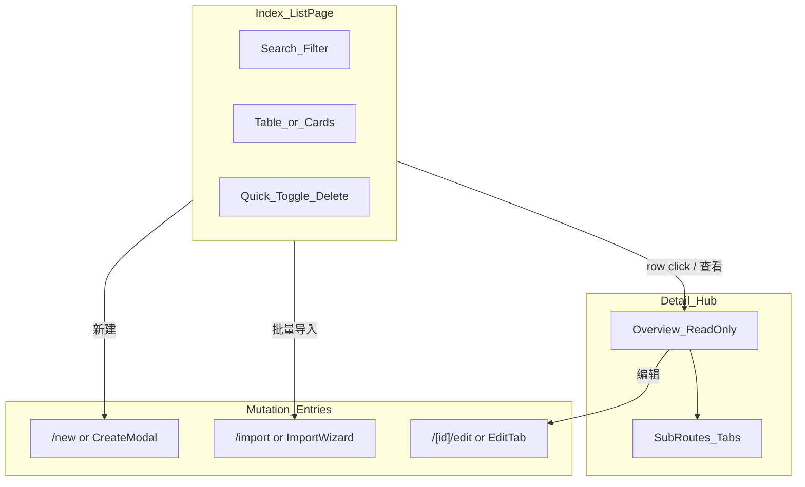

# Admin Console Patterns

> Interaction architecture for the operator console (`web/src/app/admin/`). Separates pages by **user intent**, not by technical CRUD verbs. Complements visual rules in `.kiro/steering/frontend-principles.md`.

Nav source of truth: `web/src/components/layout/admin-sidebar.tsx`.

---

## Core Principle: Intent-Based Surfaces

The first design question for an admin page is not “can we fit CRUD on one screen?” but **what is the operator trying to do right now**. Different intents belong on different routes or surfaces. Do not stack unrelated intents in one scroll flow.

| User intent | Typical actions | Where it belongs |
|-------------|-----------------|------------------|
| **Browse / search** | Search, filter, paginate, status overview | Index list page |
| **View** | Read-only summary, relationships, audit info | Detail hub (`/[id]`) or Overview tab |
| **Create** | Full form, pick related assets | Dedicated `/new` page or simple-entity modal |
| **Edit** | Change fields, save draft | Dedicated `/[id]/edit` page or Edit tab |
| **Bulk import** | Upload file, map fields, async job | **Dedicated `/import` route** — not inline on list or detail |
| **Bulk export** | Select scope, download | Secondary header action on list or analytics page |
| **Ops / diagnostics** | Upload docs, retry index, test retrieval | Sub-resource route or Ops tab — not on list page |
| **Global config** | Change policy, rules, defaults | Policy-center single-purpose page (thin shell + dedicated console) |

---

## Five Hard Rules

These are non-negotiable for new admin pages and refactors. `trellis-check` should reference them.

1. **List pages are Index only** — table/cards + search/filter + navigation to create/detail/import. No full create/edit forms on the list page.
2. **Import is separate from View** — import must not share the main surface with list browsing or detail viewing. Modals are not acceptable for import; import is its own task flow.
3. **Edit and Detail may merge, but must be separated by tab or route** — complex entities need at least `overview` (read-only) and `edit` (form). Simple entities may use `[id]` as the edit page, but the list page still must not embed edit forms.
4. **Sub-resources get sub-routes** — e.g. knowledge base documents, dictionary, retrieval diagnostics belong at `[id]/documents`, `[id]/dictionary`, `[id]/diagnostics`, not stacked on a single `[id]` god page.
5. **Policy center vs business assets** — global policies are edited in 策略中心 (Policy) pages. Asset pages only **bind/reference** policies, show read-only previews, and cross-link (see `retrieval-strategies` as the reference pattern).

---

## Intent Routing (Reference)



---

## Standard Route Tree

Use `prompts` as the baseline; extend with import and sub-resources where needed.

```
/admin/{resource}                 → Index list (light)
/admin/{resource}/new             → Create (complex forms)
/admin/{resource}/import          → Bulk import (file + job status)
/admin/{resource}/[id]            → Detail hub (read-only summary + tab nav)
/admin/{resource}/[id]/edit       → Full edit (or merge into [id] as edit tab)
/admin/{resource}/[id]/{sub}      → Sub-resource (documents / chapters / bindings …)
```

Reference implementation: `web/src/app/admin/prompts/`.

---

## Modal vs Dedicated Page

| Condition | Use modal | Use dedicated page |
|-----------|-----------|-------------------|
| ≤ 4 fields, no asset pickers | Yes (e.g. create KB name only) | — |
| Multiple asset pickers, long text, multi-step validation | — | Yes |
| Bulk import / async job | — | Yes — must be `/import` or equivalent |
| Publish gate / gate error list | — | Yes — needs stable, shareable URL |

---

## In-Page Layout: Bento Box

Every admin page uses three layers, aligned with `.kiro/steering/frontend-principles.md`:

```
┌─ PageHeader ─────────────────────────────────────┐
│ Title + one-line scope description               │
│ Primary: 新建 / 进入配置   Secondary: 导入 / 导出 │
└──────────────────────────────────────────────────┘
┌─ ContextBar (optional) ──────────────────────────┐
│ Governance banner / publish gate / page-specific │
│ context only — not cross-page setup wizards      │
└──────────────────────────────────────────────────┘
┌─ MainSurface ────────────────────────────────────┐
│ Single primary task for this page:               │
│ list OR form OR import OR console                │
└──────────────────────────────────────────────────┘
```

- **Header Primary** — only the main task entry for this page (list → 新建; import page → choose file).
- **Import button on list** — navigation only (`router.push('.../import')`); never expand inline upload on the list.
- **Row actions** — enable/disable, set default, delete confirm only; do not edit core fields inline.

---

## Application by Sidebar Category

From `admin-sidebar.tsx`:

### 业务资产 (Assets)

Entity resources: 智能体管理, 角色管理, 知识库管理, 训练案例库, 客户角色库, 课程训练模板, 学习内容管理, 题库管理, AI 考官管理, PPT 演练管理, etc.

- Index list + `[id]` hub + sub-routes where needed.
- Assembly resources (templates, case items): create/edit on dedicated pages; list shows cards and publish status only.
- `CurriculumConfigChecklist` is a **cross-page setup wizard** — show it only on the **课程训练模板** index (`/admin/curriculum-practice/templates`) or a future dedicated setup hub. Individual asset index pages (case items, role profiles, examiner agents, learning contents, test bank) are steps *inside* the checklist; do not render the full checklist on those routes. Strategy-center (Policy) pages must never include it.

### 策略中心 (Policy)

Rules, strategies, global defaults: 提示词管理, 业务规则, 评分规则集, 治理矩阵, 语音策略, PPT AI 策略, 检索策略, etc.

- Single-purpose config pages (reference: `retrieval-strategies` → `KnowledgeAnswerConsole`).
- List + `/new` + `/[id]/edit` (prompts pattern).
- Do not embed editable global policy inside asset detail pages — read-only preview + link only.

### 运营分析 (Analytics)

训练记录, 数据分析, 课程分析, 主管训练.

- Read-only first; export is a separate dialog or page, not mixed with detail browsing.
- Session snapshot detail in a dialog (e.g. records Eye icon) is acceptable; export stays a distinct header entry.
- When analytics pages depend on governed backend policy, display the effective policy diagnostics returned by the API and link to `management_entry`; do not duplicate thresholds, labels, or remediation rules in page code.

### 组织与权限 / 系统治理 (Org & System)

用户管理, 系统设置, 操作日志.

- Users: `/users` + `/users/[id]` (good existing split).
- Settings / Logs: single-page console, no CRUD list pattern.

---

## Current Page Compliance Gap Table

Snapshot for prioritizing refactors. **Compliance target** = follows five hard rules and route tree above.

| Module (sidebar label) | Route | Current pattern | Main gap | Target shape |
|------------------------|-------|-----------------|----------|--------------|
| **提示词管理** (Prompts) | `/admin/prompts` | List + `/new` + `/edit` | List still mixes governance, detail panel, scenario bindings | Slim list; bindings → `[id]/bindings` |
| **角色管理** (Personas) | `/admin/personas` | List modal + `[id]` large form | `[id]` aggregates too many config blocks | `[id]` overview + tabs/sub-routes |
| **智能体管理** (Agents) | `/admin/agents` | List modal + `[id]` large form | Same as personas | `[id]` overview + tabs/sub-routes |
| **知识库管理** (Knowledge) | `/admin/knowledge` | List modal + `[id]` god page | Documents, dictionary, diagnostics, strategy preview on one page | `[id]` hub + `documents` / `dictionary` / `diagnostics` |
| **学习内容管理** (Learning Contents) | `/admin/learning-contents` | Inline create form on list | Create mixed with list | `/new` + list index only |
| **课程训练模板** (Templates) | `/admin/curriculum-practice/templates` | Form + list same page | No deep link; edit scrolls to top | `/new`, `/[id]/edit` |
| **题库管理** (Test Bank) | `/admin/test-bank` | Categories + import + questions one page | Classic anti-pattern | Split `categories`, `import`, `questions` or tab routes |
| **检索策略** (Retrieval Strategies) | `/admin/retrieval-strategies` | Thin page + console | **Compliant** — keep as Policy template | Maintain; use as reference |
| **训练记录** (Records) | `/admin/records` | List + detail dialog + export dialog | Mostly compliant | Keep; do not conflate export with import |

Other asset entries (case items, role profiles, examiner agents, presentations) should follow the same Assets rules when touched; audit them against this table in future issues.

---

## Anti-Patterns

Do not add or extend these patterns in new work:

| Anti-pattern | Why it fails | Fix |
|--------------|--------------|-----|
| **God page** | One `[id]` scrolls through unrelated ops, config, and diagnostics | Sub-routes or tabs per intent |
| **List + form same page** | Operator cannot bookmark, share, or reason about “create vs browse” | `/new` or modal (simple only) |
| **Inline import on list** | Import is a multi-step job flow, not a table accessory | `/import` route |
| **Fake filter dialog** | Filters that should persist in URL/state hidden behind a modal | ContextBar or inline filters on Index |
| **Editable global policy on asset detail** | Blurs Policy vs Assets boundary | Read-only preview + link to 策略中心 |
| **Row inline edit of core fields** | Breaks auditability and validation gates | Navigate to edit tab/page |

---

## Recommended Reusable Components

Prefer these over one-off UI when building admin surfaces:

| Component | Path | Use when |
|-----------|------|----------|
| `ConfirmDialog` | `components/ui/confirm-dialog.tsx` | Destructive or irreversible actions — never `window.confirm` |
| `ContentAssetStatusGuide` | `components/admin/curriculum-practice/content-asset-status-guide.tsx` | Published/draft/archived asset cards with immutability copy |
| `AssetGovernanceOverview` | `components/admin/asset-governance.tsx` | Publish/status summary on asset index pages |
| `AdminAssetRefPicker` | `components/admin/asset-ref-picker.tsx` | Picking linked assets in create/edit forms |
| `PersonaRefPicker` | `components/admin/persona-ref-picker.tsx` | Persona binding in templates and agents |
| `KbMultiRefPicker` | `components/admin/kb-multi-ref-picker.tsx` | Multi knowledge-base selection |
| `KnowledgeAnswerConsole` | `components/admin/knowledge-answer/knowledge-answer-console.tsx` | Policy-center tabbed console (retrieval strategies template) |
| `CurriculumConfigChecklist` | `components/admin/curriculum-config-checklist.tsx` | Curriculum setup readiness wizard — **templates index only** (not per-asset index pages) |
| `CurriculumConfigWizard` | `components/admin/curriculum-config-wizard.tsx` | Guided multi-step curriculum setup (does not replace per-route separation) |

---

## Verification (Documentation / PR)

When adding or refactoring an admin page:

1. Name the primary **intent** for each route segment.
2. Confirm list page has no full create/edit form and no inline import.
3. Confirm import (if any) has its own route or dedicated page.
4. Confirm Policy edits live under 策略中心, not asset detail.
5. Reference this spec in PR description; `trellis-check` may ask for compliance notes.

---

## Published Asset Change Workflow

Curriculum assets (`CaseItem`, `RoleProfile`, `ExaminerAgent`) and `PracticeTemplate` follow **publish immutability**: published records cannot be edited in place because runtime snapshots bind by ID + content hash.

| Operator intent | Preferred action | UI placement |
|-----------------|------------------|--------------|
| Change published content | **Duplicate → edit draft → update template bindings → republish template** | Primary button on published rows: 「复制为新草稿」 |
| Emergency revert | **Unpublish** (secondary, strong confirm) | Lists referencing published templates before acknowledge |
| Template binding change | Save template draft + **republish template** | Amber `AdminContextBar` on template edit when case/role refs change |

**Do not** encourage unpublish as the default change path. Duplicate preserves existing `curriculum_snapshot` references until the operator explicitly rebinds templates.

---

## Governed Policy Diagnostics

Domain settings pages may show read-only snapshots of backend-managed policies when the API returns a diagnostic payload such as `phase2_policy`.

Required behavior:

- Render values from the API payload (`source`, `config_version`, `fallback_applied`, `fallback_reason`, thresholds), never page-local constants.
- Show a navigation link to `management_entry` when provided.
- Keep edits in the policy-center/business-rule surface, not the domain settings or analytics page.
- Treat missing diagnostics as unknown/read-only, not as permission to invent defaults in the page.
- Add a page test that proves the values shown came from the mocked API payload.

**API surfaces** (admin):

- `POST /case-items|role-profiles|examiner-agents/{id}/duplicate`
- `POST .../unpublish` with optional `{ acknowledge: true }` when published templates still reference the asset
- `GET .../template-references` for preflight in confirm dialogs

---

## Related Docs

- Visual / glass UI: `.kiro/steering/frontend-principles.md`
- App Router map: `web/src/app/AGENTS.md` (Admin Console Patterns summary)
- Components: `.trellis/spec/frontend/component-guidelines.md`
- Nav labels: `web/src/components/layout/admin-sidebar.tsx`
