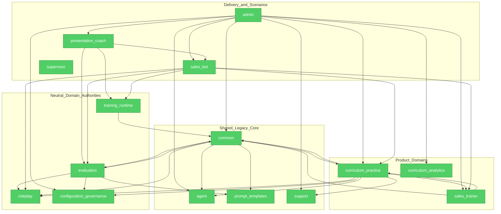

# Brooks-Lint Review

**Mode:** Architecture Audit

**Scope:** Incremental audit — final Gate 4 branch state since `5647155c` (90 files, excluding the user's unrelated dirty plan), with the complete 15-package dependency policy graph and the post-audit route/quality-harness repairs re-evaluated

**Health Score:** 100/100

**Trend:** Stable at 100

Gate 4 now has real neutral ownership rather than import-only facades: Configuration Governance owns
lifecycle sequencing and audit decisions, Evaluation exchanges deeply immutable value objects, and the
five targeted reverse dependencies remain absent.

---

## Module Dependency Graph

完整 AST inventory 为 52 条受策略解释的实际边。图中折叠了低风险共享边以保持可读性。
Gate 1A 的 12-package baseline SCC 已单调收缩为 7-package 历史 SCC
`agent/common/curriculum_practice/evaluation/prompt_templates/sales_trainer/support`；它没有扩张，且
属于 Gate 5 已批准的物理模型与共享核心拆分范围，不作为 Gate 4 增量 finding 重复计分。

---

## Findings

最终复审无 Critical、Warning 或 Suggestion finding。

### 已修复的首次审计 finding

1. **R4/R5 — Configuration Governance 是浅转发层 [guided]**

   Symptom: `ConfigBundleLifecycleService` 逐方法转发给 Admin SQLAlchemy adapter，生命周期顺序、
   audit decision 和 ORM entity result 都由 adapter 决定。
   Source: *A Philosophy of Software Design* — Shallow Module；*Clean Architecture* — DIP。
   Consequence: 新包只有名称所有权，配置生命周期变化仍必须修改 Admin/ORM，Gate 4 的边界无法
   独立测试或演进。
   Remedy: 已在 `configuration_governance/lifecycle.py` 收拢 ensure/load/mutate/projection/audit
   顺序，在 `contracts.py` 定义 immutable record 与 persistence port；Admin adapter 只实现持久化
   capability，HTTP delivery 不再 refresh/读取 ORM entity result。

2. **R6 — “Frozen” Evaluation DTO 包含可变 list/dict [quick-fix]**

   Symptom: `EvaluationScenarioResult` 与 `EvaluationScenarioInput` 虽为 frozen dataclass，字段仍可
   原地 append 或改写嵌套 dict。
   Source: *Domain-Driven Design* — Value Object；*Code Complete* — Defensive Programming。
   Consequence: 场景 adapter 可在注册表边界外改写评分证据或报告，破坏冻结证据与幂等 writer
   假设。
   Remedy: 已把序列规范化为 tuple、映射递归冻结为 `MappingProxyType`，并在报告 mapper 明确
   thaw/copy 到既有 mutable persistence model；配置治理 value objects 同样递归冻结。

---

## Summary

首次审计的两个结构性问题均已通过 Red → Green 回归测试修复；复审未发现 Gate 4 新增的依赖
倒置、隐藏具体场景导入、重复 authority 或可变 Evidence 边界。残余 7-package SCC 是已记录且
单调缩小的 Gate 5 输入，不影响 Gate 4 的增量闭环判定。

Canonical gate 期间新增的三项修复已在最终分支状态复审：root composition 仅恢复既有 scoring
router 的 OpenAPI 顺序/标签且未让 Evaluation 反向导入 Admin；`run_playwright` 只吸收宿主动态库
差异；smoke 入口只冻结 loopback public build inputs。它们均有聚焦合同测试，不新增领域权威、
跨包边、运行时分支或永久 skip，因此最终 finding 仍为 0。

## Fix Summary

| Finding | Tier | Target File | Action |
|---|---|---|---|
| Configuration Governance 浅转发 | guided | `backend/src/configuration_governance/lifecycle.py` | 将 lifecycle/audit policy 移入 neutral core，SQLAlchemy 降为 persistence capability |
| Evaluation DTO 浅冻结 | quick-fix | `backend/src/evaluation/ports/scenario.py` | tuple + recursive immutable mapping，并在 mapper 显式复制 |

## Verification

- Red：Gate 4 ownership suite 首次为 `2 failed, 9 passed`。
- Green：Gate 4 ownership suite `11 passed`。
- Config lifecycle/HTTP/projection matrix：`14 passed`。
- Evaluation/Presentation/Gate 4 matrix：`61 passed`。
- Combined architecture-focused matrix：`94 passed`；architecture guard satisfied。
- Ruff passed；mypy passed for 662 source files。
- Final clean-start canonical gate: backend `3287 passed, 1 skipped`; Vitest `1329 passed,
  6 skipped`; Playwright `3/9/11/2/1 passed`; selected backend `598 passed, 21 skipped`; changed
  coverage 4898/5519（88.75%）；final line `Critical quality gate passed`。
