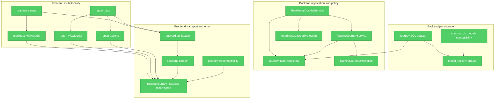

# Brooks-Lint Review

**Mode:** Architecture Audit

**Scope:** Incremental audit — final Gate 5 branch state since `6be88ef7` (67 files; unrelated dirty readiness plan excluded)

**Health Score:** 100/100

**Trend:** Stable at 100

Gate 5 now has one coherent locality model: persistence adapters translate ORM into frozen reads, application
services orchestrate use cases, deterministic projections own policy, and frontend route modules own DTO
interpretation and navigation mechanics.

---

## Module Dependency Graph

---

## Findings

Final rerun: **0 Critical, 0 Warning, 0 Suggestion**.

Pass 1 found and remediated two locality leaks before this final score:

- application services called underscored projection helpers, which made a hidden cross-class Interface;
- the report page interpolated one source session identifier instead of delegating to report actions.

The remediation exposes an explicit projection Interface guarded by AST contract, and routes the final source
report URL through `buildSessionReportPath` with reserved-identifier encoding. Focused Red → Green tests,
Ruff, mypy, TypeScript and ESLint errors-only all pass.

Testability seams are present at ORM, projection and frontend mapping boundaries. Compatibility registries are
rule-free, identity-preserving and explicitly scheduled for evidence-based Gate 6 retirement rather than being
misclassified as accidental complexity. Conway's Law is not scored because repository team ownership is not
available; no cross-team coordination claim is inferred.

---

## Summary

Gate 5 passes the Depth, deletion-test, dependency-direction, domain-language, testability and compatibility
checks. The remaining seven-package historical SCC and compatibility fan-in are governed pre-existing migration
inputs for Gate 6; Gate 5 adds no edge, SCC, policy exception, schema change or second global authority.
