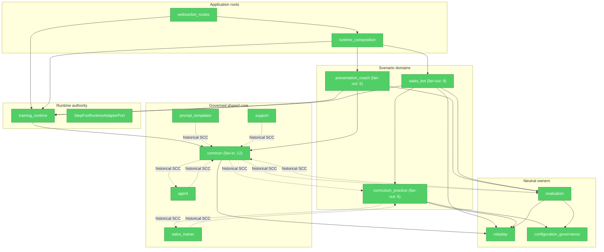

# Brooks-Lint Review

**Mode:** Architecture Audit

**Scope:** Incremental audit — final Gate 6 branch state since `13cdfd6a` (44 files; unrelated dirty readiness plan excluded), with the complete 15-package dependency policy graph and retained compatibility inventory re-evaluated

**Health Score:** 100/100

**Trend:** Stable at 100

Gate 6 has one coherent retirement model: declarative plugins choose a closed key, delivery/application roots own
disjoint factories, cross-domain concrete composition exists only at the app root, and deletion is gated by real
consumer plus rollback/deprecation evidence.

---

## Module Dependency Graph

完整 AST inventory 为 51 条实际边。图突出 Gate 6 composition/ownership 路径，并保留历史循环的
代表边；唯一多包 SCC 仍是
`agent/common/curriculum_practice/evaluation/prompt_templates/sales_trainer/support`。它较 Gate 1A 的
12 包基线已缩小，Gate 6 未扩大它，也未新增 policy exception。`presentation_coach -> sales_bot`
已从源码和 policy 同时消失。

---

## Findings

最终复审：**0 Critical、0 Warning、0 Suggestion**。

- **Dependency Disorder / Change Propagation**：四个 runtime key 的实现没有汇入全局 service locator。
  Sales-local 与 Presentation app-root map 互斥且穷尽；domain 不反向 import app root。唯一 concrete
  Presentation/Sales 组合位于 `runtime_composition.py`，符合 *Clean Architecture* 对 composition root
  的例外，不构成 DIP finding。
- **Accidental Complexity / Knowledge Duplication**：无消费者 `ScenarioPluginEntrypoint`、260 行浅描述器、
  动态 handler module/attribute locator、未使用 root factory wrapper 和 Common Roleplay forwarding
  module 均已删除；没有以另一个 barrel 或动态注册器替代。两个 root map 表达不同 delivery ownership，
  factory 实现不重复。
- **Cognitive Overload / Domain Model Distortion**：`PresentationStepFunRuntimeMixin` 依赖的 cooperative-MRO
  状态和 hook 通过中立 `StepFunRuntimeAdapterPort` 显式列出，Presentation domain 不再把 Sales 当作父域。
  该 port 是有真实 default/rollback 消费者的 anti-corruption seam，不按文件大小误判为 Lazy Class。
- **Testability Seam**：Engine façade强制注入 runtime Engine/adapter factory；closed maps 可替换，unknown key
  在构造前 fail closed；真实 Golden、2x2x2、snapshot、persistence、reconnect、evidence 与 Roleplay parity
  覆盖 retained transport，而不是只测 AST wiring。
- **Compatibility/Deletion test**：`common.db.models` 222 个生产 importer、frontend type façade 262 个源码
  importer、Legacy Grounding cache/adapter 与三项 constructor-time flag 均有真实消费者或 rollback 价值，
  已写明 owner/reason/retire_when。保留是 *Software Engineering at Google* 的兼容性纪律，不是 Gate 6
  遗漏。`common -> roleplay` 只剩 active defaults registry 源，因此 policy edge 正确保留。

Conway's Law 不计分：仓库没有可验证的多团队 ownership 信息，不推断跨团队协调成本。

---

## Summary

Gate 6 通过 Depth、deletion test、dependency direction、conceptual integrity、testability seam 和
backward-compatibility 复核。可证收益是 52→51 条边、0 Presentation-to-Sales domain edge、闭集 factory
替代可执行字符串，以及两个浅 façade 删除；七包历史 SCC 和高 fan-in compatibility surface 均如实保留，
未被包装成虚假完成。

## Verification

- `codegraph sync .`：最新索引；核心 runtime 改动选择 227 个 affected test files。
- Gate 6 聚焦矩阵：`161 passed`（pytest 39.39s；shell 48.129s）。
- Gate 6 + architecture contract：`28 passed`；dependency policy satisfied。
- Ruff passed；full mypy passed（677 source files）。
- 最终 clean-start canonical gate：backend `3322 passed, 1 skipped`；Vitest 213 files / `1345 passed,
  6 skipped`；Playwright `3/9/11/2/1 passed`；selected backend `598 passed, 21 skipped`；changed coverage
  7326/8048（91.03%）；末行 `Critical quality gate passed`。
