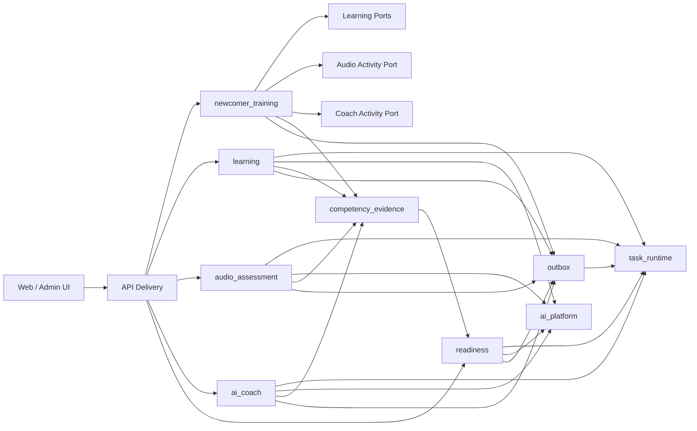
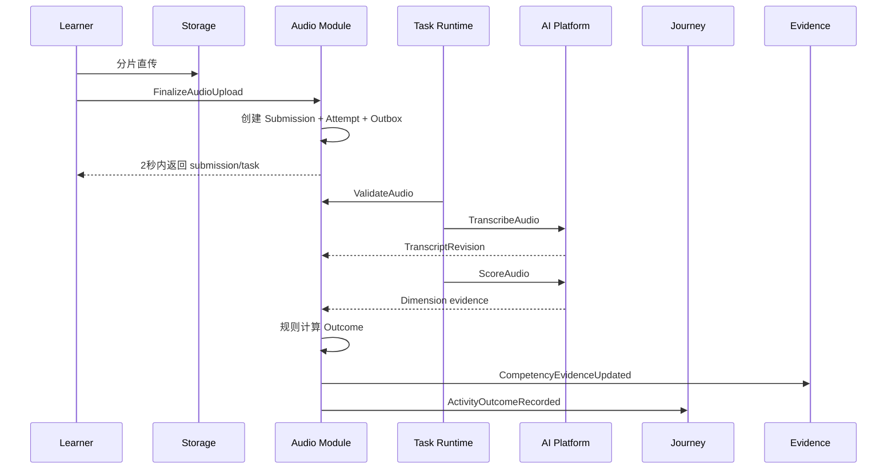

# 目标架构

> 状态：目标设计。2026-07-16 起，模块、状态、事件、权限、API、AI、迁移和测试的细化权威从 [`../../../../../docs/newcomer-foundation-contract-index.md`](../../../../../docs/newcomer-foundation-contract-index.md) 进入；切片 0 不声明这些目标已实现。

## 1. Architecture Style

采用单仓库、单 PostgreSQL、API + Worker 分进程的模块化单体。

模块通过稳定接口和事件协作，不通过跨模块 ORM、表连接、全局 Facade 或动态字符串导入协作。Redis 用于缓存、限流、短期通知加速和任务唤醒，不是状态真源。



## 2. Target Modules

### `newcomer_training`

Owns:

- Path / PathRevision / Stage / ActivityDefinition；
- Cohort / Enrollment；
- ActivityAttempt 通用信封；
- Gate、前置条件、Attempt 次数和路径进度；
- Activity Registry 和接口编排；
- Journey Query / Projection；
- 路径修订迁移。

Does not own:

- 课程正文、题目、音频、Prompt、AI Session、能力评分细节；
- 跨活动的直接 Provider 调用；
- 达标人工结论。

### `learning`

Owns:

- SourceDocument / Revision；
- LearningUnit / Revision；
- SourceAnchor；
- QuestionGenerationBatch；
- QuestionCandidate；
- Question / QuestionRevision；
- Quiz / QuizRevision；
- QuizAttempt 详细记录；
- 题目质量和使用效果。

### `audio_assessment`

Owns:

- AudioUploadSession；
- AudioSubmission；
- Original / Normalized Audio Artifact references；
- TranscriptRevision；
- AudioQualityReport；
- ScoreOutcomeVersion；
- AudioAssessmentOutcome；
- 技术重试、转写校正和历史重评。

### `ai_coach`

Owns:

- CoachProfileRevision；
- CoachSession；
- CoachTurn；
- TrainingCard；
- CardResponse；
- CoachScoreOutcome；
- RemediationPlan；
- 会话恢复与结束摘要。

### `competency_evidence`

Owns:

- CanonicalCompetency；
- CompetencyMapping；
- CompetencyEvidence；
- EvidenceSupersession / Validity；
- Evidence Query Port。

只保存事实，不保存最终达标决定。

### `readiness`

Owns:

- ReadinessDossier；
- DossierSnapshot；
- ReadinessReview；
- ReviewQueue；
- CalibrationNote；
- Appeal；
- RetrainingAssignment；
- Team Readiness Projection。

### Platform Modules

| 模块 | 职责 |
|---|---|
| `identity_access` | 组织、Team、账号、Capability、对象级权限 |
| `ai_platform` | Provider、模型路由、Invocation、预算、限流、血缘、输出校验 |
| `task_runtime` | 持久化任务、租约、重试、死信、取消、进度 |
| `knowledge` | 授权知识、来源和检索，不直接拥有业务 Prompt |
| `storage` | 对象存储、签名、上传会话、派生文件和保留策略 |
| `configuration_governance` | 配置修订、校验、影响、发布和回滚 |
| `observability` | Trace、日志、指标、审计基础设施 |
| `shared_kernel` | ID、时间、Actor、Organization、Result、Error、Transaction、Outbox 基础类型 |

`shared_kernel` 不得包含业务服务、ORM Model、配置 Facade 或 Provider 实现。

## 3. Dependency Direction

目标依赖方向：

```text
delivery
  -> application
      -> domain/contracts
      -> ports
adapters
  -> ports/domain
application_root
  -> adapters + application
```

业务模块之间只能依赖对方公开 Contracts / Ports。具体 Adapter 由应用根组合。

禁止：

- `newcomer_training` 导入 `audio_assessment.models`；
- `readiness` 直接 join quiz/audio/coach 表；
- `learning` 直接调用 Prompt ORM；
- `ai_platform` 导入业务模块；
- 前端页面跨领域直接拼接多个原始 DTO 得出业务结论。

## 4. Core Interfaces

### Activity Runtime

```python
class ActivityRuntime(Protocol):
    type_key: ActivityType

    async def project(
        self,
        context: ActivityExecutionContext,
    ) -> ActivityProjection: ...

    async def execute(
        self,
        command: ActivityCommand,
        context: ActivityExecutionContext,
    ) -> ActivityExecutionAccepted: ...

    async def reconcile(
        self,
        attempt: ActivityAttemptSnapshot,
        evidence: ActivityEvidenceSnapshot,
    ) -> ActivityOutcome: ...
```

### Activity Definition Governance

```python
class ActivityDefinitionCompiler(Protocol):
    async def validate(
        self,
        definition: ActivityDefinition,
    ) -> tuple[ValidationIssue, ...]: ...

    async def preview(
        self,
        definition: ActivityDefinition,
        actor: ActorContext,
    ) -> ActivityPreview: ...

    async def compile(
        self,
        definition: ActivityDefinition,
    ) -> CompiledActivityDefinition: ...
```

### AI Invocation

```python
class AIInvocationPort(Protocol):
    async def invoke(
        self,
        request: GovernedAIRequest,
    ) -> AIInvocationResult: ...
```

`GovernedAIRequest` 必须携带：

- business purpose；
- Prompt template / revision / contract hash；
- model routing profile；
- organization / actor / object scope；
- input schema version；
- output schema version；
- timeout / retry policy reference；
- idempotency key；
- data classification；
- trace / correlation / causation。

### Task Runtime

```python
class TaskRuntimePort(Protocol):
    async def enqueue(self, command: TaskCommand) -> TaskReference: ...
    async def request_cancel(self, task_id: str, actor: ActorContext) -> None: ...
    async def get(self, task_id: str, viewer: ActorContext) -> TaskProjection: ...
```

### Evidence Writer

```python
class CompetencyEvidenceWriter(Protocol):
    async def append(
        self,
        evidence: NewCompetencyEvidence,
    ) -> CompetencyEvidenceRef: ...
```

## 5. Path Aggregate

```text
Path
└── PathRevision (immutable when published)
    ├── metadata
    ├── competency policy snapshot
    ├── readiness policy snapshot
    └── Stage[]
        └── ActivityDefinition[]
```

PathRevision 使用强类型 JSONB Aggregate 保存编排内容，稳定 Key、资源修订引用和内容哈希必须可验证。Path、Revision、Release Plan 元数据使用关系表。

`ActivityDefinition` 共用字段：

- activity_id；
- type；
- title；
- objective；
- why_it_matters；
- steps；
- success_criteria；
- estimated_minutes；
- required；
- prerequisites；
- ai_dependency；
- retry_policy；
- typed config。

Typed config 使用封闭联合，不允许任意字典进入运行时。

## 6. Attempt And Outcome

`ActivityAttempt` 只保存：

- enrollment / path revision / activity；
- attempt_no；
- lifecycle status；
- frozen activity snapshot；
- evidence reference；
- latest normalized outcome reference；
- idempotency / trace；
- started / submitted / completed timestamps。

活动详情保存在活动模块。

`ActivityOutcome` 标准字段：

- lifecycle result；
- assessment result；
- score / max_score；
- passed；
- competency evidence refs；
- source refs；
- lineage；
- confidence；
- critical flags；
- degradation；
- next action；
- produced_at。

## 7. Commands

Journey Commands：

- `EnrollLearner`
- `StartActivity`
- `ExecuteActivityCommand`
- `CancelActivityAttempt`
- `StartNewAttempt`
- `MigrateEnrollmentRevision`
- `AssignRetraining`

Learning Commands：

- `ImportSourceDocument`
- `SaveLearningUnitWorkingRevision`
- `GenerateQuestionCandidates`
- `ReviewQuestionCandidate`
- `PublishQuestionRevision`
- `SubmitQuizAttempt`

Audio Commands：

- `CreateAudioUploadSession`
- `FinalizeAudioUpload`
- `CancelAudioSubmission`
- `FlagTranscriptCorrection`
- `ApproveTranscriptCorrection`
- `RetryAudioStage`
- `RegradeAudioSubmission`

Coach Commands：

- `StartCoachSession`
- `SubmitCoachResponse`
- `RequestCoachNextAction`
- `EndCoachSession`
- `EscalateCoachSession`

Readiness Commands：

- `RequestReadinessReview`
- `RecordReviewDecision`
- `AssignRetraining`
- `SubmitAppeal`
- `ResolveAppeal`

## 8. Events

公开业务事件保持小而稳定：

- `ActivityOutcomeRecorded`
- `CompetencyEvidenceUpdated`
- `JourneyProgressChanged`
- `ReadinessReviewRequested`
- `ReviewDecisionRecorded`
- `RetrainingAssigned`
- `EnrollmentRevisionMigrated`

领域内部事件可以更细，但不作为跨模块永久公共 API。

事件元数据：

- event_id / event_type / schema_version；
- occurred_at；
- organization_id；
- actor_id；
- trace_id / correlation_id / causation_id；
- idempotency_key；
- aggregate type / id / version；
- business refs。

事件 payload 不携带音频、完整转写、Raw AI Response 或大型 JSON。

## 9. Durable Task Model

```text
Task
├── task_id
├── task_type
├── business_ref
├── state
├── progress
├── attempt_no / max_attempts
├── lease_owner / lease_expires_at
├── next_run_at
├── idempotency_key
├── input_ref
├── result_ref
├── error_summary
└── trace metadata
```

Task 状态：

- queued；
- running；
- retry_wait；
- succeeded；
- dead_letter；
- cancel_requested；
- cancelled。

Worker 规则：

- 领取任务和提交结果使用短事务；
- 外部 IO 不占用数据库事务；
- 重复领取必须幂等；
- 租约超时可重新领取；
- Cancel 为协作式、最佳努力；
- 业务最终结果由业务模块保存，Task 只保存执行状态和引用。

## 10. Audio Pipeline



评分模型不直接决定通过。音频质量失败不等于能力失败。

## 11. Question Production Pipeline

```text
SourceDocumentRevision
  -> LearningUnitWorkingRevision
  -> QuestionGenerationBatch
  -> QuestionCandidate
  -> DeterministicQualityGate
  -> HumanReview
  -> QuestionWorkingRevision
  -> ReleasePlan
  -> PublishedQuestionRevision
  -> QuizRevision
```

Candidate 和 Question 是不同对象。拒绝 Candidate 不会污染正式题库。

## 12. AI Coach Pipeline

```text
Start Session
  -> freeze goal/context/prompt/model/rubric
  -> issue one training card
  -> persist learner response
  -> invoke scoring
  -> persist card outcome
  -> choose deterministic next action
  -> next card / remediation / summary / human review
```

AI 可建议下一卡，但业务规则校验：

- 是否属于白名单；
- 是否超过卡片数；
- 是否仍在本次目标；
- 是否需要人工复核；
- 是否达到结束条件。

## 13. Readiness Projection

Readiness 不跨表直接拼接。它消费标准化 Evidence Query 和事件投影。

```text
CompetencyEvidence[]
  -> Evidence completeness
  -> latest valid + trend
  -> risk and confidence rules
  -> DossierSnapshot
  -> Review Queue
  -> Human Decision
```

已人工确认的结论遇到新重评时：

- 不静默覆盖；
- 标记结论可能受影响；
- 重新打开复核任务；
- 保留原结论和新证据。

## 14. API Surface

Learner：

- `/api/v1/newcomer-training/journey`
- `/api/v1/newcomer-training/activities/{activity_id}`
- `/api/v1/newcomer-training/activities/{activity_id}/commands`
- `/api/v1/newcomer-training/tasks/{task_id}`
- `/api/v1/newcomer-training/history`
- `/api/v1/newcomer-training/notifications`
- `/api/v1/newcomer-training/dossier`

Admin：

- `/api/v1/admin/newcomer-training/overview`
- `/api/v1/admin/newcomer-training/paths`
- `/api/v1/admin/newcomer-training/releases`
- `/api/v1/admin/newcomer-training/resources`
- `/api/v1/admin/newcomer-training/cohorts`
- `/api/v1/admin/newcomer-training/learners`
- `/api/v1/admin/newcomer-training/reviews`
- `/api/v1/admin/newcomer-training/diagnostics`

每个子资源允许内部细分，但公开契约必须按业务对象组织，不暴露旧技术模块名称。

## 15. Frontend Domain Layout

```text
web/src/domains/newcomer-training/
├── api/
├── model/
├── presenters/
├── queries/
├── commands/
├── components/
├── activities/
└── pages/

web/src/domains/admin-newcomer-training/
├── overview/
├── paths/
├── content/
├── questions/
├── releases/
├── cohorts/
├── learners/
└── reviews/
```

Transport DTO 不直接进入组件。Presenter 把内部状态、枚举和错误映射为用户语言。

## 16. Data And Transaction Rules

- 每个模块拥有表、Repository 和 Migration。
- 外键可以引用稳定身份表，但跨模块业务读取通过 Port。
- 业务写 + Outbox 同事务。
- 外部调用前提交准备状态；调用后以版本/租约校验提交结果。
- 乐观锁用于工作修订和人工复核。
- 所有长任务结果追加版本，不原地覆盖历史。
- 删除优先归档和撤销引用；真正清理遵守保留策略和审计。

## 17. Migration Strategy

1. Slice 0 先更新 ADR、Spec、API Contract 和 Architecture Policy。
2. 复用首发 Alembic Baseline，在干净数据库建立新表。
3. 每个垂直切片只迁移自己范围内的新写入。
4. 新 Authority 通过端到端门禁后删除旧写路径。
5. 旧只读历史若没有业务价值直接删除；有审计价值则通过显式 Legacy Adapter 只读。
6. 不保留永久双写、永久 Dual Read 或不设期限的 Feature Flag。

## 18. Architecture Fitness Gates

- 无新增跨包未声明边。
- 基线 SCC 只能缩小，不能扩大。
- 无跨模块 ORM / SQL。
- 无活动类型动态字符串导入。
- 无业务模块直接 Provider 调用。
- 无 API Controller 直接编排事务和外部调用。
- 无前端页面直接计算达标结论。
- OpenAPI 由运行时生成并校验。
