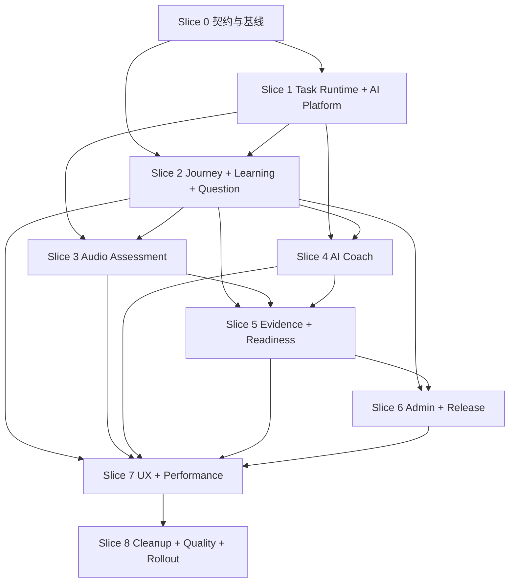

# 执行计划

## 1. Delivery Strategy

采用 9 个 Trellis 子任务、垂直切片交付。父任务不直接承载实现提交，只负责范围、依赖、决策、验收总账和最终收口。

每个切片必须：

1. 先读取对应 Trellis Spec、ADR、API Contract 和实际代码链路；
2. 明确本片建立的新业务权威；
3. 写复现或契约测试；
4. 端到端实现；
5. 删除本片已替代的旧写入、旧路由和旧 Facade；
6. 运行 CodeGraph impact / affected 和质量门禁；
7. 把偏差写入 `implementation-notes.md`。

## 2. Dependency Graph

## 3. Subtasks

| 顺序 | Trellis 子任务 | 主要结果 |
|---:|---|---|
| 0 | `07-16-foundation-contracts-baseline` | ADR、Spec、模块地图、API/状态/事件契约、旧规范冲突消除 |
| 1 | `07-16-durable-task-ai-platform` | PostgreSQL Task Runtime、Outbox、Worker、AI Invocation、Fake Provider |
| 2 | `07-16-journey-learning-question-governance` | 新 Path/Enrollment/Attempt、Learning、候选题、Quiz、标准内容包 |
| 3 | `07-16-audio-assessment-durable-pipeline` | 续传、音频校验、ASR、评分、Outcome、重评 |
| 4 | `07-16-structured-ai-coach-remediation` | 结构化 Coach、训练卡、保存优先、补练和人工转接 |
| 5 | `07-16-competency-readiness-review` | Evidence、Dossier、Review Queue、重练、申诉 |
| 6 | `07-16-admin-workspace-release-governance` | 统一后台、路径编辑、资源快建、Release Plan、Cohort |
| 7 | `07-16-frontend-experience-performance` | 单入口、Activity Shell、移动端、状态、性能、通知 |
| 8 | `07-16-cleanup-quality-rollout` | 清理旧链路、架构门禁、E2E、Provider 金标、发布和回滚 |

## 4. Small PR Plan

### Slice 0

- PR0.1：ADR + Domain Glossary + module dependency policy。
- PR0.2：Path/Activity/Attempt/Outcome/Event/API contracts。
- PR0.3：更新 Trellis Spec、OpenAPI 计划和迁移清单。

### Slice 1

- PR1.1：Task Runtime schema、Repository、lease 和 worker loop。
- PR1.2：Outbox、幂等、取消、通知和任务 API。
- PR1.3：AI Invocation Port、模型路由、Prompt Contract、Fake Provider。

### Slice 2

- PR2.1：PathRevision/Stage/ActivityDefinition、Cohort/Enrollment/Attempt。
- PR2.2：Lesson/Quiz Adapter 和新 Journey。
- PR2.3：Source/LearningUnit/QuestionCandidate/QuestionRevision。
- PR2.4：QuizRevision、抽题、异步简答评分和标准示例包。
- PR2.5：删除旧路径写入和重复学习入口。

### Slice 3

- PR3.1：Upload Session、对象存储分片、Finalize 和音频校验。
- PR3.2：TranscriptRevision、ASR 路由和置信度门禁。
- PR3.3：评分 Scheme、维度证据、红线和 Outcome。
- PR3.4：Journey reconcile、重试、转写校正和 Regrade。
- PR3.5：删除同步请求处理和旧录音/评分分离 Authority。

### Slice 4

- PR4.1：Coach Profile/Session/Turn/Card contracts。
- PR4.2：保存学员输入、流式反馈、评分和下一步规则。
- PR4.3：三个默认检查点、补练、上限和人工转接。
- PR4.4：Coach Activity reconcile、结果和通知。
- PR4.5：删除自由聊天入口和直接 LLM 调用。

### Slice 5

- PR5.1：Canonical Competency、Mapping 和 Evidence Store。
- PR5.2：Dossier Projection、证据完整性、趋势和风险。
- PR5.3：Review Queue、人工结论、例外和审计。
- PR5.4：Retraining Assignment、前后对比和 Appeal。

### Slice 6

- PR6.1：Admin Overview、Cohort、Learner 和 Review routes。
- PR6.2：路径三栏编辑器和上下文内资源创建。
- PR6.3：内容/候选题审核工作台。
- PR6.4：Release Plan、预览、Gate、影响和回滚。
- PR6.5：权限矩阵和管理员诊断。

### Slice 7

- PR7.1：学员单一入口和 Journey Server-first projection。
- PR7.2：Activity Shell + Lesson/Quiz/Audio/Coach/Assignment runners。
- PR7.3：任务中心、通知、后台恢复和持久结果。
- PR7.4：档案、经理复核和团队列表 ViewModel。
- PR7.5：响应式、A11y、长文本、慢网和请求性能。

### Slice 8

- PR8.1：删除旧路由、Facade、动态导入、旧 Feature Flag。
- PR8.2：Architecture Guard、OpenAPI、Migration 和 dead-code gate。
- PR8.3：核心 E2E、权限矩阵、失败恢复和性能基准。
- PR8.4：ASR/LLM 金标、Shadow/Canary、Provider staging。
- PR8.5：发布 Runbook、回滚演练、最终验收和文档收口。

## 5. Slice Completion Gate

任何子任务不能因为“后续切片会补”而跳过本片范围内：

- 对象级权限；
- loading / empty / error / retry；
- 幂等与并发；
- 审计；
- 契约测试；
- 旧写入删除；
- 文档与 Spec 更新。

允许后续切片接入更完整的消费者，但当前切片必须提供稳定 Port 和 Fake Adapter。

## 6. Parallelism

允许的并行：

- Slice 3 Audio 和 Slice 4 Coach 在 Slice 1/2 契约稳定后并行。
- Slice 6 的内容工作台可以与 Slice 5 的 Readiness 后端局部并行。
- 测试、文档和性能证据可以在不修改同一文件时并行。

禁止的并行：

- 同时建立两套 Path/Attempt Authority。
- 在 Task Runtime 未稳定前各模块自行实现后台任务。
- 在 Evidence Contract 未稳定前多个模块各自设计能力字段。
- 在 Release Plan 未稳定前分别发布路径、题目和评分方案。

## 7. Verification Cadence

每个 PR：

- 相关单元测试；
- 相关集成 / 契约测试；
- Ruff / Mypy 或 TypeScript / ESLint；
- `git diff --check`；
- Architecture affected 检查。

每个 Slice：

- 跨层端到端测试；
- 权限正向和越权测试；
- 失败、超时、重复提交和恢复；
- 实际 UI 渲染检查；
- OpenAPI 语义检查。

最终：

- 全量关键质量门禁；
- 核心 Playwright；
- Provider staging；
- 性能基准；
- 备份恢复和回滚演练。

## 8. Stop Conditions

以下情况必须暂停当前切片并修正设计：

- 新模块需要反向依赖已有业务模块；
- 需要长期双写才能上线；
- 需要在 Controller 中保持外部 IO 事务；
- 新 UI 必须暴露内部字段才能工作；
- AI 无法提供证据仍被要求输出正式结论；
- 当前 Spec 与实现冲突但没有 ADR 更新；
- 同一业务对象出现第二个写权威。
