# 架构边界与模块依赖审查

- **审查日期**：2026-06-03
- **审查者**：严苛架构师
- **审查范围**：`/Users/zhaozengqing/github/销售训练qoder/backend/src/`
- **严苛度评级**：🔴 **关键风险 (Critical)** — 发现至少 1 处 P0 §III 隔离违规、1 处 P0 router prefix 冲突、多处 PEP 420 隐式包风险、CLAUDE.md 关键行数失真

---

## 0. TL;DR

| 维度 | 评级 | 摘要 |
|------|------|------|
| 依赖图 | 🟡 | `sales_bot → agent` 单向贯穿；`common → sales_bot` 反向侵入 |
| §III 隔离 | 🔴 | `presentation_coach` 跨域 import `sales_bot` 1 处 |
| `common` 反向依赖业务域 | 🔴 | `common/services/practice_session_service.py` 同时 import 销售与演示 |
| 死代码 | 🟡 | 2 处 `.backup` / `.deprecated` 文件可清理；`presentations.py.backup` 7.4 KB 无引用 |
| 启动链路 | 🟡 | 中间件挂载顺序合规；**未挂载限流中间件**（仅装饰器） |
| 路由完整性 | 🔴 | 60+ `include_router`；**2 处 router prefix 冲突** |
| 文档失真 | 🔴 | `CLAUDE.md` `main.py 19655 行` 与实际 75 行差 260 倍；`common/` 35 子目录实际 30 |
| 命名空间包 | 🟡 | `sales_bot/`、`presentation_coach/`、`common/` 根无 `__init__.py`，但内部有 `__init__.py`，混用风险 |

---

## 1. 依赖图（基于 grep 实测，非推断）

### 1.1 跨域 import 矩阵

| 源 → 目标 | 次数 | 备注 |
|-----------|------|------|
| `sales_bot → agent` | ~60+ 行 | `agent.capabilities.*`、`agent.models.*`、`agent.context` 全面穿透 |
| `presentation_coach → agent` | 6 行 | `presentation_handler.py`、`presentation_stepfun_realtime_handler.py`、`presentation_ai_policy_service.py` |
| `sales_bot → common` | 100+ 行 | `common.db`、`common.monitoring`、`common.websocket`（top 3） |
| `presentation_coach → common` | 60+ 行 | 同样 `db` / `monitoring` / `error_handling` 主导 |
| `agent → common` | 38 行 | `monitoring`、`db` 主导 |
| `common → sales_bot` | **3** | **业务域反向依赖**，`common/services/practice_session_service.py:55-57`、`common/services/practice_service.py:30`、`common/services/session_runtime_repair_service.py:18` |
| `common → presentation_coach` | **2** | `common/services/practice_session_service.py:54`、`common/conversation/session_evidence.py:317` |
| `presentation_coach → sales_bot` | **1** | 🔴 `presentation_coach/websocket/presentation_stepfun_realtime_handler.py:39` |
| `sales_bot → presentation_coach` | 0 | ✅ 单向通过 |
| 顶层 `router_registry` → 业务域 | 2 | `from presentation_coach.api import presentations` (L59)、`from sales_bot.api.scenarios` (L62) |
| 顶层 `websocket_routes` → 业务域 | 1 | `from sales_bot.websocket.router` (L24) |
| `admin → 业务域` | 3 | `admin/api/presentation_ai.py`、`admin/api/admin.py`、`admin/api/voice_runtime.py` |
| `evaluation → 业务域` | 2 | `evaluation/services/comprehensive_report.py:43,350` |
| `support → 业务域` | 1 | `support/services/runtime_status_service.py:35,38` |
| `curriculum_practice → 业务域` | 0 | ✅ |

### 1.2 简化依赖图（Mermaid）

```mermaid
graph TB
  %% Top-level entry
  main[main.py 75 lines] --> appFactory[app_factory.py 199 lines]
  main --> lifespan[app_lifespan.py 148 lines]
  main -.shim.-> wsRoutes[websocket_routes.py 352 lines]
  appFactory --> appLifespan
  appFactory --> httpRoutes[http_routes.py 146 lines]
  appFactory --> routerReg[router_registry.py 378 lines]
  appFactory --> wsRoutes

  %% Cross-domain violations
  pc[presentation_coach]:::violation -.FROM.-> sbStepFun[sales_bot.websocket.stepfun_realtime_handler]
  pcStepFun[presentation_coach/websocket/presentation_stepfun_realtime_handler.py:39]:::violation -.imports.-> sbStepFun

  %% Common reverse-dependency on business
  commonSvc[common/services/practice_session_service.py]:::violation -.FROM.-> sbSvc[sales_bot.services.bot_service, summary_service, voice_runtime_policy]
  commonSvc -.FROM.-> pcSvc[presentation_coach.services.coach_service]
  commonPractice[common/services/practice_service.py] -.FROM.-> sbVRP[sales_bot.services.voice_runtime_policy]
  commonRepair[common/services/session_runtime_repair_service.py] -.FROM.-> sbVRP

  %% Sales -> Agent
  sb[sales_bot]:::domain --> agent[agent]:::domain
  pc --> agent
  agent --> common[common]:::shared
  sb --> common
  pc --> common

  %% Top-level mounting
  routerReg --> pcAPI[presentation_coach.api.presentations]
  routerReg --> sbAPI[sales_bot.api.scenarios]
  wsRoutes --> sbWS[sales_bot.websocket.router]
  wsRoutes --> cpWS[curriculum_practice.websocket.router]

  %% Other
  admin[admin] --> sb
  admin --> pc
  admin --> common
  evaluation[evaluation] --> pc
  evaluation --> sb
  support[support] --> pc
  support --> sb

  classDef violation fill:#ff6b6b,stroke:#c92a2a,color:#fff
  classDef domain fill:#4dabf7,stroke:#1971c2,color:#fff
  classDef shared fill:#51cf66,stroke:#2f9e44,color:#fff
```



### 1.3 关键发现

🔴 **§III 场景隔离违规**：`presentation_coach/websocket/presentation_stepfun_realtime_handler.py:39` `from sales_bot.websocket.stepfun_realtime_handler import TRANSCRIPTION_DUPLICATE_WINDOW_SECONDS, StepFunRealtimeHandler`。子类 `PresentationStepFunRealtimeHandler(StepFunRealtimeHandler)` 跨域继承，违反宪法 §III 模块化场景独立。

🔴 **`common/` 反向依赖业务域**：`common/services/practice_session_service.py:54-57` 在共享内核内**同时 import** `presentation_coach.services.coach_service` 与 `sales_bot.services.bot_service` / `summary_service` / `voice_runtime_policy`。`backend/src/common/AGENTS.md:27` 明确禁止 "introduce business-specific logic for a single domain here"，但 `practice_session_service.py` 实际上是 sales + presentation 双业务编排器。这 3 个文件应迁出 `common/` 或拆分为 `common/services/practice_orchestrator_sales.py` + `practice_orchestrator_presentation.py` 抽象基类。

🟡 `admin/`, `evaluation/`, `support/` 跨域 import 业务模块属正常控制面调用，**不构成违规**。

---

## 2. 模块边界 — `common/` 子目录审计

### 2.1 子目录清单（实际 30 个，CLAUDE.md 写 35 个）

| 目录 | .py 数 | 含 `__init__.py` | 状态 |
|------|--------|------------------|------|
| `ai` | 8 | ✅ | explicit |
| `analytics` | 10 | ❌ | **PEP 420 隐式** |
| `api` | 13 | ✅ | explicit |
| `audio` | 10 | ❌ | **PEP 420 隐式** |
| `auth` | 2 | ❌ | **PEP 420 隐式** |
| `business_rules` | 4 | ✅ | explicit |
| `cache` | 2 | ❌ | **PEP 420 隐式** |
| `conversation` | 10 | ❌ | **PEP 420 隐式** |
| `cos` | 2 | ✅ | explicit |
| `db` | 6 | ❌ | **PEP 420 隐式** |
| `e2e` | 3 | ✅ | explicit |
| `effectiveness` | 7 | ✅ | explicit |
| `error_handling` | 2 | ❌ | **PEP 420 隐式** |
| `growth` | 3 | ✅ | explicit |
| `jobs` | 1 | ❌ | **PEP 420 隐式** |
| `knowledge` | 15 | ❌ | **PEP 420 隐式** |
| `knowledge_engine` | 16 | ✅ | explicit |
| `logging` | 1 | ❌ | **PEP 420 隐式** |
| `middleware` | 1 | ❌ | **PEP 420 隐式** |
| `monitoring` | 8 | ❌ | **PEP 420 隐式** |
| `oss` | 2 | ✅ | explicit |
| `ppt` | 2 | ❌ | **PEP 420 隐式** |
| `rate_limit` | 2 | ❌ | **PEP 420 隐式** |
| `recommendations` | 2 | ✅ | explicit |
| `resilience` | 2 | ❌ | **PEP 420 隐式** |
| `services` | 11 | ✅ | explicit |
| `storage` | 4 | ✅ | explicit |
| `training_tasks` | 3 | ✅ | explicit |
| `validation` | 3 | ❌ | **PEP 420 隐式** |
| `websocket` | 3 | ❌ | **PEP 420 隐式** |

**统计**：30 个子目录，其中 **17 个无 `__init__.py`**（56.7%），属于 PEP 420 隐式命名空间包。`common/` 根目录本身也**无 `__init__.py`**。

### 2.2 PEP 420 风险评估

🟡 **中危**：依赖 `sys.path` 注入 + 隐式发现。在以下场景会产生不易察觉的故障：
- 跨解释器/跨 OS 路径分隔符差异
- 同名模块冲突（如未来新增 `common/logging` 子目录会与 stdlib `logging` 撞名）
- IDE / 类型检查器对 namespace package 解析不一致

**建议**：1 月内补齐 17 个缺失的 `__init__.py`（每个文件 0 字节即可），消除隐式包歧义。

### 2.3 `sales_bot/` 与 `presentation_coach/` 的 PEP 420 混用

| 路径 | 是否有 `__init__.py` |
|------|---------------------|
| `sales_bot/` | ❌ （隐式） |
| `sales_bot/websocket/components/` | ✅ （显式） |
| `presentation_coach/` | ❌ （隐式） |
| `presentation_coach/websocket/components/` | ✅ （显式） |

🔴 **风险**：父包隐式 + 子包显式。Python 3.3+ 允许这种混用，但**类型检查器（mypy/pyright）与部分打包工具（setuptools）行为不一致**。`pyrightconfig.json` 已配置在仓库根，混用可能导致**导入解析时把 `sales_bot` 误判为 namespace package 而忽略 `sales_bot/websocket/components/__init__.py` 的 re-export 逻辑**。

---

## 3. 隔离性验证

### 3.1 严格 grep 检查

```bash
# 双向扫描（已执行）
grep -rn "from sales_bot" backend/src/presentation_coach/
# 结果：1 处
backend/src/presentation_coach/websocket/presentation_stepfun_realtime_handler.py:39:from sales_bot.websocket.stepfun_realtime_handler import (
#     TRANSCRIPTION_DUPLICATE_WINDOW_SECONDS,
#     StepFunRealtimeHandler,
# )

grep -rn "from presentation_coach" backend/src/sales_bot/
# 结果：0 处 ✅
```

### 3.2 隔离违规清单

| 编号 | 文件:行 | 类型 | 严重 |
|------|---------|------|------|
| I-1 | `presentation_coach/websocket/presentation_stepfun_realtime_handler.py:39` | 跨域类继承 `StepFunRealtimeHandler` | 🔴 P0 |
| I-2 | `common/services/practice_session_service.py:54-57` | 共享层双向耦合业务域 | 🔴 P0 |
| I-3 | `common/services/practice_service.py:30` | 共享层依赖 `sales_bot` 服务 | 🟡 P1 |
| I-4 | `common/services/session_runtime_repair_service.py:18` | 同上 | 🟡 P1 |
| I-5 | `common/conversation/session_evidence.py:317` | 共享层内 lazy import presentation 服务 | 🟢 P2 |

### 3.3 修复建议（不改代码，仅记录）

- **I-1**：在 `common/websocket/` 下抽 `StepFunRealtimeBase`，让 `sales_bot` 与 `presentation_coach` 都继承 common 基类，**消除跨域继承**。
- **I-2~I-5**：将 `practice_session_service.py` 拆为 `common/services/practice_orchestrator.py`（只含通用编排）+ `sales_bot/services/practice_runtime_adapter.py` + `presentation_coach/services/practice_runtime_adapter.py`，由各业务域的 API 层做组合。

---

## 4. 死代码清单

### 4.1 备份/废弃文件

| 文件 | 大小 | 最后修改 | 引用方 | 评级 |
|------|------|---------|--------|------|
| `backend/src/sales_bot/websocket/sales_handler.py.deprecated` | 12,773 B (12.5 KB) | 2025-04-20 | 0（grep 验证） | 🟡 1 月内清理 |
| `backend/src/presentation_coach/api/presentations.py.backup` | 7,411 B (7.2 KB) | 2025-02-05 | 0（grep 验证） | 🟡 1 月内清理 |
| `backend/src/evaluation/websocket/broadcaster.py.backup` | 9,275 B | 2025-02-04 | 0（grep 验证） | 🟡 1 月内清理 |

> 注：`sales_handler.py.deprecated` 在 `training_runtime/plugins.py:14` 的 `LEGACY_SALES_HANDLER_MODULES` 列表中作为「禁止重引入」的反面引用，**`LEGACY` 列表的存在本身要求该文件继续存在**用于运行时审计检查（`legacy_sales_handlers_absent()` in `plugins.py:92`）。删除该 .deprecated 文件前应同时删除 LEGACY 列表及审计调用。详见 `backend/src/sales_bot/AGENTS.md:37`。

### 4.2 仍被调用的"legacy"模块

`presentation_coach/websocket/presentation_handler.py`（29,xxx bytes）**仍被引用**于：

| 引用方 | 行号 | 用途 |
|--------|------|------|
| `training_runtime/plugins.py` | 235, 262, 321 | `legacy_handler` fallback |
| `prompt_templates/taxonomy.py` | 93 | 分类引用 |

`backend/src/training_runtime/AGENTS.md:29` 明确："Legacy sales websocket modules are explicitly banned; do not reintroduce `base_sales_handler` / `enhanced_handler` / `simple_handler`." 但 **`presentation_handler` 不在禁令名单**，被有意保留为「fallback path」。**应将其迁移到 `legacy/presentations_legacy.py` 或加 deprecation banner**。

### 4.3 `common/conversation/highlight_review_service.py` print 检查

```bash
grep -nE "^\s*print\(" backend/src/common/conversation/highlight_review_service.py
# 结果：空
```

🟢 **误报澄清**：该文件**无** `print()` 调用，grep 命中的 `print` 子串均位于 `client_fingerprint` 与 `_client_fingerprint` 标识符中。文件统一使用 `logger.warning(...)`（L258, L345, L408）。L2 编程规则 §1 与 AGENTS.md `backend/src/common/` L23 行为正确。

### 4.4 `main.py` 末尾 9 个 presentation helper 别名

| 行号 | 名称 | 是否仅测试使用 |
|------|------|---------------|
| L29 | `_parse_session_id` | ✅ 仅 `test_main_presentation_ws_runtime.py` 引用 |
| L30-32 | `_reject_invalid_presentation_session` | ✅ 同上 |
| L33-35 | `_normalize_requested_voice_mode` | ❌ 也被 `sales_bot/websocket/router.py:340,347` 重新定义，**两份独立实现** |
| L36 | `_default_voice_mode` | ❌ 同上重复实现 |
| L37 | `_resolve_presentation_runtime` | ✅ 仅测试 |
| L38-40 | `_is_presentation_kb_lock_unbound_session` | ✅ 仅测试 |
| L41-43 | `_resolve_presentation_session_owner_id` | ✅ 仅测试 |
| L44-46 | `_resolve_presentation_admission_decision` | ✅ 仅测试 |
| L47 | `_is_admin_user_id` | ❌ 也被 `sales_bot/websocket/router.py:417` 重复实现 |
| L51-69 | `_handle_presentation_websocket` | ✅ 仅测试 |

🔴 **重复定义（DRY 违反）**：
- `_normalize_requested_voice_mode`: `main.py:33` vs `sales_bot/websocket/router.py:340`
- `_default_voice_mode`: `main.py:36` vs `sales_bot/websocket/router.py:347`
- `_is_admin_user_id`: `main.py:47` vs `sales_bot/websocket/router.py:417`

🟡 **死代码**（仅测试使用，应迁出 `main.py` 到 `tests/_helpers/` 或改为 pytest fixture）：
- `_parse_session_id` 等 9 个 helper 共 9 个 alias + 1 个 async wrapper
- `main.py:13-14` 注释明确："Backward compatibility shim: main is imported directly by tooling/tests."，承认是 shim
- 评级 🟡 而非 🔴：测试网是有效用法，但**应改用 `from websocket_routes import _xxx` 直接 import 消除 shim 层**

---

## 5. 启动链路（`app_factory.py` + `app_lifespan.py`）

### 5.1 lifespan 顺序（`app_lifespan.py:20-148`）

```
1. logger.info("Starting AI Practice System backend")
2. initialize_otel(app)                          # 观测先于业务
3. env != development → SECRET_KEY 必填
4. env != development → JWT_SECRET 必填
5. logger.info("Database authority map resolved")
6. await init_db()                                # DB 先于下游
7. auth_config / wecom_config 诊断
8. env != development → 鉴权 / SSO 强校验
9. logger.info / warning 摘要
10. await initialize_config_manager()            # 业务配置
11. PRELOAD_SERVICES → get_asr_service()
12. await init_session_manager()                  # 会话设施
13. await init_session_state_service()
14. await init_audio_archival_scheduler()
--- yield ---
15. await shutdown_audio_archival_scheduler()
16. await shutdown_session_state_service()
17. await shutdown_session_manager()
```

✅ **顺序合理**：观测 → 配置 → DB → 会话设施 → 后台任务。shutdown 倒序关闭。

### 5.2 中间件挂载顺序（`app_factory.py:135-149`）

```
1. ErrorHandlerMiddleware       # 1st (外层)
2. MetricsMiddleware             # 2nd
3. CORSMiddleware                # 3rd (内层)
4. http_exception_handler
5. request_validation_exception_handler
6. global_exception_handler
```

✅ **CORS 在最内层**：符合 FastAPI 最佳实践（CORSMiddleware 必须最后添加以避免 CORS 头被前面中间件吞掉）。
✅ **CSRF 在 `http_routes.py:138` 单独挂**：`app.middleware("http")(csrf_protection_middleware)`，通过 `app.middleware()` 装饰器注入，**实际顺序在 CORSMiddleware 之外**（先添加的后执行）。CSRF 顺序在 CORS 之前，跨域预检（OPTIONS）会先被 CORS 拦截，**避免 CSRF 误报**。

### 5.3 CORS 配置位置（`app_factory.py:31-50, 79-110`）

🟡 **配置散落**：
- `DEV_CORS_ORIGINS` 列表（L31-40）
- `DEV_CORS_ALLOW_ORIGIN_REGEX` 模式（L42-50）
- `_resolve_cors_origins()` 函数（L79-99）
- `_resolve_cors_origin_regex()` 函数（L102-110）
- `_current_environment()` / `_is_dev_or_test_environment()` / `_validate_cors_origins()` 辅助函数

**应抽取**为 `common/middleware/cors.py`，让 `app_factory.py` 保持瘦。当前 CORS 逻辑占了 `app_factory.py` 总行数的 50%。

### 5.4 限流挂载位置

🔴 **`common/rate_limit/` 仅作为装饰器使用**（`common/auth/api.py:558 @rate_limit`），**未挂载全局限流中间件**。

L1-global 编程规则 §9 要求"全局限流 + 用户级限流 + 服务级限流 + 端点限流"，本仓库**只实现端点级（auth 装饰器）和会话级（`session_limiter.py`，手动调用）**，缺少：
- 进程级全局 QPS 限流
- 用户级 QPM 限流
- IP 级限流

宪法原则 II 实时性优先 + 宪法原则 VII 可观测性 + 编程规则 §9 限流保护：当前实现**不满足**。`common/rate_limit/` 目录有 2 个文件 (`api_limiter.py`, `session_limiter.py`) 实际使用率低。

### 5.5 `main.py` 末尾 helper 别名 vs `websocket_routes.py` 实现

🟡 `main.py:26-27` `create_app = create_app; lifespan = _factory_lifespan` 是无意义的自赋值（`create_app` 已经是 `app_factory.create_app`）。应删除。

---

## 6. 路由完整性

### 6.1 数量统计

- `router_registry.py` 中 `app.include_router(...)` 调用：**60 次**
- `http_routes.py` 中 0 次（仅 `app.add_api_route`）
- `websocket_routes.py` 中 3 次（`router` / `examiner_ws_router` / `sales_ws_router`）
- 总计：63 个 `app.include_router/add_api_route` 挂载点

### 6.2 导入但未挂载的 router

🟢 **全部已挂载**（40 个 import-as 命名 + 10 个直接引用 + 1 个 `_build_knowledge_bases_alias_router` 工厂 + 13 个隐式）= 60 次挂载 ↔ 40 个 import + 20 个直接引用 = 60。无遗漏。

### 6.3 🔴 **Router Prefix 冲突**

#### 冲突 #1：双 `analytics` router 共享 `/api/v1/admin/analytics`

| 字段 | 值 |
|------|-----|
| 文件 A | `backend/src/admin/api/analytics.py:34` — `APIRouter(prefix="/admin/analytics", tags=["admin-analytics"])` |
| 文件 B | `backend/src/admin/api/analytics_curriculum.py:18` — `APIRouter(prefix="/admin/analytics", tags=["admin-curriculum-analytics"])` |
| 挂载点 | `router_registry.py:264-275` — 两者均以 `prefix="/api/v1"` 挂载 |

**最终路径**：
- A 暴露 `/api/v1/admin/analytics/overview`、`/trends`、`/agents`、`/leaderboard`、`/operating-pack`、`/runtime-metrics`、`/policy-effectiveness`、`/voice-mode-comparison`、`/fallback-metrics`、`/export`
- B 暴露 `/api/v1/admin/analytics/curriculum`

**现状**：路由方法不重叠，**未触发 FastAPI 启动异常**，但 **两个不同业务域（admin-analytics vs admin-curriculum-analytics）共用同一 URL prefix**，违背宪章 §III 单一权威。后续若 A 增添 `/curriculum` endpoint 将**直接产生 409 冲突**。评级 🔴 P1。

#### 冲突 #2：双 `agent` admin router 共享 `/api/v1/admin/agents`

| 字段 | 值 |
|------|-----|
| 文件 A | `backend/src/agent/api/agents.py:42` — `admin_router = APIRouter(prefix="/admin/agents", tags=["admin-agents"])` |
| 文件 B | `backend/src/agent/api/agent_personas.py:37` — `admin_router = APIRouter(prefix="/admin/agents", tags=["admin-agent-personas"])` |
| 挂载点 | `router_registry.py:202,205` — 两者均以 `prefix="/api/v1"` 挂载 |

**最终路径**：
- A: `POST/GET /api/v1/admin/agents`, `GET /industry-pack-contract`, `GET/PUT/DELETE /{agent_id}`, `POST /{agent_id}/{publish|archive|unpublish}`
- B: `POST/GET /api/v1/admin/agents/{agent_id}/personas`, `PUT/DELETE /{agent_id}/personas/{persona_id}`

**现状**：路径不重叠，**未触发冲突**，但 B 实际是 A 的子资源（嵌套路径 `/agents/{id}/personas`），按 REST 最佳实践应**合并到 `agent/api/agents.py` 内**，或挂载时使用 `prefix="/api/v1/admin/agents"` 套在 A 的 prefix 之上。评级 🟡 P2。

### 6.4 标签/路径不一致

🟡 `_build_knowledge_bases_alias_router()`（`router_registry.py:77-98`）将 `/admin/knowledge` 路由**整体重命名**为 `/admin/knowledge-bases`。这是历史兼容逻辑，但**生成的子路径无明确 `tags` 之外的可观测标识**，建议加 deprecation 警告 header。

### 6.5 `app.include_router` 重复 prefix 但不冲突

13 次 `prefix="/api/v1/admin"` 挂载 + 45 次 `prefix="/api/v1"` 挂载 + 1 次 `prefix="/admin/knowledge-bases"` 嵌套 alias 挂载 = 59 次。加上 `http_routes.py` 的 3 个 `add_api_route` 与 `websocket_routes.py` 的 3 次 = 65 个挂载动作。**无路径完全重复**（除上面 2 处分析）。

---

## 7. 文档失真

### 7.1 🔴 **CLAUDE.md 行数失真**

| 文件 | CLAUDE.md 声称 | 实际（`wc -l`） | 偏差 |
|------|----------------|-----------------|------|
| `main.py` | 19,655 行 | **75 行** | -99.6% (260 倍夸大) |
| `router_registry.py` | 未列 | 378 行 | — |
| `websocket_routes.py` | 未列 | 352 行 | — |
| `http_routes.py` | 未列 | 146 行 | — |
| `app_factory.py` | 未列 | 199 行 | — |
| `app_lifespan.py` | 未列 | 148 行 | — |

**根因推测**：`main.py` 19655 行应来自某次早期大单体版本，或被错误地计算为 `grep -c ""` 输出。`backend/AGENTS.md` 引用了 `src/main.py` 但未声明行数，**CLAUDE.md 是唯一失真源**。

### 7.2 🟡 **`common/` 子目录数失真**

| 来源 | 声明 | 实际 |
|------|------|------|
| `CLAUDE.md` | "35 子目录" | **30**（不含 `__pycache__`） |
| 用户问题 | "35 个子目录" | **30** |

偏差 -14.3%，影响下游审计判断。建议：CLAUDE.md 补注「`common/` 共 30 个子目录，其中 17 个无 `__init__.py`」。

### 7.3 🟢 `Project Structure` 段落（`CLAUDE.md`）

- `presentation_coach/` 段落遗漏 `services/presentation_ai_policy_service.py`、`services/prompt_role_resolver.py`（虽 2026-02-16 更新中提及 "PPT 演练增强"）
- `sales_bot/` 段落漏 `websocket/stepfun_realtime_handler.py` 等组件化模块的目录
- 整体结构图与 `backend/AGENTS.md:8-34` 重复但**未交叉引用**

---

## 8. 命名空间包（PEP 420）综合评估

### 8.1 风险清单

| 位置 | 模式 | 风险 |
|------|------|------|
| `backend/src/common/` 根 | 隐式 | 与子包显式混用 |
| `backend/src/sales_bot/` 根 | 隐式 | 与 `websocket/components/` 显式混用 |
| `backend/src/presentation_coach/` 根 | 隐式 | 同上 |
| `backend/src/common/{analytics,audio,auth,cache,conversation,db,error_handling,jobs,knowledge,logging,middleware,monitoring,ppt,rate_limit,resilience,validation,websocket}/` | 隐式 | 17 处 |

### 8.2 风险等级

🟡 **中危**：
- 当前 `pyproject.toml` 未启用 PEP 420 显式声明（`tool.setuptools.packages.find` 仍会抓取隐式包）
- `pyrightconfig.json` 配置存在（仓库根），pyright 对 namespace package 有特殊处理（`reportImplicitOverride` 等），可能产生误报

### 8.3 修复建议

1. 立即：在 `common/{17 个隐式包}/` 下补 0 字节 `__init__.py`
2. 1 月内：补 `sales_bot/__init__.py`、`presentation_coach/__init__.py`、`common/__init__.py`
3. ADR 记录 PEP 420 决策（`docs/adr/`）

---

## 9. 评级汇总

| # | 发现 | 评级 | 建议时限 |
|---|------|------|---------|
| F-01 | `presentation_coach` 跨域继承 `sales_bot.stepfun_realtime_handler.StepFunRealtimeHandler` | 🔴 必修 | 1 周内 |
| F-02 | `common/services/practice_session_service.py` 反向依赖双业务域 | 🔴 必修 | 2 周内 |
| F-03 | `admin/api/analytics.py` + `analytics_curriculum.py` router prefix 冲突 | 🔴 必修 | 2 周内 |
| F-04 | `CLAUDE.md` 声称 `main.py 19655 行` | 🔴 必修 | 24h 内（文档 bug） |
| F-05 | `agent/api/agents.py` + `agent_personas.py` 共享 `/admin/agents` prefix | 🟡 1 月内 | — |
| F-06 | 限流仅装饰器实现，缺全局中间件 | 🟡 1 月内 | — |
| F-07 | 17 个 `common/` 子目录 + 3 个根包无 `__init__.py`（PEP 420 混用） | 🟡 1 月内 | — |
| F-08 | `main.py` 9 个 helper 别名 + `create_app` 自赋值 | 🟡 1 月内 | — |
| F-09 | `_normalize_requested_voice_mode` / `_default_voice_mode` / `_is_admin_user_id` 在 `main.py` 与 `sales_bot/websocket/router.py` 重复实现 | 🟡 1 月内 | — |
| F-10 | `sales_handler.py.deprecated` / `presentations.py.backup` / `broadcaster.py.backup` 残留 29.4 KB 死代码 | 🟡 1 月内 | — |
| F-11 | `presentation_coach/websocket/presentation_handler.py` 仍作 legacy fallback | 🟡 1 月内 | 评估是否加 deprecation banner |
| F-12 | `common/` 30 子目录（CLAUDE.md 写 35） | 🟢 持续 | 文档同步 |
| F-13 | CORS 配置占 `app_factory.py` 50% 行数 | 🟢 持续 | 抽取 `common/middleware/cors.py` |
| F-14 | `evaluation/websocket/broadcaster.py.backup` 残留 | 🟢 持续 | 清理 |
| F-15 | `_build_knowledge_bases_alias_router` 旧路径别名 | 🟢 持续 | 评估是否加 Deprecation 头 |

---

## 10. 严苛度总评

**当前架构处于「高复杂度 + 边界部分破窗」状态**。三个核心问题：

1. **隔离墙有缺口**：`presentation_coach → sales_bot` 1 处明确违反 §III；`common/ → 业务域` 3 处反向依赖。
2. **文档与代码严重分叉**：`main.py 19655 行` 是 19,580 行的文档失真（260 倍），足以让 LLM/Agent 在审查时基于错误数据做决策。
3. **namespace package 混用**：56.7% 的 `common/` 子目录无 `__init__.py`，父隐式 / 子显式混用，长期会埋雷。

**严苛度评级**：🔴 **关键风险**（高复杂度已超出宪法 §III/§VII 边界）。建议优先级 F-01 → F-04 → F-02 → F-03 → 后续 F-05..F-15。

---

## 附录 A：本报告所有引用

### A.1 文件:行 引用列表

- `backend/src/main.py:13-14` 注释 "Backward compatibility shim"
- `backend/src/main.py:14` `import websocket_routes as _presentation_websocket_routes`
- `backend/src/main.py:26` `create_app = create_app` 自赋值
- `backend/src/main.py:27` `lifespan = _factory_lifespan`
- `backend/src/main.py:29-47` 9 个 helper alias
- `backend/src/main.py:51-69` `_handle_presentation_websocket` shim
- `backend/src/app_factory.py:31-50` CORS 常量
- `backend/src/app_factory.py:135-149` middleware 挂载
- `backend/src/app_factory.py:179-199` create_app
- `backend/src/app_lifespan.py:20-148` lifespan 上下文
- `backend/src/router_registry.py:8-74` 40 个 router import-as
- `backend/src/router_registry.py:77-98` `_build_knowledge_bases_alias_router`
- `backend/src/router_registry.py:101-378` 60 个 `app.include_router`
- `backend/src/websocket_routes.py:24` `from sales_bot.websocket.router`
- `backend/src/websocket_routes.py:348-352` 3 个 ws router 挂载
- `backend/src/sales_bot/websocket/sales_handler.py.deprecated` 12,773 B 残留
- `backend/src/presentation_coach/api/presentations.py.backup` 7,411 B 残留
- `backend/src/evaluation/websocket/broadcaster.py.backup` 9,275 B 残留
- `backend/src/presentation_coach/websocket/presentation_handler.py:34-46` legacy 引用的 imports
- `backend/src/presentation_coach/websocket/presentation_stepfun_realtime_handler.py:39` 跨域继承
- `backend/src/common/services/practice_session_service.py:54-57` 反向依赖
- `backend/src/common/services/practice_service.py:30` 反向依赖
- `backend/src/common/services/session_runtime_repair_service.py:18` 反向依赖
- `backend/src/common/conversation/session_evidence.py:317` lazy import
- `backend/src/admin/api/analytics.py:34` prefix="/admin/analytics"
- `backend/src/admin/api/analytics_curriculum.py:18` prefix="/admin/analytics"
- `backend/src/agent/api/agents.py:42` prefix="/admin/agents"
- `backend/src/agent/api/agent_personas.py:37` prefix="/admin/agents"
- `backend/src/sales_bot/websocket/router.py:340` 重复定义 `_normalize_requested_voice_mode`
- `backend/src/sales_bot/websocket/router.py:347` 重复定义 `_default_voice_mode`
- `backend/src/sales_bot/websocket/router.py:417` 重复定义 `_is_admin_user_id`
- `backend/src/common/conversation/highlight_review_service.py:33,35,258,345,408` 实际 logger 误报澄清
- `backend/src/training_runtime/plugins.py:14,92,235,262,321` legacy sales handler 审计
- `backend/src/training_runtime/AGENTS.md:29` legacy sales 禁令
- `backend/src/sales_bot/AGENTS.md:37` legacy sales 重引入禁令
- `backend/src/common/AGENTS.md:27` 业务逻辑禁入 common 规则
- `CLAUDE.md` 19655 行 / 35 子目录 失真声明

### A.2 已执行的 grep 命令

```bash
# 跨域引用
grep -r "from common" backend/src/sales_bot/ backend/src/presentation_coach/ backend/src/agent/ \
  | awk -F'from ' '{print $2}' | awk -F'.' '{print $1"/"$2}' | sort -u

grep -rn "from sales_bot" backend/src/presentation_coach/
grep -rn "from presentation_coach" backend/src/sales_bot/

# 死代码
grep -nE "^\s*print\(" backend/src/common/conversation/highlight_review_service.py

# 路由
grep -rn "include_router" backend/src/

# 行数
wc -l backend/src/main.py backend/src/router_registry.py \
        backend/src/websocket_routes.py backend/src/http_routes.py \
        backend/src/app_factory.py backend/src/app_lifespan.py
```

---

**报告生成完毕**。未对任何源文件、文档或 git 状态进行修改。唯一产出物为本文件。
