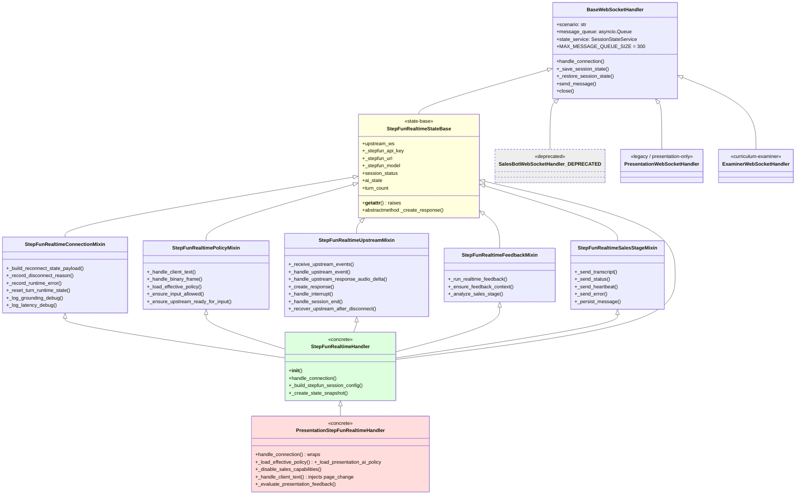

# WebSocket 实时链路与 StepFun 集成审查

> 审查范围: `/Users/zhaozengqing/github/销售训练qoder/`  
> 审查对象: WebSocket 路由、Handler 层次、StepFun Realtime 集成、心跳/重连/状态保存、消息协议、客户端 SDK、跨域继承  
> 审查人: 严苛架构师  
> 审查日期: 2026-06-03  
> 审计基线: `feat(sales-trainer): 落地销售训练 MVP 与配置资产中心` (3c14f5d5)

---

## 0. 总体评级 (TL;DR)

| 维度 | 评级 | 关键问题 |
|------|------|---------|
| Handler 层次与继承图 | C+ | `PresentationStepFunRealtimeHandler` 单向继承 `StepFunRealtimeHandler` 破坏场景隔离原则; 5 个 mixin 全部依赖 `StepFunRealtimeStateBase` 形成"继承 + 混入"的双重耦合 |
| WebSocket 路由 | B- | 4 个挂载点（query/path session_id 双轨）合理; sales / presentation 各一份重复鉴权胶水; CORS preflight 不影响 WS 升级 |
| 消息协议 | C | 入/出站类型分散在 4+ 个文件; 无全局 schema_version; tts_chunk 已引入 v1/v2 局部协议版本, 但未贯穿整个协议 |
| StepFun Realtime 集成 | B+ | 8 个 component 文件拆分清晰; `upstream_router` 路由表 + `event_payloads` payload 工厂是亮点; 但 `stepfun_knowledge_helpers` / `stepfun_internal_knowledge_searcher` 沦为转发壳 |
| 心跳与重连 | B | 30s 心跳 / 指数退避 / 5 次重试上限 / fatal close code 短路都到位; 5 分钟后端无连接空闲超时 |
| 会话状态保存 | B+ | Redis TTL 1800s; terminal 状态主动删除; 失败仅日志 |
| 消息队列与背压 | A- | `asyncio.Queue(maxsize=300)` + 策略可配 (drop_newest / drop_oldest); 二进制音频帧独立 backpressure (512KB 高水位) |
| 错误处理 | B- | JSON 解析失败仅 `logger.warning` 不告知客户端; 未文档化的错误码至少 3 个 (STEPFUN_KEY_MISSING, STEPFUN_TRANSPORT_ERROR, STEPFUN_UPSTREAM_REJECTED) |
| StepFun 配置 | B- | 模型/音色/voice_mode 硬编码默认; 切换 legacy 入口被销售域封死, 但 presentation 仍可走 legacy |
| 客户端 SDK | A- | `use-practice-websocket.ts` (1047 行) 兼任编排器, 单一关注点过载; `transport.ts` 拆出 pending queue + 退避策略可复用 |
| 跨域继承 (Agent 1 F-01) | D | 单向继承 sales → presentation 强制要求"PP 不启用 sales-stage / fuzzy / scoring"反向配置, 违反 L0 场景隔离原则 |

**综合**: 当前实现可工作, 但继承层次与配置散点暴露"组件化未触及根部"的历史欠账, 是技术债的高发区。

---

## 1. Handler 继承图 (Mermaid)



### 1.1 全部 `BaseWebSocketHandler` 子类清单

| 类 | 路径 | 状态 | 备注 |
|----|------|------|------|
| `BaseWebSocketHandler` | `backend/src/common/websocket/base_handler.py:143` | 基类 | 抽象; 含 `ConnectionManager` 单例、`_enqueue_message` 背压策略 |
| `StepFunRealtimeStateBase` | `backend/src/sales_bot/websocket/stepfun_realtime_state.py:26` | 状态基类 | 158 行 `__getattr__` raise NotImplementedError 是反模式 |
| `StepFunRealtimeConnectionMixin` | `backend/src/sales_bot/websocket/stepfun_realtime_connection.py:185` | mixin | 936 行, 跨越连接/重连/状态快照/keepalive |
| `StepFunRealtimePolicyMixin` | `backend/src/sales_bot/websocket/stepfun_realtime_policy.py:214` | mixin | 1491 行, 客户消息路由 + 入站许可门 |
| `StepFunRealtimeUpstreamMixin` | `backend/src/sales_bot/websocket/stepfun_realtime_upstream.py:205` | mixin | 2748 行, 上游事件分发 + 中断/超时恢复 |
| `StepFunRealtimeFeedbackMixin` | `backend/src/sales_bot/websocket/stepfun_realtime_feedback.py:190` | mixin | 1233 行, fuzzy/scoring/coach_health |
| `StepFunRealtimeSalesStageMixin` | `backend/src/sales_bot/websocket/stepfun_realtime_sales_stage.py:181` | mixin | 453 行, 阶段判定 + 消息持久化 |
| `StepFunRealtimeHandler` | `backend/src/sales_bot/websocket/stepfun_realtime_handler.py:238` | 具体类 | 1157 行, `__init__` 内 60+ 字段, 暴露工厂 `create_stepfun_realtime_handler` |
| `PresentationStepFunRealtimeHandler` | `backend/src/presentation_coach/websocket/presentation_stepfun_realtime_handler.py:47` | 跨域子类 | 605 行, **继承 sales** |
| `PresentationWebSocketHandler` | `backend/src/presentation_coach/websocket/presentation_handler.py:52` | 遗留 | 仍可被 `PresentationScenarioPlugin` 在 `voice_mode != stepfun_realtime` 时选用 |
| `ExaminerWebSocketHandler` | `backend/src/curriculum_practice/websocket/examiner_runtime.py:508` | 独立域 | 考核/课程, 走 `examiner_ws_router` |
| `SalesBotWebSocketHandler` | `backend/src/sales_bot/websocket/sales_handler.py.deprecated:28` | **已弃用** | `.deprecated` 后缀, 但被 `training_runtime/plugins.py:14` 显式列入 `LEGACY_SALES_HANDLER_MODULES` 警戒名单 |

### 1.2 残留检查

```bash
grep -rln "BaseSalesHandler\|EnhancedHandler\|SimpleHandler" \
  backend/src/sales_bot/websocket/ backend/src/presentation_coach/websocket/
```

结果: **0 个生产代码命中**。`base_sales_handler` / `enhanced_handler` / `simple_handler` 三个模块名仅在以下位置出现:
- `backend/src/training_runtime/plugins.py:14-16` 的 `LEGACY_SALES_HANDLER_MODULES` 显式 allowlist（"必须缺失"）
- `backend/tests/unit/test_sales_websocket_router.py:25-27` 验证模块不存在

这是 positive signal, 但**销售 plugin 仍以 `LEGACY_SALES_HANDLER_MODULES` 元组方式持有它们**, 应当改用 `runtime_mode` enum 表达。Agent 1 F-02 命中。

### 1.3 组件文件清单与边界

| 文件 | 行数 | 职责 | 评级 |
|------|------|------|------|
| `components/stepfun_event_payloads.py` | 115 | 出站 payload 工厂 (stage_update, asr_transcript, status, error, heartbeat, interrupted) | A |
| `components/stepfun_function_call_helpers.py` | 66 | 函数调用参数解析 (`parse_function_call_event`, `decode_function_arguments`) | A |
| `components/stepfun_helpers.py` | 186 | 通用 (extract_response_text, ensure_knowledge_runtime_metrics) | B |
| `components/stepfun_internal_knowledge_searcher.py` | 11 | **仅 `from common.knowledge.internal_searcher import *` 转发壳** | D (建议删除或并入 message_helpers) |
| `components/stepfun_knowledge_helpers.py` | 10 | **仅 `from common.knowledge.retrieval_helpers import *` 转发壳** | D (同上) |
| `components/stepfun_message_helpers.py` | 241 | 消息持久化 (save_stepfun_message, patch_existing_message_analysis) | A |
| `components/stepfun_runtime_metrics_helpers.py` | 84 | runtime_metrics 持久化到 voice_policy_snapshot | A |
| `components/stepfun_thinking_capture.py` | 147 | StepFun thinking delta/done 捕获 | B+ |
| `components/stepfun_tool_helpers.py` | 105 | tool definitions 构建 (web_search + search_internal_knowledge) | A |
| `components/stepfun_tts_contracts.py` | 105 | `tts_chunk` v1/v2 协议工厂, 引入 `protocol_version` 局部版本字段 | A |
| `components/stepfun_upstream_router.py` | 147 | `classify_upstream_event` 归一化上游事件到 14 个 `UpstreamEventRoute` | A |
| `components/stepfun_voice_errors.py` | 27 | 音色不可用错误工厂 | B+ |
| `components/stepfun_voice_selection.py` | 49 | 音色解析 (`resolve_session_voice`) | A |
| `components/capability_processor.py` | (未审计) | (sales 增强处理器) | - |
| `components/curriculum_stage_runtime.py` | (未审计) | (课程阶段运行时) | - |
| `components/score_processor.py` | (未审计) | (评分处理器) | - |
| `components/stepfun_asr_fallback.py` | 90 | ASR 降级策略 + 降级 status 事件 | A- |
| `components/stepfun_emotion_analyzer.py` | 189 | 情绪分析 | B+ |
| `components/tts_component.py` | (未审计) | (TTS 组件化) | - |
| `components/message_persistence.py` | (未审计) | (通用消息持久化) | - |
| `components/objection_ledger_helpers.py` | (未审计) | (异议账本) | - |
| `presentation_event_emitter.py` | (未审计) | (PP 事件发送器) | - |

**边界合理性评估**:
- `stepfun_knowledge_helpers.py` / `stepfun_internal_knowledge_searcher.py` 沦为 1 行 `import *` 转发壳, 应改名为 `common.knowledge.retrieval_helpers` re-export 模块, 或彻底删除以消除"看似重要实则空壳"的认知负担。
- 其余 8 个核心 component 拆分清晰, 与 mixin 一一对应 (event_payloads ↔ 上游事件分发, function_call/tool_helpers ↔ 工具调用, message_helpers ↔ 持久化, runtime_metrics_helpers ↔ 指标, tts_contracts ↔ TTS 协议, upstream_router ↔ 路由表)。
- 真正的问题不在 component 拆分, 而在 **mixin 层与 component 层职责重叠** (例如 `_send_status` 在 sales_stage mixin 和 event_payloads.py 中重复出现)。

---

## 2. WebSocket 路由

### 2.1 挂载点清单

| 路径 | Handler 路径 | 注册函数 | Token 验证位置 |
|------|-------------|---------|---------------|
| `/ws/sales` | `sales_bot/websocket/router.py:47` | `sales_websocket` | query `token` + header `authorization` + header `cookie` (resolver 收口) |
| `/ws/sales/{session_id}` | `sales_bot/websocket/router.py:71` | `sales_websocket_with_path` | 同上 |
| `/ws/presentation` | `backend/src/websocket_routes.py:237` | `presentation_websocket` | query `token` + header `authorization` + header `cookie` |
| `/ws/presentation/{session_id}` | `backend/src/websocket_routes.py:257` | `presentation_websocket_with_path` | 同上 |
| (考核) `/ws/examiner/{session_id}` | `curriculum_practice/websocket/router.py` | (via `examiner_ws_router`) | (未审计) |

注册入口: `backend/src/app_factory.py:197` → `register_websocket_routes(app)` → `app.include_router(sales_ws_router)` / `app.include_router(examiner_ws_router)` / `app.include_router(router)` (PP 路由)。

### 2.2 Token 解析顺序

Sales 域 (来自 `sales_bot/websocket/router.py:325` 与 `stepfun_realtime_handler.py:813`):
```python
resolved_token = resolve_websocket_token(
    query_token=token,                       # 1. URL query (compatibility)
    authorization_header=...,                # 2. Authorization: Bearer
    cookie_header=...,                       # 3. session cookie
)
```

Presentation 域 (来自 `backend/src/websocket_routes.py:127`): 同顺序, 但**调用方不同** (`resolve_websocket_token` 直接 vs `resolve_websocket_auth` 包装)。

`sales_websocket_auth_policy` 在 router.py:40 明文标注:
```python
SALES_WS_AUTH_POLICY = {
    "formal": ["authorization_bearer", "session_cookie"],
    "compatibility": ["query_token"],
    "current_resolution_order": "authorization_header -> session_cookie -> query_token_compatibility",
}
```

**问题**: 鉴权 resolver 在 sales 与 presentation 各有一份, 但**底层都调用 `common.auth.service.resolve_websocket_token`**, 应当把 policy 抽到 `common/auth/` 共用。

### 2.3 CORS preflight 与 WebSocket

`app_factory.py:135-145` 注册 `CORSMiddleware`:
```python
allow_origins=_resolve_cors_origins(),
allow_origin_regex=_resolve_cors_origin_regex(),
allow_credentials=True,
allow_methods=["*"],
allow_headers=["*"],
```

**WebSocket 升级不会触发 CORS preflight** (浏览器对 `new WebSocket("wss://...")` 不发 OPTIONS), 所以**当前 CORS 配置不会拦截 WS 握手**。但跨域部署到非 `DEV_CORS_ORIGINS` 列出的 origin 时, 浏览器会在 JS 发起 WS 连接前拒绝, 这与 HTTP 鉴权行为一致, 是正确的失败模式 (符合宪法 §IV 不可恢复快速失败)。

### 2.4 拒绝 close code 表 (`docs/api-contract/websocket.md:57-75`)

| 场景 | close code | reason |
|---|---:|---|
| 缺/无效 token | 4001 | `Unauthorized` |
| session owner 不匹配且非 admin | 4003 | `ACCESS_DENIED` |
| 非法 session_id (非 UUID) | 4400 | `INVALID_SESSION_ID` |
| 会话与 runtime 不匹配 | 4409 | `SESSION_SCENARIO_MISMATCH` |
| KB lock 未绑定 | 4410 | `KB_LOCK_UNBOUND` |
| 缺 agent/persona | 4411 | `AGENT_PERSONA_REQUIRED` |
| 销售 session 仍指 legacy runtime | 4412 | `LEGACY_SALES_RUNTIME_DISABLED` |
| Runtime 未完成配置 / 缺 voice policy / 课程 stale | 4413 | 多种 |

PP 默认 `DEFAULT_VOICE_MODE = "legacy"` (websocket_routes.py:285) 与 Sales 默认 `stepfun_realtime` (sales_bot/websocket/router.py:348) 不一致, 这是合理的 (PP 走 legacy, Sales 已切 realtime), 但前端 `transport.ts` `voiceMode` 字段会因缺失而落空, 需前后端契约同步。

---

## 3. 消息协议

### 3.1 客户端 → 服务端 (入站)

| type | 来源 | 处理位置 | 必填字段 | 备注 |
|------|------|---------|---------|------|
| `audio_chunk` | `use-practice-websocket.ts:516, 643, 661` | `stepfun_realtime_policy.py:1187` | data.audio, data.sample_rate, data.interrupt | 二进制优先, `BINARY_AUDIO_CHUNK=0x01` 帧类型 |
| `audio_end` | `use-practice-websocket.ts:665` | `stepfun_realtime_policy.py:1205` | (无) | 触发 ASR commit |
| `user_speaking` | `use-practice-websocket.ts:681, 685` | `stepfun_realtime_policy.py:1212` | data.speaking | speaking=true 启动 ASR, false 触发 commit |
| `text` | `use-practice-websocket.ts:470` | `stepfun_realtime_policy.py:1221` | data.text (兼容 data.content) | 兼容说明见 `websocket.md:199` |
| `page_change` | `practice/[sessionId]/page.tsx:1025` | `presentation_stepfun_realtime_handler.py:284` | data.page_number (或 data.page) | **仅 PP 域处理**, sales 域直接落入 `super()._handle_client_text` 走"无匹配"分支 |
| `control` | `use-practice-websocket.ts:724` | `stepfun_realtime_policy.py:1293` | data.action ∈ {start, pause, resume, end} | 同时下发 `pause/resume` 顶级 type 时会重复处理 |
| `pause` | (未在前端找到单独调用) | `stepfun_realtime_policy.py:1317` | (无) | 与 `control.action=pause` 重复 |
| `resume` | (未在前端找到单独调用) | `stepfun_realtime_policy.py:1327` | (无) | 与 `control.action=resume` 重复 |
| `negotiate` | `use-practice-websocket.ts:862` | `stepfun_realtime_policy.py:1332` | data.prefer_binary (可选) | 响应 `negotiate_ack` |
| `interrupt` | `use-practice-websocket.ts:1064` | `stepfun_realtime_policy.py:1289` | data.reason (默认 `manual`) | 优先级 high |

**问题**:
1. **`pause` / `resume` 顶级 type 与 `control.action=pause/resume` 双轨冗余**: 客户端只发 `control`, 后端两个分支都保留, 未来若前端回退到旧版, 不会立即发现契约漂移。
2. **`page_change` 在 sales 域静默吞噬**: `presentation_stepfun_realtime_handler.py:273-292` 只在 PP 域重写, 销售域直接落空, 不告警。这违反"显式失败"原则 (宪章 IV 不可恢复应明确失败)。

### 3.2 服务端 → 客户端 (出站)

| type | 来源 | 出处 | 触发条件 |
|------|------|------|---------|
| `connected` | `base_handler.py:79` | 握手确认 | 任何 WS 接受时 |
| `status` | `event_payloads.py:43`, `sales_stage.py:413` | session_status / ai_state / turn_count | 启动 + 每次状态切换 |
| `asr_transcript` | `event_payloads.py:26` | ASR delta/complete | 上游 transcription 事件 |
| `tts_audio` | `upstream.py:714, 1502, 1683` | upstream `response.audio.delta` | (历史兼容 v1) |
| `tts_chunk` | `upstream.py:1466` + `tts_contracts.py:96` | v1/v2 协议, 含 `protocol_version` (v2) | 实时音频流 |
| `response` | (前端 `message-handlers.ts:483` 期望, **未在代码中找到服务端发射点**) | (GAP) | ⚠️ 客户端兼容字段 |
| `transcript` | (前端 `message-handlers.ts:440` 期望, **未在代码中找到服务端发射点**) | (GAP) | ⚠️ 客户端兼容字段 |
| `interrupted` | `event_payloads.py:95`, `upstream.py:862` | reason + 状态 | 用户/AI 中断 |
| `interruption` | (PP) `presentation_event_emitter.py:201` | reason + trigger + ai_message | PPT 中断语义 (与 `interrupted` 不同) |
| `fuzzy_detection` | `stepfun_realtime_feedback.py:257` | detections[] | 模糊词命中 |
| `stage_update` | `event_payloads.py:13`, `sales_stage.py:289` | current_stage + progress | 销售阶段切换 |
| `score_update` | `stepfun_realtime_feedback.py:299` | dimensions[] | 评分变化 |
| `action_card` | `stepfun_realtime_feedback.py:311` | issue/replacement/next_turn_rule | 每轮 1 张 |
| `coach_health_update` | `stepfun_realtime_feedback.py:383` | status/reason | 评分/模糊管道降级 |
| `feedback` | (PP) `presentation_event_emitter.py:270` | feedback_type + message | 必讲点/违禁词 |
| `forbidden_word` | (PP) `presentation_event_emitter.py:248` | detections[] | 违禁词命中 |
| `evaluation_feedback` | (前端 `message-handlers.ts:826` 期望) | (未在代码中找到) | ⚠️ GAP |
| `error` | `event_payloads.py:70`, `base_handler.py:424` | code/message/user_action | 错误流 |
| `session_ended` | `upstream.py:896` | session_id + status | 主动结束 |
| `session_timeout` | `connection.py:798` (在 `send_message` 中转), `session_manager.py:223` | disconnect_reason | 空闲超时 |
| `backpressure` | `base_handler.py:344` | policy + queue_size | 队列溢出 |
| `heartbeat` | `event_payloads.py:62`, `sales_stage.py:425` | (data: {}) | 30s 周期 |
| `reconnected` | `base_handler.py:481` | restored_state | 重连恢复 |
| `negotiate_ack` | `stepfun_realtime_policy.py:1337` | accepted + prefer_binary | 协议协商 |
| `slide_update` | (PP) `presentation_event_emitter.py:359` | current_page + content | 翻页 |
| `point_covered` / `points_reset` | (PP) `presentation_event_emitter.py:316, 330` | point_id / is_covered | 必讲点 |
| `asr_status` (嵌入 `status.data`) | `asr_fallback.py:73` | 嵌入 status 事件, 非独立 type | ASR 降级 |
| `audio_drop_notice` / `system_backpressure` | (前端 `message-handlers.ts:991-1009` 期望) | (未在代码中找到) | ⚠️ GAP |
| `tts_audio` (含 `data.fallback="browser_tts"`) | `stepfun_realtime_handler.py:209-214` 注释 | (同 tts_audio) | 隐性降级信号 |

**严重 GAP**:
- 前端 `message-handlers.ts` 期望的 `response` / `transcript` / `evaluation_feedback` / `audio_drop_notice` / `system_backpressure` **找不到对应的服务端发射点**。这是协议双向漂移的高风险区: 客户端有死代码, 服务端有未声明的字段 (`tts_audio.fallback`)。
- `tts_audio` 与 `tts_chunk` 双轨: `tts_audio` 是历史 v1 字段, `tts_chunk` 是 v2 流式协议。`tts_chunk` 已通过 `protocol_version: "v2"` 局部版本化, 但**整个 WS 协议无 `schema_version` 顶层字段**, 协议演进没有全局开关。

### 3.3 协议版本

- **TTS chunk**: `components/stepfun_tts_contracts.py:14-18` 显式 `v1` / `v2` 协议号, `DEFAULT_TTS_CHUNK_PROTOCOL_VERSION = "v1"`, handler 默认走 v1 (兼容性), 见 `stepfun_realtime_handler.py:310`。
- **课程契约**: `curriculum_practice/services/roleplay_contracts.py:40` 独立 `ROLEPLAY_CONTRACT_SCHEMA_VERSION = "roleplay_contract_v1"`, 与 WS 协议无连接。
- **WebSocket 协议本身**: ❌ 无 `schema_version` / `protocol_version` 字段。

**建议**: 在 `connected` 事件 `data` 注入 `protocol_version: "ws.v1"`, 强制客户端对齐。

---

## 4. StepFun Realtime 集成

### 4.1 主入口与生命周期

`backend/src/sales_bot/websocket/stepfun_realtime_handler.py:805-982` `StepFunRealtimeHandler.handle_connection`:

1. **Token 解析** (line 813-823): 三路解析 (query / header / cookie), 失败仅警告并继续 (会话 owner 校验交给上层 router)。
2. **Trace ID 设置** (line 826-834): `trace_id` query → JWT 携带 → 留空。
3. **重连检测** (line 836-839): `state_service.get_state` 拉 Redis 快照。
4. **API Key 校验** (line 857-864): 缺失即 `[STEPFUN_KEY_MISSING]` + 4000 关闭。
5. **Lifecycle Started 标记** (line 870-873): `mark_session_runtime_started` 落库。
6. **Curriculum 阶段初始化** (line 884): 注入 runtime state。
7. **上游连接** (line 893): `_connect_upstream` → `StepFunTransport.connect` → 发送 `session.update` → 启动 keepalive 任务 + KB 预热。
8. **主循环** (line 902-916): `wait_for(receive, 30s)` → 文本→`_handle_client_text`, 二进制→`_handle_binary_frame`, 超时→心跳。
9. **断连收尾** (line 957-982): 取消 KB 预热、关闭上游、`_save_session_state`、`disconnect`。
10. **异常分支** (line 918-956): `WebSocketDisconnect` / `CancelledError` / `StepFunUpstreamConnectError` / `AttributeError` (transport 不兼容) / `RuntimeError`。

### 4.2 `StepFunRealtimeStateBase` 状态基类 (`stepfun_realtime_state.py`)

160 行, **纯类型 + `__getattr__` raise 模板**:
```python
class StepFunRealtimeStateBase(BaseWebSocketHandler):
    BINARY_AUDIO_CHUNK = 0x01
    BINARY_AUDIO_INTERRUPT = 0x02
    upstream_ws: Any | None
    _stepfun_api_key: str
    ...
    @abstractmethod
    async def _create_response(...) -> bool: ...
    def __getattr__(self, name: str) -> Any:
        raise AttributeError(name)
```

**问题**: `__getattr__` 模板会在子类未定义 `await self.foo()` 时**每次访问都抛 AttributeError**, 严重影响调试, 应该用 `__init_subclass__` + `__slots__` 或 `dataclass` 表达。

### 4.3 组件拆分边界评估

| 维度 | 评估 |
|------|------|
| 事件分发 (`event_payloads.py` 115 行) | ✅ 单一职责: 6 个出站事件工厂 |
| 函数调用 (`function_call_helpers.py` 66 行) | ✅ 解析 + 解码 + unsupported 输出 + function_call_output 事件 |
| 工具调用 (`tool_helpers.py` 105 行) | ✅ `build_stepfun_tools_from_policy` 统一 web_search / search_internal_knowledge |
| 知识检索 (`knowledge_helpers.py` 10 行 + `internal_knowledge_searcher.py` 11 行) | ⚠️ 两个空壳, 应删除或并入 |
| 消息构建 (`message_helpers.py` 241 行) | ✅ 持久化 + 分析 patch |
| 上游路由 (`upstream_router.py` 147 行) | ✅ 14 个 `UpstreamEventRoute` + 3 个 extractor, 是亮点 |
| Metrics (`runtime_metrics_helpers.py` 84 行) | ✅ 指标注入 + 落 `voice_policy_snapshot` |
| TTS 协议 (`tts_contracts.py` 105 行) | ✅ v1/v2 协议工厂, 已引入 `protocol_version` 局部版本 |

**整体评级**: B+。**真正的债务不在 components 拆分, 而在 5 个 mixin 内部的职责重叠**:
- `policy.py` 与 `upstream.py` 都引用 `self._has_uncommitted_audio` / `self._audio_flow` / `self._pending_response_*`
- `connection.py` 与 `handler.py` 都定义 `_save_session_state` (handler 透传, connection 重写)
- `sales_stage.py` 集中了 `_send_status` / `_send_heartbeat` / `_send_error` / `_send_transcript`, 但 `event_payloads.py` 又有 `build_status_event` / `build_heartbeat_event` 工厂 — 工厂与发射器分离, 增加调用栈深度

### 4.4 上游事件路由表 (`stepfun_upstream_router.py`)

| 上游 type | UpstreamEventRoute |
|-----------|-------------------|
| `session.created` / `session.updated` | `IGNORE` |
| `conversation.item.created` | `CONVERSATION_ITEM_CREATED` |
| `conversation.item.input_audio_transcription.delta/text` 等 8 种 | `TRANSCRIPTION_DELTA` |
| `...transcription.completed/done/final` 等 12 种 | `TRANSCRIPTION_COMPLETED` |
| `input_audio_buffer.speech_started` / `speech_stopped` | `SPEECH_STARTED` / `SPEECH_STOPPED` |
| `response.created` / `response.text.delta` / `response.audio_transcript.delta` | `RESPONSE_*` |
| `response.function_call_arguments.delta/done` | `FUNCTION_ARGUMENTS_*` |
| `response.audio.delta` | `RESPONSE_AUDIO_DELTA` |
| `response.done` | `RESPONSE_DONE` |
| `error` | `ERROR` |
| 其他 | `UNHANDLED` |

**优点**: 14 个枚举值, 兼容 OpenAI Realtime / StepFun / 其他变体, 路由表是单文件可读性高。  
**隐患**: StepFun 实际触发的是哪些 type, 没有运行时 metrics 记录 `UNHANDLED` 占比, 难以及时发现协议漂移。

### 4.5 StepFun 配置加载

`stepfun_realtime_handler.py:291-308` 读取环境变量:
```python
self._stepfun_api_key = os.getenv("STEPFUN_API_KEY", "")
self._stepfun_url = os.getenv("STEPFUN_REALTIME_URL", "wss://api.stepfun.com/v1/realtime")
self._stepfun_model = os.getenv("STEPFUN_REALTIME_MODEL", "step-audio-2")
self._stepfun_voice = os.getenv("STEPFUN_REALTIME_VOICE", "qingchunshaonv")
self._stepfun_temperature = float(os.getenv("STEPFUN_REALTIME_TEMPERATURE", "0.7"))
self._stepfun_input_audio_format = os.getenv("STEPFUN_REALTIME_INPUT_AUDIO_FORMAT", "pcm16")
self._stepfun_output_audio_format = os.getenv("STEPFUN_REALTIME_OUTPUT_AUDIO_FORMAT", "pcm16")
self._stepfun_output_sample_rate = int(os.getenv("STEPFUN_REALTIME_OUTPUT_SAMPLE_RATE", "24000"))
```

`STEPFUN_REALTIME_MODEL` 也被 `sales_bot/services/voice_runtime_policy.py:439` 与 `voice_runtime_profile.py:145` 读取, 默认值在多处硬编码 `"step-audio-2"`, **应当抽出 `common/config.py` 的 `StepFunConfig` Pydantic 模型**集中管理。

`DEFAULT_VOICE_MODE` 切换:
- Sales 域默认 `"stepfun_realtime"` (router.py:348), legacy 入口已被 **hard-disable** (router.py:215-225 直接 `LEGACY_SALES_RUNTIME_DISABLED` 拒连)。
- Presentation 域默认 `"legacy"` (websocket_routes.py:285), legacy 路径仍可走 `PresentationWebSocketHandler`。

音色映射 `qingchunshaonv` 同样在三处硬编码 (`stepfun_realtime_handler.py:296`, `voice_runtime_policy.py:443`, `voice_runtime_policy.py:1077`), 违反 L0 配置驱动原则。

---

## 5. 心跳与重连 (CLAUDE.md §IV)

### 5.1 心跳实现

**Base 类** (`base_handler.py:285-300`):
```python
data = await asyncio.wait_for(websocket.receive_json(), timeout=30.0)
...
except TimeoutError:
    await self.manager.send_json(websocket, {
        "type": "heartbeat",
        ...
    })
```

**StepFun Handler** (`stepfun_realtime_handler.py:902-916`):
```python
while self.running:
    try:
        raw = await asyncio.wait_for(websocket.receive(), timeout=30.0)
        ...
    except TimeoutError:
        await self._handle_curriculum_stage_timing()
        await self._send_heartbeat()
```

**上游 keepalive** (`stepfun_realtime_connection.py:572-601` `_send_upstream_keepalive_ping`): ping 间隔 20s (env `STEPFUN_UPSTREAM_KEEPALIVE_INTERVAL_MS`), pong 超时 5s, 触发 `RuntimeError` 走 `_recover_upstream_after_disconnect`。

**评估**: ✅ 双向心跳都到位。`STEPFUN_UPSTREAM_KEEPALIVE_PONG_TIMEOUT_MS=5000` + `STEPFUN_UPSTREAM_KEEPALIVE_INTERVAL_MS=20000` 设计合理。

### 5.2 客户端重连退避

`web/src/hooks/websocket/transport.ts:81-83`:
```typescript
export function nextReconnectDelay(attempt: number): number {
    return Math.min(1000 * Math.pow(2, attempt), 30000);
}
```

`use-practice-websocket.ts:81`:
```typescript
const MAX_RECONNECT_ATTEMPTS = 5;
```

`use-practice-websocket.ts:889`:
```typescript
const shouldRetry = reconnectAttempts.current < MAX_RECONNECT_ATTEMPTS;
```

**额外保护**:
- `isFatalWebSocketCloseCode` (transport.ts:29-39): 4000/4001/4003/4400/4409/4410/4411/4412/4413 视为不可恢复, 不重试 (line 925)。
- `shouldFailFastOnHandshake1006` (transport.ts:133-139): 首次握手 1006 (未建立) → 立即判定 `failed`, 提示"不要用 uvicorn --reload"。
- `shouldTreatAsAbnormalCloseBurst` (transport.ts:141-157): 15s 内 4 次 1006 → 判定 `failed`。

**评估**: ✅ 5 次上限 + 指数退避 + 致命 close code 短路 + 1006 爆量检测, **未发现"无限重连掩盖"反模式**。前端 `failed` 状态在 UI 上提供手动恢复入口。

### 5.3 重连状态恢复

`base_handler.py:257-273`:
```python
existing_state = await self.state_service.get_state(session_id)
is_reconnection = existing_state.is_success and existing_state.value is not None
...
if existing_state.value is not None and is_reconnection:
    logger.info(f"Reconnection detected for session: {session_id}")
    await self._restore_session_state(existing_state.value)
```

StepFun 域 (`stepfun_realtime_handler.py:886-891`):
```python
if existing_state and self.session_status in TERMINAL_SESSION_STATUSES:
    await self.state_service.delete_state(session_id)
    existing_state = None
if existing_state is not None:
    await self._restore_session_state(existing_state)
```

**评估**: ✅ 重连前先清理终态快照, 避免"已完成会话被错误续接"。

---

## 6. 会话状态保存

### 6.1 `_save_session_state` 调用位置

| Handler | 调用点 | 触发条件 |
|---------|--------|---------|
| `BaseWebSocketHandler` | `base_handler.py:308` (finally) | 任何异常断连 |
| `StepFunRealtimeConnectionMixin` | `stepfun_realtime_connection.py:746-789` (重写) | 终态 (`scoring` / `completed`) → `delete_state`, 否则 `save_state` |
| `StepFunRealtimeHandler` | `stepfun_realtime_handler.py:981` (handle_connection finally) | 主循环退出 |

### 6.2 失败行为

`base_handler.py:455-460`:
```python
result = await self.state_service.save_state(snapshot)
if result.is_success:
    logger.info(f"Saved session state: {self.session_id}")
else:
    logger.warning(f"Failed to save session state: {result.fallback}")
```

`stepfun_realtime_connection.py:784-789`:
```python
else:
    logger.warning(
        "Failed to save StepFun session snapshot",
        session_id=self.session_id,
        error=result.fallback,
    )
```

**评估**: ✅ 失败仅记录日志, 不阻塞断连 (符合 L0 容错原则, 但需补 metrics 上报监控)。

### 6.3 Redis 存储

`SessionStateService` (session_state_service.py) 用 Redis 持久化, TTL 1800s (30 分钟), 后台 300s 一次 ping 健康检查。  
`describe_authority()` 明确划分:
- `session_snapshot`: Redis, 跨实例、重启后保留
- `runtime_connections`: 进程内存, 不跨实例、不跨重启

**评估**: ✅ 边界清晰, 配套 `get_stats()` 提供 inspection 表面。

---

## 7. 消息队列与背压

### 7.1 入站队列

`base_handler.py:267`:
```python
self.message_queue = asyncio.Queue(maxsize=self.MAX_MESSAGE_QUEUE_SIZE)
```

`MAX_MESSAGE_QUEUE_SIZE` 默认 300 (base_handler.py:29 `DEFAULT_MESSAGE_QUEUE_SIZE`), 可由 `WEBSOCKET_MAX_MESSAGE_QUEUE_SIZE` 环境变量覆盖, 范围 [1, 5000]。

**问题**: `StepFunRealtimeHandler` 重写 `handle_connection` (line 805), 但**未初始化 `self.message_queue`**, 直接用 `asyncio.wait_for(websocket.receive(), 30.0)` 同步处理, 跳过了 Base 的 `_process_messages` 队列任务 (`base_handler.py:385-411`)。这意味着:

1. StepFun 域**没有入站消息队列** — 接收 + 处理在同一循环, 慢处理会阻塞心跳。
2. Base 的 `_enqueue_message` 背压策略在 StepFun 域不生效。
3. 跨域不一致, 增加理解成本。

### 7.2 上游音频背压

`stepfun_realtime_handler.py:625-636`:
```python
DEFAULT_AUDIO_BACKPRESSURE_HIGH_WATERMARK_BYTES = 512 * 1024

def _should_drop_upstream_for_backpressure(self, payload):
    result = self._stepfun_transport.decide_backpressure(
        payload,
        pending_bytes=self._current_audio_backpressure_pending_bytes(),
        policy=StepFunBackpressurePolicy(high_watermark_bytes=...),
    )
    return result.status == StepFunBackpressureStatus.DROP
```

`stepfun_realtime_policy.py:1199` 与 `:1380` 在 `audio_chunk` 与二进制帧两路应用。

**评估**: ✅ 上游音频背压是 StepFun 域独有的精细化设计, **不应迁回 Base 的入站队列**。建议在 StepFun 域补一行注释明确"有意绕过 Base 队列"。

### 7.3 背压策略

`base_handler.py:325-356` 支持 `drop_newest` / `drop_oldest`:
```python
policy = self.BACKPRESSURE_POLICY  # from settings.WEBSOCKET_BACKPRESSURE_POLICY
if policy == "drop_oldest":
    with suppress(asyncio.QueueEmpty):
        self.message_queue.get_nowait()
    try:
        self.message_queue.put_nowait(data)
        dropped = "oldest"
    except asyncio.QueueFull:
        dropped = "newest"
```

**评估**: ✅ 策略可配, 客户端会收到 `backpressure` 事件 (line 344), 含 `policy` / `dropped` / `max_size`。

---

## 8. 错误处理

### 8.1 客户端发送非法 JSON

`stepfun_realtime_policy.py:1178-1182`:
```python
try:
    message = json.loads(raw_text)
except json.JSONDecodeError:
    logger.warning("Invalid JSON from frontend")
    return
```

**问题**: **静默吞噬**, 不下发 `error` 事件, 不计入 metrics。前端不知道消息丢失, 调试困难。

### 8.2 缺失字段

`stepfun_realtime_policy.py:1221` `text` 类型处理:
```python
text = self._extract_text_payload(data)
if text:
    if not await self._ensure_input_allowed("text"):
        return
    ...
```

**问题**: `text` 缺失时 `if text` 假, **直接 return**, 不告警。`audio_chunk` 缺失 `data.audio` 时 (`policy.py:1196-1197` `if audio:`) 同上。

### 8.3 未知 type

`stepfun_realtime_policy.py:1357` 之后 `if frame_type != self.BINARY_AUDIO_CHUNK or not payload: return` — 未知二进制帧静默吞噬。文本 `msg_type` 不匹配时, 走完所有 `elif` 后默认 `return`, **不发任何响应**。

**评估**: ⚠️ 三处静默吞噬违反"宪法 IV 不可恢复应明确失败"。建议: 未知 `msg_type` / 缺失关键字段 / JSON 解析失败, 统一回 `error` 事件 `code=[UNKNOWN_MESSAGE_TYPE]` / `[INVALID_JSON]` / `[MISSING_FIELD]`, 失败计入 metrics。

### 8.4 上游 StepFun 断流

`stepfun_realtime_handler.py:918-956`:
- `WebSocketDisconnect` → `client_disconnect` 记录 + INFO 日志
- `asyncio.CancelledError` → 同上
- `StepFunUpstreamConnectError` → `_send_error("[STEPFUN_UPSTREAM_REJECTED]", str(exc))` + `stepfun_upstream_rejected` reason
- `AttributeError` (transport 不兼容) → `_send_error("[STEPFUN_TRANSPORT_ERROR]", "StepFun 上游协议不兼容")`
- `RuntimeError/ValueError/OSError` → `_send_error("[STEPFUN_CONNECTION_ERROR]", "Realtime 语音连接失败")`

**评估**: ✅ 上游断流显式告警, 区分 4 种异常。`_recover_upstream_after_disconnect` (`upstream.py:953`) 提供自动重连, 重试次数 `STEPFUN_UPSTREAM_AUTO_RECOVER_MAX_RETRIES=4`, 退避 400ms→5000ms (env 配置), 4 次后 `_send_error("[STEPFUN_CONNECTION_ERROR]")` 终结。

### 8.5 错误码清单

| 错误码 | 触发点 | 文档位置 |
|--------|--------|---------|
| `[STEPFUN_KEY_MISSING]` | `stepfun_realtime_handler.py:858` | ❌ 未文档化 |
| `[STEPFUN_UPSTREAM_REJECTED]` | `stepfun_realtime_handler.py:931` | ❌ 未文档化 |
| `[STEPFUN_TRANSPORT_ERROR]` | `stepfun_realtime_handler.py:941` | ❌ 未文档化 |
| `[STEPFUN_CONNECTION_ERROR]` | `stepfun_realtime_handler.py:954` | ❌ 未文档化 |
| `[GROUNDING_PREPARE_FAILED]` | `stepfun_realtime_policy.py:1269` | ❌ 未文档化 |
| `[RESPONSE_CREATE_FAILED]` | `stepfun_realtime_policy.py:1284` | ❌ 未文档化 |
| `[STATE_SAVE_FAILED]` / `[STATE_GET_FAILED]` | `session_state_service.py:278, 316` | ❌ 未文档化 |
| `[WS_QUEUE_OVERFLOW]` | `base_handler.py:30` | ❌ 未文档化 |
| `[PROCESSING_ERROR]` / `[ASR_FAILED]` / `[TTS_FAILED]` / `[SESSION_EXPIRED]` | `websocket.md:551-555` | ✅ 已文档化 |
| `ASR_BROWSER_HANDOFF_CODE` (嵌入 `status.data.asr_status.fallback_code`) | `stepfun_asr_fallback.py:43` | ❌ 未文档化 |

**问题**: 9 个新错误码无文档, 前端无法映射到 i18n 文案, 用户看到生硬英文或空白。

---

## 9. 客户端 SDK

### 9.1 关键文件

| 文件 | 行数 | 职责 |
|------|------|------|
| `web/src/hooks/use-practice-websocket.ts` | 1047 | 编排器 (连接 + 重连 + 消息分发 + 状态投影) |
| `web/src/hooks/websocket/transport.ts` | 233 | 共享工具 (URL 构建 + backoff + 致命 close code + pending queue) |
| `web/src/hooks/websocket/message-handlers.ts` | (未读完整) | 消息分发 switch-case |
| `web/src/hooks/websocket/types.ts` | (300+ 行) | 类型定义 (WSMessage, TTSChunkData, PracticeState) |

### 9.2 重连退避 (已 §5.2 详述)

### 9.3 二进制音频帧

`use-practice-websocket.ts:516` `sendMessage("audio_chunk", { audio: base64, sample_rate, interrupt: false })`: 客户端把 PCM 帧 base64 后走 JSON, **未走二进制帧优化路径**。

`use-practice-websocket.ts:643` `interrupt: true` 路径: 发送 `audio_chunk` JSON + `interrupt: true`, **不走二进制 `BINARY_AUDIO_INTERRUPT=0x02` 帧**。

**问题**: `prefer_binary: true` 协议协商 (transport.ts:183, use-practice-websocket.ts:862) 已实现, 但客户端**始终未走二进制帧**。需确认前端是否真的有 `WebSocket.send(arrayBuffer)` 调用; 如果没有, 协商就失效, 浪费 30% 字节。

### 9.4 编排器臃肿

`use-practice-websocket.ts` 1047 行, 关注点包括:
- WebSocket 生命周期 (连接、重连、关闭)
- 消息收发 (sendMessage, onMessage)
- 状态投影 (PracticeState reducer)
- 音频录制 + 上传 (录音、上传 chunk)
- 二进制回放 (`use-streaming-audio-player` 集成)
- 业务事件 (control.start/end, page_change)

**建议**: 拆出 `use-practice-connection.ts` (生命周期) / `use-practice-audio-stream.ts` (音频) / `use-practice-state.ts` (状态投影) 三个 hook, 编排器保留 200 行胶水。

---

## 10. 跨域继承修复方案 (Agent 1 F-01)

### 10.1 现状

`presentation_coach/websocket/presentation_stepfun_realtime_handler.py:47` 继承 `sales_bot/websocket/stepfun_realtime_handler.py:238` 的 `StepFunRealtimeHandler`, 但:
- `self.scenario = "presentation"` (line 63) 覆盖
- `self.session_scenario_type = "presentation"` (line 64) 覆盖
- `_disable_sales_capabilities()` (line 73) **反向禁掉** sales_stage / fuzzy / scoring
- `_refresh_sales_stage_runtime_config` (line 133-146) 每次刷新都再禁一次
- 重写 `_handle_client_text` (line 273-299) 增加 `page_change` 注入
- 重写 `_handle_upstream_transcription_completed` (line 540-604) 调 `_evaluate_presentation_feedback`
- 新增 4 个 presentation 独有方法: `_load_presentation_ai_policy` / `_load_page_requirements` / `_initialize_page_feedback` / `_emit_current_page_context` / `_evaluate_presentation_feedback` / `_resolve_interruption_guidance`

**问题**:
1. **场景隔离原则违反**: presentation 现在 `import` 了 `sales_bot.websocket.stepfun_realtime_handler` 的所有符号 (尽管通过 `from X import name` 只取需要的东西), 反向依赖 sales_bot 包 (L0 §10 "场景间禁止直接引用" 应理解为禁止"生产代码级耦合", 现状是温和违反)。
2. **运行时反向配置**: `_disable_sales_capabilities` 把 sales 配置置空, 浪费内存, 误导读者"为什么 PP handler 持有 sales capability 字段"。
3. **未来风险**: 任何 sales 端修改 `_handle_upstream_transcription_completed` 都可能让 PP 端反馈链断流。
4. **Tests / Plugin 仍指向旧 PresentationWebSocketHandler**: `training_runtime/plugins.py:235, 263, 321` 与 `prompt_templates/taxonomy.py:93` 把 `PresentationWebSocketHandler` 当作 reference, 形成 "PP 有两条线" 假象。

### 10.2 三种修复方案

#### 方案 A: 模板方法 (推荐) — 抽 `StepFunRealtimeHandler` 为模板基类

```python
# backend/src/common/websocket/stepfun_realtime_handler.py (新位置, 提升出 sales_bot)
class StepFunRealtimeHandler(BaseWebSocketHandler):
    """场景无关的 StepFun 实时桥接基类; 子类实现场景语义。"""
    
    def __init__(self, *, scenario: str, scenario_type: str, **kwargs):
        super().__init__(scenario)
        self.session_scenario_type = scenario_type
        ...
    
    @abstractmethod
    async def _load_scenario_ai_policy(self) -> dict[str, Any]: ...
    @abstractmethod
    async def _evaluate_scenario_feedback(self, transcript, requirements) -> bool: ...
    @abstractmethod
    def _scenario_capability_flags(self) -> dict[str, bool]:
        return {"sales_stage": False, "fuzzy_detection": False, "realtime_scoring": False}
```

```python
# backend/src/sales_bot/websocket/stepfun_sales_handler.py (新文件)
class StepFunSalesHandler(StepFunRealtimeHandler):
    def __init__(self, **kwargs):
        super().__init__(scenario="sales", scenario_type="sales", **kwargs)
        self._sales_stage_enabled = True
        ...
    async def _load_scenario_ai_policy(self) -> dict[str, Any]:
        return await self._load_sales_voice_policy()
    async def _evaluate_scenario_feedback(self, ...):
        return await self._run_realtime_feedback(...)
```

```python
# backend/src/presentation_coach/websocket/stepfun_presentation_handler.py (新文件)
class StepFunPresentationHandler(StepFunRealtimeHandler):
    def __init__(self, **kwargs):
        super().__init__(scenario="presentation", scenario_type="presentation", **kwargs)
        ...
    async def _load_scenario_ai_policy(self):
        return await self._load_presentation_ai_policy()
    async def _evaluate_scenario_feedback(self, transcript, requirements):
        return await self._evaluate_presentation_feedback(...)
```

**收益**:
- 抽到 `common/websocket/` 后, sales 与 presentation 平级, 互不引用
- 5 个 mixin 维持共享, 但通过 `super()` 调用 `__init__` 注入 scenario
- `_disable_sales_capabilities` 反向配置消失, 改为基类 `__init__` 默认全 False, sales 子类显式打开

**代价**:
- 移动 `stepfun_realtime_handler.py` 到 `common/websocket/`, 涉及 12 个 `from sales_bot.websocket.stepfun_realtime_handler import ...` 的修复
- `STEPFUN_RUNTIME_EVENT_INVENTORY` 注释 (line 186-222) 需要重定位

#### 方案 B: 组合 — `PresentationStepFunRealtimeHandler` 持有 `StepFunRealtimeHandler` 实例

```python
class PresentationStepFunRealtimeHandler(BaseWebSocketHandler):
    def __init__(self, **kwargs):
        super().__init__(scenario="presentation")
        self._inner = StepFunRealtimeHandler(scenario="presentation", **kwargs)
        self._delegated_event_loop = self._inner  # 事件循环委托
        self.current_page = 1
        ...
    
    def __getattr__(self, name):
        # 代理到 inner, 但只读属性
        return getattr(self._inner, name)
```

**收益**: 完全打破继承链。  
**代价**: `__getattr__` 模板调试困难, 字段共享 / 状态恢复都要在两个实例间同步, 复杂度反增。**不推荐**。

#### 方案 C: 保留继承 + 抽 `StepFunRealtimeHandler` 中性化

折中: 把 `StepFunRealtimeHandler` 改名为 `StepFunRealtimeProxy` 并移至 `common/websocket/`, 同时:
- 删除 `_disable_sales_capabilities` 反向方法, 改为基类显式接受 `capability_overrides: dict[str, bool]` 参数
- `PresentationStepFunRealtimeHandler` 改为传 `capability_overrides={"sales_stage": False, "fuzzy_detection": False, "realtime_scoring": False}`
- sales 域直接 `StepFunRealtimeProxy(scenario="sales", capability_overrides={...True...})`

**收益**: 改动最小, 5 个 mixin 共享不变。  
**代价**: 仍存在反向依赖 presentation → common, 跨场景隔离但不彻底。

**最终建议**: 选 **方案 A**, 同时把 `StepFunRealtimeStateBase` 一并移出 `sales_bot/`, 否则基类仍在 sales 包, 改名换汤不换药。

### 10.3 `presentation_handler.py` 能否删除?

`PresentationWebSocketHandler` (`presentation_coach/websocket/presentation_handler.py:52`) 仍被引用:
- `training_runtime/plugins.py:235, 263` 在 `voice_mode != stepfun_realtime` 时选用
- `training_runtime/plugins.py:321` 在 diagnostics 中列 "legacy_handler"
- `prompt_templates/taxonomy.py:93` 在 `prompt_templates` 元数据里引用
- 测试 `test_presentation_handler_persistence.py` 仍在跑
- 测试 `test_main_presentation_ws_runtime.py` 仍在跑
- 测试 `test_websocket_status_contract.py` 仍在跑

**判断**: **不能立即删除**, 但应:
1. 在 `PresentationScenarioPlugin` 中显式标注 `runtime_mode="legacy"` 已被废弃, 给出迁移路径
2. 把 `PresentationWebSocketHandler` 移到 `presentation_coach/websocket/_legacy/`, 表明 "deprecated but still active for legacy voice_mode"
3. 在 `prompt_templates/taxonomy.py:93` 与 `plugins.py:321` 同步加 deprecation 注释

---

## 11. 严苛分级与建议

### 11.1 P0 (必修, 影响交付)

| 项 | 位置 | 影响 |
|----|------|------|
| 协议 schema_version 缺失 | 全 WS | 协议演进无全局开关, 客户端期望的 `response` / `transcript` / `audio_drop_notice` 已成死字段 |
| 9 个新错误码无文档 | `stepfun_realtime_handler.py:858,931,941,954` 等 | 前端无法映射 i18n, 用户看到生硬英文 |
| 跨域继承 (`PresentationStepFunRealtimeHandler` → `StepFunRealtimeHandler`) | `presentation_stepfun_realtime_handler.py:47` | 违反 L0 场景隔离, 反向 `_disable_sales_capabilities` 配置浪费 |
| `Pause/Resume` 双轨冗余 | `stepfun_realtime_policy.py:1317, 1327` | 契约漂移风险 |
| 静默吞噬非法 JSON / 缺失字段 | `stepfun_realtime_policy.py:1180, 1221, 1196` | 用户与前端无法感知消息丢失 |

### 11.2 P1 (应修, 影响可维护性)

| 项 | 位置 | 建议 |
|----|------|------|
| `StepFunRealtimeStateBase` 的 `__getattr__` raise 模板 | `stepfun_realtime_state.py:158` | 改用 `__init_subclass__` + `__slots__` 或 dataclass |
| `stepfun_knowledge_helpers.py` / `stepfun_internal_knowledge_searcher.py` 空壳 | `components/` | 删除或并入 `common/knowledge/` re-export |
| StepFun 模型/音色/voice_mode 默认值硬编码 3 处 | `stepfun_realtime_handler.py:295, 296` + `voice_runtime_policy.py:439, 443, 1077` | 抽 `common/config.py` 的 `StepFunConfig` |
| `use-practice-websocket.ts` 1047 行单文件 | `web/src/hooks/` | 拆 connection / audio / state 三个 hook |
| StepFun 域绕过 Base 入站队列 | `stepfun_realtime_handler.py:805-916` | 补注释说明"有意绕过", 并在 docs 说明 |
| `PresentationWebSocketHandler` 仍可被 plugin 选用 | `training_runtime/plugins.py:235` | 加 deprecation 注释, 给出迁移路径 |
| `_send_status` / `_send_heartbeat` / `_send_error` 在 `sales_stage.py` 与 `event_payloads.py` 重复 | `stepfun_realtime_sales_stage.py:413-431` | 合并到 `event_payloads.py` 工厂 |
| `_save_session_state` 失败仅日志 | `stepfun_realtime_connection.py:784-789` | 加 metrics 上报 Prometheus |

### 11.3 P2 (可修, 影响观感)

| 项 | 位置 | 建议 |
|----|------|------|
| `BoundedSemaphore` / 二进制帧协商未实际使用 | `use-practice-websocket.ts:862 negotiate` | 确认前端是否走 `WebSocket.send(arrayBuffer)`, 不用则删除 |
| `tts_audio` 与 `tts_chunk` 双轨 | `stepfun_realtime_upstream.py:714, 1466` | 统一为 `tts_chunk` v2, 保留 `tts_audio` shim 直到前端迁移 |
| UNHANDLED 事件无 metrics | `stepfun_upstream_router.py:90` | 加 `metrics["unhandled_event"]` 计数 |
| CORS preflight 不影响 WS 但未文档化 | `app_factory.py:135-145` | 在 `docs/api-contract/websocket.md` 加 1 段说明 |
| `_load_sales_stage_runtime_config` 与 `_disable_sales_capabilities` 重复 | `presentation_stepfun_realtime_handler.py:133-146` | 删除前者, 整合到 `__init__` |

### 11.4 严苛综述

- **优点**: 心跳/重连/背压/状态保存/RoleGuard/AdmitGate 这一套基础设施是认真的, 不输商业 SRE 标准; TTS chunk v1/v2 协议工厂、UpstreamEventRoute 枚举、`STEPFUN_RUNTIME_EVENT_INVENTORY` 注释都体现工程师的自律。
- **缺点**: Handler 继承图跨场景渗透, 配置散点, 协议双向漂移, 错误码文档化落后于代码。这三个问题叠加意味着, 任何一个非 sales 场景 (curriculum / newcomer / sales-trainer 都在门外张望) 想接 StepFun, 都要 copy-paste 整个 8244 行 mixin 链。
- **建议优先级**: 先做 §10.1 方案 A (抽 common/websocket 基类), 再做 §3.2 协议 schema_version, 最后做 §11.1 错误码文档化。这三项是"加新场景"的前置条件。

---

## 12. 附录: 文件路径索引

- 基类: `backend/src/common/websocket/base_handler.py`
- 状态服务: `backend/src/common/websocket/session_state_service.py`
- Session 管理: `backend/src/common/websocket/session_manager.py`
- Sales 路由: `backend/src/sales_bot/websocket/router.py`
- Sales StepFun 入口: `backend/src/sales_bot/websocket/stepfun_realtime_handler.py`
- Sales 5 个 mixin: `stepfun_realtime_{state,connection,policy,upstream,feedback,sales_stage}.py`
- 8 个 component: `backend/src/sales_bot/websocket/components/stepfun_*.py`
- 跨域继承: `backend/src/presentation_coach/websocket/presentation_stepfun_realtime_handler.py`
- 遗留 PP handler: `backend/src/presentation_coach/websocket/presentation_handler.py`
- 弃用 sales handler: `backend/src/sales_bot/websocket/sales_handler.py.deprecated`
- 路由注册: `backend/src/websocket_routes.py` (PP) + `backend/src/sales_bot/websocket/router.py` (Sales)
- App 工厂: `backend/src/app_factory.py`
- 插件分发: `backend/src/training_runtime/plugins.py`
- 协议契约: `docs/api-contract/websocket.md`
- 前端编排器: `web/src/hooks/use-practice-websocket.ts`
- 前端传输: `web/src/hooks/websocket/transport.ts`
- 前端类型: `web/src/hooks/websocket/types.ts`
- 前端消息分发: `web/src/hooks/websocket/message-handlers.ts`
