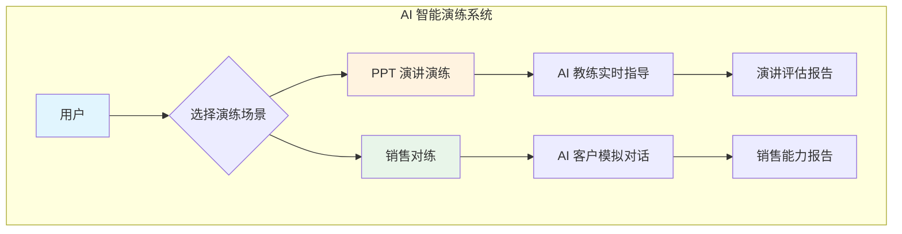
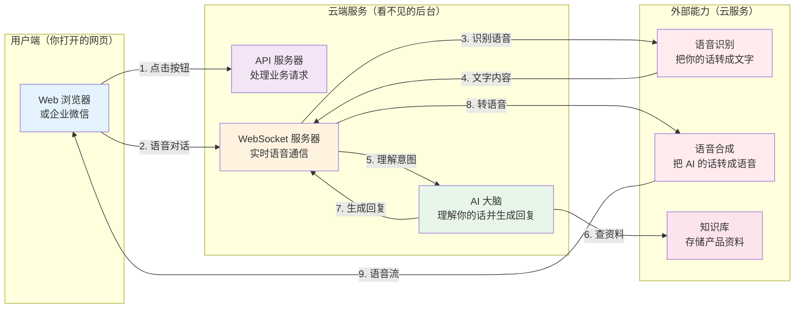
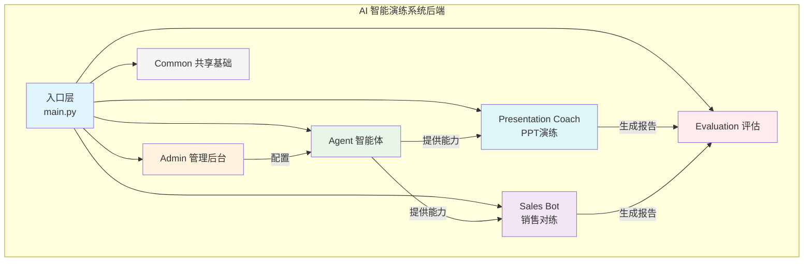
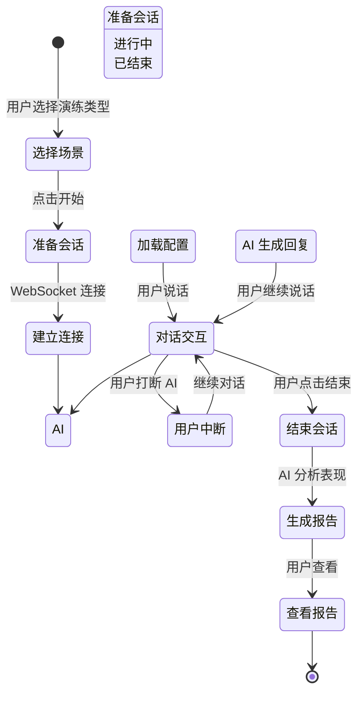
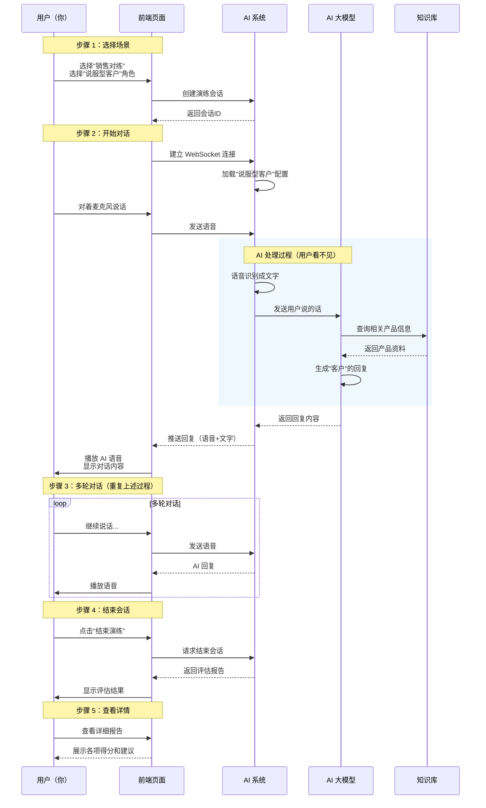
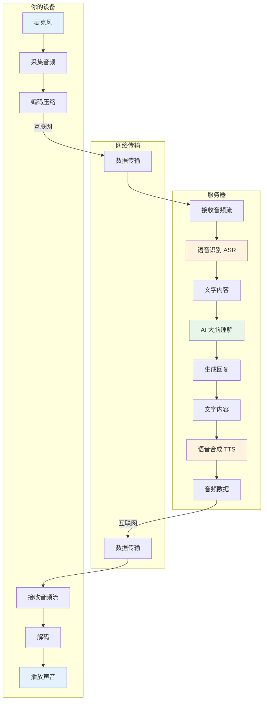
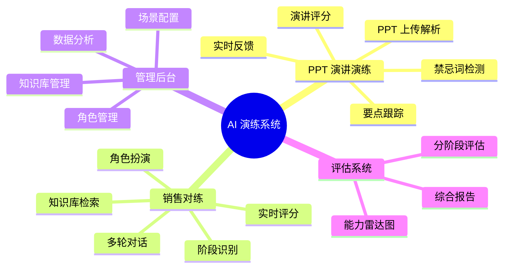

# AI 智能演练系统 - 整体业务架构说明

> 编写：Claude Code | 日期：2026-02-18 | 目标读者：产品经理（无需技术背景）

---

## 一、系统定位与核心价值

### 1.1 系统是什么？

想象一下，你的公司需要培训销售人员或让员工练习演讲，传统方式是：
- 找真人扮演客户或评委 → 费时费力
- 观看教学视频 → 被动学习，缺乏互动
- 实际面对客户练习 → 犯错成本高

**这套系统的核心价值**是：**用 AI 模拟真实场景，让员工可以随时随地进行「无风险练习」**。

### 1.2 系统提供两种核心演练场景

---

## 二、系统整体架构图

### 2.1 用户视角的业务架构

下面这张图展示了用户使用系统时，背后有哪些「服务」在支持：

### 2.2 核心模块分工

系统后端由多个「模块」组成，每个模块负责不同的事情：

---

## 三、核心业务流程总览

### 3.1 演练会话的完整生命周期

当你（用户）开始一次演练时，系统会经历以下阶段：

### 3.2 典型用户操作流程

下面是一个完整的「销售对练」场景，用户做了什么、系统做了什么：

---

## 四、两种演练场景对比

| 对比维度 | PPT 演讲演练 | 销售对练 |
|---------|-------------|---------|
| **核心目标** | 练习演讲技能 | 练习销售话术 |
| **AI 角色** | 教练（指导者） | 客户（对话者） |
| **输入内容** | PPT 文件 | 销售场景配置 |
| **AI 反馈** | 实时点评 | 对话式互动 |
| **评估维度** | 要点覆盖、禁忌词 | 话术技巧、应变能力 |
| **典型用户** | 需要演讲培训的员工 | 需要销售培训的员工 |

---

## 五、数据流转示意图

### 5.1 一次完整的语音对话，数据是怎么流动的？

---

## 六、关键概念解释

### 6.1 什么是 Agent（智能体）？

**简单理解**：Agent = 「演练场景的配置包」

| 概念 | 生活中类似的例子 | 在系统中的作用 |
|------|----------------|---------------|
| **Agent** | 一份「培训教材」 | 定义演练的目标、规则、评分标准 |
| **Persona** | 扮演的「角色」 | AI 扮演什么类型的客户/评委 |
| **知识库** | 「产品手册」 | AI 回答问题时参考的资料 |

### 6.2 什么是 WebSocket？

**简单理解**：WebSocket = 「保持连接的打电话」

- 传统网页请求像「发短信」：你发一条请求，服务器回复一条，然后就断了
- WebSocket 像「打电话」：一旦连接建立，双方可以随时说话、随时回应

这对语音对话场景至关重要，因为：
1. 用户可以随时打断 AI 说话
2. AI 可以边说边推送给你，不用等全部说完

### 6.3 什么是 ASR 和 TTS？

| 缩写 | 全称 | 功能 | 生活中类似的例子 |
|------|------|------|----------------|
| **ASR** | Automatic Speech Recognition 自动语音识别 | 把你说的话转成文字 | 录音转文字 APP |
| **TTS** | Text-to-Speech 语音合成 | 把文字转成声音 | 导航软件的语音播报 |

---

## 七、系统能力地图

下面这张图展示了系统能够做什么：

---

## 八、总结

这套系统的本质是：**用 AI 技术模拟真实场景，让员工可以低成本、高效率地进行技能训练**。

核心逻辑很简洁：
1. **配置** → 管理员配置演练场景（Agent）和角色（Persona）
2. **执行** → 用户选择场景开始演练，AI 实时互动
3. **评估** → 演练结束后生成评估报告

希望这份文档能帮助你理解系统的整体架构。如果还想深入了解某个具体场景的细节，请阅读后续文档。
