# 销售对练场景 - 业务逻辑详解

> 编写：Claude Code | 日期：2026-02-18 | 目标读者：产品经理（无需技术背景）

---

## 一、场景概述

### 1.1 销售对练是什么？

想象一下，你要训练一批销售新人。传统方式是：
1. 让老销售扮演客户 → 费时间，老销售也很累
2. 让新人直接打电话给真实客户 → 成交机会成本高，客户体验差

**销售对练场景的价值**：让 AI 扮演各种类型的客户，新人可以反复练习销售话术，犯错成本为零。

### 1.2 销售对练的核心流程

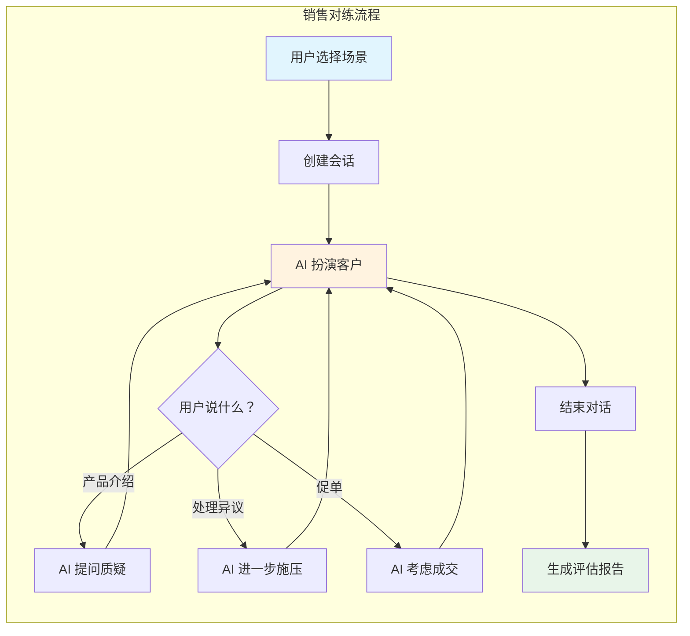

---

## 二、核心概念解析

### 2.1 为什么需要「Agent + Persona」？

在销售对练中，有两个关键配置：

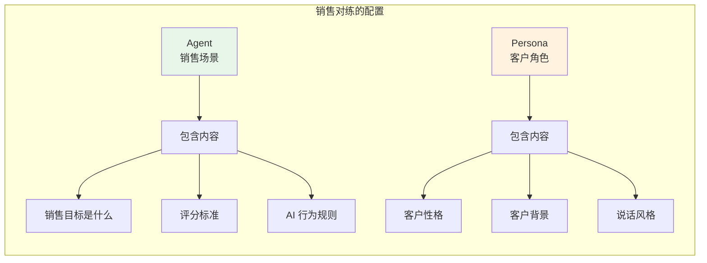

| 概念 | 通俗解释 | 例子 |
|------|---------|------|
| **Agent** | 这是一个什么类型的练习？ | 「B2B 软件销售」 |
| **Persona** | AI 扮演什么样的客户？ | 「预算有限的 CTO」 |

### 2.2 Agent 配置详解

Agent 就像一份「演练剧本」，定义了：

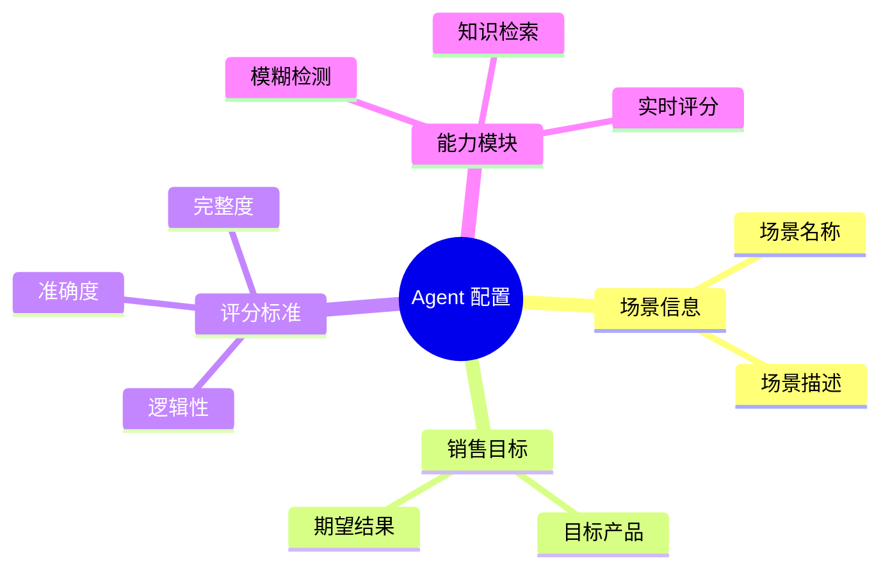

### 2.3 Persona 配置详解

Persona 就像给 AI 一份「角色设定」：

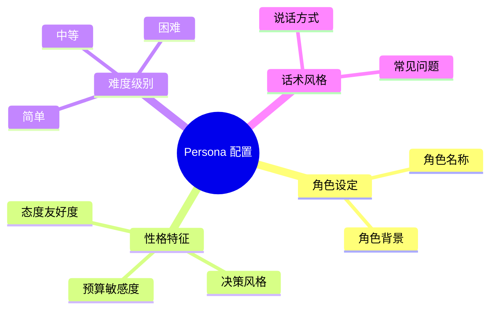

---

## 三、销售对练完整流程

### 3.1 步骤一：选择场景

用户打开系统后，看到的场景：

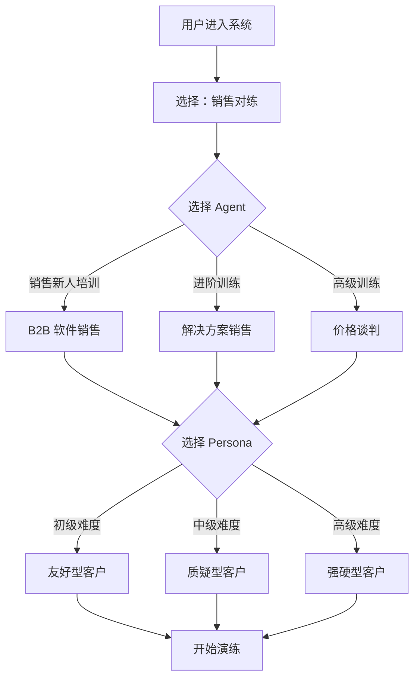

### 3.2 步骤二：创建会话

当用户点击「开始演练」时，系统在后台做的事情：

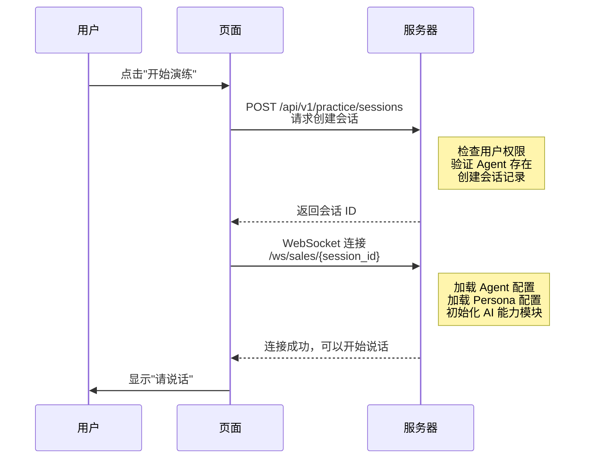

### 3.3 步骤三：实时对话交互

这是最核心的部分。当用户说话时，系统会经历多个处理阶段：

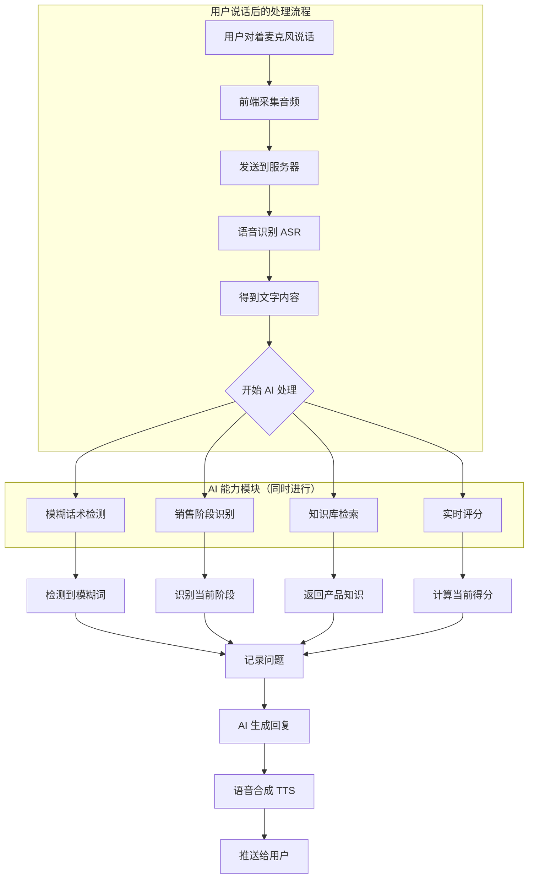

### 3.4 对话过程中的 AI 能力

在用户和 AI 对话的过程中，AI 的大脑（能力模块）同时在做这些事情：

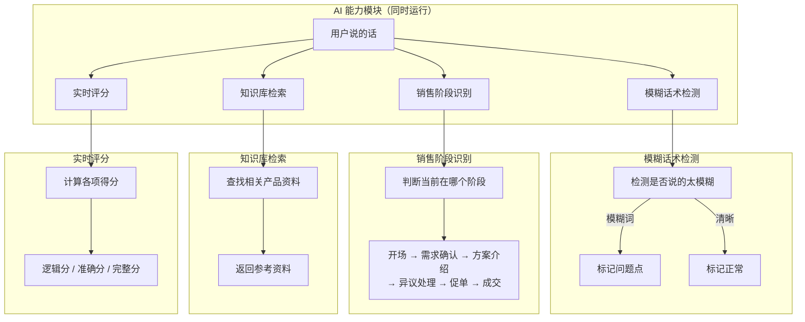

---

## 四、销售阶段模型

### 4.1 标准销售流程

AI 会识别用户当前处于哪个销售阶段：

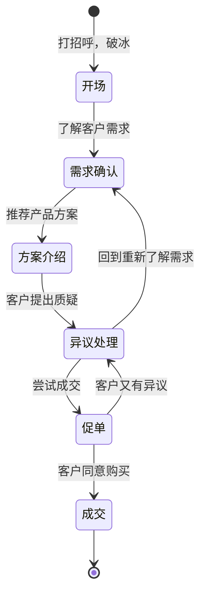

### 4.2 每个阶段的 AI 策略

| 阶段 | AI（扮演客户）的目标 | 典型反应 |
|------|-------------------|---------|
| **开场** | 判断是否值得继续 | 冷淡/礼貌/积极 |
| **需求确认** | 透露需求信息 | 给出模糊需求 |
| **方案介绍** | 质疑方案 | 问价格、效果、竞品对比 |
| **异议处理** | 制造更多障碍 | 「太贵了」「不需要」「和 XX 有什么区别」 |
| **促单** | 做出最终决定 | 「我再想想」「和老板商量」 |
| **成交** | 结束对话 | 同意/拒绝 |

---

## 五、知识库 grounding 机制

### 5.1 什么是知识库？

**知识库 = AI 的「产品手册」**

当用户向客户介绍产品时，AI 需要知道产品的真实信息，这就需要查询知识库：

```mermaid
sequenceDiagram
    participant 用户 as 销售人员
    participant AI as AI 客户
    participant 知识库 as 产品知识库

    用户: 我们这个产品可以帮助企业
    用户: 提升 30% 的销售效率...

    AI->>知识库: 查询"销售效率提升"
    知识库-->>AI: 返回相关产品资料

    AI: 听起来不错，
    AI: 但你们和竞品相比有什么优势？
```

### 5.2 知识库检索流程

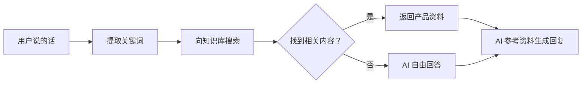

### 5.3 知识库锁机制（KB Lock）

系统有一个特殊机制：**强制 AI 基于知识库回答**

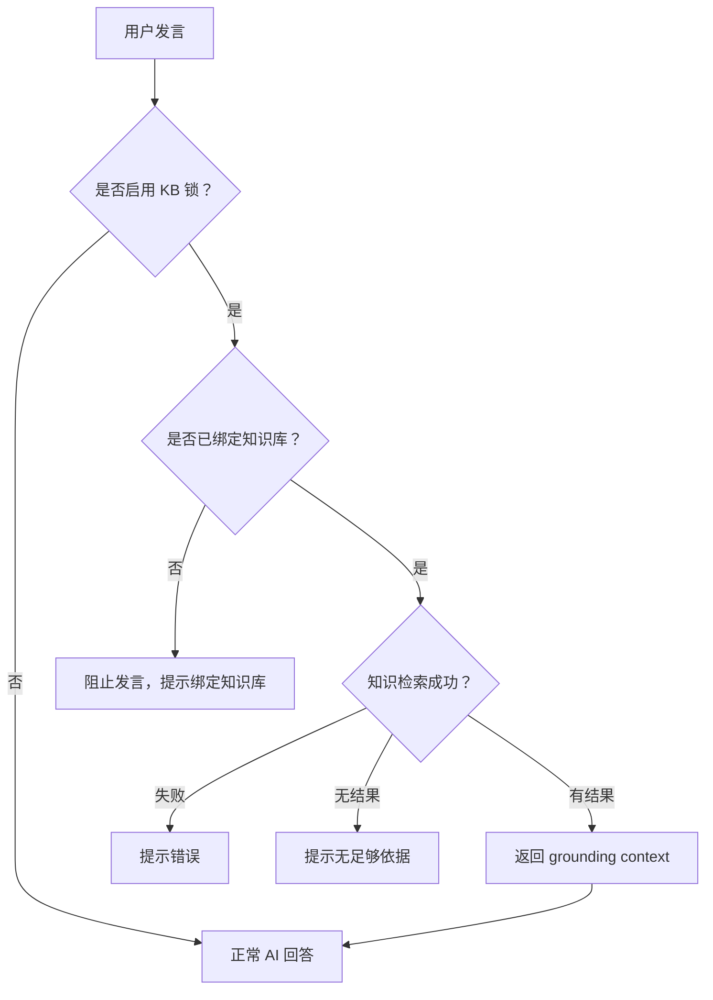

---

## 六、会话管理与状态

### 6.1 会话状态流转

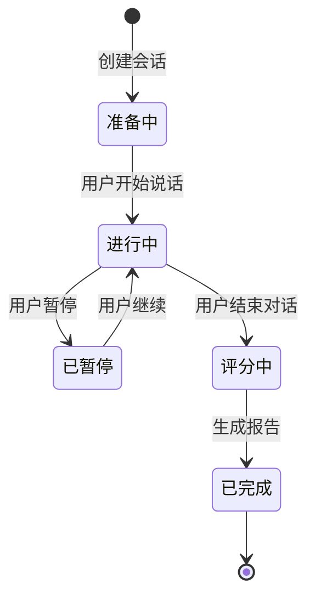

### 6.2 断线重连机制

如果用户网络断开怎么办？

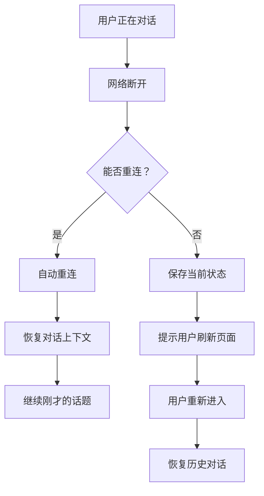

---

## 七、评估与反馈

### 7.1 实时评分

在对话过程中，系统会实时计算用户的得分：

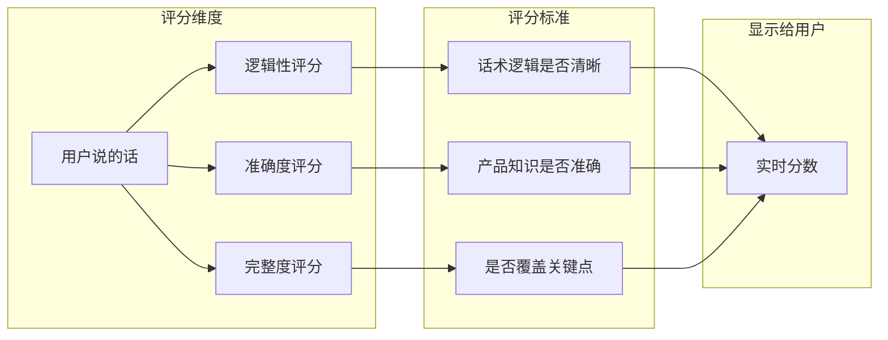

### 7.2 评估报告内容

会话结束后，用户会收到一份详细的评估报告：

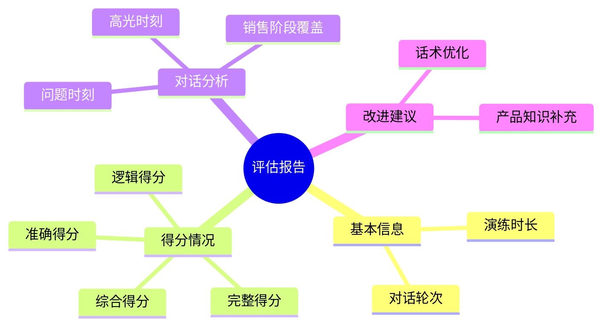

---

## 八、典型场景示例

### 场景一：新人销售练习

```
用户选择：
- Agent：B2B 软件销售入门
- Persona：友好型客户（简单难度）

对话示例：
AI：你好，有什么可以帮到你？
用户：您好，我是 XX 公司的，想给您介绍一款...
AI：哦，你们主要做什么产品的？
用户：我们做企业协作软件的...
AI：具体能解决什么问题呢？
...
```

### 场景二：高级谈判练习

```
用户选择：
- Agent：价格谈判
- Persona：强硬型客户（高级难度）

对话示例：
AI：说吧，找我什么事？
用户：您好，我看了您的需求，我们的产品...
AI：行了，直接说多少钱吧。
用户：标准版是 10 万一年...
AI：太贵了，我们预算只有 5 万。
用户：但是我们功能很全...
AI：得了吧，XX 公司比你们便宜一半。
...
```

---

## 九、技术实现要点（可选了解）

### 9.1 WebSocket 连接管理

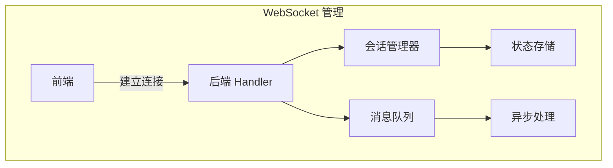

### 9.2 语音处理链路

```
麦克风 → 音频采集 → 编码压缩 → 网络传输 → 服务器解码 → ASR 识别 → AI 处理 → TTS 合成 → 网络传输 → 前端播放
```

---

## 十、总结

销售对练场景的核心逻辑：

1. **配置层**：管理员配置 Agent（场景）和 Persona（角色）
2. **会话层**：用户创建会话，AI 加载配置
3. **交互层**：实时语音对话，多个 AI 能力模块同时工作
4. **评估层**：实时评分 + 结束后生成详细报告

这套机制让销售培训变得：
- **低成本**：不用占用老销售的时间
- **可重复**：可以无限次练习
- **标准化**：每个学员面对相同的"客户"
- **可量化**：通过数据了解学员水平
