# PPT 演讲演练场景 - 业务逻辑详解

> 编写：Claude Code | 日期：2026-02-18 | 目标读者：产品经理（无需技术背景）

---

## 一、场景概述

### 1.1 PPT 演讲演练是什么？

想象一下，你要做一场重要的演讲（产品发布会、工作汇报、竞标演示），但在正式上台前，你希望能有人帮你：

1. **提醒你漏掉了重点内容** → 系统检测你是否有遗漏关键要点
2. **指出你说错了什么** → 系统检测你是否说了禁忌词
3. **实时给你反馈** → 讲得不好时 AI 教练即时提醒

**PPT 演讲演练场景的价值**：让 AI 充当你的「演讲教练」，在模拟演讲过程中实时指导你。

### 1.2 PPT 演练 vs 销售对练

| 对比维度 | PPT 演讲演练 | 销售对练 |
|---------|-------------|---------|
| **AI 角色** | 教练（指导者） | 客户（对话者） |
| **交互方式** | 单向演讲 + 即时点评 | 双向对话 |
| **核心检测** | 要点覆盖 + 禁忌词 | 话术技巧 |
| **反馈时机** | 演讲过程中实时 | 对话过程中实时 |

---

## 二、核心流程总览

### 2.1 完整业务流程

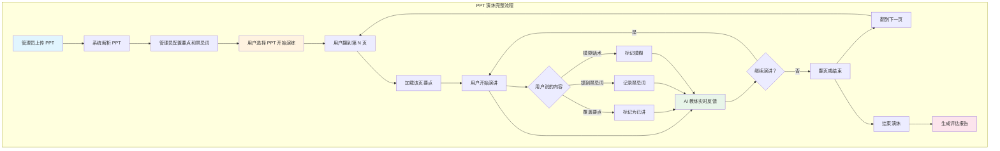

---

## 三、PPT 管理与配置

### 3.1 管理员的工作：准备 PPT

当管理员要创建一个演讲演练时，需要做以下事情：

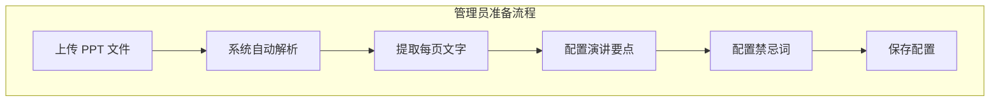

### 3.2 演讲要点配置

每个 PPT 页面可以配置「必讲要点」，即用户演讲时必须覆盖的内容：

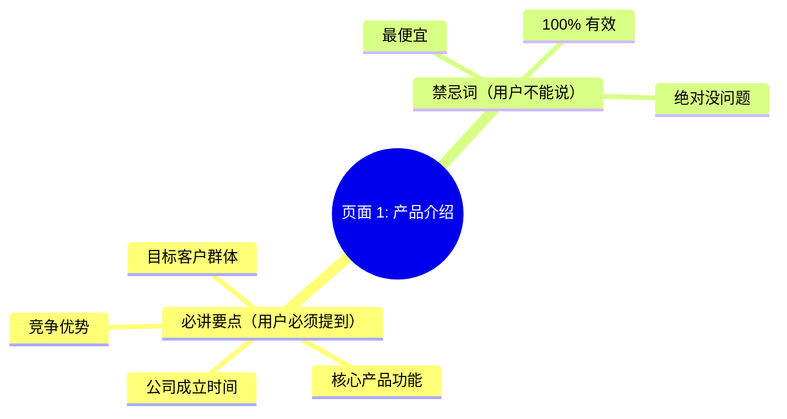

**举例说明**：

假设有一个产品介绍 PPT，第 3 页是「产品功能」：

| 配置类型 | 配置内容 |
|---------|---------|
| **必讲要点** | 1. 功能 A：自动化流程<br/>2. 功能 B：数据分析<br/>3. 功能 C：团队协作 |
| **禁忌词** | 1. 「最便宜」<br/>2. 「保证效果」<br/>3. 「独一无二」 |

用户在演讲时：
- ✅ 提到「自动化流程」→ 系统标记要点已覆盖
- ❌ 提到「最便宜」→ 系统标记禁忌词触犯

---

## 四、用户演讲流程

### 4.1 用户视角的操作流程

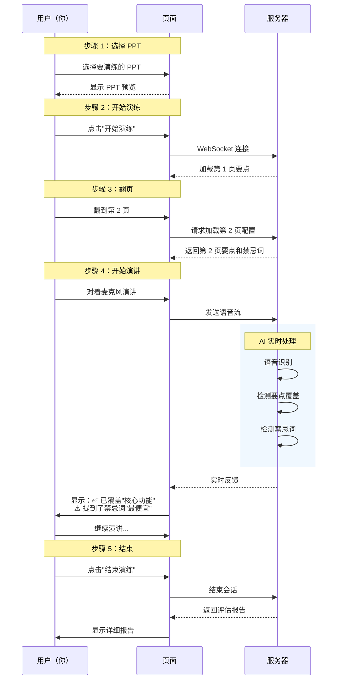

---

## 五、实时反馈机制

### 5.1 AI 教练做什么？

当用户演讲时，AI 教练同时在做以下几件事情：

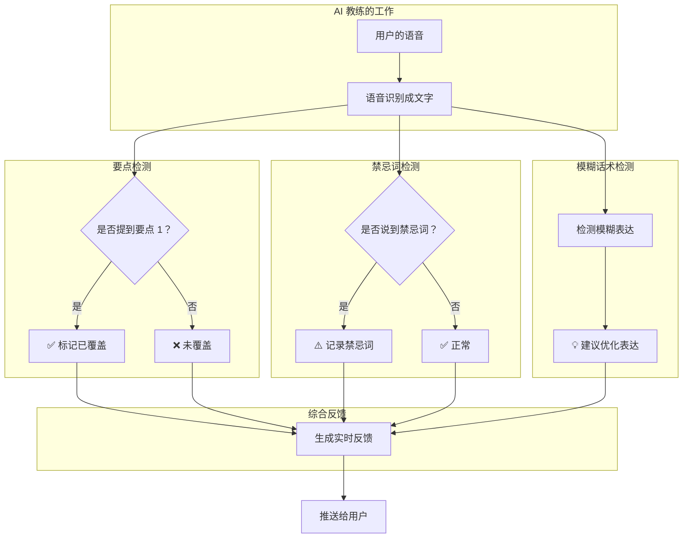

### 5.2 反馈内容示例

用户在演讲过程中，可能收到的实时反馈：

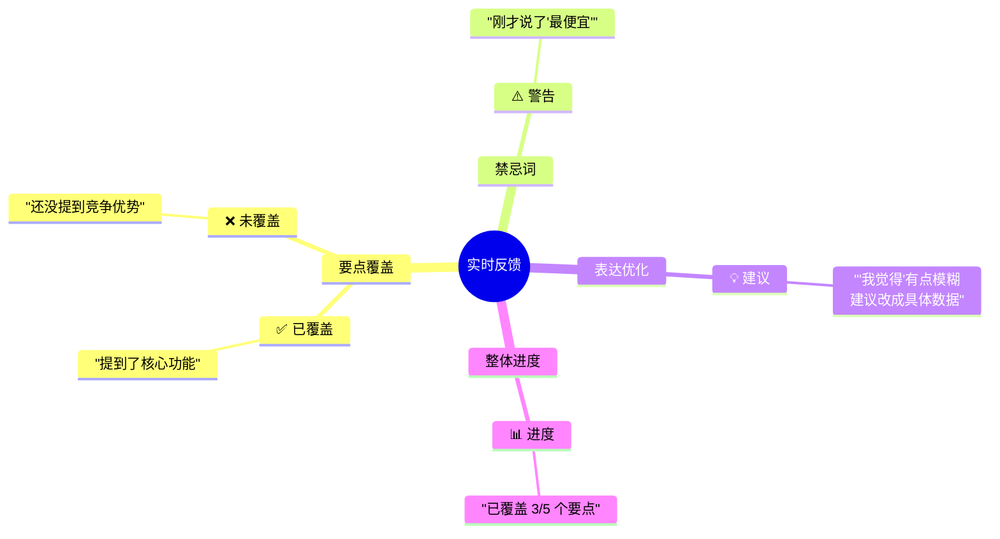

---

## 六、演讲过程详解

### 6.1 单页演讲流程

以某一页 PPT 为例，用户演讲时的完整流程：

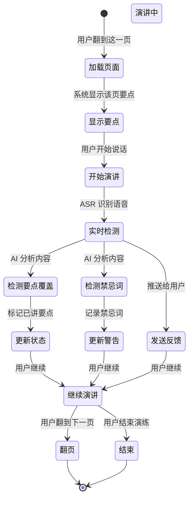

### 6.2 多页演讲流程

用户通常需要演讲多页 PPT：

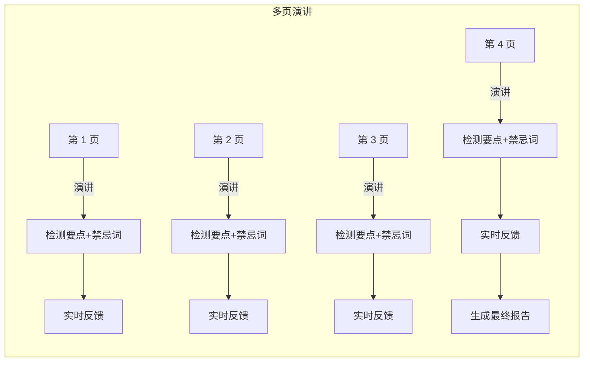

---

## 七、评估报告

### 7.1 报告包含的内容

当用户结束演练后，会生成一份详细的评估报告：

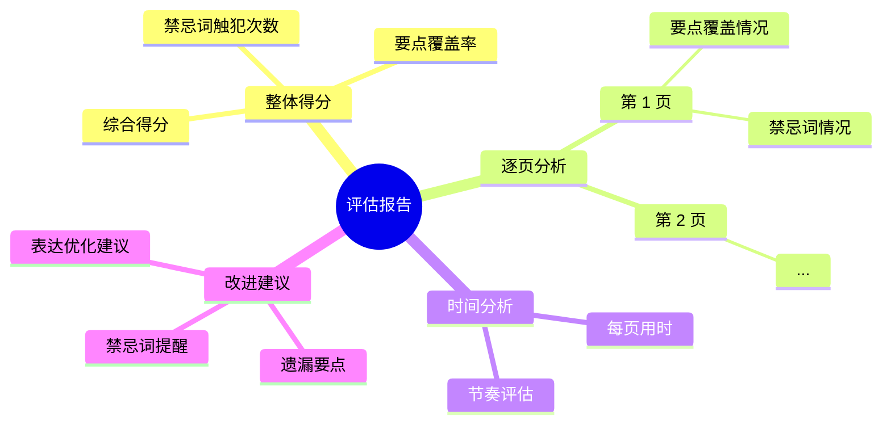

### 7.2 报告可视化示例

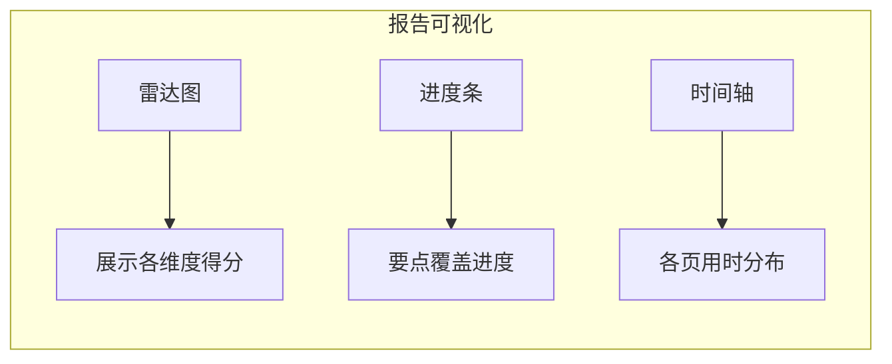

---

## 八、技术实现要点（可选了解）

### 8.1 PPT 解析流程

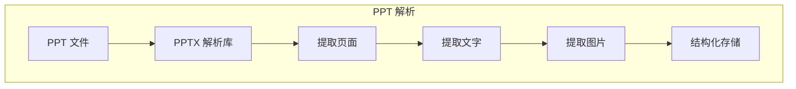

### 8.2 反馈展示方式

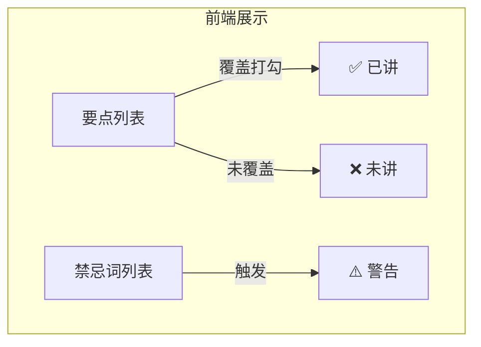

---

## 九、典型使用场景

### 场景一：产品发布会演练

```
管理员配置：
- PPT：产品发布会
- 第 1 页要点：产品名称、发布时间
- 第 2 页要点：核心功能 1/2/3
- 第 3 页要点：价格策略
- 禁忌词：最便宜、保证效果

用户演练：
- 翻到第 1 页，开始演讲
- 系统实时检测是否提到"产品名称"
- 提到"最便宜"时，系统警告
- 翻到第 2 页继续...
```

### 场景二：工作汇报演练

```
管理员配置：
- PPT：季度工作汇报
- 第 1 页要点：业绩完成情况
- 第 2 页要点：存在问题
- 第 3 页要点：下季度计划

用户演练：
- 系统检测要点覆盖
- 检测到模糊表达时给出建议
- 结束后生成评估报告
```

---

## 十、与销售对练的对比

### 10.1 核心差异

| 维度 | PPT 演讲演练 | 销售对练 |
|------|-------------|---------|
| **交互模式** | 单向演讲 + 即时点评 | 双向对话 |
| **AI 角色** | 教练 | 客户 |
| **检测重点** | 内容覆盖度 | 对话技巧 |
| **反馈内容** | 要点+禁忌词 | 话术+应变 |
| **评估方式** | 要点覆盖率 | 多维度评分 |

### 10.2 适用场景

| 场景 | 推荐使用 |
|------|---------|
| 练习演讲技能 | PPT 演练 |
| 练习销售话术 | 销售对练 |
| 练习产品介绍 | 两者都可 |
| 练习客户应对 | 销售对练 |

---

## 十一、总结

PPT 演讲演练场景的核心逻辑：

1. **准备阶段**：管理员上传 PPT 并配置要点和禁忌词
2. **演练阶段**：用户演讲每页 PPT，AI 实时检测
3. **反馈阶段**：实时显示要点覆盖和禁忌词触犯
4. **评估阶段**：生成完整的演讲评估报告

这套机制让演讲培训变得：
- **标准化**：每个人考核标准一致
- **客观**：避免人为评分的主观性
- **即时**：边练边改，效率更高
- **可量化**：用数据说话，了解实际水平
