# 管理后台 - 业务逻辑详解

> 编写：Claude Code | 日期：2026-02-18 | 目标读者：产品经理（无需技术背景）

---

## 一、管理后台概述

### 1.1 管理后台是什么？

管理后台是系统管理员（你）使用的「控制面板」，用来：
- **配置**演练场景和角色
- **管理**用户和权限
- **查看**演练数据和报告
- **维护**系统正常运行

简单说，就是「管理这个 AI 演练系统的地方」。

### 1.2 管理后台能做什么？

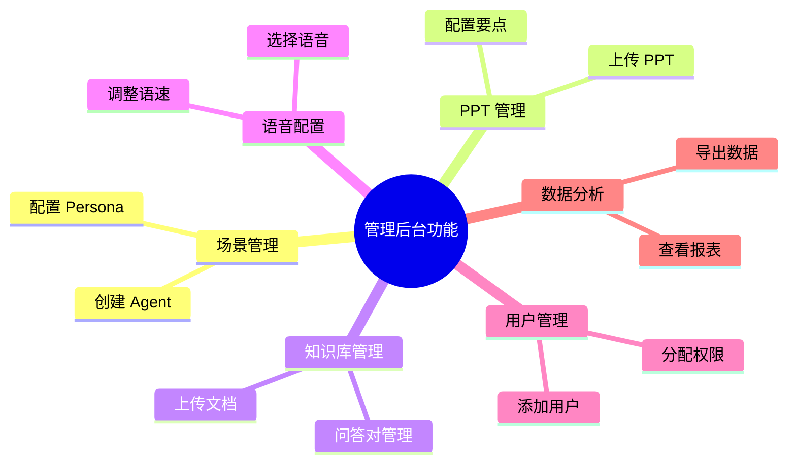

---

## 二、核心功能模块

### 2.1 功能模块一览

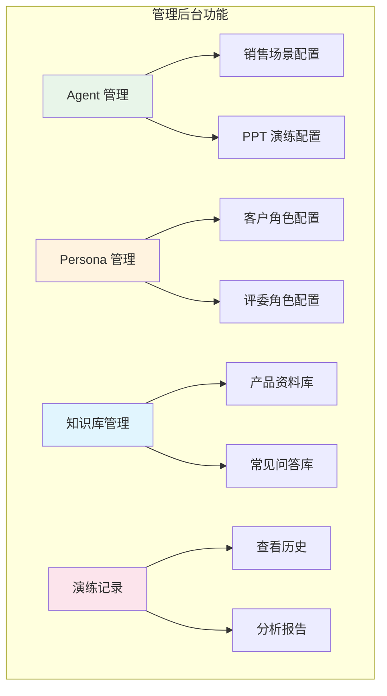

---

## 三、Agent 管理

### 3.1 Agent 是什么？

**Agent = 演练场景的配置包**

想象 Agent 是一份「培训课程大纲」，定义了：
- 这次演练的目标是什么
- 评估标准是什么
- AI 需要具备哪些能力

### 3.2 创建 Agent 的流程

```mermaid
flowchart TB
    subgraph "创建 Agent 流程"
        A[点击"新建 Agent"] --> B[填写基本信息]
        B --> C[选择场景类型]
        C --> D[配置能力模块]
        D --> E[设置评分标准]
        E --> F[保存并发布]
    end

    style A fill:#e1f5fe
    style F fill:#e8f5e9
```

### 3.3 Agent 配置项

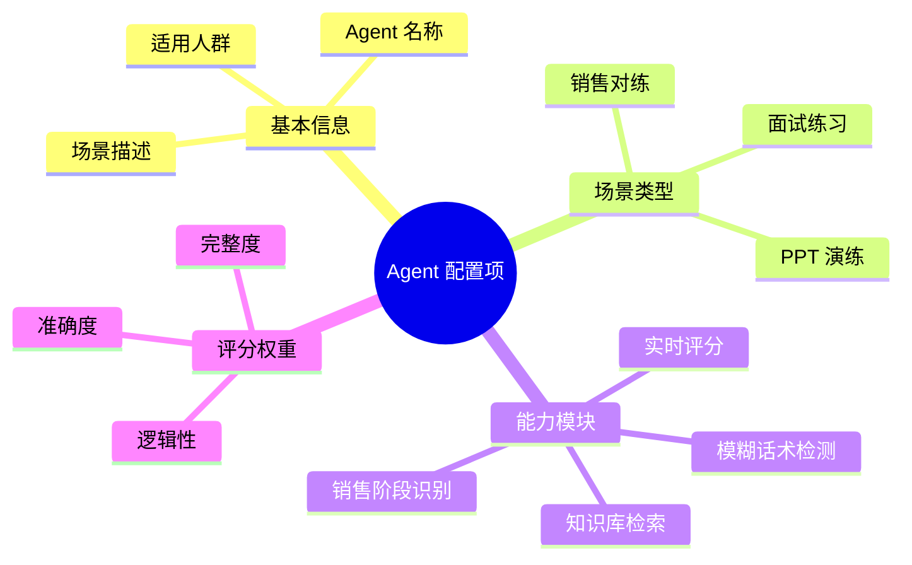

### 3.4 Agent 状态管理

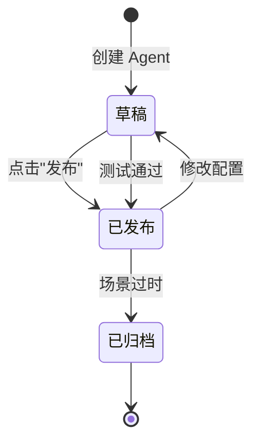

---

## 四、Persona 管理

### 4.1 Persona 是什么？

**Persona = AI 扮演的角色设定**

想象 Persona 是一份「角色剧本」，告诉 AI：
- 你是谁？（角色背景）
- 你什么性格？（态度、语气）
- 你会遇到什么问题？（常见挑战）

### 4.2 创建 Persona 的流程

```mermaid
flowchart TB
    subgraph "创建 Persona 流程"
        A[点击"新建角色"] --> B[填写角色信息]
        B --> C[设定性格特征]
        C --> D[编写角色话术]
        D --> E[设置难度等级]
        E --> F[保存]
    end

    style A fill:#fff3e0
    style F fill:#e8f5e9
```

### 4.3 Persona 配置详解

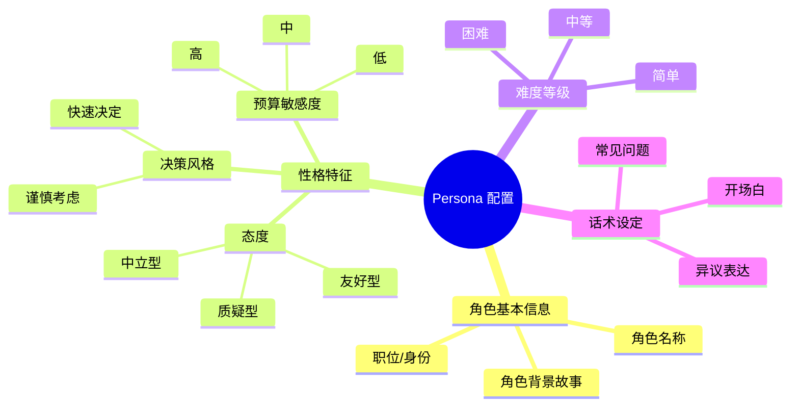

### 4.4 典型 Persona 示例

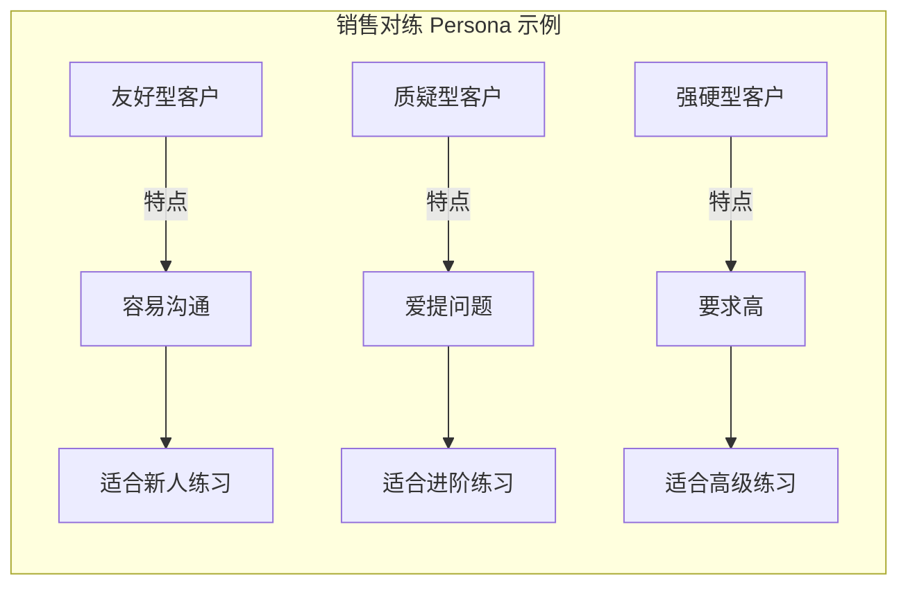

---

## 五、知识库管理

### 5.1 知识库是什么？

**知识库 = AI 的「产品手册」**

当 AI 和用户对话时，它需要知道产品的真实信息，这些信息就存在知识库里。

### 5.2 知识库的作用

```mermaid
sequenceDiagram
    participant 销售 as 销售人员
    participant AI as AI 客户
    participant 知识库 as 知识库

    销售: 我们的产品可以提升效率
    AI->>知识库: 查询"效率提升"
    知识库-->>AI: 返回产品资料

    AI: 具体能提升多少？
    销售: 30% 左右
    AI->>知识库: 验证"30%"
    知识库-->>AI: 文档说是 25-30%

    AI: 好的，那具体怎么实现？
```

### 5.3 知识库管理功能

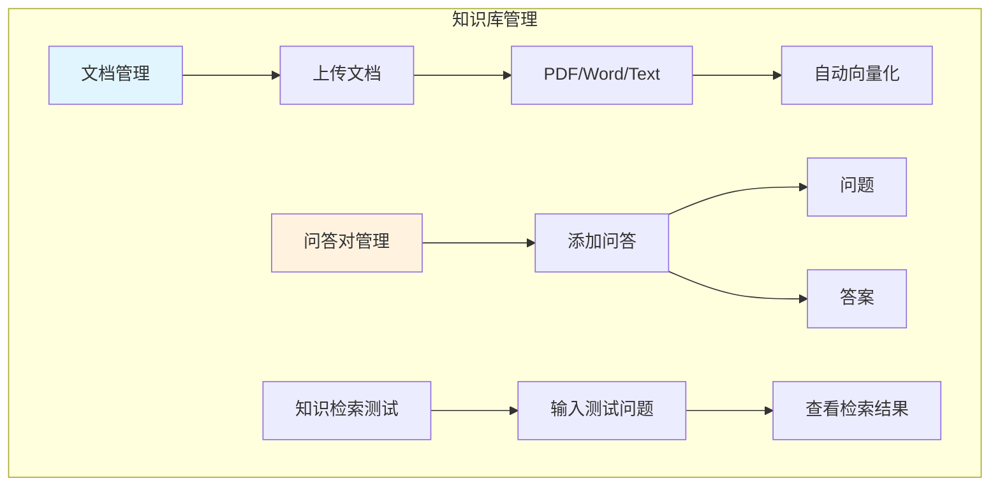

### 5.4 知识库配置流程

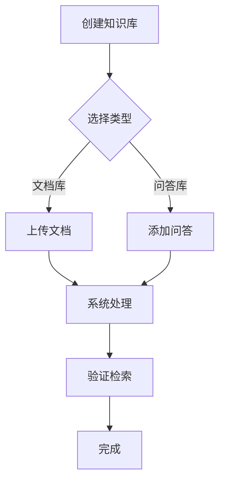

---

## 六、PPT 管理

### 6.1 PPT 管理功能

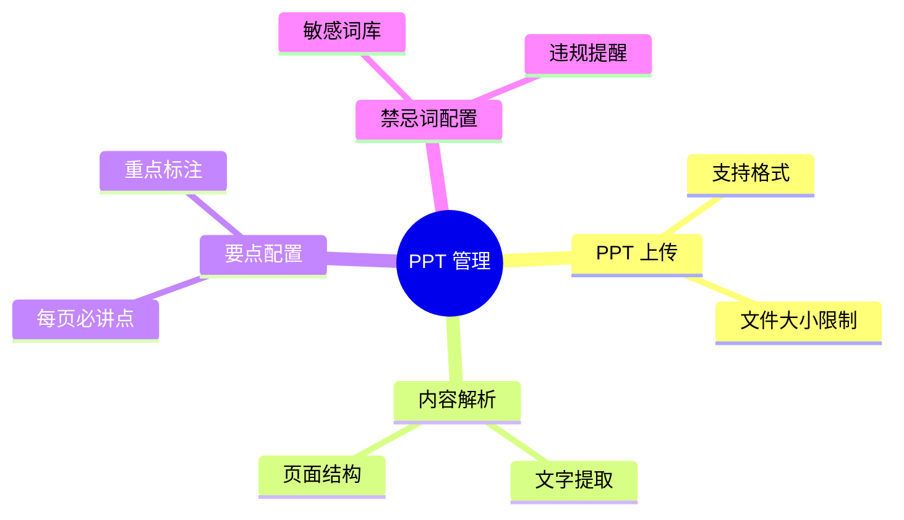

### 6.2 要点配置界面

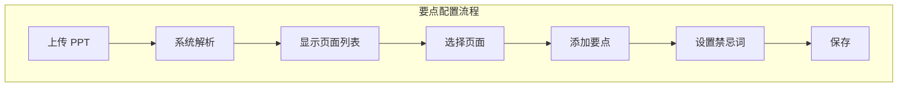

---

## 七、语音配置

### 7.1 语音配置的意义

用户和 AI 对话时，需要：
- **TTS**：AI 说话的声音（文字转语音）
- **ASR**：用户说话被识别（语音转文字）

### 7.2 可配置的语音参数

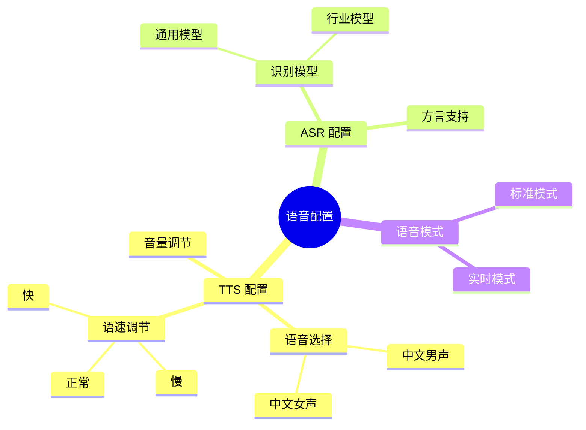

---

## 八、用户管理

### 8.1 用户管理功能

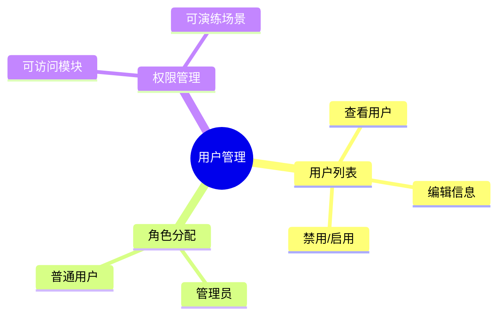

### 8.2 用户权限模型

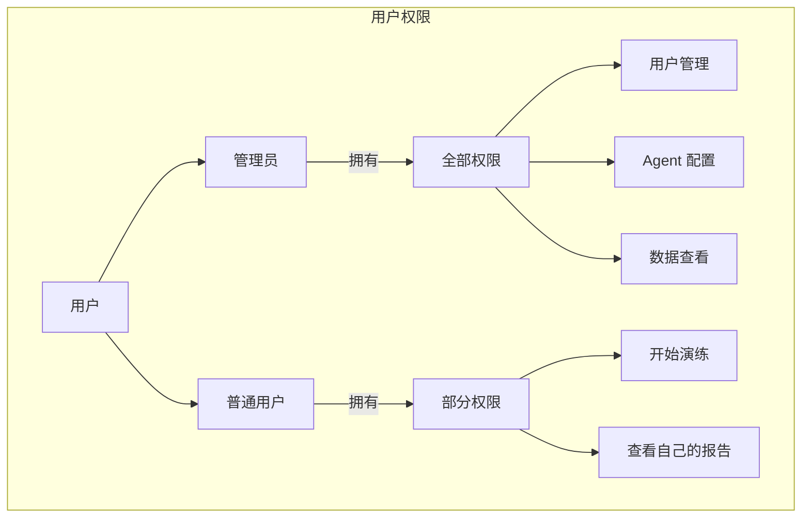

---

## 九、数据分析

### 9.1 数据分析功能

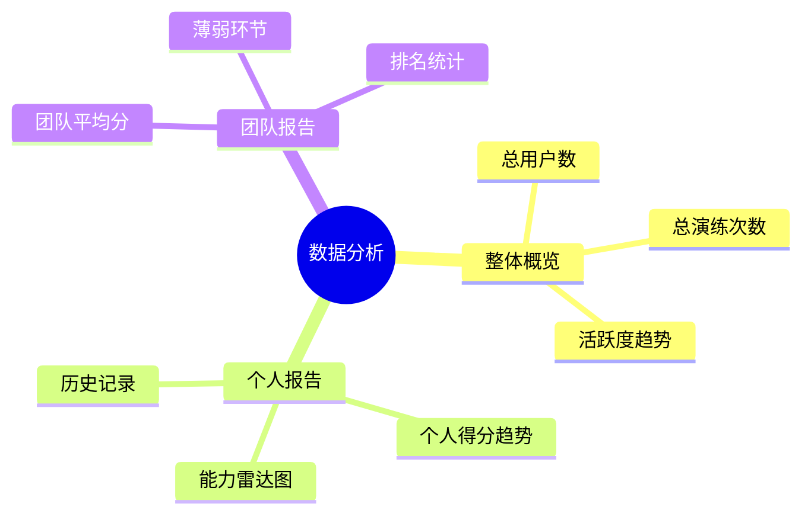

### 9.2 数据可视化

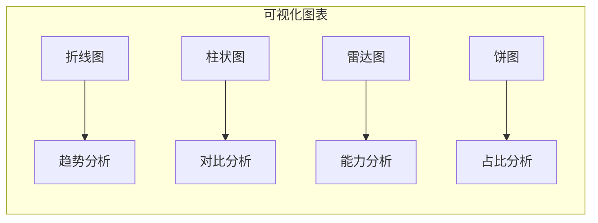

---

## 十、演练记录

### 10.1 演练记录功能

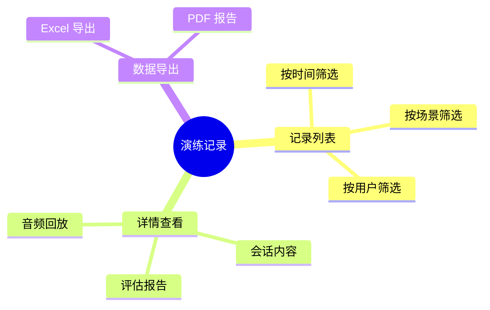

### 10.2 记录详情页面

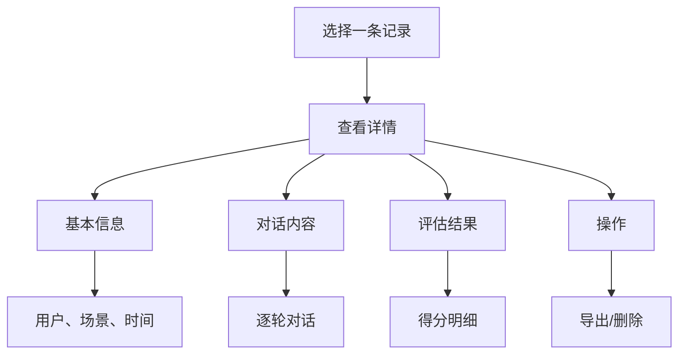

---

## 十一、工作流程总结

### 11.1 管理员日常操作

```mermaid
flowchart LR
    subgraph "日常操作"
        A[日常] --> B[查看数据]
        B --> C[处理异常]
        C --> D[优化配置]
        D --> E[周期性任务]
    end

    B -->|查看| F[仪表盘]
    C -->|用户反馈| G[调整 Agent]
    C -->|数据异常| H[排查问题]
    D -->|更新| I[优化话术]
    D -->|补充| J[完善知识库]
```

### 11.2 新场景创建流程

```mermaid
flowchart TB
    A[需要新场景] --> B{场景类型}
    B -->|销售| C[创建 Agent]
    B -->|演讲| D[上传 PPT]

    C --> E[配置 Persona]
    D --> F[配置要点]

    E --> G[关联知识库]
    F --> G

    G --> H[测试演练]
    H -->|有问题| I[调整配置]
    H -->|通过| J[发布上线]
```

---

## 十二、总结

管理后台的核心价值：

1. **配置能力**：定义各种演练场景和角色
2. **内容管理**：维护产品知识库和话术
3. **数据洞察**：了解用户演练情况和效果
4. **运营支持**：日常运维和异常处理

通过管理后台，你可以：
- 快速创建新的销售场景
- 调整 AI 扮演的客户性格
- 更新产品资料库
- 查看培训效果数据
