# 评估与反馈系统 - 业务逻辑详解

> 编写：Claude Code | 日期：2026-02-18 | 目标读者：产品经理（无需技术背景）

---

## 一、评估系统概述

### 1.1 评估系统的价值

想象一下，你在健身房练健身，练完之后：
- **没有评估**：你不知道自己练得好不好，下次怎么改进
- **有评估**：教练告诉你力量提升了 5%，动作还有哪些问题

**评估系统就是那个「教练」**，它会告诉你：
- 这次演练表现如何？
- 比上次有进步吗？
- 哪些地方需要改进？

### 1.2 评估系统的两种模式

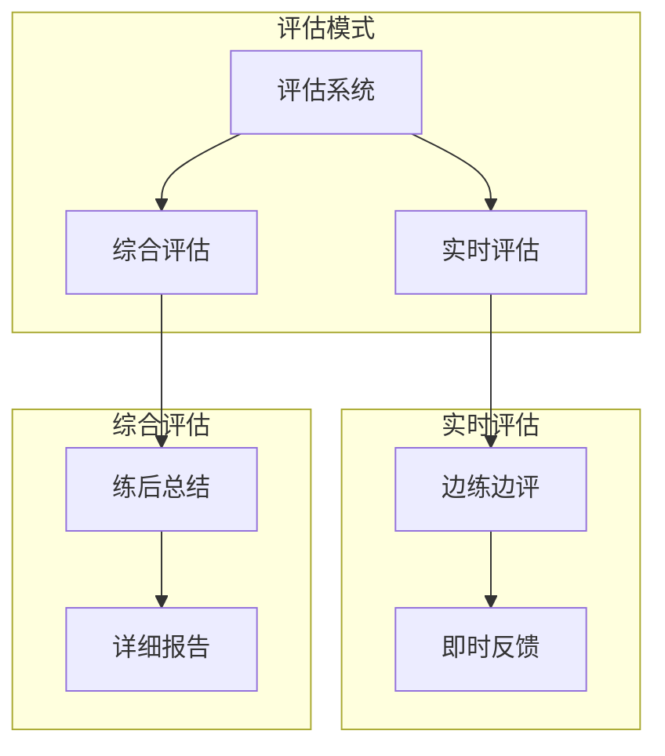
```mermaid
flowchart TB
    subgraph "评估模式"
        A[评估系统] --> B[实时评估]
        A --> C[综合评估]
    end

    subgraph "实时评估"
        B --> D[边练边评]
        D --> E[即时反馈]
    end

    subgraph "综合评估"
        C --> F[练后总结]
        F --> G[详细报告]
    end
```

| 评估模式 | 说明 | 例子 |
|---------|------|------|
| **实时评估** | 演练过程中即时反馈 | 刚说完话，马上告诉你说得怎么样 |
| **综合评估** | 演练结束后生成报告 | 全部练完后，给你一份详细报告 |

---

## 二、实时评估

### 2.1 什么是实时评估？

实时评估 = 在用户说话的同时，系统立即给出反馈

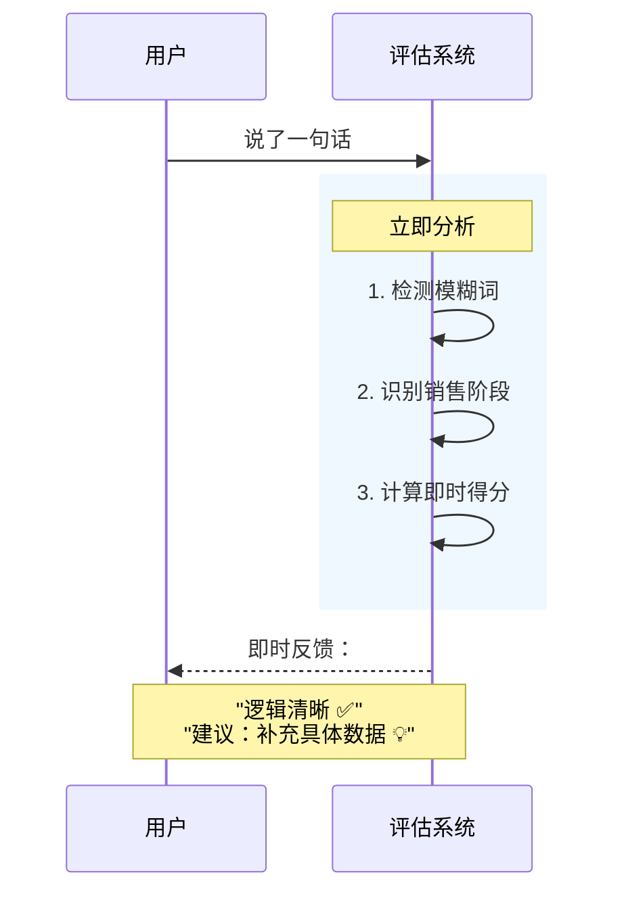
```mermaid
sequenceDiagram
    participant 用户 as 用户
    participant 系统 as 评估系统

    用户->>系统: 说了一句话

    rect rgb(240, 248, 255)
    Note over 系统: 立即分析
    系统->>系统: 1. 检测模糊词
    系统->>系统: 2. 识别销售阶段
    系统->>系统: 3. 计算即时得分
    end

    系统-->>用户: 即时反馈：
    Note over 系统,用户: "逻辑清晰 ✅"<br/>"建议：补充具体数据 💡"
```

### 2.2 实时评估的内容

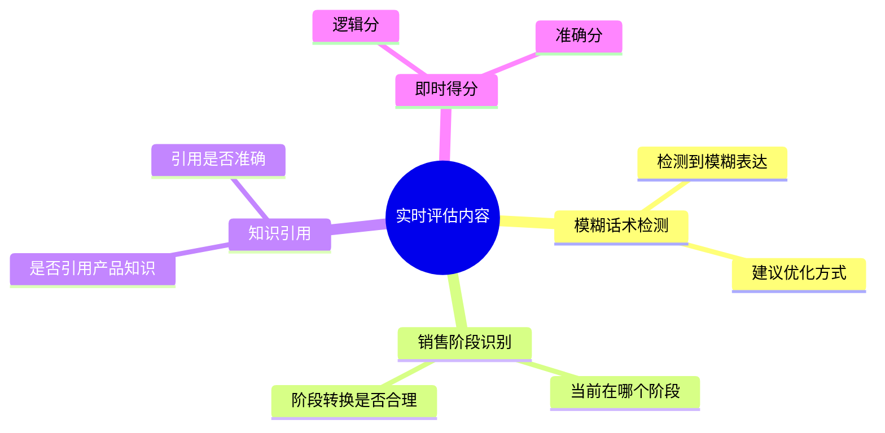
```mermaid
mindmap
  root((实时评估内容))
    模糊话术检测
      检测到模糊表达
      建议优化方式
    销售阶段识别
      当前在哪个阶段
      阶段转换是否合理
    知识引用
      是否引用产品知识
      引用是否准确
    即时得分
      逻辑分
      准确分
```

### 2.3 实时反馈示例

```
用户说：我们这个产品效果很好...

系统立即反馈：
┌─────────────────────────┐
│ ✅ 逻辑清晰             │
│ ⚠️ "效果很好"有点模糊   │
│ 💡 建议：改成具体数据    │
│    例如：提升效率 30%    │
└─────────────────────────┘
```

---

## 三、综合评估

### 3.1 什么是综合评估？

综合评估 = 演练结束后生成一份完整的评估报告

### 3.2 报告生成流程

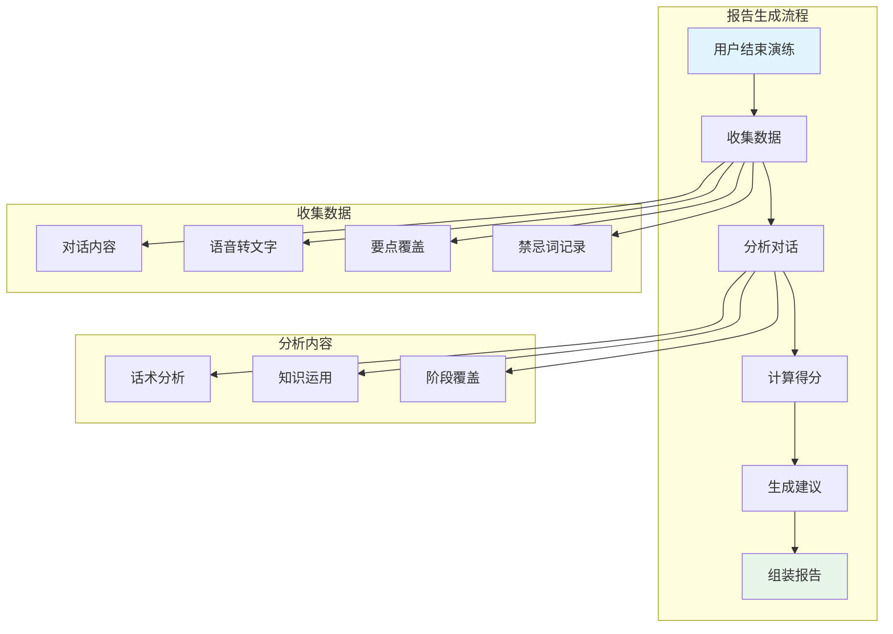
```mermaid
flowchart TB
    subgraph "报告生成流程"
        A[用户结束演练] --> B[收集数据]
        B --> C[分析对话]
        C --> D[计算得分]
        D --> E[生成建议]
        E --> F[组装报告]
    end

    subgraph "收集数据"
        B --> B1[对话内容]
        B --> B2[语音转文字]
        B --> B3[要点覆盖]
        B --> B4[禁忌词记录]
    end

    subgraph "分析内容"
        C --> C1[话术分析]
        C --> C2[知识运用]
        C --> C3[阶段覆盖]
    end

    style A fill:#e1f5fe
    style F fill:#e8f5e9
```

---

## 四、评估维度

### 4.1 销售对练评估维度

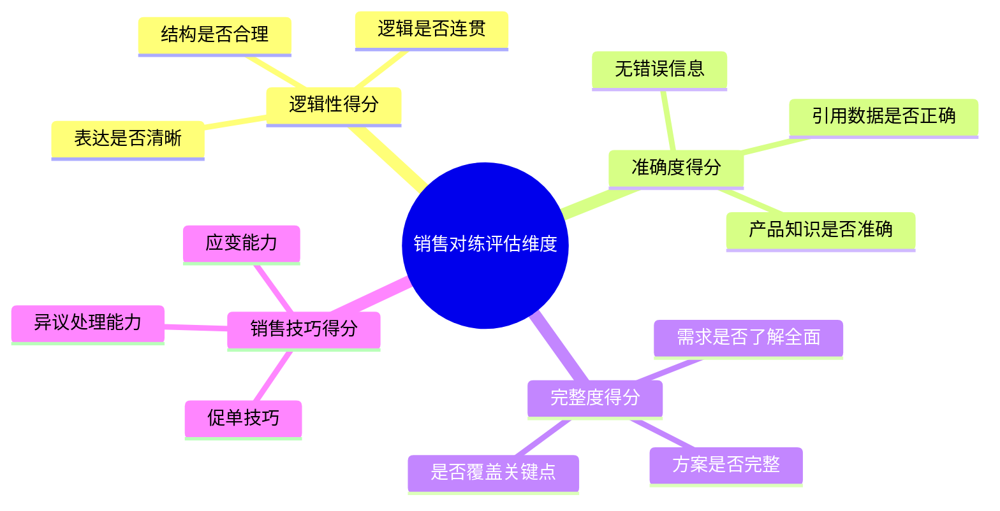
```mermaid
mindmap
  root((销售对练评估维度))
    逻辑性得分
      表达是否清晰
      逻辑是否连贯
      结构是否合理
    准确度得分
      产品知识是否准确
      引用数据是否正确
      无错误信息
    完整度得分
      是否覆盖关键点
      需求是否了解全面
      方案是否完整
    销售技巧得分
      异议处理能力
      促单技巧
      应变能力
```

### 4.2 PPT 演练评估维度

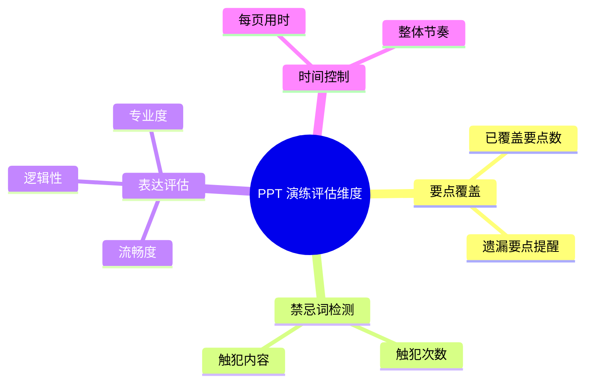
```mermaid
mindmap
  root((PPT 演练评估维度))
    要点覆盖
      已覆盖要点数
      遗漏要点提醒
    禁忌词检测
      触犯次数
      触犯内容
    表达评估
      流畅度
      逻辑性
      专业度
    时间控制
      每页用时
      整体节奏
```

### 4.3 评估计算公式

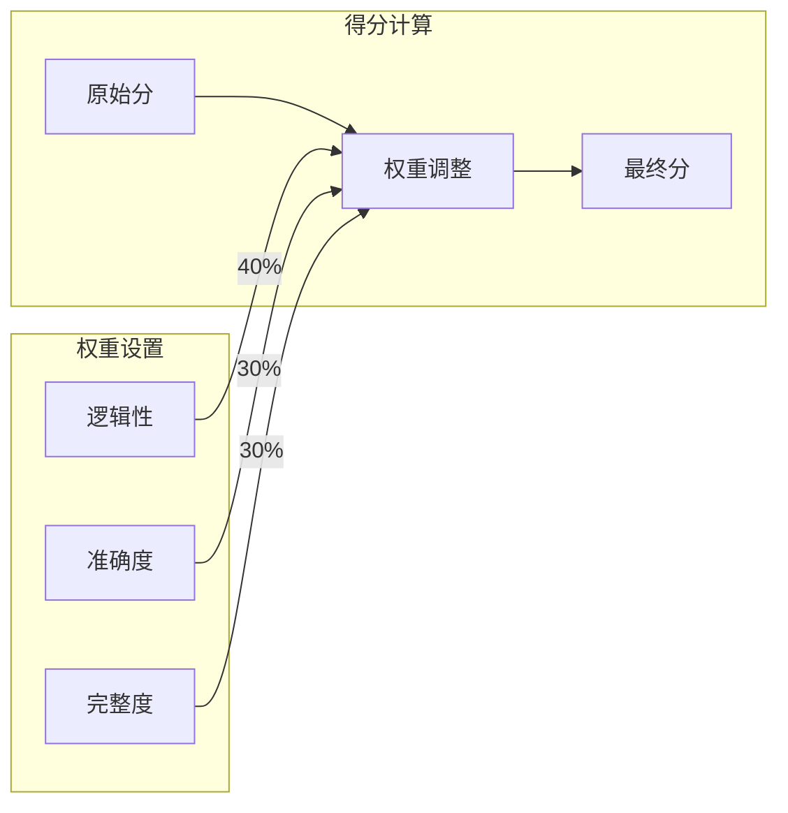
```mermaid
flowchart LR
    subgraph "得分计算"
        A[原始分] --> B[权重调整]
        B --> C[最终分]
    end

    subgraph "权重设置"
        D[逻辑性] -->|40%| B
        E[准确度] -->|30%| B
        F[完整度] -->|30%| B
    end
```

---

## 五、评分标准详解

### 5.1 逻辑性评分

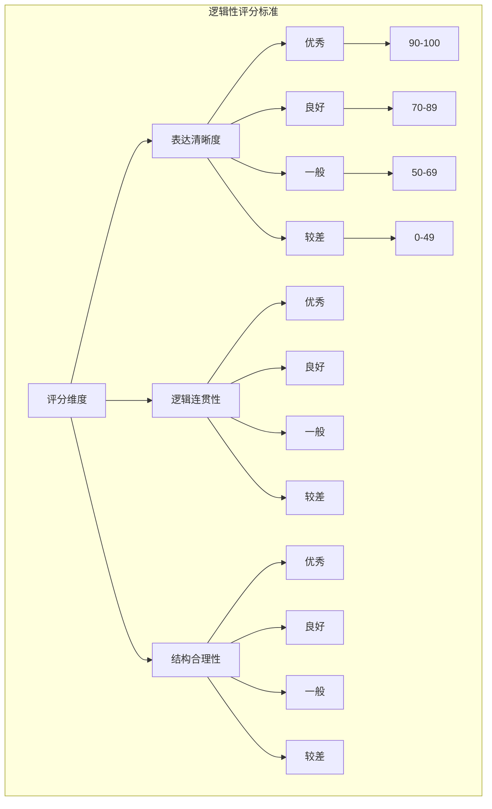
```mermaid
flowchart TB
    subgraph "逻辑性评分标准"
        A[评分维度] --> B[表达清晰度]
        A --> C[逻辑连贯性]
        A --> D[结构合理性]

        B --> B1[优秀] --> 90-100
        B --> B2[良好] --> 70-89
        B --> B3[一般] --> 50-69
        B --> B4[较差] --> 0-49

        C --> C1[优秀]
        C --> C2[良好]
        C --> C3[一般]
        C --> C4[较差]

        D --> D1[优秀]
        D --> D2[良好]
        D --> D3[一般]
        D --> D4[较差]
    end
```

### 5.2 准确度评分

| 表现 | 得分 | 说明 |
|------|------|------|
| 完全准确 | 90-100 | 产品知识全部正确，无错误 |
| 基本准确 | 70-89 | 有少量错误，但不影响 |
| 有误 | 50-69 | 有明显错误，可能误导客户 |
| 错误多 | 0-49 | 错误较多，需要改进 |

---

## 六、评估报告内容

### 6.1 报告结构

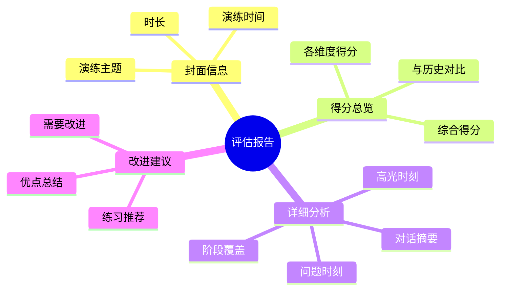
```mermaid
mindmap
  root((评估报告))
    封面信息
      演练主题
      演练时间
      时长
    得分总览
      综合得分
      各维度得分
      与历史对比
    详细分析
      对话摘要
      高光时刻
      问题时刻
      阶段覆盖
    改进建议
      优点总结
      需要改进
      练习推荐
```

### 6.2 得分展示

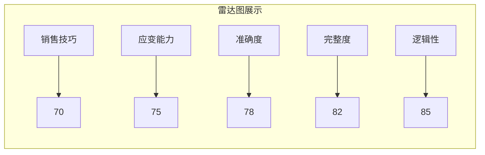
```mermaid
graph LR
    subgraph "雷达图展示"
        A[逻辑性] --> 85
        B[准确度] --> 78
        C[完整度] --> 82
        D[销售技巧] --> 70
        E[应变能力] --> 75
    end
```

### 6.3 对话高亮

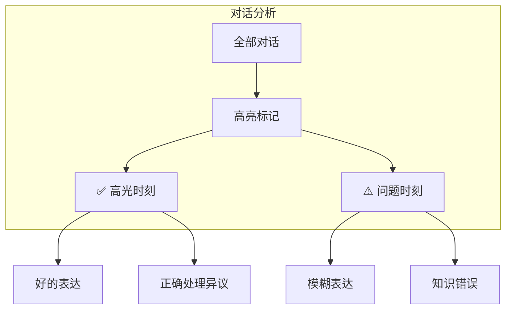
```mermaid
flowchart TB
    subgraph "对话分析"
        A[全部对话] --> B[高亮标记]
        B --> C[✅ 高光时刻]
        B --> D[⚠️ 问题时刻]
    end

    C --> C1[好的表达]
    C --> C2[正确处理异议]
    D --> D1[模糊表达]
    D --> D2[知识错误]
```

---

## 七、分阶段评估

### 7.1 什么是分阶段评估？

分阶段评估 = 在特定时机触发评估，而不是等演练结束后

### 7.2 评估触发条件

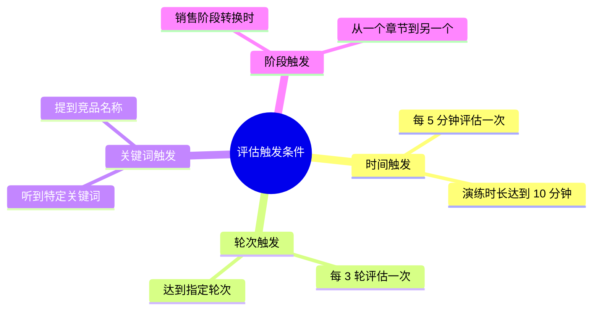
```mermaid
mindmap
  root((评估触发条件))
    时间触发
      每 5 分钟评估一次
      演练时长达到 10 分钟
    轮次触发
      每 3 轮评估一次
      达到指定轮次
    关键词触发
      听到特定关键词
      提到竞品名称
    阶段触发
      销售阶段转换时
      从一个章节到另一个
```

### 7.3 评估触发流程

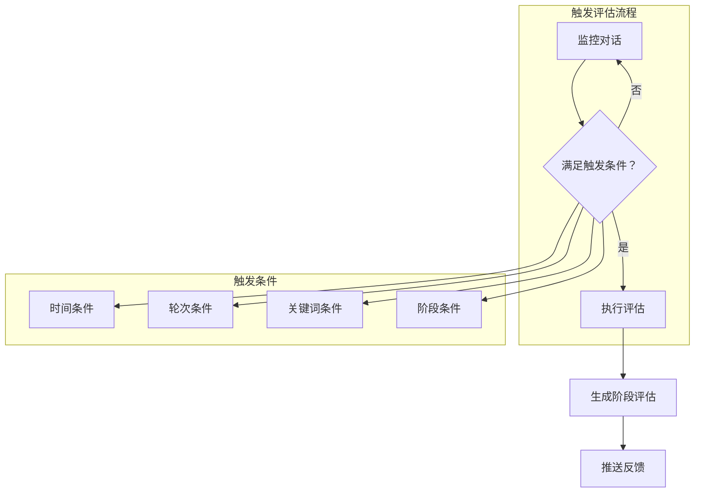
```mermaid
flowchart TB
    subgraph "触发评估流程"
        A[监控对话] --> B{满足触发条件？}
        B -->|否| A
        B -->|是| C[执行评估]
    end

    subgraph "触发条件"
        B --> T1[时间条件]
        B --> T2[轮次条件]
        B --> T3[关键词条件]
        B --> T4[阶段条件]
    end

    C --> D[生成阶段评估]
    D --> E[推送反馈]
```

---

## 八、反馈机制

### 8.1 反馈时机

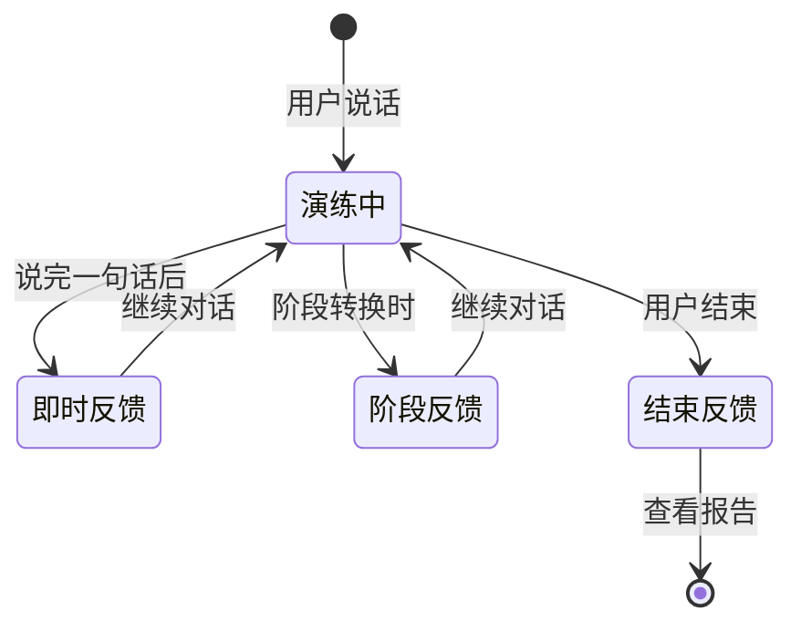
```mermaid
stateDiagram-v2
    [*] --> 演练中: 用户说话

    演练中 --> 即时反馈: 说完一句话后
    即时反馈 --> 演练中: 继续对话

    演练中 --> 阶段反馈: 阶段转换时
    阶段反馈 --> 演练中: 继续对话

    演练中 --> 结束反馈: 用户结束
    结束反馈 --> [*]: 查看报告
```

### 8.2 反馈内容类型

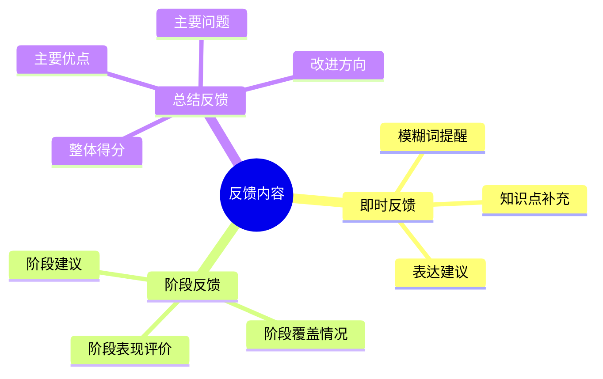
```mermaid
mindmap
  root((反馈内容))
    即时反馈
      模糊词提醒
      知识点补充
      表达建议
    阶段反馈
      阶段覆盖情况
      阶段表现评价
      阶段建议
    总结反馈
      整体得分
      主要优点
      主要问题
      改进方向
```

---

## 九、历史对比

### 9.1 历史数据对比

评估系统会记录用户的历史表现，可以对比进步情况：

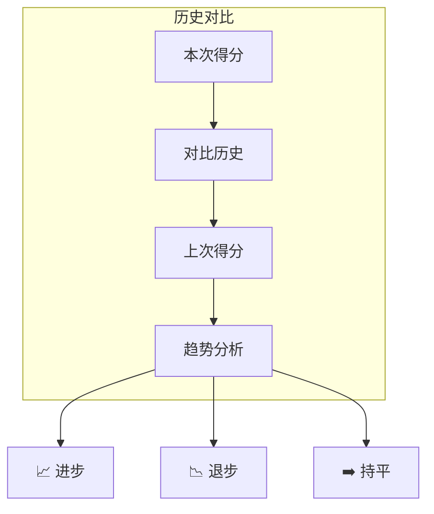
```mermaid
flowchart TB
    subgraph "历史对比"
        A[本次得分] --> B[对比历史]
        B --> C[上次得分]
        C --> D[趋势分析]
    end

    D --> E[📈 进步]
    D --> F[📉 退步]
    D --> G[➡️ 持平]
```

### 9.2 能力雷达图

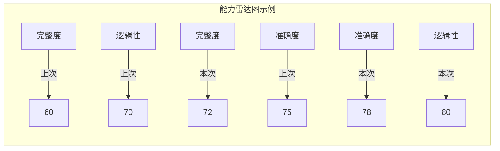
```mermaid
graph LR
    subgraph "能力雷达图示例"
        A1[逻辑性] -->|上次| 70
        A2[逻辑性] -->|本次| 80
        B1[准确度] -->|上次| 75
        B2[准确度] -->|本次| 78
        C1[完整度] -->|上次| 60
        C2[完整度] -->|本次| 72
    end
```

---

## 十、自定义评估规则

### 10.1 可配置的评估规则

管理员可以自定义评估规则：

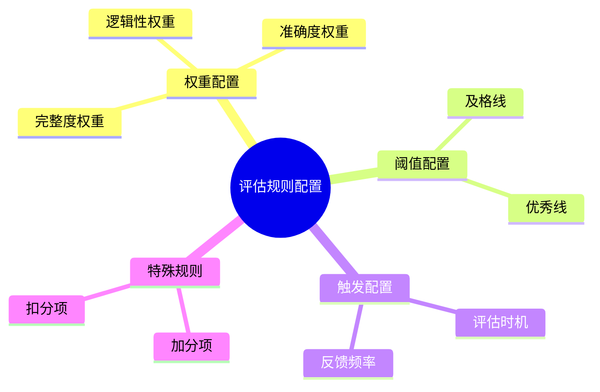
```mermaid
mindmap
  root((评估规则配置))
    权重配置
      逻辑性权重
      准确度权重
      完整度权重
    阈值配置
      及格线
      优秀线
    触发配置
      评估时机
      反馈频率
    特殊规则
      加分项
      扣分项
```

### 10.2 自定义评分项

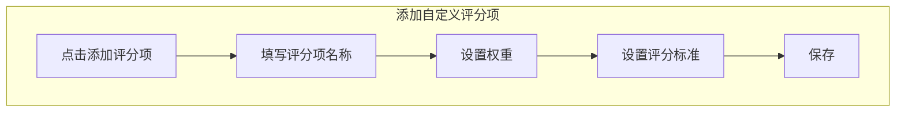
```mermaid
flowchart TB
    subgraph "添加自定义评分项"
        A[点击添加评分项] --> B[填写评分项名称]
        B --> C[设置权重]
        C --> D[设置评分标准]
        D --> E[保存]
    end
```

---

## 十一、技术实现要点（可选了解）

### 11.1 评分计算流程

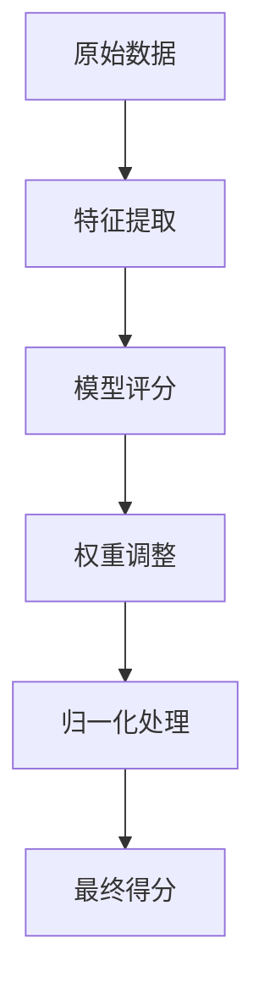
```mermaid
flowchart TB
    A[原始数据] --> B[特征提取]
    B --> C[模型评分]
    C --> D[权重调整]
    D --> E[归一化处理]
    E --> F[最终得分]
```

### 11.2 报告生成流程

```mermaid
sequenceDiagram
    participant 前端 as 请求
    participant 服务 as 评估服务
    participant AI as AI 分析
    participant 存储 as 数据库

    前端->>服务: 请求生成报告
    服务->>存储: 获取对话数据
    存储-->>服务: 返回数据
    服务->>AI: 发送待分析内容
    AI-->>服务: 返回分析结果
    服务->>服务: 计算得分
    服务->>服务: 生成报告内容
    服务-->>前端: 返回报告
```

---

## 十二、典型评估场景

### 场景一：销售新人首次评估

```
评估报告：
┌────────────────────────────────┐
│ 综合得分：72 分（及格）         │
├────────────────────────────────┤
│ 逻辑性：80 分 ✅                │
│ 准确度：75 分 ✅                │
│ 完整度：60 分 ⚠️               │
├────────────────────────────────┤
│ 优点：                         │
│ • 表达清晰，逻辑连贯           │
│ • 产品知识基本准确             │
│                                │
│ 需改进：                       │
│ • 遗漏了了解客户预算           │
│ • 促单时机把握不够好           │
└────────────────────────────────┘
```

### 场景二：多次练习趋势

```
历史表现：
┌────────────────────────────────┐
│ 第 1 次：65 分（不及格）       │
│ 第 2 次：72 分（及格）         │
│ 第 3 次：78 分（良好）         │
│ 第 4 次：85 分（优秀）📈       │
└────────────────────────────────┘
```

---

## 十三、总结

评估系统的核心价值：

1. **量化表现**：用分数直观展示演练效果
2. **即时反馈**：边练边改，效率更高
3. **历史追踪**：看到自己的进步曲线
4. **改进方向**：明确知道哪里需要提升

评估不是目的，而是帮助用户持续进步的工具。
