# 核心业务实体与数据关系

> 编写：Claude Code | 日期：2026-02-18 | 目标读者：产品经理（无需技术背景）

---

## 一、数据模型概述

### 1.1 什么是数据模型？

在系统中，有各种「数据」，比如：
- 用户信息
- 演练会话记录
- 评估分数
- PPT 文件

这些数据不是散乱存放的，而是按照一定的「结构」组织起来的。这个「结构」就是数据模型。

### 1.2 核心实体关系图

下面这张图展示了系统中主要的数据实体以及它们之间的关系：

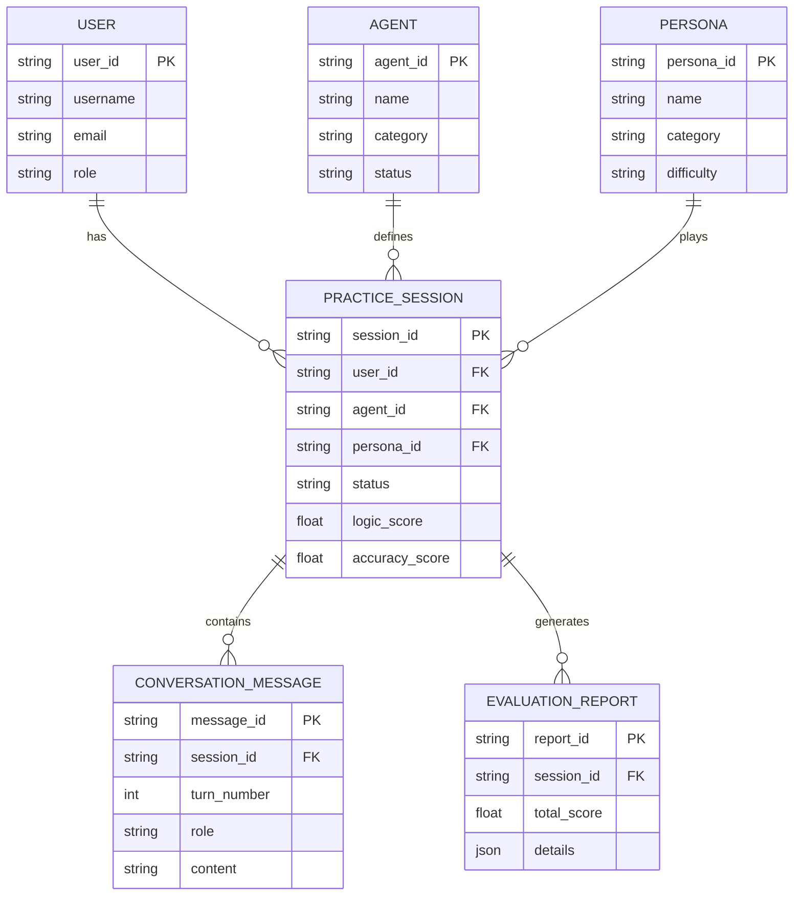

---

## 二、核心实体详解

### 2.1 用户（User）

用户是系统的基础，所有操作都围绕用户展开：

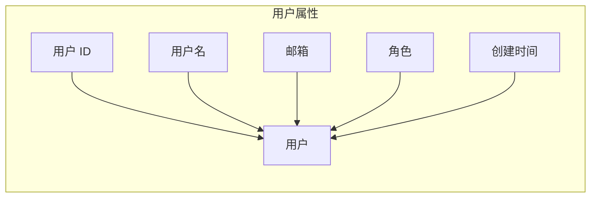

**用户角色**：
| 角色 | 权限 |
|------|------|
| 管理员 | 管理所有配置、查看所有数据 |
| 普通用户 | 使用演练功能、查看自己的报告 |

---

### 2.2 Agent（智能体）

Agent 定义了一个演练场景的配置：

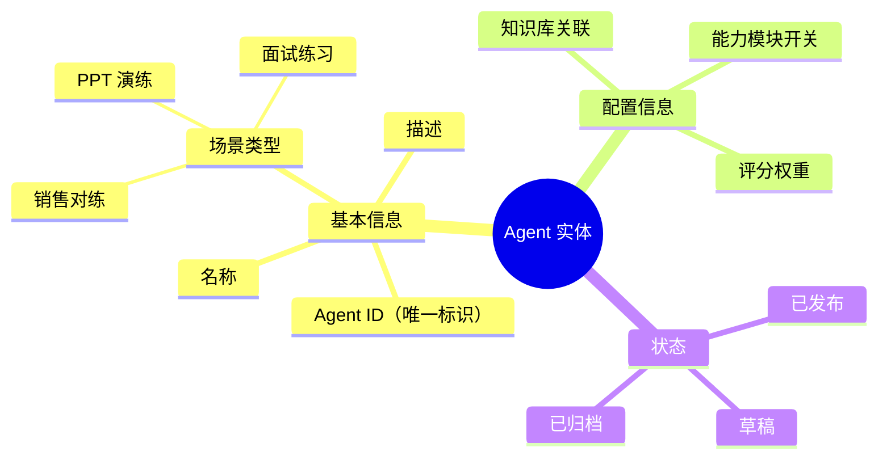

---

### 2.3 Persona（角色）

Persona 定义了 AI 扮演的角色：

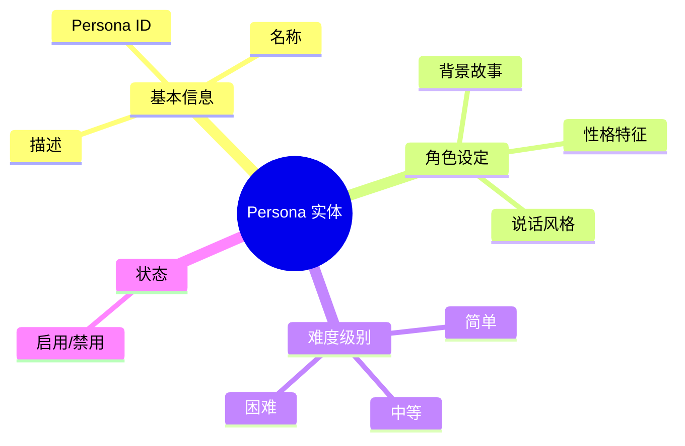

---

### 2.4 演练会话（Practice Session）

一次完整的演练就是一个会话：

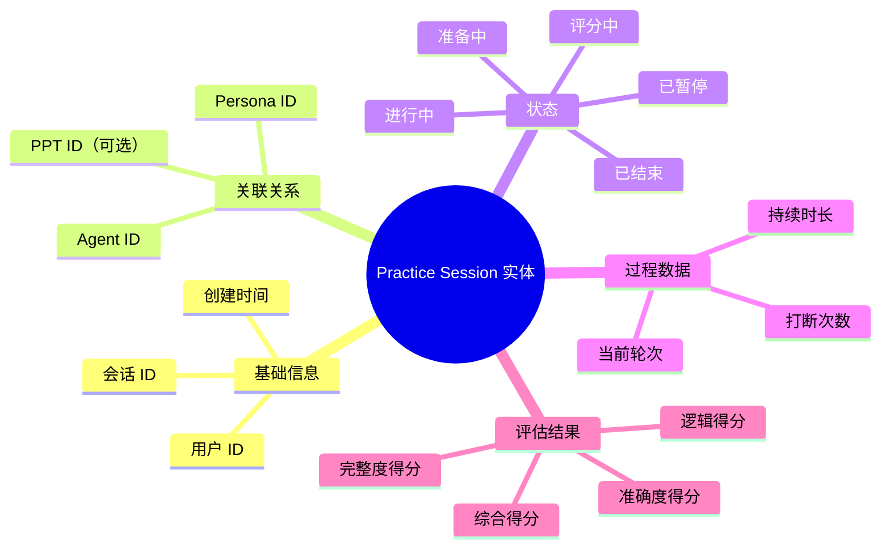

---

### 2.5 对话消息（Conversation Message）

会话中的每一条对话记录：

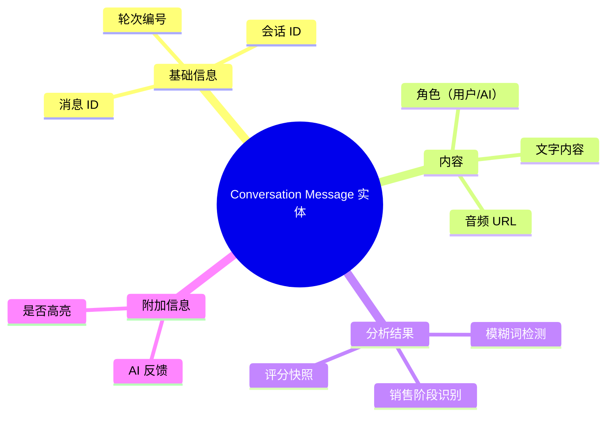

---

## 三、实体关系详解

### 3.1 用户与演练会话

一个用户可以创建多次演练会话：

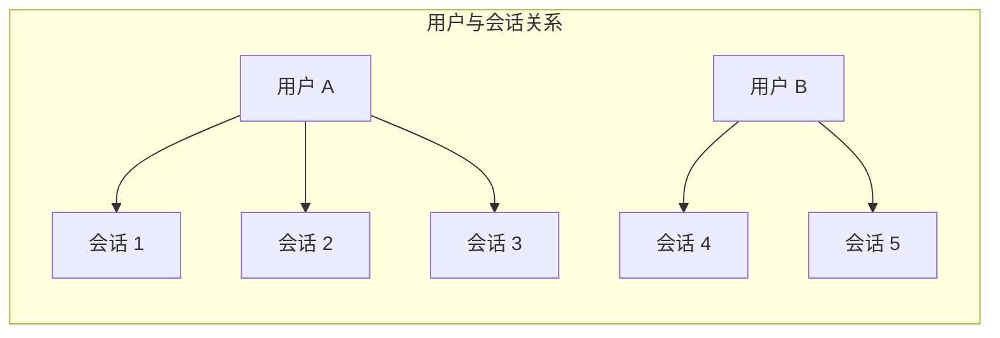

---

### 3.2 Agent 与 Persona 的关系

一个 Agent 可以关联多个 Persona：

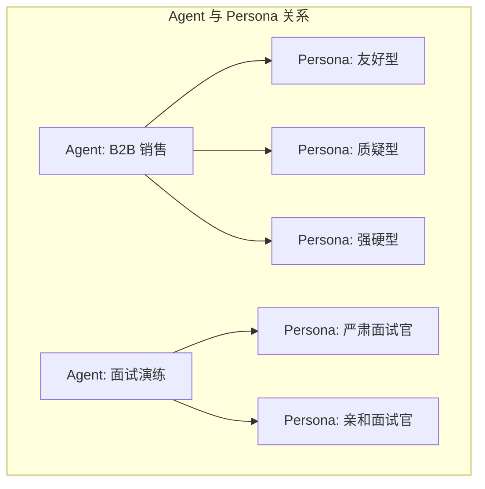

---

### 3.3 会话与消息的关系

一次会话包含多条消息：

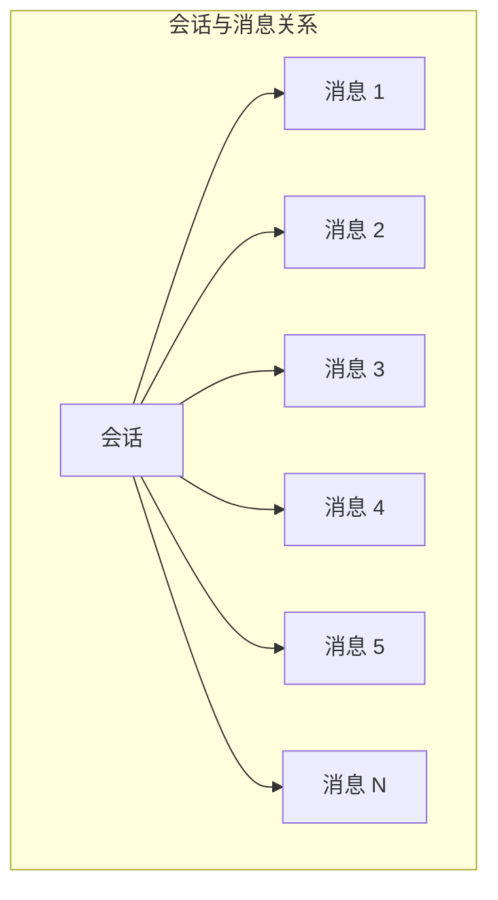

---

## 四、数据流转

### 4.1 演练数据流转

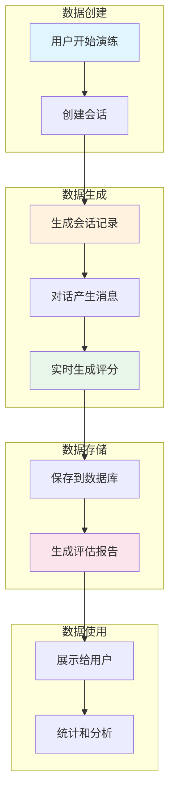

---

## 五、典型数据场景

### 5.1 一次完整的销售对练数据

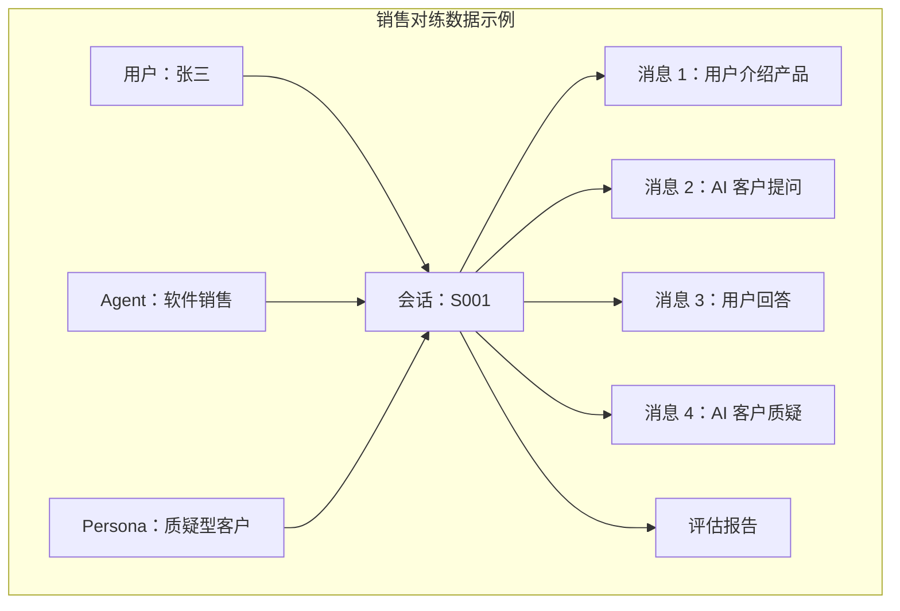

---

### 5.2 一次完整的 PPT 演练数据

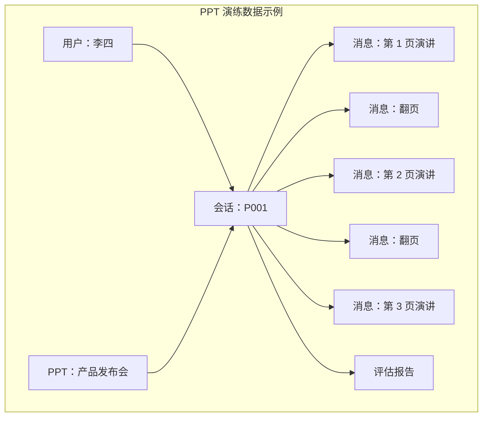

---

## 六、数据生命周期

### 6.1 会话数据生命周期

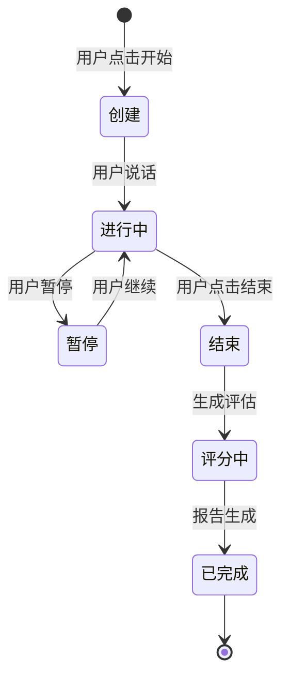

---

## 七、数据统计

### 7.1 可以统计的数据

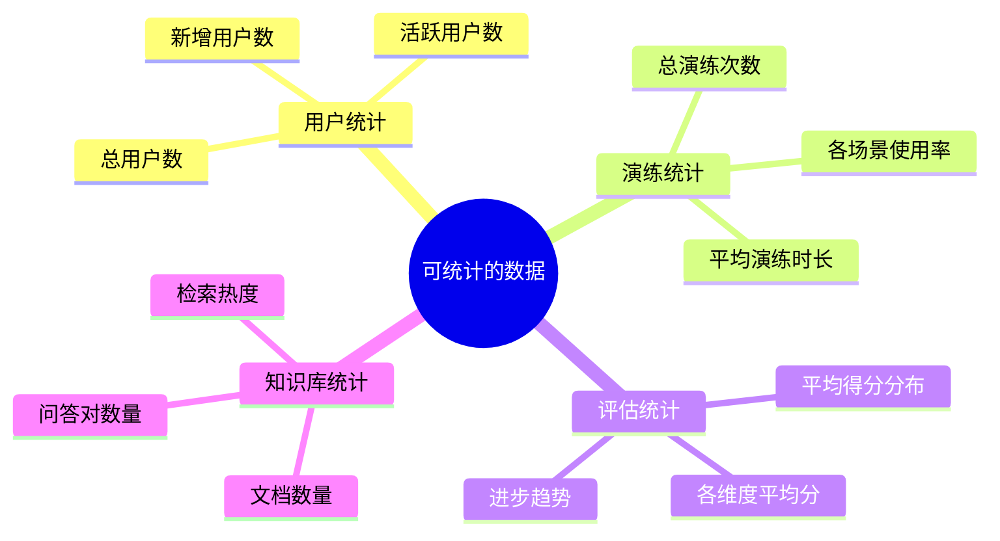

---

## 八、数据安全

### 8.1 数据权限控制

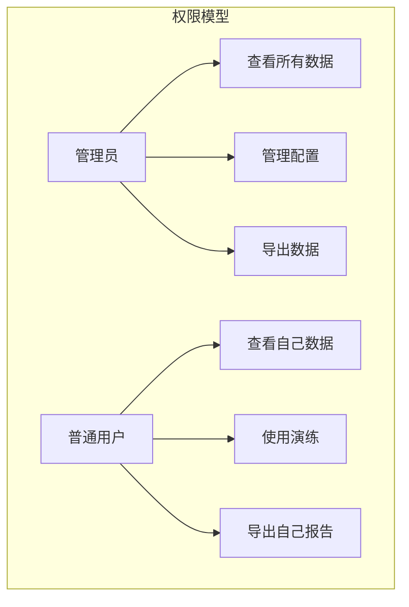

---

## 九、总结

核心数据实体：

| 实体 | 说明 | 关系 |
|------|------|------|
| **用户** | 使用系统的人 | 1 对 N 个会话 |
| **Agent** | 演练场景配置 | 1 对 N 个会话 |
| **Persona** | AI 角色设定 | 1 对 N 个会话 |
| **会话** | 一次演练 | N 对 1 用户/Agent/Persona |
| **消息** | 对话内容 | N 对 1 会话 |
| **报告** | 评估结果 | 1 对 1 会话 |

理解这些数据关系，可以帮助你更好地理解系统是如何运作的。
