# 语音交互全流程解析

> 编写：Claude Code | 日期：2026-02-18 | 目标读者：产品经理（无需技术背景）

---

## 一、语音交互概述

### 1.1 什么是语音交互？

语音交互 = 用户对着麦克风说话，AI 实时回应

这套系统最核心的特点是：**全双工语音交互**，意思是你一句我一句，像打电话一样流畅。

### 1.2 对比其他交互方式

| 交互方式 | 特点 | 适用场景 |
|---------|------|---------|
| **文字聊天** | 打字输入，速度慢 | 客服、简单咨询 |
| **语音消息** | 说一段，发送一段 | 微信语音、录音 |
| **语音通话** | 实时对话，即时回应 | 电话、视频会议 |
| **语音对练** | AI 实时互动，可打断 | 销售演练、演讲练习 |

---

## 二、语音交互全流程

### 2.1 完整流程概览

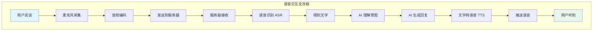

### 2.2 分步详解

#### 第一步：用户说话

```
用户对着麦克风说话...
       ↓
       ↓
       ↓
声音是空气的振动
       ↓
       ↓
       ↓
麦克风把振动转成电信号
```

#### 第二步：音频采集

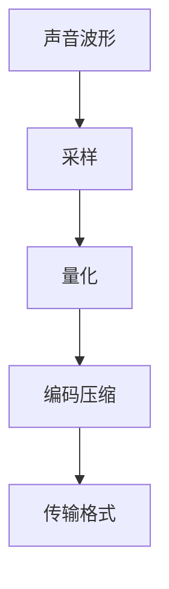

#### 第三步：发送到服务器

```
前端 (你的浏览器)
     │
     │ WebSocket 连接
     ↓
服务器 (云端)
```

#### 第四步：语音识别 (ASR)

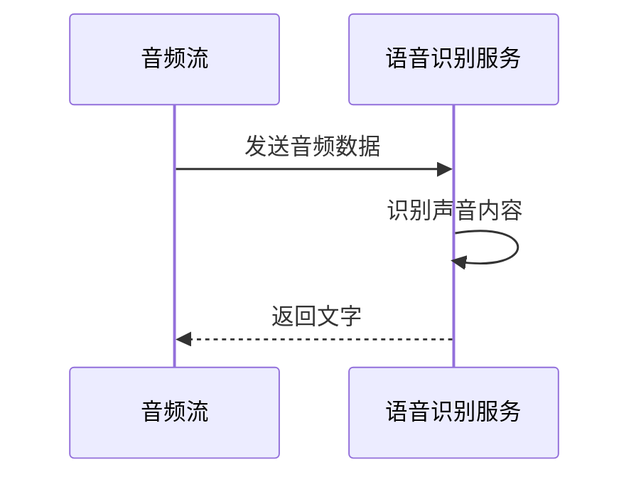

#### 第五步：AI 处理

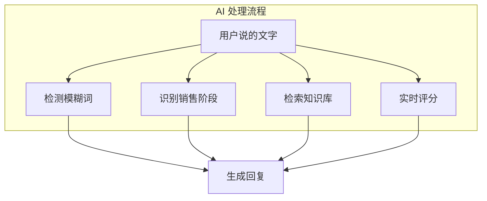

#### 第六步：语音合成 (TTS)

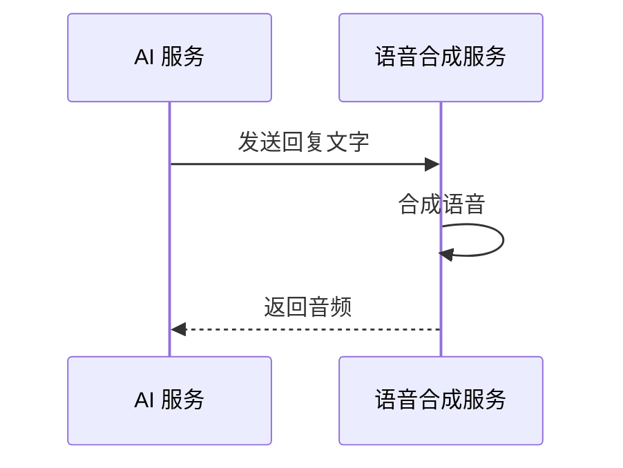

---

## 三、关键技术点

### 3.1 WebSocket 连接

WebSocket = 保持连接的电话

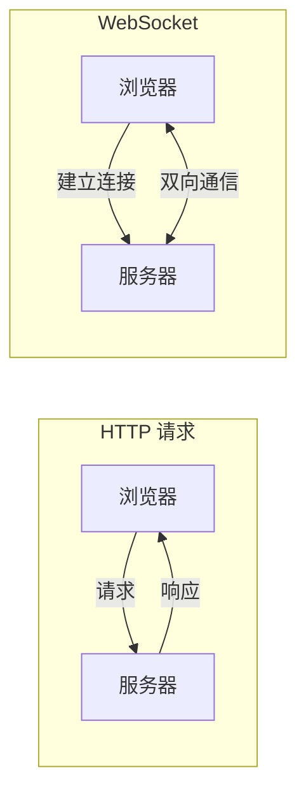

**WebSocket 的优势**：
- 连接建立后保持打开
- 服务器可以主动推送
- 适合实时交互

---

### 3.2 语音识别 (ASR)

ASR = Automatic Speech Recognition，把声音变成文字

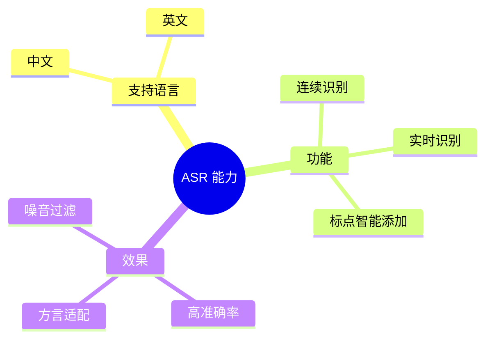

---

### 3.3 语音合成 (TTS)

TTS = Text-to-Speech，把文字变成声音

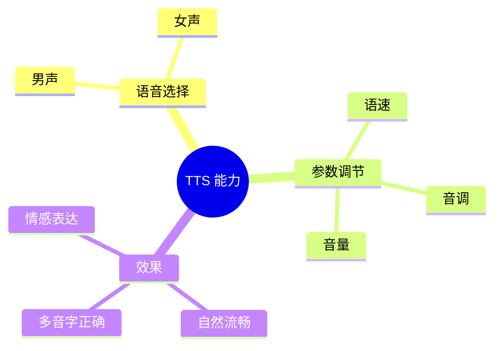

---

## 四、双工模式

### 4.1 什么是双工？

**双工 = 双方可以同时说话**

想象两个人打电话：
- **单工**：只能一个人说，另一个人听
- **半双工**：可以说，但要先等对方说完
- **全双工**：双方可以同时说

### 4.2 系统支持的能力

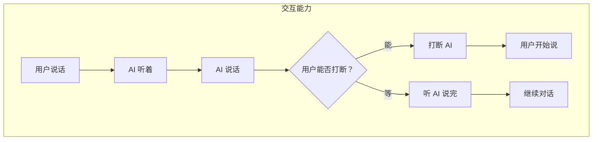

---

## 五、语音降级机制

### 5.1 为什么要降级？

当云端语音服务不可用时，系统需要「降级」到备用方案：

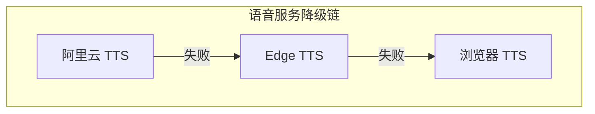

| 优先级 | 服务 | 说明 |
|--------|------|------|
| 1 | 阿里云 TTS | 质量最好 |
| 2 | Edge TTS | 免费，Windows 内置 |
| 3 | 浏览器 TTS | 所有浏览器都有 |

---

## 六、实时反馈机制

### 6.1 边说边反馈

用户说话的同时，系统已经在分析：

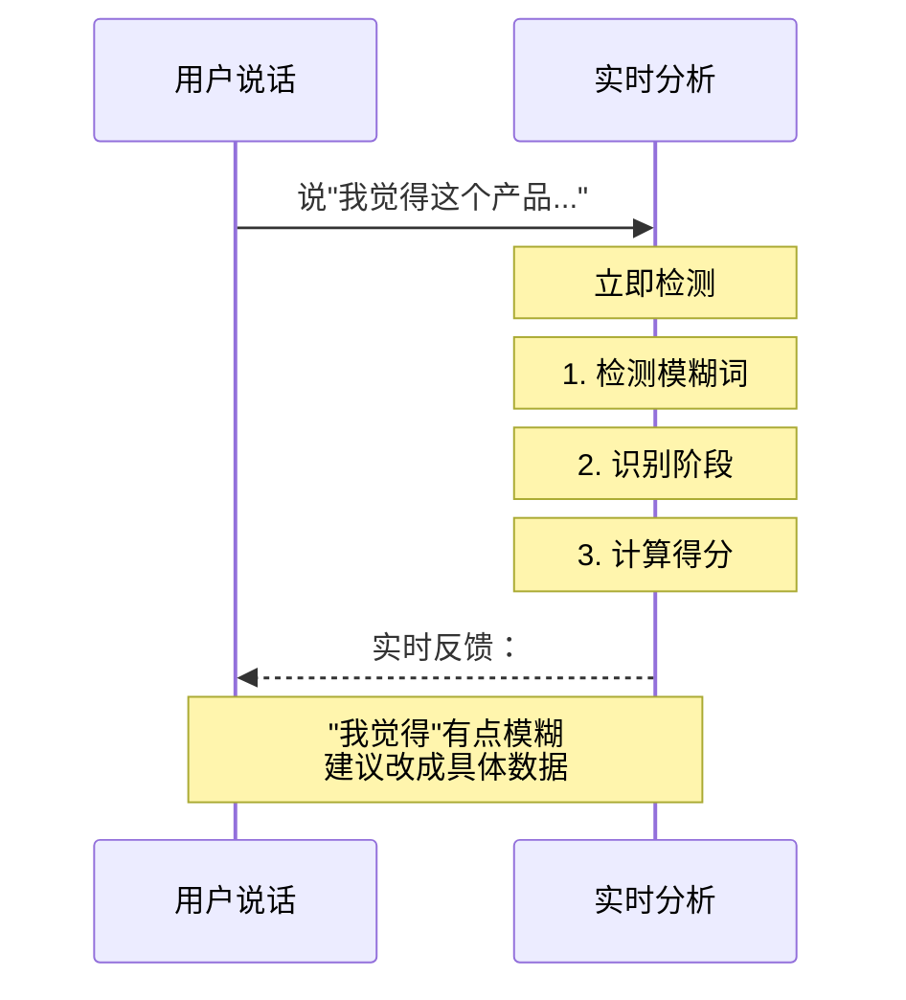

---

## 七、音频传输

### 7.1 音频格式

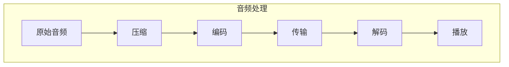

常用音频编码：
| 编码 | 特点 |
|------|------|
| PCM | 质量最高，文件大 |
| Opus | 压缩率高，适合网络传输 |
| AAC | 平衡质量和大小 |

---

## 八、网络传输优化

### 8.1 延迟优化

语音交互对延迟敏感：

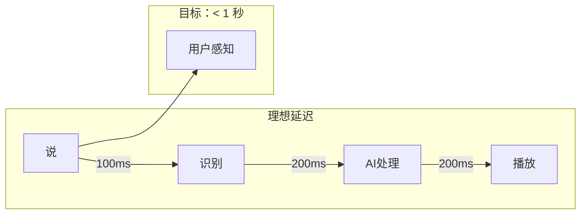

### 8.2 抗丢包

网络不稳定时：

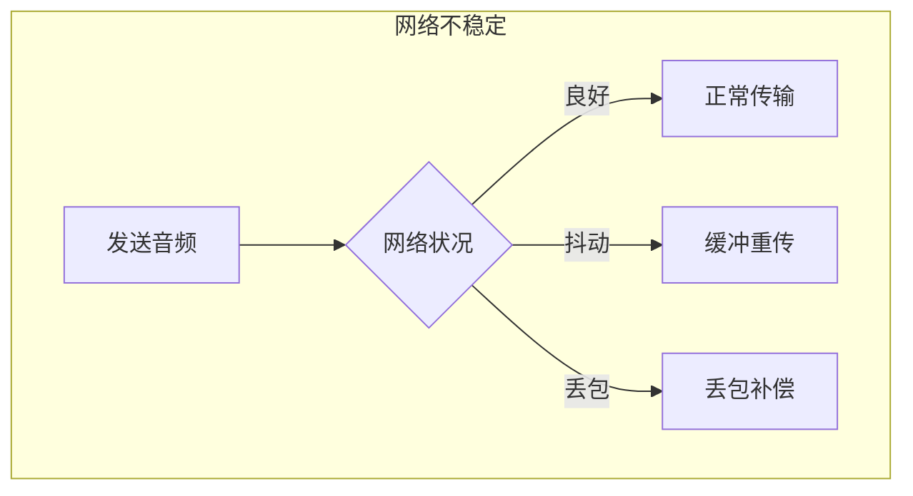

---

## 九、用户设备适配

### 9.1 支持的设备

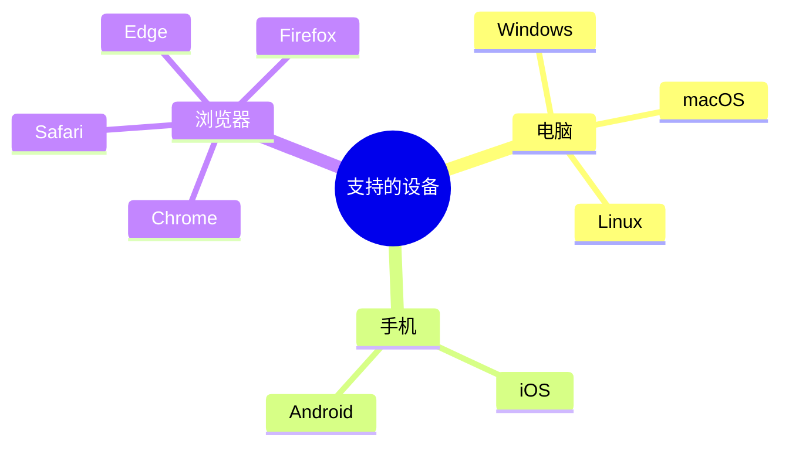

---

## 十、典型场景

### 场景一：网络良好的标准流程

```
用户：你好，我想了解一下你们的产品
    ↓
系统：（100ms）识别完成
    ↓
系统：（200ms）AI 处理中
    ↓
系统：（400ms）开始播放回复
    ↓
系统：当然可以，请问您想了解哪方面的产品？
```

### 场景二：网络不好时

```
用户：你好...
    ↓
系统：网络有点慢，正在处理...
    ↓
系统：（稍等）识别到"你好"
    ↓
系统：抱歉让您久等了，请问有什么可以帮您？
```

---

## 十一、技术架构

### 11.1 整体架构

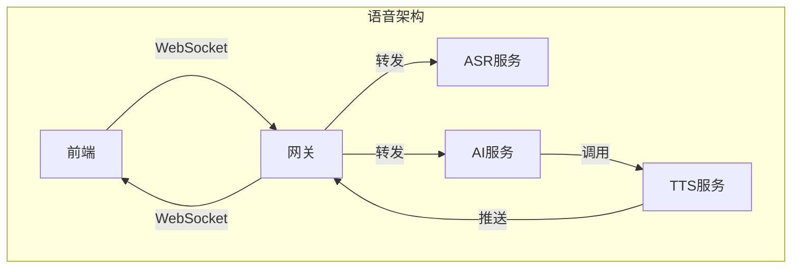

---

## 十二、总结

语音交互的核心要点：

1. **实时性**：从说话到听到回复 < 1 秒
2. **双工性**：可以随时打断 AI 说话
3. **降级机制**：主服务不可用时自动切换备用
4. **抗丢包**：网络不稳定时仍能保持通话

这套语音交互系统让用户感觉像在和真人打电话，极大地提升了演练的真实感。
