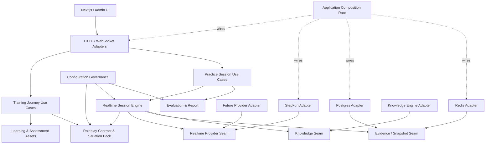

# 模块化单体 2.0 架构设计

日期：2026-07-10
状态：已批准，分 Gate 实施中（Gate 0A、Gate 0B、Gate 0C、Gate 1A、Gate 1B、Gate 2 已完成）
决策记录：`docs/adr/2026-07-10-modular-monolith-2-ai-native-governance.md`

实施证据：Gate 0A 已在 2026-07-10 完成并归档，恢复了路由、OpenAPI、contributor
和 Realtime 测试合同；聚焦回归为 `53 passed, 1 warning`。Gate 1A 已将当前 49 条
跨包边、12 包 SCC 和临时例外纳入 CI。Gate 0B 已逐项清零后端 15 个失败，最终
unit + contract 为 `2617 passed, 1 skipped, 74 warnings`。Gate 0C 已把前端全量恢复为
209 files、1327 passed、6 skipped，并在 5:54.32 自然 exit 0。Gate 1B 已将 selector、
changed coverage、全量 mypy、持久化路径解锁和录音 transition 接入唯一 release gate；最终
从头验收为 backend unit+contract `2665 passed, 1 skipped`、Vitest 209 files / `1329 passed,
6 skipped`、generic/smoke/newcomer/presentation/sales Playwright 全绿、selected backend
integration/E2E `598 passed, 21 skipped`、changed coverage 82%，并自然输出
`Critical quality gate passed`。Gate 2 已于 2026-07-11 完成 Presentation tracer bullet：默认
Engine façade、单 flag Legacy 回滚、显式 versioned state、additive/pre-Gate snapshot、单 writer、
零 Presentation Sales capability construction 和真实 Golden differential 已进入生产路径。
本 Gate canonical gate 从头自然 exit 0：backend `2868 passed, 1 skipped`、Vitest 209 files /
`1329 passed, 6 skipped`、Playwright generic/smoke/newcomer/presentation/sales 为
`3/9/11/2/1 passed`、selected backend `598 passed, 21 skipped`、changed coverage
770/847（90.91%）。Gate 3–6 仍按路线图推进，本文件的目标架构尚未整体落地。

## 1. 背景

系统已经形成可运行的 FastAPI + Next.js 模块化单体，并具备实时语音对练、
课程训练、评估报告、配置治理、主管复核和新人训练闭环。现有设计方向正确：

- 保持单体部署和单数据库事务能力；
- REST、WebSocket、二进制音频协议和用户路径已经稳定；
- 会话读取冻结的 voice、curriculum、Roleplay Contract snapshot；
- RuntimeGate、对象级权限、reconnect epoch、KB fail-closed、record-only
  Roleplay observation 等关键不变量已有测试；
- `StepFunTransport`、`RealtimeTurnCoordinator`、
  `GroundingDecisionPipeline`、`StepFunToolExecutionModule` 等第一轮 Seam 已进入
  生产路径。

但是，当前代码结构还没有兑现文档声明的依赖方向。以 13 个后端顶层包为节点、
扫描 Python 静态和字面量动态 import 后，当前存在 49 条跨包边，除
`supervisor` 外的 12 个包处于同一个强连通分量。Realtime 也主要完成了文件拆分，
尚未完成状态和决策权拆分。

本设计采用渐进式模块化单体 2.0：不重写、不拆微服务，通过可验证的
strangler 切片把现有物理目录逐步深化为真正的 Module。

## 2. 审计事实基线

### 2.1 结构事实

- `stepfun_realtime_handler/connection/feedback/policy/upstream/sales_stage` 合计约
  7,800 行、约 220 个方法和约 300 个 `self._*` 隐式成员；149 个私有成员被
  两个以上文件共享。
- `common/db/models.py` 约 2,663 行，是 400 多个文件消费的 ORM 注册中心。
- `curriculum_practice/services/roleplay_contracts.py` 约 1,842 行，仍同时承担
  compiler、disclosure、turn context、runtime projection 和 admin service。
- `web/src/lib/api/types.ts` 约 8,459 行；`client.ts` 约 4,825 行；报告页约
  3,350 行。
- Git 历史显示 `common ↔ sales_bot`、`evaluation ↔ sales_bot`、报告页 ↔
  全局 DTO 文件存在真实高频共变，依赖问题已经转化为协调修改成本。

### 2.2 质量事实

本设计获批时，聚焦架构和 realtime 测试能够通过，但全量事实并不绿色：

- 后端 unit + contract：2,592 collected，2,556 passed，36 failed，1 skipped；
- 路由完整性 5 个失败中，4 个来自 FastAPI `_IncludedRouter` 表示变化，1 个
  来自真实 OpenAPI 漂移；
- committed OpenAPI 330 paths，runtime OpenAPI 491 paths，runtime-only 161；
- Realtime 另有 reconnect fake token 和异步 transcript sink 时序测试漂移；
- 前端初始短窗口曾确认 dashboard 1 个时间断言失败、business-skills 16 个
  fixture/topic-governance 失败；Gate 0C 随后用 420 秒诊断保护得到完整 209-file 基线，
  证明当时的“超过 5 分钟”是观察窗口不足而非进程挂住。

因此，Gate 0 必须先恢复测试事实，不能直接把当时的全量测试加入发布门禁。截至
2026-07-10，Gate 0A 已恢复平台合同真相，Gate 0B 已使后端 unit + contract 达到
`2617 passed, 1 skipped`；Gate 0C 也已达到 209 files 全绿、1327 passed、6 skipped，
并在 5:54.32 自然退出。Gate 1B 随后已基于这些事实完成自动发现和变更覆盖接线。

## 3. 设计目标

### 3.1 用户和产品目标

- 当前智能对话实验、REST/WS 行为、二进制音频、报告、重连和训练路径保持兼容；
- 新增实时 Provider 时只新增 Adapter、事件 Codec 和一致性测试；
- 新增训练场景时通过组合 Scenario Hooks，不继承 Sales 内部状态；
- 新增评分或训练闭环时消费冻结 Evidence 和稳定契约，不跨域查内部 ORM；
- 主流程缺失数据时继续遵守上下文内完成原则，不因架构治理打断用户任务。

### 3.2 工程目标

- 依赖方向由 CI 执行，而不是只写在文档和 allowlist 中；
- 每个高价值 Module 具有小 Interface、足够 Implementation Depth 和明确所有权；
- 每条临时跨域依赖有 owner、原因、退役条件和到期日；
- 变更按 1–3 个提交的独立验收包推进，不使用传统人周作为完成度指标；
- 以行为、合同、变更覆盖和共变半径判断收益，不以 LOC 下降判断成功。

## 4. 非目标

- 不拆微服务，不引入消息中间件或分布式事务；
- 不更换 PostgreSQL、Redis、Chroma、StepFun 或前端框架；
- 不在架构治理中改变权限、业务阈值、评分语义和用户文案；
- 不立即搬迁数据库表或重写 Alembic 历史；
- 不为了形式统一给每个函数创建 Protocol；
- 不恢复已删除的 legacy Sales realtime handlers；
- 不允许 runtime 从 latest config 重拼历史 session snapshot。

## 5. 核心不变量

所有 Gate 默认继承以下不可破坏约束：

1. Sales 当前仍是 StepFun-only；Provider Seam 只提供未来替换能力，不在未选定
   Provider 前改变生产选择。
2. 外部 REST、WS event、close code、二进制音频 frame shape 保持向后兼容。
3. WebSocket 必须 fail-fast 鉴权，并执行 owner、permission 和 RuntimeGate admission。
4. 会话只消费 frozen voice/curriculum/Roleplay snapshot，不读取 latest 资产重拼。
5. KB-bound 场景在知识不可用时 fail closed，并记录可观察的降级原因。
6. request、response、stream、connection epoch 继续阻止过期事件污染当前轮次。
7. REST 与 WS 共用唯一 SessionLifecycleService 状态权威。
8. reconnect 不重复评分、不重复报告、不恢复已终止 session。
9. Roleplay observation 保持 record-only，不 cancel/regenerate 主对话音频。
10. Evidence 不足时不得伪造分数、结论或“已验证事实”。

## 6. 目标架构



### 6.1 Realtime Session Engine

`RealtimeSessionEngine` 是目标 Deep Module。它拥有 session runtime 的状态和决策，
而不是拥有 FastAPI WebSocket：

- `ConnectionState`：连接、health、reconnect、connection epoch；
- `TurnState`：request/response/stream id、interruption、timeout、completion；
- `GroundingState`：冻结 policy、检索决策、单一有界缓存、诊断；
- `EvidenceState`：transcript、audio audit、score snapshot、flush/ack；
- `ScenarioTurnHooks`：Sales、Presentation、Examiner 的场景行为；
- `RealtimeProviderPort`：Provider 能力、连接、事件和错误分类的 Seam。

WebSocket Adapter 只负责：鉴权、协议解析、调用 Engine、把 Engine 输出写回客户端。
StepFun 是 `RealtimeProviderPort` 的第一个 Adapter，而不是 Engine 的内部主语。

Gate 2 当前实现只兑现了该目标的 Presentation tracer bullet：
`training_runtime.realtime` 已拥有 versioned Connection/Turn/Grounding/Evidence state 和
invariant-checked transitions；Presentation 通过组合 façade 接入，兼容 Adapter 保留现有
StepFun wire/persistence 单 writer。音频 Evidence 只聚合共享入口 accepted 的 chunk，以 O(1)
流式 digest/count 元数据在本地 commit 后按 turn 写一次，拒绝帧和逐帧路径不写。当前
`GroundingState` 记录一次决策结果，但 Tool/Grounding 缓存尚未收敛为单一权威；
`RealtimeProviderPort` 和 provider event codec 也尚未落地。
因此上段完整 WebSocket/Provider/Grounding 描述仍是 Gate 3+ 目标，不是 Gate 2 当前事实。

### 6.2 Scenario 组合

Sales、Presentation、Examiner 不共享巨型父类状态。每个场景声明自己需要的能力：

```text
Sales = Engine + StepFun Adapter + Sales Hooks + Realtime Feedback + Evidence
Presentation = Engine + StepFun/Legacy Adapter + Presentation Hooks + Evidence
Examiner = Engine/Exam Runtime Port + Exam Scorer + Completion Writer
```

Presentation tracer bullet 已在 Gate 2 落地：façade 不再继承 Sales handler，兼容 Adapter
从第一次 base 初始化即声明 `scenario="presentation"` 且不构造 SalesStage、FuzzyDetection、
RealtimeScoring。兼容 Adapter 仍临时复用 `sales_bot` StepFun mixins，所以实际
`presentation_coach -> sales_bot` 依赖和 architecture policy 临时例外尚未退役；Gate 3
完成 Provider/Grounding 中立化后再删除该边，不能以 façade 已组合化代替边退役事实。

### 6.3 Roleplay Contract bounded context

完成 ADR 2026-06-20 已声明但尚未完成的中立化：

- 中立 Module 拥有 schema、compiler、hash/freeze、visible/hidden disclosure、
  turn context、compliance decision 和 runtime DTO；
- curriculum、sales runtime、evaluation、Situation Pack 通过稳定 Interface 消费；
- admin 只通过治理 Adapter 发布版本；
- 不移动或重算历史 hash，不改变 record-only sidecar 语义。

### 6.4 Configuration Governance

`ConfigBundleLifecycleService` 等发布、审批、版本和影响预览能力从 `admin` 所有权中
抽出。`admin` 是 delivery Adapter；evaluation 和 curriculum 不再反向依赖 admin。

### 6.5 Evaluation & Report

Evaluation 只消费：

- `SessionEvidence`；
- frozen `RoleplayContract`；
- versioned `ScoringRuleset`；
- scenario-provided `EvaluationAdapter`。

它不直接导入 Sales、Presentation、Curriculum 的 service 或 ORM。报告生成保持幂等，
Evidence 不足继续返回 non-evaluable，而不是制造低分或完整报告。

### 6.6 Shared Kernel 和持久化

`common` 逐步缩为稳定技术 Kernel：ID、时间、Result、审计、trace、基础 auth、
通用 port。近期不拆数据库：

- 先通过 repository/projection 限制跨域 ORM 消费；
- 再物理拆分 `common/db/models.py`，继续共享同一个 `Base.metadata`；
- 只有当表的写入所有权稳定后，才评估 schema 或部署边界。

### 6.7 前端 Locality

- 页面继续只导入 `api` from `client.ts`；
- `client.ts` 保留兼容 façade 和 auth/trace/error transport；
- 高增长领域进入 `lib/api/domains/<domain>.ts`；
- DTO 按领域 barrel 暴露，不在页面重复定义；
- 报告页先抽纯 mapper/ViewModel/actions，再拆 UI 区块；
- 页面只消费 ViewModel，不直接解释数据库或全局 DTO 细节。

## 7. 迁移策略

采用 Strangler + Branch by Abstraction：

1. 先修复测试和合同事实；
2. 冻结当前依赖图，禁止新增边和扩大 SCC；
3. 为一个真实场景建立新 Engine Adapter，与旧路径做事件序列和 Evidence 对比；
4. 每迁移一个决策权威，就删除旧路径中的对应写入；
5. 兼容 façade 只允许转发，不承载新业务规则；
6. 每个临时例外必须定义退役条件；
7. 只有行为测试、合同测试和影响测试都通过后才删除旧实现。

## 8. 测试和发布策略

### 8.1 测试分层

- PR 快速层：ruff、mypy/tsc、architecture guard、backend unit+contract、Vitest；
- 影响层：按 CodeGraph/changed paths 选择 integration 和 E2E；
- 关键路径层：保留现有 `critical-quality-gate.sh` 的 Sales、Presentation、
  Newcomer 本地 Provider E2E；
- 定时层：真实 Provider、全量 integration/E2E、恢复演练；
- 变更覆盖：关键模块 changed-line 和 branch coverage，不以单一全局百分比代替风险。

Gate 1B 将该分层实现为三层真相：unit+contract 与 Vitest 不允许 selector 缩小；integration、
backend E2E 和 Playwright 由 critical baseline、direct change、path policy 与健康 CodeGraph
affected 做加法选择；不可信输入、未知生产路径和横切变更扩大到 family/full fallback。
CodeGraph 在 CI 缺失时只记录 degraded evidence，非法或空的生产影响结果则 fail closed。

backend coverage 先由全量 unit+contract 建立，再由 selected integration/E2E 使用 branch
coverage append 合并，避免“集成测试已经覆盖但 changed-line 报告看不见”的假红；frontend
coverage 明确 include 全部生产 `src`。changed executable lines 门槛为 80%，并为路径进度、
会话生命周期、Journey projection、录音 FSM 等关键文件冻结不可回退的 branch baseline。

### 8.2 Golden Conversation Contract

每次 Realtime 切片至少固定：

- 鉴权与对象所有权；
- connect/start/text/audio/response.done 事件顺序；
- binary audio frame；
- timeout/backpressure/degraded provider；
- frozen snapshot 和 KB lock；
- reconnect state/epoch；
- transcript/evidence/score/report 幂等；
- Roleplay observation 不阻塞主链。

### 8.3 发布和回滚

- 不改变协议的内部切片默认直接兼容上线；
- 新 Engine/Provider 路径必须受 server-side feature flag 或 runtime selection 控制；
- 回滚只切回旧 Adapter，不回写或重建历史 snapshot；
- 新旧路径对同一 session 不得同时写入评分和报告；
- 指标至少覆盖连接成功率、首包、turn completion、reconnect、grounding 降级、
  duplicate score/report 和 Adapter fallback。

## 9. AI 原生交付模型

本设计不用“人周”衡量。当前更诚实的规模是 27–39 个独立变更包、7 个 Gate。
每个变更包 1–3 个提交，必须具备自己的失败测试、通过测试、影响分析和回滚点。

机械迁移可以并行；以下语义 Gate 不可压缩：

- frozen snapshot/hash 一致性；
- WebSocket 事件/epoch/重连；
- 权限和对象范围；
- 评分、Evidence 和报告幂等；
- 外部 Provider 真实协议验证。

详细顺序见
`docs/superpowers/plans/2026-07-10-modular-monolith-2-roadmap.md`。

## 10. 成功标准

- 所有必跑测试绿色，隔离测试必须有 owner、原因和到期日；
- committed OpenAPI 与 runtime OpenAPI 一致；
- 新跨包边、新循环或扩大 SCC 会在 CI 失败；
- Presentation 不再继承 Sales runtime 状态；
- Fake Provider 可在不修改 Engine 的前提下通过 Golden Conversation Contract；
- Grounding 只有一个决策权威和一个有界缓存；
- Roleplay、Evaluation、Configuration Governance 所有权中立化；
- 新场景不修改 Sales runtime，新 Provider 不修改 Evaluation/Curriculum；
- 前端领域变更不再要求修改全局页面 + 全局 DTO + 全局 client 三个热点；
- Git 共变半径和 CodeGraph affected tests 随 Gate 递减，而不只是文件行数减少。
