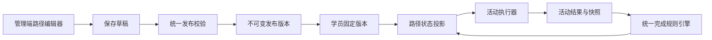

# 新人训练路径活动编排架构设计

> 状态：设计已确认，待实施计划
>
> 日期：2026-07-12
>
> 决策前提：系统仍处于未对外发布的原型阶段。允许废弃现有新人训练路径配置、兼容结构和测试数据，直接以本设计替换，不建设 V1/V2 双轨、不编写迁移适配层。

## 1. 目标

将新人训练路径从“几个固定关卡的配置页”重建为一个活动编排系统，使业务管理员能够在不修改代码的情况下：

- 新增、复制、删除和排序阶段、模块与活动；
- 配置 PPT 讲解、产品 Demo、产品单模块讲解、技术学习、做题、录音评分、AI 辅导和实时对练；
- 在当前编辑流程中快速创建并绑定学习内容、材料、试卷和评分标准；
- 保存草稿、预览、校验并发布；
- 保证学员训练过程、成绩和证据引用固定版本，不因后续编辑发生漂移；
- 在路径规模增长到多个阶段、数十个模块时，管理端和学员端仍保持清晰。

## 2. 非目标

- 不建设通用低代码平台。
- 不允许管理员配置任意脚本、组件、路由或网络请求。
- 不在本次重构中新增第七种活动执行能力。
- 不支持多条并行新人训练路径；首版只有一个逻辑路径和一个当前发布版本。
- 不保留旧 `module_key`、旧学习专题固定键、旧路径兼容 API 或旧前端适配层。
- 不迁移现有新人训练原型配置和测试结果。

## 3. 核心原则

### 3.1 业务对象与执行能力分离

“产品 A”“PPT 讲解”“技术基础”是管理员创建的数据，不是代码枚举。

代码只注册稳定的活动执行类型：

- `lesson`
- `quiz`
- `audio_assessment`
- `realtime_roleplay`
- `ai_coach`
- `assignment`

使用已有活动类型新增内容、模块或路径结构不需要改代码。只有引入全新的执行机制时，才增加新的活动处理器和前端渲染器。

### 3.2 单一真源

当前发布的 `TrainingPathRevision` 是学员路径结构、活动顺序、前置关系和资源绑定的唯一真源。

前端不得通过模块名称、业务键、页面路由或资源目录推断训练结构；执行器不得从最新配置补写历史记录。

### 3.3 草稿宽松，发布严格

草稿允许缺少资源，方便管理员逐步编辑。发布必须执行完整校验，任何必需资源、活动配置或前置关系缺失都阻止发布，并定位到具体活动。

学员只读取通过校验的不可变发布版本。

### 3.4 前台轻，后台稳

管理端只向普通管理员展示业务语言和必要字段；内部标识、模型参数、运行时绑定和技术诊断默认隐藏在高级区域。

学员端始终突出一个下一步动作，不把全部状态、录音历史和技术诊断堆在路径首页。

## 4. 领域模型

```text
TrainingPath
└── Phase
    └── Module
        └── Activity
```

### 4.1 TrainingPath

系统中唯一的新人训练路径逻辑身份。

```text
TrainingPath
- path_id
- name
- active_revision_id
- created_at
- updated_at
```

### 4.2 TrainingPathRevision

保存完整路径聚合。发布版本不可变。

```text
TrainingPathRevision
- revision_id
- path_id
- revision_no
- status: draft | published | archived
- payload_json
- reason
- created_by
- published_by
- created_at
- published_at
```

约束：

- 同一路径最多一个可编辑草稿；
- 发布创建新的不可变 revision，并移动 `active_revision_id`；
- 已发布 revision 不允许原地更新；
- 草稿保存与发布都写审计日志；
- 删除草稿不影响当前发布版本。
- 恢复历史版本时，不直接移动 active 指针，而是把历史 payload 复制为新草稿，重新校验后发布。

### 4.3 Phase

阶段用于组织认知顺序，不承担具体执行逻辑。

```text
Phase
- phase_id
- title
- description
- order_index
- required
- modules[]
```

阶段完成条件：全部必修模块完成。选修模块不阻塞后续阶段。

### 4.4 Module

模块表达一个业务学习目标，例如“产品 A 核心能力”。

```text
Module
- module_id
- title
- description
- order_index
- required
- estimated_minutes
- audience_rule
- prerequisites[]
- completion_policy
- activities[]
```

`prerequisites` 只能引用同一 revision 内更早的阶段、模块或活动，禁止循环依赖。

`completion_policy` 首版支持：

- `all_required`：所有必修活动完成；
- `at_least_count`：指定活动集合中至少完成 N 个。

### 4.5 Activity

活动是最小可执行训练任务。

```text
Activity
- activity_id
- type
- title
- description
- order_index
- required
- estimated_minutes
- prerequisites[]
- config
```

`config` 是以 `type` 为判别字段的严格联合类型，不接受未声明字段。

示例：

```json
{
  "phase_id": "phase-product",
  "title": "产品能力",
  "modules": [
    {
      "module_id": "module-product-a",
      "title": "产品 A 核心功能",
      "required": true,
      "completion_policy": { "mode": "all_required" },
      "activities": [
        {
          "activity_id": "activity-product-a-lesson",
          "type": "lesson",
          "title": "学习产品 A 技术资料",
          "required": true,
          "config": { "learning_content_id": "content-id" }
        },
        {
          "activity_id": "activity-product-a-quiz",
          "type": "quiz",
          "title": "完成产品 A 小测",
          "required": true,
          "config": { "exam_paper_id": "paper-id", "pass_score": 80 }
        },
        {
          "activity_id": "activity-product-a-audio",
          "type": "audio_assessment",
          "title": "上传产品 A 讲解录音",
          "required": true,
          "config": {
            "material_id": "material-id",
            "scoring_rubric_id": "rubric-id",
            "pass_score": 75,
            "max_attempts": 3
          }
        }
      ]
    }
  ]
}
```

## 5. 活动类型契约

### 5.1 lesson

用途：文章、Markdown、PPT、视频、附件和技术资料学习。

必要配置：

- `learning_content_id`
- 完成方式：阅读确认或全部章节完成

输出：阅读进度、完成时间和内容 revision 快照。

### 5.2 quiz

用途：单选、多选、判断、简答和组合考卷。

必要配置：

- `exam_paper_id`
- `pass_score`
- 可选 `max_attempts`

输出：分数、是否通过、逐题结果和试卷/题目 revision 快照。

### 5.3 audio_assessment

用途：PPT 讲解、Demo 讲解、产品模块讲解、FAQ 口播等离线录音评分。

必要配置：

- `scoring_rubric_id`
- `pass_score`
- 可选 `material_id`
- 可选 `max_attempts`

输出：音频证据、转写快照、评分标准快照、维度得分、总分和是否通过。

业务场景只体现在活动名称、任务说明、材料和评分标准中，不新增场景代码枚举。

### 5.4 realtime_roleplay

用途：通过 StepAudio 实时语音运行时完成对练。

必要配置：

- `practice_template_id`
- `runtime_profile_id`
- 完成条件

执行前由处理器校验权限、运行时配置和 Provider readiness。新人训练模块不直接管理 WebSocket 会话。

### 5.5 ai_coach

用途：围绕当前模块进行辅导、追问、复盘和补救。

必要配置：

- `coach_profile_id`
- `completion_mode`

高风险建议只生成建议和证据，不自动执行业务操作。

### 5.6 assignment

用途：普通文件、截图、文本或人工审核作业。

必要配置：

- `submission_type`
- `review_mode`

输出：提交证据、审核状态和审核意见。

## 6. 活动执行器架构

后端只通过注册表访问活动能力：

```text
ActivityTypeRegistry
├── lesson             -> LessonActivityHandler
├── quiz               -> QuizActivityHandler
├── audio_assessment   -> AudioAssessmentActivityHandler
├── realtime_roleplay  -> RealtimeRoleplayActivityHandler
├── ai_coach           -> AiCoachActivityHandler
└── assignment         -> AssignmentActivityHandler
```

每个 Handler 实现同一接口：

```text
validate_config(config, context)
check_access(activity, learner)
build_next_action(activity, learner_state)
project_result(activity, evidence)
is_complete(activity, result)
```

统一活动状态：

```text
not_started
locked
in_progress
submitted
processing
passed
failed
needs_review
completed
unavailable
```

路径引擎只处理结构、前置关系和完成聚合，不包含 PPT、Demo、商务礼仪、产品名称或活动路由分支。

前端维护对应的六个配置编辑器和六个学员执行渲染器。新增业务模块不修改注册表；新增第七种执行能力时才扩展注册表。

管理端“添加活动”菜单通过后端活动类型描述接口获取名称、说明、能力和可用状态；前端不另建业务场景目录。

## 7. 学员版本与训练结果

### 7.1 LearnerPathEnrollment

学员第一次进入路径时固定到当前发布 revision。

```text
LearnerPathEnrollment
- enrollment_id
- learner_id
- path_id
- path_revision_id
- status: active | completed | cancelled
- started_at
- completed_at
```

同一学员同一路径只有一个 active enrollment。

### 7.2 LearnerActivityAttempt

所有活动结果使用统一索引，活动专属证据仍由原有引擎持有。

```text
LearnerActivityAttempt
- attempt_id
- enrollment_id
- path_revision_id
- activity_id
- activity_type
- attempt_no
- status
- score
- max_score
- passed
- evidence_type
- evidence_id
- activity_snapshot
- result_snapshot
- created_at
- completed_at
```

约束：

- `activity_snapshot` 冻结提交时活动配置；
- `result_snapshot` 冻结评分或审核结果；
- 历史结果不得从最新路径、最新试卷或最新评分标准反推；
- 重评通过追加新 attempt/result 记录实现，不覆盖原结果。

## 8. 管理后台体验

唯一核心入口：`/admin/newcomer-training/path`。

### 8.1 页面布局

- 左侧：阶段、模块、活动大纲；支持新增、复制、删除和拖动排序。
- 中间：当前选中对象的编辑表单。
- 右侧：学员端预览、配置完整性和发布问题。
- 顶部固定：草稿状态、保存、预览和发布。

页面不同时展开所有模块详情，不使用卡片墙承载路径编辑。

### 8.2 添加流程

“添加模块”提供少量业务模板：

- 空白模块
- 内容学习模块
- 学习加考试
- 学习加录音讲解
- 学习、考试加录音讲解
- 实时对练模块

模板只生成活动组合，生成后所有内容都可编辑。

“添加活动”只展示六种标准活动类型。

### 8.3 上下文内完成

配置活动时缺少资源，管理员可在当前页面抽屉中：

- 快速新建学习内容和首章节；
- 快速创建或选择题目并组卷；
- 快速新建材料并上传发布版本；
- 快速新建结构化评分标准；
- 选择实时对练模板和运行配置。

创建成功后自动绑定当前活动，不要求管理员跳转到资源管理页再返回。

### 8.4 简单模式与高级模式

普通编辑默认只展示名称、说明、资源、通过条件、是否必修和重试次数。

以下内容进入折叠的高级区域：

- 适用新人范围；
- 前置条件；
- AI 模型策略；
- 运行时策略；
- 技术诊断和审计信息。

普通管理员界面不展示数据库 ID、Prompt、raw JSON、内部枚举、traceId 或 runtime binding。

### 8.5 发布校验

发布问题必须使用业务语言并定位到对象，例如：

- “产品 A 讲解尚未选择评分标准”；
- “技术基础考试没有已发布题目”；
- “实时对练服务当前不可用”；
- “模块存在循环前置条件”。

点击问题直接聚焦对应活动。

## 9. 学员端体验

核心入口：`/newcomer-training`。

### 9.1 首页

第一屏只展示：

- 当前阶段；
- 整体进度；
- 当前任务；
- 预计用时；
- 一个“继续学习”主操作。

路径大纲采用渐进披露：

- 当前阶段默认展开；
- 已完成阶段折叠；
- 未来阶段只展示名称和解锁条件；
- 选修模块归入“推荐学习”。

录音历史、全部成绩、补练记录和技术诊断不放在路径首页。

### 9.2 模块详情

模块详情展示活动步骤和唯一下一步：

```text
产品 A 核心功能                     2 / 3

已完成  学习产品 A 技术资料
已完成  完成产品 A 小测
待完成  上传产品 A 讲解录音

[继续上传讲解录音]
```

活动失败时保留当前上下文，展示重试、查看反馈或联系负责人，不把学员引导到管理页面。

### 9.3 我的训练记录

训练记录独立呈现，可按模块和活动类型查看录音、考试、实时对练、AI 辅导和人工审核结果。

## 10. 数据流



## 11. API 边界

管理端最小 API：

```text
GET    /api/v1/admin/newcomer-training/path
PUT    /api/v1/admin/newcomer-training/path/draft
DELETE /api/v1/admin/newcomer-training/path/draft
POST   /api/v1/admin/newcomer-training/path/validate
POST   /api/v1/admin/newcomer-training/path/publish
GET    /api/v1/admin/newcomer-training/path/revisions
POST   /api/v1/admin/newcomer-training/path/revisions/{revision_id}/restore
GET    /api/v1/admin/newcomer-training/activity-types
```

学员端最小 API：

```text
GET /api/v1/newcomer-training/journey
GET /api/v1/newcomer-training/modules/{module_id}
GET /api/v1/newcomer-training/activities/{activity_id}
```

活动提交继续委托已有内容、考试、录音和实时运行时服务；路径 API 只提供统一入口、准入判断、下一步动作和结果投影。

接口不得把任意前端路由存入配置。下一步 URL 由受信任的活动渲染器根据 `activity_id` 生成。

## 12. 权限与审计

首版能力：

- `newcomer_training.manage_path`
- `newcomer_training.manage_content`
- `newcomer_training.publish_path`
- `newcomer_training.view_records`
- `newcomer_training.learn`

后端执行对象级权限校验。前端隐藏按钮不能替代权限。

以下行为必须审计：

- 保存或删除草稿；
- 发布路径；
- 创建、替换或删除活动；
- 修改评分标准、考试或实时运行时绑定；
- 人工审核、重评和结果纠正。

日志不得记录密钥、Token、完整 Prompt、音频正文或敏感个人数据。

## 13. 错误处理

- 草稿缺资源：允许保存，标记为未完成。
- 发布缺资源：阻止发布，返回结构化问题列表。
- 学员端：只读取已发布且通过校验的 revision。
- 外部服务错误分为可重试、需要管理员处理和学员输入错误。
- 选修活动不可用不阻塞无关必修模块。
- 必修活动不可用时明确展示状态，不伪造完成。
- 未识别活动类型、非法配置或循环依赖一律 fail closed。
- 所有错误包含 requestId/traceId，但普通学员界面不直接展示内部标识。

## 14. 直接替换范围

本次不做渐进迁移。实施完成后删除或替换：

- 固定 `CANONICAL_NEWCOMER_MODULE_KEYS` 和模块类型映射；
- `NewcomerPathModuleConfig` 旧固定字段模型；
- `business_skills`、`company_product_demo` 等业务场景分支；
- 固定 `business_etiquette` / `customer_faq` 学习专题配置模型；
- 旧 `config-center-*` 模块目录与卡片式路径配置中心；
- 旧 `module-path.ts` 兼容适配层；
- TrainingJourney 中按模块键拼接入口的逻辑；
- 旧新人路径 seed、固定四关文案和旧测试数据；
- 仅为旧路径存在的兼容 API、页面和测试。

保留并复用：

- LearningContent 与章节资产；
- 题库、考卷和答题引擎；
- 材料和版本资产；
- 录音上传、ASR、评分标准与评分结果；
- StepAudio 实时运行时及其权限、readiness 和结果证据；
- 通用 revision、审计和操作日志能力。

数据重置仅覆盖新人训练路径原型相关配置、enrollment、attempt 和 seed 数据。共享内容资产若被其他模块引用，不做级联删除；只解除新人训练引用并创建新的训练样例。

## 15. 测试策略

### 15.1 活动执行器契约

六个 Handler 必须共享契约测试：

- 合法配置；
- 缺失配置；
- 权限拒绝；
- 进入动作；
- 结果投影；
- 完成判断；
- 可重试和终止错误。

### 15.2 编排规则

覆盖：

- 阶段、模块、活动排序；
- 必修和选修；
- 前置条件；
- 循环依赖拒绝；
- `all_required`；
- `at_least_count`；
- 学员版本固定；
- 发布后历史结果不漂移。

### 15.3 管理端组合测试

不得只测试孤立活动。至少覆盖：

- 创建三阶段完整路径；
- 连续创建产品 A、B、C 三个模块；
- 每个模块组合 lesson、quiz、audio assessment；
- 快速新建资源并自动绑定；
- 拖动排序后保存、校验和发布；
- 发布问题聚焦到具体活动；
- 30 个模块时仍可通过大纲快速定位和编辑。

### 15.4 学员关键路径

覆盖：

- 首次进入固定 revision；
- 首页只突出一个下一步；
- 完成学习后解锁考试；
- 考试通过后解锁录音；
- 录音评分失败后重试；
- 模块、阶段和路径完成；
- 实时对练 Provider 不可用时的明确降级；
- 选修活动失败不阻塞必修路径。

## 16. 验收标准

实现完成必须同时满足：

1. 管理员不修改源码即可创建、复制、删除和排序阶段、模块与活动。
2. 管理员可在一个页面内完成内容、考试、录音评分和实时对练配置。
3. 连续创建产品 A、产品 B、产品 C 三个“学习 + 考试 + 录音讲解”模块时不产生源码变化。
4. PPT、Demo 和产品单模块讲解全部使用同一个 `audio_assessment` 执行器。
5. 技术学习和普通产品知识全部使用同一个 `lesson` 执行器。
6. 学员首页始终只有一个主操作，路径规模增长时不形成卡片墙。
7. 发布版本不可变，学员 enrollment 固定 revision，历史成绩和证据不漂移。
8. 非法配置、缺资源、权限不足和 Provider 不可用均显式失败，不伪造成功。
9. 旧固定模块枚举、兼容投影和专用场景分支已删除。
10. 新人训练专项单元、集成、契约与关键 E2E 全部通过。

## 17. 最终架构决策

采用活动编排模型，以唯一的版本化路径聚合表达阶段、模块和活动。业务扩展通过创建和组合活动实例完成；代码扩展只发生在增加全新活动执行能力时。

由于系统未对外发布，实施采用一次性直接替换：重置新人训练原型数据、删除旧兼容结构、复用成熟执行引擎，并以本设计作为唯一目标架构。
