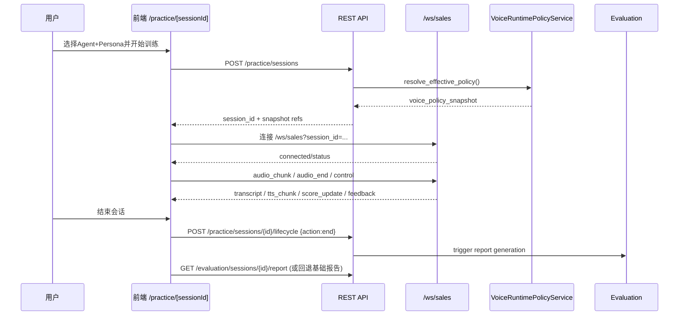

# 企业级 AI 智能演练系统深度分析报告

> 生成日期：2026-02-24  
> 分析范围：`/Users/zhaozengqing/github/销售训练qoder`  
> 分析目标：深度梳理系统内容、前后端流转链路、契约一致性、主要风险与治理优先级

---

## 1. 执行摘要

该系统已经不是“单一对话页面 + 后端接口”的简单应用，而是一个包含**训练运行时（REST + WebSocket）**、**策略治理后台（Agent/Persona/Voice/Prompt）**、**评估与回放闭环**、**运行支持与发布验收**的综合平台。核心训练闭环可概括为：

1. 管理后台配置训练资产（Agent、Persona、知识库、语音策略、提示词）
2. 用户侧创建会话并固化策略快照
3. WebSocket 实时语音交互驱动训练（销售 / 演讲双场景）
4. 生命周期状态机落库并广播状态
5. 评估服务生成报告，前端报告页再练闭环
6. 回放、高光、知识检索诊断提供复盘依据

系统整体能力完整、模块边界相对清晰，但也存在明显的“成熟系统常见问题”：**文档与实现偏移、部分异常处理过宽、异步任务可观测性不足、接口命名历史包袱、前端凭证存储安全性一般**。  

---

## 2. 分析方法与证据边界

### 2.1 证据来源

- 后端核心入口与路由：`backend/src/main.py:136`, `backend/src/main.py:327`, `backend/src/main.py:588`, `backend/src/main.py:675`
- 会话核心 API：`backend/src/common/api/practice.py:301`, `backend/src/common/api/practice.py:556`, `backend/src/common/api/practice.py:873`
- 生命周期状态机：`backend/src/common/db/session_lifecycle.py:74`
- 销售 WebSocket 路由：`backend/src/sales_bot/websocket/router.py:30`
- 语音策略决策：`backend/src/sales_bot/services/voice_runtime_policy.py:117`, `backend/src/sales_bot/services/voice_runtime_policy.py:444`
- 前端训练主链路：`web/src/app/(user)/practice/[sessionId]/page.tsx:91`, `web/src/hooks/use-practice-websocket.ts:81`
- 前端 API 统一层：`web/src/lib/api/client.ts:1023`, `web/src/lib/api/client.ts:1053`
- 契约与规范文档：`docs/api-contract/sessions.md:11`, `docs/api-contract/websocket.md:3`, `api-spec.md:142`

### 2.2 体量快照（基于仓库静态统计）

- 后端 REST 路由：132 个
- 后端 WebSocket 路由：4 个
- 主入口 `include_router`：30 处
- 前端页面（`page.tsx`）：35 个
- 前端布局（`layout.tsx`）：4 个
- 前端 hooks：17 个
- API 契约文档：13 篇
- explain 业务解释文档：7 篇

> 结论：这是中大型业务系统，且“训练运行时 + 管理治理 + 评估回放”三条产品线并行演进。

---

## 3. 系统定位与边界

## 3.1 业务定位

系统定位是“企业级 AI 智能演练平台”，当前主打两类训练场景：

- 销售对练（`sales`）
- 演讲/PPT 训练（`presentation`）

并配套：

- 管理后台（Agent/Persona/知识库/提示词/语音策略/发布验收）
- 数据分析与排行榜
- 支持角色运行态排障
- 会话回放与高光复盘

## 3.2 技术栈概览

- 后端：Python 3.11 + FastAPI + SQLAlchemy Async（`backend/pyproject.toml`）
- 前端：Next.js 16 + React 19 + TypeScript（`web/package.json`）
- 实时通信：WebSocket（`/ws/sales`, `/ws/presentation`）
- AI 与语音：LLM + ASR + TTS + 知识检索（见 `backend/requirements.txt` 与 `sales_bot`/`presentation_coach` 模块）

---

## 4. 架构分层（从入口到子域）

## 4.1 后端总入口：`main.py` 是“统一装配层”

`backend/src/main.py` 同时承担三件事：

1. 生命周期初始化（数据库、配置管理、SessionManager）  
2. 路由总装配（训练、管理、评估、支持、回放等）  
3. WebSocket 对外入口（`/ws/presentation` + 注入销售 ws router）

关键证据：

- 启动生命周期：`backend/src/main.py:136`
- 大规模路由注入：`backend/src/main.py:327` 到 `backend/src/main.py:472`
- 演讲 WebSocket：`backend/src/main.py:588`
- 销售 WebSocket 路由注入：`backend/src/main.py:675`

## 4.2 主要后端子域

### A. `common`
- 会话主 API（`practice.py`）、dashboard、analytics、users、training
- DB 模型与 schema
- 鉴权、错误处理中间件、WebSocket 公共能力

### B. `sales_bot`
- 销售场景 API（scenarios）
- 销售 WebSocket 路由与 handler（enhanced / realtime）
- 语音运行时策略决策（`VoiceRuntimePolicyService`）

### C. `presentation_coach`
- 演讲场景 API 与 WebSocket handler
- 页码、要点、禁忌词、打断检测

### D. `agent`
- Agent、Persona、关联关系
- 语音策略 profile/policy（数据模型与服务）

### E. `evaluation`
- 分阶段评估
- 综合报告生成/查询

### F. `admin` / `support`
- 管理域 CRUD 与治理接口
- 支持角色运行状态诊断

## 4.3 前端分区结构

前端按路由组清晰分层：

- `(auth)`：登录
- `(dashboard)`：用户侧训练与数据视图
- `(user)/practice/[sessionId]`：实时训练主战场
- `admin/*`：治理后台

关键证据：

- 根布局：`web/src/app/layout.tsx:1`
- 用户侧布局鉴权：`web/src/app/(dashboard)/layout.tsx:12`
- 管理侧布局鉴权：`web/src/app/admin/layout.tsx:12`
- 训练页：`web/src/app/(user)/practice/[sessionId]/page.tsx:34`

---

## 5. 核心领域模型

核心业务主线围绕 `PracticeSession` 展开。

## 5.1 关键实体

- `User`：用户与角色
- `Scenario`：训练场景（sales/presentation）
- `PracticeSession`：一次训练会话事实记录
- `ConversationMessage`：逐轮消息（支持高光/分数快照/销售阶段）
- `InterruptionEvent`：打断事件
- `ComprehensiveReport` / `StagedEvaluationResult`：评估产物
- `Agent` / `Persona` / `AgentPersona`：训练资产与角色
- `VoiceRuntimeProfile` / `AgentVoicePolicy`：语音与工具策略配置

证据：`backend/src/common/db/models.py:55`, `backend/src/common/db/models.py:188`, `backend/src/common/db/models.py:254`, `backend/src/agent/models.py:62`

## 5.2 关系特征

- `PracticeSession` 连接了用户、场景、演示文稿、Agent、Persona，是所有流程的“事实锚点”
- `voice_policy_snapshot` + `effectiveness_snapshot` 是“会话运行时与效果判定快照”
- 会话结束后报告、回放、高光均基于同一会话 ID 回溯

---

## 6. 深度流转分析（端到端）

## 6.1 流转 0：治理配置到运行时的“前置链路”

在用户真正开始训练前，管理域先沉淀可运行资产：

1. 管理员配置 Agent / Persona（`/admin/agents`, `/admin/personas`）
2. 绑定 Agent-Persona 关系与 override（`agent_personas`）
3. 配置语音 runtime profile 与 agent voice policy
4. 维护知识库与提示词模板

这条链路决定后续 `resolve_effective_policy` 的输入质量。  
核心证据：`backend/src/agent/models.py:231`, `backend/src/sales_bot/services/voice_runtime_policy.py:444`

## 6.2 流转 1：用户登录与入口数据装载

1. 登录页提交 `/auth/login`
2. 成功后 token 与 user 写入 `localStorage`
3. Dashboard 并发加载 stats/recommendation/history

证据：

- 登录写 token：`web/src/app/(auth)/login/page.tsx:28`
- 鉴权读取 token：`web/src/hooks/use-auth-protection.ts:41`
- 首页并发数据请求：`web/src/app/(dashboard)/page.tsx:85`

## 6.3 流转 2：创建会话（训练启动）

入口 API：`POST /api/v1/practice/sessions`（`backend/src/common/api/practice.py:301`）

后端关键动作：

1. 校验 `scenario_type`
2. 校验 `agent_id + persona_id` 配对规则（sales 必须成对）
3. 校验 Agent 发布状态、Persona 可用状态、关联关系
4. 调用 `VoiceRuntimePolicyService.resolve_effective_policy` 固化策略快照
5. 落库 `PracticeSession`（状态默认 `preparing`）

关键证据：

- 配对约束：`backend/src/common/api/practice.py:371`
- sales 场景分支：`backend/src/common/api/practice.py:469`
- 策略求值：`backend/src/common/api/practice.py:412`, `backend/src/sales_bot/services/voice_runtime_policy.py:444`

## 6.4 流转 3：策略决策（resolve_effective_policy）

策略优先级（代码注释与实现一致）：

`会话覆盖 > Agent 策略 > 默认 RuntimeProfile > 环境变量兜底`

关键输出：

- `voice_mode`
- `runtime_profile_id`
- `tool_policy`
- `knowledge_base_ids`
- `source`（来源解释）
- `instruction_contract_hash`

关键证据：

- 入口：`backend/src/sales_bot/services/voice_runtime_policy.py:444`
- tools 构建：`backend/src/sales_bot/services/voice_runtime_policy.py:642`

## 6.5 流转 4：WebSocket 建连与运行时锁定

前端 `usePracticeWebSocket` 构造连接：

- `ws://.../ws/{scenario}?session_id=...&token=...&agent_id=...&persona_id=...&voice_mode=...`

证据：

- WS URL 构建：`web/src/hooks/use-practice-websocket.ts:583`
- WS 基础地址：`web/src/hooks/websocket/types.ts:175`

后端握手核心校验：

1. `session_id` 是否 UUID
2. 会话场景是否匹配（防止串场）
3. KB lock 是否绑定（未绑定则拒绝）
4. sales 场景必须具备 agent/persona 运行时锁
5. `voice_mode` 以会话持久化快照为准（忽略前端不一致覆盖）

证据：

- 销售 ws 入口：`backend/src/sales_bot/websocket/router.py:30`
- KB lock 检查：`backend/src/sales_bot/websocket/router.py:262`
- 演讲 ws 入口：`backend/src/main.py:588`

## 6.6 流转 5：实时对话消息处理（销售）

消息入口处理集中在 `BaseSalesHandler`：

- 输入消息：`audio_chunk`, `audio_end`, `user_speaking`, `text`, `interrupt`, `control`
- 状态门禁：非 `in_progress` 状态拒绝输入
- 音频管线：ASR 流式转写 + 终止提交 + LLM/TTS 回发
- 心跳与背压：防止连接与队列堆积失控

关键证据：

- 消息分发：`backend/src/sales_bot/websocket/base_sales_handler.py:306`
- 状态门禁：`backend/src/sales_bot/websocket/base_sales_handler.py:239`
- 二进制音频帧协议：`backend/src/sales_bot/websocket/base_sales_handler.py:486`
- 心跳事件：`backend/src/sales_bot/websocket/base_sales_handler.py:941`

前端对应处理：

- `handleWebSocketMessage` 统一分发消息类型
- `tts_chunk` 流式播放、`score_update`/`feedback` 实时面板更新
- 支持 interrupt 和重连指数退避

证据：

- 消息处理器：`web/src/hooks/websocket/message-handlers.ts:169`
- Hook 主编排：`web/src/hooks/use-practice-websocket.ts:81`

## 6.7 流转 6：生命周期状态机（REST 与 WS 一致化）

状态机服务：`SessionLifecycleService`（`backend/src/common/db/session_lifecycle.py:74`）

动作：

- `start`: preparing -> in_progress
- `pause`: in_progress -> paused
- `resume`: paused -> in_progress
- `end`: sales -> `scoring`; presentation -> `completed`

关键特性：

- 幂等动作返回 `changed=false`
- 终止动作计算时长并落库
- 生命周期变化会向会话 WS 广播 `status` / `session_ended`

证据：

- 终态规则：`backend/src/common/db/session_lifecycle.py:96`
- lifecycle API：`backend/src/common/api/practice.py:556`

## 6.8 流转 7：结束会话与报告闭环

结束路径存在两条并行轨道：

1. lifecycle `end`（推荐）：`POST /practice/sessions/{id}/lifecycle`
2. 兼容接口：`DELETE /practice/sessions/{id}`（内部仍走 transition + 报告组装）

销售场景结束后执行：

- `summary_service.generate_summary`
- 尝试综合报告 `ComprehensiveReportService.generate_report`
- 回写会话分数与效果快照

关键证据：

- 结束会话：`backend/src/common/api/practice.py:672`
- 综合报告接口：`backend/src/common/api/practice.py:1534`
- 评估 API：`backend/src/evaluation/api.py:95`

前端报告页策略：

1. 先取综合报告
2. 未命中时触发 `POST /evaluation/sessions/{id}/report`
3. 再失败回退基础报告
4. 提供“再练一次”按钮创建新会话

证据：

- 报告页回退逻辑：`web/src/app/(user)/practice/[sessionId]/report/page.tsx:59`
- 触发生成报告：`web/src/app/(user)/practice/[sessionId]/report/page.tsx:107`

## 6.9 流转 8：回放与高光

回放域采用 `/sessions/*` 路由组（非 `/practice/sessions/*`）：

- `/sessions/{id}/messages`
- `/sessions/{id}/replay`
- `/sessions/{id}/highlights`
- `/sessions/{id}/audio/{message_id}`

服务在访问前做权限与会话完成态校验。  
证据：`backend/src/common/conversation/api.py:34`, `backend/src/common/conversation/api.py:63`

---

## 7. 契约一致性审计（文档 vs 实现）

## 7.1 一致性较好的部分

- `docs/api-contract/sessions.md` 与 `practice.py` 主路径基本一致（创建、lifecycle、report、knowledge-check）
- `docs/api-contract/websocket.md` 的连接 URL 与现网代码一致（`/ws/sales`、`/ws/presentation`）

## 7.2 主要偏差与过期点

### 偏差 A：`api-spec.md` 仍大量使用旧路径 `/api/v1/sessions`

- 文档示例：`api-spec.md:142`（`POST /api/v1/sessions`）
- 实际实现：`backend/src/common/api/practice.py:301`（`POST /api/v1/practice/sessions`）

影响：

- 新接入方按旧文档开发会直接 404/语义错配
- 训练页、报告页、历史页接口理解容易混乱

### 偏差 B：WebSocket 契约状态描述落后

- 文档：`docs/api-contract/websocket.md:3` 标记“部分已实现”
- 代码：销售与演讲 ws 已完整落地并且具备握手拒绝码、场景校验、KB lock 校验

影响：

- 组织层面对“功能成熟度”认知偏差
- 影响跨团队排期与验收判断

### 偏差 C：契约未完整覆盖扩展报告端点

已实现但在主契约中可见度不足：

- `/sessions/{session_id}/enhanced-report`（`backend/src/common/api/practice.py:1338`）
- `/practice/sessions/{session_id}/comprehensive-report`（`backend/src/common/api/practice.py:1534`）

影响：

- 前端或第三方接入容易漏用或重复实现

---

## 8. 风险与技术债（按优先级）

## 8.1 高优先级风险（建议优先治理）

### R1. 异步报告触发可观测性不足

`SessionLifecycleService` 在 end 后通过 `asyncio.create_task` 触发报告（`backend/src/common/db/session_lifecycle.py:277`），属于 fire-and-forget。

风险：

- 报告任务失败不影响主流程，容易出现“用户结束了但报告迟迟不完整”
- 追踪链路弱，故障定位成本高

### R2. 局部 broad exception 可能掩盖关键错误

- `sales ws` KB lock 检查：`backend/src/sales_bot/websocket/router.py:297`
- 报告服务内部多处 `except Exception`：`backend/src/evaluation/services/comprehensive_report.py:161`

风险：

- 真正的依赖故障（DB、外部服务）被统一吞并为泛化错误，降低排障效率

### R3. 前端 token 存储在 localStorage

- 写入：`web/src/app/(auth)/login/page.tsx:28`
- 读取：`web/src/hooks/use-auth-protection.ts:41`

风险：

- XSS 场景下凭证风险高于 HttpOnly Cookie 方案

## 8.2 中优先级风险

### R4. 会话创建的 sales 场景兼容分支会自动创建 Scenario

逻辑位于 `backend/src/common/api/practice.py:469` 与 `backend/src/common/api/practice.py:482`。

风险：

- 在错误调用或并发重复情况下可能积累“技术性 scenario 数据”

### R5. 接口命名历史包袱导致认知复杂度上升

同时存在：

- `/practice/sessions/*`
- `/sessions/*`（回放、增强报告）
- `/evaluation/sessions/*`（评估域）

风险：

- 新人学习成本高
- API 网关治理难度增大

### R6. 文档体系分叉：`api-spec` 与 `api-contract` 并存且部分冲突

风险：

- 真正“权威契约”不唯一，易引发跨团队误解

## 8.3 低优先级/持续优化项

- 部分 handler 文件体量较大，长期维护难度偏高
- 训练页逻辑复杂度高，后续可继续分层拆分

---

## 9. 架构优点（必须保留）

1. **会话中心化设计明确**：`PracticeSession` 作为事实锚点，连接训练、评估、回放  
2. **状态机统一**：REST 与 WS 控制路径在生命周期规则上对齐  
3. **策略快照机制成熟**：创建会话时固化 runtime 决策，减少运行期漂移  
4. **运行时防线较全**：ws 握手校验 + 场景校验 + KB lock 校验 + agent/persona 锁  
5. **前后端接口集中层清晰**：前端 `api/client.ts` 与后端 `main.py` 路由装配可追踪性较好  

---

## 10. 治理建议（分阶段）

## 阶段 1（1-2 周）：一致性与可观测性修复

1. 统一官方文档入口，明确 `docs/api-contract/*` 为权威，`api-spec.md` 标注为历史/迁移文档  
2. 为报告异步任务补充任务追踪 ID + 指标上报 + 重试策略  
3. 规范异常分层：业务异常、依赖异常、系统异常分别处理与打点  

## 阶段 2（2-4 周）：接口语义收敛

1. 输出 API 路由命名治理方案（至少在文档层先形成“域边界说明”）  
2. 将扩展报告端点纳入会话契约清单（避免隐形接口）  
3. 明确 `DELETE /practice/sessions/{id}` 与 lifecycle `end` 的对外建议用法  

## 阶段 3（4-8 周）：安全与复杂度优化

1. 登录态迁移评估：`localStorage token` -> 更安全方案（如 HttpOnly Cookie + CSRF 防护）  
2. 拆分超大 handler 的职责（消息分发、ASR 管线、评分反馈、TTS 回发、持久化）  
3. 建立“契约变更自动校验”流水线（文档与代码 diff gate）  

---

## 11. 关键流程图（文本版）

## 11.1 销售训练端到端

## 11.2 演讲训练端到端（差异点）

与销售链路共用“创建会话 + lifecycle + 报告”骨架，但实时层换为 `/ws/presentation`，并增加：

- `page_change` 事件
- required_points / forbidden_words 实时反馈
- 演讲场景终态为 `completed`（非 `scoring`）

---

## 12. 证据索引（高价值文件）

### 后端

- 入口与路由装配：`backend/src/main.py:327`
- 演讲 ws：`backend/src/main.py:588`
- 会话 API 主链：`backend/src/common/api/practice.py:301`
- lifecycle 状态机：`backend/src/common/db/session_lifecycle.py:74`
- 销售 ws 路由：`backend/src/sales_bot/websocket/router.py:30`
- 销售消息处理基类：`backend/src/sales_bot/websocket/base_sales_handler.py:113`
- 语音策略解析：`backend/src/sales_bot/services/voice_runtime_policy.py:444`
- 评估 API：`backend/src/evaluation/api.py:95`
- 回放 API：`backend/src/common/conversation/api.py:63`
- 核心实体：`backend/src/common/db/models.py:188`, `backend/src/agent/models.py:62`

### 前端

- 登录态写入：`web/src/app/(auth)/login/page.tsx:28`
- 训练页主逻辑：`web/src/app/(user)/practice/[sessionId]/page.tsx:34`
- WS 编排：`web/src/hooks/use-practice-websocket.ts:81`
- WS 类型定义：`web/src/hooks/websocket/types.ts:175`
- API 统一层：`web/src/lib/api/client.ts:1023`
- 报告页回退链路：`web/src/app/(user)/practice/[sessionId]/report/page.tsx:59`

### 文档

- 会话契约：`docs/api-contract/sessions.md:11`
- WebSocket 契约：`docs/api-contract/websocket.md:3`
- 历史接口规格（存在偏差）：`api-spec.md:142`

---

## 13. 结论

从架构与流转视角看，该系统已经具备“企业训练平台”级别的主干能力，尤其在**会话快照、状态机、实时交互、评估闭环**方面完成度较高。  
当前最需要补的是“工程治理层”的一致性与可观测性：**统一契约口径、加强异步任务追踪、收敛异常策略、提升鉴权安全性**。这些工作不会改变现有业务价值，却能显著降低后续演进成本与线上不确定性。

